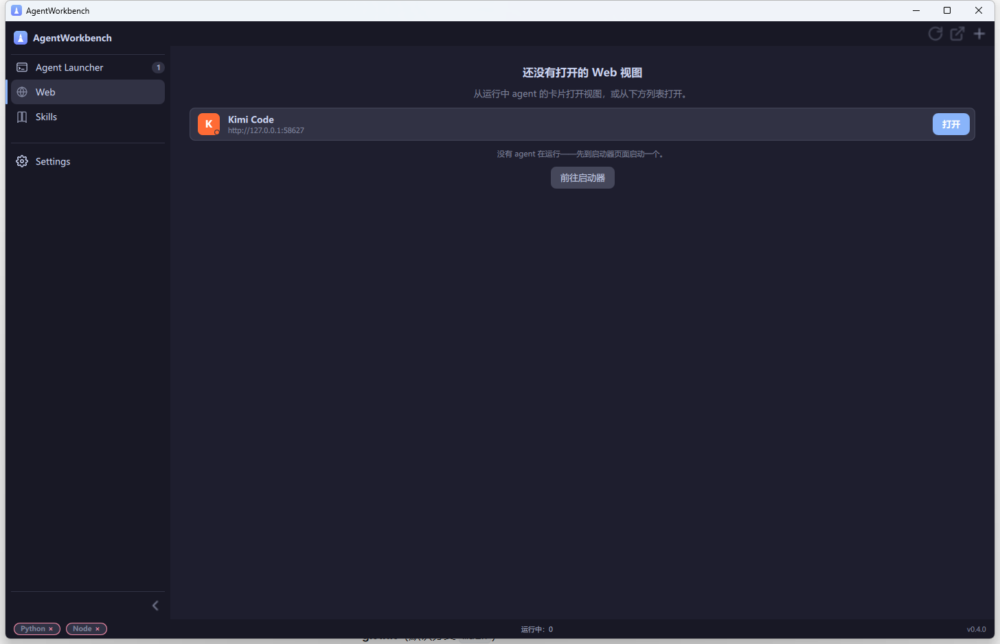
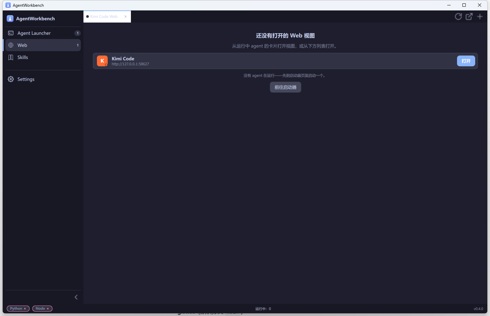

# AgentWorkbench

A Qt6/QML + C++ desktop **workbench for AI coding agents** (formerly
*AgentLauncher*): a sidebar + workspace shell that launches the **web UI** of
several agents (Kimi Code, OpenCode, Qwen Code, DeepSeek Harness), embeds
their Web interfaces as tabs, browses local Skills, and themes everything
from JSON files. Everything is **config-driven** — new agents are added by
editing a JSON file, no code changes required.




> The app follows the system language automatically.

## Features

- **Workbench shell**: sidebar navigation with badges (`Ctrl+1…9`,
  `Ctrl+B`, `Ctrl+,`), workspace pages and a status bar with Python/Node
  runtime badges; window size, sidebar state and the last page persist
  across restarts.
- **Card grid launcher** for every configured agent: start, install, update,
  version labels, right-click actions, HTTP-detected running state with the
  agent's own color, and per-session stop (×).
- **Embedded Web tabs**: agent WebUIs open inside the app (Qt WebEngine),
  one persistent profile per agent, freeze-inactive tabs, LRU release past
  `maxLiveTabs`, crash/offline/error overlays — and **Open in browser**
  always stays one click away. Degrades to the system browser without
  WebEngine (`-DAWB_ENABLE_WEBENGINE=OFF`).

  
- **Skill browser**: scans the usual `SKILL.md` locations (`~/.agents`,
  `~/.claude`, `~/.codex`, ZCode plugin caches, project dirs) with search,
  source facets, sorting, hover details and click-to-copy paths.
- **Themes**: colors/metrics come from JSON theme files; two Catppuccin
  variants ship built-in, custom themes hot-reload on save, and a ctest
  gate (`check_architecture`) rejects literal colors in QML.
- **Config-driven**: all agents, commands, URLs and config directories live
  in `agents.json`; app settings live in `settings.json`.
- **Experimental plugins**: an ABI-stable header + example plugin; disabled
  by default with an explicit in-process trust notice
  ([docs](https://agentlauncher.dev/plugins/)).

## Supported agents (defaults)

| Agent | Launch command | Web URL | Config directory |
|---|---|---|---|
| Kimi Code | `kimi web` | `http://127.0.0.1:58627` | `%USERPROFILE%/.kimi-code` |
| OpenCode | `opencode web --port 4096` | `http://127.0.0.1:4096` | `%USERPROFILE%/.config/opencode` |
| Qwen Code | `qwen serve` | `http://127.0.0.1:4170` | `%USERPROFILE%/.qwen` |
| OpenClaw | `openclaw gateway --port 18789` | `http://127.0.0.1:18789` | `%USERPROFILE%/.openclaw` |
| DeepSeek Harness | `dsh web` | `http://127.0.0.1:3080` | `%USERPROFILE%/.dsh` |

> OpenCode uses a random port by default, so AgentWorkbench pins it to `4096`
> (both the `--port` flag and the Web URL) so that health-checking and
> "open in browser" work reliably. Change it in the edit dialog if you like.

## Build

Requirements: **Qt 6.5+** (with `Core`, `Gui`, `Qml`, `Quick`, `QuickControls2`,
`Network`, and optionally `WebEngineQuick`), **CMake 3.16+**, and a C++17
compiler (MSVC / GCC / Clang).

On Windows, `scripts/build.sh` locates Qt and the MSVC toolchain by itself, and
configures and compiles in one step:

```bash
bash scripts/build.sh --test       # Debug build in build/, then run the tests
```

The plain CMake commands work too (set up the MSVC environment first, e.g. from
an "x64 Native Tools Command Prompt"):

```bash
cmake -B build -DCMAKE_PREFIX_PATH="C:/Qt/6.7.3/msvc2019_64"
cmake --build build
```

Then run `build/AgentWorkbench` (or `build/AgentWorkbench.exe` on Windows).

## Configuration

On first run AgentWorkbench creates its data directory — and when upgrading
from AgentLauncher it **copies** the old `~/.AgentLauncher` data into it first
(the old directory is kept):

- Windows: `%USERPROFILE%\.AgentWorkbench\`
- Linux/macOS: `~/.AgentWorkbench/`

That directory holds `agents.json`, `settings.json`, `agent_state.json`,
`themes/`, `plugins/`, `webprofiles/` and `log/agentworkbench.log`. The
built-in launchers come from the bundled `config/default_agents.json` and are
re-applied on every start, so your copy only carries the launchers you added
yourself (plus the built-ins you deleted).

Each agent entry looks like:

```json
{
    "id": "kimi-code",
    "name": "Kimi Code",
    "command": "kimi web",
    "webUrl": "http://127.0.0.1:58627",
    "configDir": "%USERPROFILE%/.kimi-code",
    "icon": "qrc:/icons/kimi-code.svg",
    "color": "#FF6B35"
}
```

| Field | Purpose |
|---|---|
| `id` | Stable identifier |
| `name` | Card title |
| `command` | Shell command run (detached) by **Start** |
| `webUrl` | URL health-checked and opened (embedded or in the browser) |
| `configDir` | Directory opened from the card menu (supports `%VAR%`) |
| `icon` | Icon resource path |
| `color` | Highlight color used when the agent is running |

See the [configuration guide](https://agentlauncher.dev/configuration/) for
`settings.json`, themes, skill roots and Web options.

## Documentation

Full docs (English + 中文) are built with [MkDocs](https://www.mkdocs.org/) and
the [Material](https://squidfunk.github.io/mkdocs-material/) theme:

```bash
pip install mkdocs mkdocs-material mkdocs-static-i18n
mkdocs serve
```

## Contributing

Pull requests welcome. Keep agent definitions in `agents.json` rather than
hard-coding them in C++. See [AGENTS.md](AGENTS.md) for the module layout,
build commands and project conventions, and the [docs](docs/) site for the
user-facing guides.

## License

[MIT](LICENSE) © AgentWorkbench Contributors
