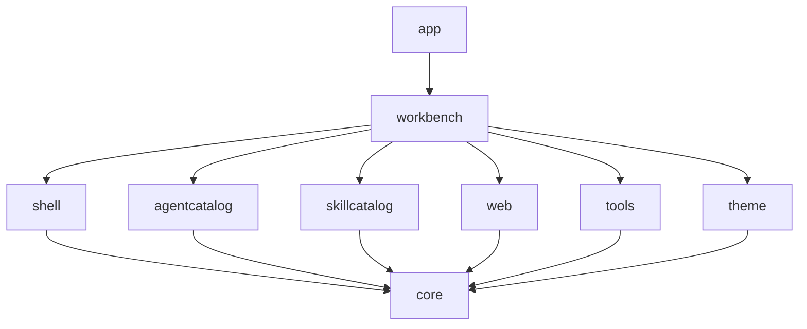
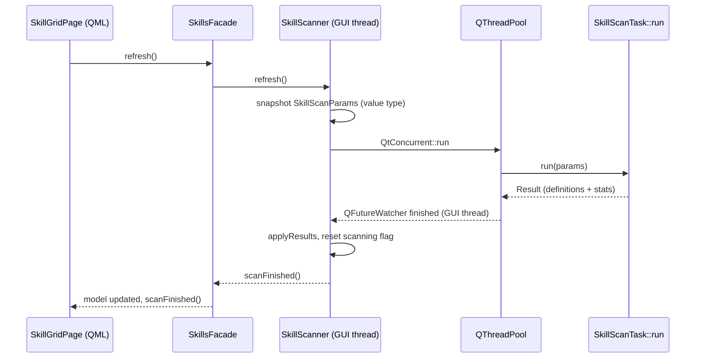

# C++ design

This page is for developers who are adding or restructuring C++ code. It explains how the library is layered, why QML only ever talks to facades and models, which types may cross the meta-object boundary, how threading is allowed to work, and where new code belongs. The front-end rules that consume these APIs are on the [front-end design](frontend-design.md) page.

## L0 to L3: layers and module boundaries

The library is built bottom-up from four layers, and the arrow direction in the figure below is the real dependency direction: `app` depends on `workbench`, `workbench` depends on the domain modules and `theme`, and every domain module depends on `core`.

- **L0** is `src/core/` (paths, JSON storage, settings, logging, process and script running, HTTP probing, the plugin host, icon resolution, environment expansion, text helpers, `OpResult`) plus `src/plugin_api/`, the header-only plugin ABI.
- **L1** is `src/theme/`, the theme engine.
- **L2** is the domain and UI-framework modules: `src/agentcatalog/`, `src/skillcatalog/`, `src/web/`, `src/tools/`, and `src/shell/`.
- **L3** is `src/workbench/`, the application layer.

The domain modules never depend on each other, and none of them depends on `shell/` or `workbench/`. `scripts/check-architecture.sh`, wired into ctest as `check_architecture`, enforces this: its first rule greps every domain module for reverse or sideways includes and fails the build. That is why `AgentsFacade` cannot call `WebTabsFacade` even though opening an agent's web UI needs both; the cross-domain action lives in `awb_workbench`. The full map, including which concrete class sits in which layer, is in [Layers and dependencies](layers-and-dependencies.md).

## The facade pattern

QML interacts with facades and models and nothing else. A facade is a `QObject` that assembles the objects of its own module, connects their signals, keeps a stable set of `Q_INVOKABLE` methods and signals for QML, and exposes the module's models. There is one facade per domain, plus the shell-side controllers and the application-side context:

- `agentcatalog::AgentsFacade` owns `AgentRepository`, `AgentStateStore`, `AgentModel`, `AgentRuntime`, `AgentScripts` and `AgentHealthMonitor`.
- `skillcatalog::SkillsFacade` owns `SkillModel` and `SkillScanner`.
- `tools::ToolsFacade` owns `ToolsStore`, `FileTreeModel` and `FileTreeFlatModel`.
- `web::WebTabsFacade` owns `WebTabsModel` and `WebSurfaceRegistry`.
- On the shell side, `ShellController` holds window-level state, `UiServices` holds generic UI operations, `NavigationModel` is the page registry and list model, and `Notifications` is the toast queue.
- On the application side, `WorkbenchContext` is the single entry point for cross-domain intents and general actions.

Two responsibilities of a facade are easy to miss. It **preserves the historical Q_INVOKABLE and signal names** — `AgentsFacade` deliberately keeps the API surface of the 0.3.0 `launcher` object so existing QML only had to change the prefix from `launcher.` to `agents.`. It also **derives properties with `NOTIFY` for things QML binds**, rather than exposing them only as methods, because a binding over a method call can never re-evaluate. `SkillsFacade::roots`, `WebTabsFacade::tabCount` and `NavigationModel::badges` exist for this reason.

**A cross-domain action belongs in `WorkbenchContext`, not in a domain facade.** `AgentsFacade` deliberately has no `openWeb`; opening an agent's web UI needs the agent's URL and drives the `web` and `shell` modules at once, so it is `workbench.openWeb(agentId)`. `WorkbenchContext` is the only layer in the project allowed to know several domains at the same time; it navigates pages, opens and closes web views, launches agents, dispatches notifications and copies text. Keeping that knowledge in one place is what lets the domain modules stay mutually ignorant.

## Models and role contracts

The models that QML consumes are `QAbstractListModel` / `QAbstractItemModel` subclasses. Their `roleNames()` map role numbers to the property names a delegate sees, and that mapping is **a public contract with QML**: both the names and their order are stable, and a role name becomes the delegate's `required property` name verbatim. Renaming a role silently detaches it from the delegate. Check every page before changing one.

The role families in use:

- `agentcatalog::AgentModel`: `agentId`, `name`, `command`, `webUrl`, `configDir`, `icon`, `color`, `cardColor`, `running`, `launching`, the four one-shot commands (`installCommand`, `updateCommand`, `versionCommand`, `setupCommand`), `installed`, `version`, `installing`, `setupDone`, `setupping`, `checkingVersion`, `consoleOutput`.
- `web::WebTabsModel`: `tabId`, `agentId`, `url`, `title`, `iconSource`, `color`, `surfaceKind`, `state`, `loadProgress`, `lastError`, `zoom`, `tabObject`. The last one hands the live `WebTab` object to QML so a surface can bind directly to its `Q_PROPERTY`s.
- `skillcatalog::SkillModel`: `skillId`, `name`, `description`, `dirPath`, `skillFilePath`, `rootId`, `rootLabel`, `kind`, `pluginId`, `pluginVersion`, `lastModified`, `sizeBytes`, `extras`.
- `tools::FileTreeModel` (a tree): `display`, `name`, `path`, `relativePath`, `isDir`, `suffix`, `iconSource`. `tools::FileTreeFlatModel` (the flat projection QML actually renders): `display`, `name`, `path`, `relativePath`, `isDir`, `iconSource`, plus the flat-only `depth`, `expanded` and `hasChildren`. Both keep `display` so the delegate keeps its default text role.
- `shell::NavigationModel`: `pageId`, `title`, `iconSource`, `source`, `section`, `order`, `badgeText`, `enabled`.
- `shell::Notifications`: `toastId`, `level`, `title`, `text`.

`FileTreeFlatModel` is worth reading before writing any model that mirrors another. It projects a tree into a linear list so that both Qt versions can render the same `ListView` delegate, because `TreeView` did not exist in Qt 5.15. Its `data()` **maps each forwarded role explicitly** instead of passing the role number to the source model. The two enums agree up to `IsDirRole`, but the source model has a `SuffixRole` between `IsDirRole` and `IconRole` while the flat model does not, so the numeric values are offset from that point on and a pass-through would return the wrong data. When you mirror another model's roles, mirror the names, then map the numbers by hand.

## Value types and the meta-object boundary

Most of the project's small types are plain structs with no meta-object machinery: `agentcatalog::AgentDefinition` (the persisted fields), `agentcatalog::AgentState` (the runtime fields), `skillcatalog::SkillDefinition`, `skillcatalog::SkillRoot`, and `theme::ThemeFile`. They are passed by `const &` or by value inside C++, and at the QML edge they are converted to a `QVariantMap` snapshot rather than registered as gadgets — `NavigationModel::page()` returns a page descriptor map, `AgentModel::agent()` merges a definition with its state, and `SkillsFacade::skill()` returns a skill map.

`core::OpResult` is the exception: it is a `Q_GADGET` with `ok` and `error` properties, because QML reads those fields directly off the return value of a `Q_INVOKABLE` such as `UiServices::copyText`. Use a plain struct when the type only travels inside C++, and reach for `Q_GADGET` only when QML must read fields of the returned value; otherwise expose a `QVariantMap`.

There is one trap that sits between the two. **A `Q_GADGET` return type must be spelled with its fully qualified name in the header.** `src/shell/UiServices.h`, `src/skillcatalog/SkillsFacade.h` and `src/tools/ToolsFacade.h` all write `awb::core::OpResult` as the return type for exactly this reason: Qt 5's moc records the type name as written, while the QML call site resolves it through the registered `QMetaType` name, which is the fully qualified class name. A short name does not resolve, and the call throws "Unknown method return type" and fails silently — the C++ code looks correct. `app/main.cpp` calls `qRegisterMetaType<awb::core::OpResult>()` to make the type known.

## Designing APIs for QML

- **Asynchronous by default.** A QML-facing operation returns immediately and reports its result through a signal, such as `refresh()` followed by `scanFinished()` / `refreshFinished()`. This is not decoration: it means moving the work onto a worker thread later does not change a line of QML, which is exactly what happened to `SkillsFacade::refresh()`.
- **A property that QML binds must have `NOTIFY`.** A `Q_PROPERTY` without a notify signal never re-evaluates its binding, and a `Q_INVOKABLE` used in a binding expression evaluates once to a function reference. The status bar once failed to update for this reason, which is why `NavigationModel::badges`, `WebTabsFacade::tabCount` and `SkillsFacade::roots` are properties with notifications rather than methods.
- **Every method QML calls must be `Q_INVOKABLE` or a slot**, and every property QML assigns must have `WRITE`. This is enforced at build time by `check_architecture` rule 5 (see [front-end design](frontend-design.md) for the failure mode).

## Error handling

The current division of labour has two halves.

- **Inside a module**, a fallible operation or a possibly-absent value is expressed by throwing an exception. The coding standard explicitly rejects `std::optional` returns for this, because callers forget the `has_value()` check and the failure propagates as an empty value with no diagnostic. See `docs/standards/coding-standard.md` (and its Chinese counterpart under `docs/zh/standards/`) for the full statement.
- **At a module boundary, and especially towards QML**, a fallible synchronous operation returns `awb::core::OpResult`, a `{ ok, error }` pair that QML can read directly. `UiServices::copyText`, `UiServices::openExternalUrl` and `ToolsFacade::addWorkspace` are examples. Asynchronous work reports failure through signals instead.

The one rule that is absolute: **never let an exception cross the C++/QML boundary.** The QML engine cannot catch a C++ exception, so anything QML touches must use `OpResult` or a signal. Note that the global wording of "exceptions versus `OpResult`" is still an open question in the project — the two documents that discuss it do not fully agree, and it should not be read as a settled, uniform policy. This page describes what the code does today.

## State ownership

The dividing line is lifetime, not convenience:

> State that must survive a page switch or an application restart belongs in a C++ model or on disk; state that only affects presentation stays in QML.

Concretely, the in-memory state includes the agent PIDs recorded for this session, the session URLs captured from launch output, the health-check running flags, the tab states and the prompt draft buffer. The on-disk state includes `agents.json` (agent definitions), `settings.json` (application settings), `agent_state.json` (which agents finished their one-shot setup), `tools.json` (workspace memory and the prompt draft) and the skill cache. QML properties are for things like whether a flyout is open or which filter facet is highlighted. The full file-by-file list, including the role of the data directory, is in [State and persistence](state-and-persistence.md).

## Threading model

The GUI thread owns everything QML touches. Background work follows exactly one pattern:

1. A GUI-side coordinator object (a `QObject` living in the GUI thread) snapshots the inputs into **value types**;
2. it dispatches a **pure static function** onto a thread pool;
3. the worker operates only on its value-typed copy and never touches the coordinator, `Settings`, or any GUI object;
4. a `QFutureWatcher` delivers the result back to the GUI thread, where the coordinator updates its members and emits signals.

`skillcatalog::SkillScanner` and `skillcatalog::SkillScanTask` are the reference implementation. `SkillScanner` lives in the GUI thread and owns the roots and the last result; `SkillScanTask::run()` is a stateless static function whose input is `SkillScanParams`, a value snapshot that carries no `QObject` pointer at all. The reason the snapshot is required is that `core::Settings` is a `QObject` and cannot be used from a worker thread, so the roots are copied into the value-typed params before dispatch. The scan is sent with `QtConcurrent::run` on the global pool, and the `QFutureWatcher`'s `finished` signal returns to the GUI thread.

`core::Logging` follows the same principle in the other direction. It installs a Qt message handler that formats the line and enqueues it, and an spdlog background thread performs the file write, rotation and stderr mirroring. The calling thread — usually the GUI thread — never performs the I/O, so log volume cannot stall it. One consequence is that a log line is not guaranteed to be on disk when `qInfo()` returns; `Logging::uninstall()` drains the queue on the exit path for that reason.

The figure shows the scan round trip.

The rule that makes this safe is stated in the coding standard and worth repeating: never manipulate a GUI control from a thread. Cross-thread communication is either a signal/slot connection, which Qt queues onto the receiving thread automatically, or an explicit `QMetaObject::invokeMethod`. Every line that touches the UI lives in the slot that runs on the main thread.

## Qt 5 and Qt 6 dual-version strategy

The project supports Qt 6.5 and later as the main line and Qt 5.15.16 LTS as a fallback. New or modified code must compile on both routes, not just the one on your machine, and version checks always go through `QT_VERSION_MAJOR` or `#if QT_VERSION`.

The differences are concentrated in two places, and they must not scatter:

- **Build-time differences** live in the wrapper functions of `cmake/AwbQtCompat.cmake`: component renames, `qt_add_qml_module` versus the generated qmldir and qrc, resource aliases, and `/utf-8`.
- **Compile-time differences** live next to the code that needs them, as a short `#if QT_VERSION` branch.

Do not route around a difference with `setContextProperty` or a version check inside QML. **Compatibility is not downgrading**: when Qt 6 has a clearly better facility, Qt 6 uses its best implementation and Qt 5 gets a separate, explicit fallback branch, even if that branch is plainer or slightly less capable. The one-WebEngine-profile-per-agent storage is the same idea at the API level, and the `WebEngineCompat` bridge is the reference for absorbing a rename instead of leaking it into QML.

The reason the discipline matters is the asymmetry of failures. On the Qt 5 route the usual outcome is a page or surface that fails to load or silently stops working, while the Qt 6 build and the whole test suite stay green — so a single build on one version proves nothing about the other.

## Resources and registration

- **Resources may only be compiled into the executable.** A qrc initializer inside a static library is dropped by the linker, so the `awb_add_resources` calls live in `app/CMakeLists.txt` even though the icons and config files belong to modules. A module's own `CMakeLists.txt` lists C++ only, never `.qml`.
- **The QML module `AgentWorkbench`** is generated by `awb_add_qml_module` (which is `qt_add_qml_module` on Qt 6, and a generated qmldir plus qrc on Qt 5). Its page and component URLs have the form `qrc:/qt/qml/AgentWorkbench/<area>/<Name>.qml`, where `<area>` is set by the `QT_RESOURCE_ALIAS` in `app/CMakeLists.txt`.
- **The pure C++ URI `AgentWorkbench.App`** carries the singletons registered with `qmlRegisterSingletonInstance`. Type names there must be capitalised. The lowercase alias layer that pages actually use is described in [front-end design](frontend-design.md).

Adding or moving a `.qml` file therefore means updating two manifests at once: the matching area list in `app/CMakeLists.txt` (`_shell_qml`, `_component_qml`, `_agentcatalog_qml`, `_skillcatalog_qml`, `_web_qml`, `_webengine_qml`, `_tools_qml`), and `AWB_TS_SOURCES` in `cmake/AwbTranslations.cmake` when the file contains `qsTr()`.

## Naming, comments and logging

The full style rules are in `docs/standards/coding-standard.md` (Chinese: `docs/zh/standards/coding-standard.md`), and new code must follow them. In one line each: comments are Chinese while identifiers, user-facing strings, logs and commit messages are English; a member function in a header carries only a short plain comment, while every function implementation in the `.cpp` carries a complete Doxygen block; the capitalised Qt macros are used throughout (`Q_OBJECT`, `Q_SIGNALS`, `Q_SLOTS`, `Q_EMIT`); a single-statement `if` still gets braces; a non-const Qt container is range-iterated through `std::as_const()`; and application-level events are logged through the `AWB_INFO` / `AWB_WARNING` family in `src/core/Logging.h` while module-internal messages use `qInfo()` / `qWarning()` with a `[module]` prefix.

## Where new code goes

| You are adding | It belongs in |
|---|---|
| A new feature page | The domain module it serves (a new page for skills goes in `src/skillcatalog/`, with its QML under that module's `qml/`), registered with `NavigationModel` from `workbench::BuiltinPages` |
| A page that is not tied to one domain | `src/shell/` if it is window-framework UI, otherwise `src/workbench/` if it coordinates several domains |
| A cross-domain action | `workbench::WorkbenchContext` (for example `openWeb`), never a single domain facade |
| A pure utility | `src/core/` — and keep `src/core/` free of Qt Quick, QML and WebEngine, which `check_architecture` rule 4 enforces |
| Theme tokens or theme loading behaviour | `src/theme/` |
| A shared QML `A*` component | `src/shell/qml/components/`, then register it in both manifests (see [front-end design](frontend-design.md)) |
| A value type shared by a module | Next to that module's other types; a plain struct unless QML must read its fields, in which case it is a `Q_GADGET` (see above) |

## Related documents

- [Layers and dependencies](layers-and-dependencies.md) — the full module map with every concrete class placed.
- [State and persistence](state-and-persistence.md) — the in-memory and on-disk state split, file by file.
- [Front-end design](frontend-design.md) — how QML consumes these models and facades.
- `docs/standards/coding-standard.md` — file and naming rules, Qt best practice, and the comment rules in full.
