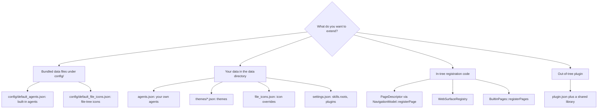

# Extension points

This page is for anyone who wants to extend AgentWorkbench — add an agent, a
theme, a file-type icon, a Skill scan root, a sidebar page, a Web surface, or
ship a plugin. It answers one question: **which parts of the app can be
extended, and where does each extension live?**

## Extension philosophy: configuration first, plugins as a fallback

The rule is simple: **if what you want to change can be expressed as data, it
is data — edit a configuration file. Only when no configuration file can carry
it do you write in-tree code, and only when that code must live outside this
repository do you write a plugin.**

The bundled JSON files under `config/` are the built-in defaults. The same
shapes can be overridden from the data directory (the root returned by
`core::Paths::dataRoot()`) without rebuilding. Code-level registration — a new
sidebar page or a new Web surface — is a built-in extension point; the plugin
ABI exists for extensions that must ship as a separate binary.

The diagram below routes a "what do I want to extend?" question to one of four
classes of extension point.

## Extending the agent list (data, not code)

An agent is a JSON object, and no agent is defined in C++. The built-in
definitions come from exactly one place — `config/default_agents.json`, compiled
into the binary as `:/config/default_agents.json`. Anything you add yourself
lives in `<data directory>/agents.json`, and the two are merged on every start.

`AgentRepository::load()` applies the merge synchronously: every entry whose id
matches a built-in is replaced wholesale by the bundled definition, entries you
added yourself are kept after the built-ins in their existing order, ids listed
in the root-level `removed` array stay gone, and agents with an empty `color`
get a palette color assigned from the current theme. The merged result is
written back when anything changed.

Two consequences follow, and both are intentional:

- **Editing a built-in agent in the Settings page only lasts for the current
  run.** The next start overwrites it from `config/default_agents.json`. If the
  change should stick, edit that file and rebuild.
- **A self-made agent must use an id that is not a built-in id**, or it is
  overwritten by the bundled definition on the next start.

`AgentRepository::save()` is diff-friendly: when there are no self-made agents
and no removed ids, the definitions array equals the bundled array and the file
is written back **byte for byte** from the bundled resource (`JsonStore::writeBytes`),
so a clean install has no spurious diff. Once you add an agent or delete a
built-in, the normal pretty-printed object (with `agents` and, if non-empty,
`removed`) is written instead.

The full field reference for an agent entry lives in
[Configuration](../configuration.md); this page does not repeat it.

## Extending file-type icons (data)

The file tree's icon mapping is data, not code. `config/default_file_icons.json`
holds three lookup tables plus a fallback:

| Table | Key | Example |
|---|---|---|
| `fileNames` | full file name, lowercase | `cmakelists.txt` |
| `suffixes` | extension, lowercase | `qml` |
| `folderNames` | folder name, lowercase | `src` |
| `defaults` | — | file and folder fallback icons |

`tools::FileIcons` resolves a file by trying the full file name first, then the
suffix, then the default; folders go straight to `folderNames` and then the
folder default. Lookups are case-insensitive, and every value is normalized by
`core::IconResolver`, so a bad value falls back to the default icon instead of
leaving a hole.

You can override or extend the built-in tables from
`<data directory>/file_icons.json`; the user file is merged on top, and a key
present in both wins from the user file (`FileIcons::loadUserFile()`).

Adding one icon means three edits and no code: drop an SVG into
`icons/filetypes/` (or `icons/foldertypes/`), add a row to the JSON table, and
register the SVG in the resource list in `app/CMakeLists.txt`. There is
deliberately **no suffix check in C++ or QML** — if you find yourself writing
one, the table is where the entry belongs.

## Extending themes (data)

A theme is a JSON file in `<data directory>/themes/`. A user theme with the same
`id` as a built-in overrides it; otherwise it is added. The file name must equal
the theme's `id` — a mismatch makes `ThemeLoader::parse()` skip the whole file
with a warning.

Missing theme tokens fall back to the built-in theme of the same `variant`
(`mocha-dark` for dark, `latte-light` for light), illegal colors and numbers
do the same, and unknown keys are warned about and ignored. `ThemeRegistry`
watches the user theme directory with a `QFileSystemWatcher`, so **saving a
theme file hot-reloads it** — no restart.

The editing workflow and the complete token list are in
[Configuration](../configuration.md); how the theme engine loads, validates and
hot-reloads a file is in [Theme engine](../development/theme-engine.md).

## Extending the Skill scan roots (config)

Skill scanning reads its roots from `settings.json` at `skills.roots`. An **empty
array means the built-in default list** (`SkillRoots::defaults()` — the usual
`~/.agents/skills`, `~/.claude/skills`, `~/.codex/skills`, the ZCode plugin
cache and the project's own skill directories). A **non-empty array completely
replaces** that default list; it does not add to it.

Each entry is `{ "id", "label", "path", "kind", "enabled" }` (the internal
`SkillRoot` also carries `recursive` and a `dedupeScope`). The path supports
`~`, `%VAR%` expansion and wildcards, and is stored **exactly as written**:
expansion happens in the scanner at scan time, and the expanded form is never
written back to `settings.json`. That is what keeps a portable config portable.

Scanning behavior — recursion depth, plugin-cache deduplication, the first-screen
cache — is documented in [Skill browser](../development/skill-browser.md).

## Registering a page (a built-in extension point)

A workspace page is described by `awb::shell::PageDescriptor` and registered
through `awb::shell::NavigationModel::registerPage()`. The shell itself knows
nothing about agents, Skills or Web — it just renders the descriptors it is
given, which is why a built-in page and a plugin page travel the same path.

| Field | Type | Default | Meaning |
|---|---|---|---|
| `id` | string | — | Registration key; `NavigationModel` dedupes and looks pages up by it |
| `title` | string | — | English source string, translated at the display edge |
| `iconSource` | string | — | Icon URL, e.g. `qrc:/icons/terminal.svg` |
| `source` | string | — | Page QML URL, e.g. `qrc:/qt/qml/AgentWorkbench/agentcatalog/AgentGridPage.qml` |
| `section` | string | `main` | Sidebar section: `main`, `extensions` or `system` |
| `order` | int | `0` | Sort key within the section; equal values keep registration order (stable sort) |
| `badgeText` | string | empty | Sidebar badge text; empty means no badge |
| `enabled` | bool | `true` | When false the page is not shown in the sidebar |
| `keepAlive` | bool | `false` | When true the page is instantiated once and only hidden on switch-away (see below) |

`section` decides where the page lands: `main` is the everyday group,
`extensions` is where plugin-contributed pages go, and `system` is pinned to the
bottom of the sidebar. The built-in Settings page is registered in `system`.

`BuiltinPages::registerPages()` is the single place where the built-in pages are
declared — the launcher (`agents`), Web (`web`), Skills (`skills`), Agent Tools
(`tools`) and Settings (`settings`). A new built-in page is added there.

`keepAlive` is not free. A keep-alive page is created once and survives page
switches; the Workspace only hides it. That is required for pages whose state
cannot be moved into C++ — the Web page holds `WebEngineView`s, and destroying
one reloads the whole agent Web UI. The costs:

- the page is resident, so it consumes resources even while another page is
  shown;
- its global shortcuts stay alive while hidden, so it must disable them itself
  when it is not the current page (the Web page gates them on
  `nav.currentPageId`);
- it is created at `0x0` and only receives its real size once it becomes
  visible, which forces one layout pass — a component that binds `height`
  instead of `implicitHeight` can collapse to zero.

## Registering a Web surface (a surface kind)

A **surface** is a way of presenting an agent's Web UI. `web::WebSurfaceRegistry`
maps a surface `kind` to the QML component URL that implements it. Two kinds
exist:

- `external` **always exists and has no QML component**. The registry's
  constructor inserts it with an empty URL; its semantics are "hand the URL to
  the system browser". It is the fallback that makes the app usable with no
  embedded engine at all.
- `embedded` is registered by `WebEngineSurfaceProvider` in its constructor when
  the build includes WebEngine, pointing at
  `qrc:/qt/qml/AgentWorkbench/web/WebEngineSurface.qml`.

`WebTabsFacade::engineAvailable()` is literally "is the `embedded` kind
registered", and the Settings page greys out the embedded option when it is not.
When `web.surface` requests `embedded` but the kind is not registered,
`openTab()` logs a warning and degrades to `external` rather than opening a
blank tab.

A plugin can contribute an additional surface through
`PluginServices::addWebSurface(kind, componentUrl)`, which forwards to the same
registry. A contributed kind whose component URL is empty behaves like
`external` for that kind — the presentation side decides what to do with it.

## The plugin ABI (experimental)

Plugins are the only extension point that lives outside this repository. The
contract is `src/plugin_api/PluginApi.h`, and the current version is
`awb::plugin::ApiVersion` (`1` for 0.4.0). **Any breaking change to the ABI must
bump that constant** — the host refuses a plugin whose version does not match.

A plugin is a shared library that exports two `extern "C"` symbols, marked with
`AWB_PLUGIN_EXPORT`:

- `awb_plugin_api_version()` returns the version the plugin was compiled against;
- `awb_plugin_register(Services *)` performs the registration and returns `0` on
  success (any other value makes the host log and ignore the plugin).

The `Services` interface is the only way a plugin touches the host:

| Method | Purpose |
|---|---|
| `registerPage` / `unregisterPage` | Sidebar pages, through the same path as built-ins |
| `addWebSurface` | Contribute an additional Web surface kind |
| `dataDir` | A private writable directory for the plugin |
| `log` / `notify` | Application log line and toast notification |
| `themeColor` | Read-only theme token access, returned as `"#rrggbb"` |
| `settingsValue` | Read-only access to a small settings whitelist |

Discovery scans `<data directory>/plugins/*/plugin.json`. Reading a manifest
never loads code, so the Settings page can list every plugin — disabled ones
included. **Plugins are disabled by default.** The master switch is
`plugins.enabled` and `plugins.disabledIds` lists per-plugin opt-outs; libraries
are loaded once at startup, so changing either takes effect after a restart.

Two independent version checks guard loading. The manifest's declared
`apiVersion` must match `ApiVersion`, **and** the library's actual
`awb_plugin_api_version()` must match as well; a stale manifest cannot smuggle an
incompatible binary in. Any failure — unreadable manifest, missing entry point,
load error, version mismatch, or a non-zero return from `awb_plugin_register` —
is **logged and skipped**. A plugin can never prevent the application from
starting, and the other plugins are unaffected.

Hardening rules follow from the trust model — **plugins run inside the
application process; there is no sandbox**, so only enable plugins you trust:

- only Qt value types cross the ABI boundary; host C++ classes are never exposed;
- plugins cannot write `agents.json` or `settings.json`; theme and settings
  access is read-only, and `settingsValue` only serves a handful of keys
  (`appearance.theme`, `window.title`, `web.surface`, `locale.override`);
- a plugin id derived from a manifest is sanitized before it is used in a path
  (`PluginServices::dataDir`).

The plugin author's guide, with a full example, is in
[Plugins](../plugins.md).

## Deliberately not extension points

Some things that look like they could be configurable are not, on purpose:

- **No agent definitions hardcoded in C++.** They live in
  `config/default_agents.json`; hardcoding them would make the built-in set
  invisible to the same merge and diff logic every user agent goes through.
- **No `setContextProperty`.** Globals are registered as typed singletons, so
  they are visible to tooling and checked at build time.
- **No manual singleton registration on the `AgentWorkbench` URI.** That URI is
  a `qt_add_qml_module` module with a `qmldir`; registering there manually fails
  as a protected module. Application globals go on the pure C++ `AgentWorkbench.App`
  URI instead.
- **No migration code for `settings.json`/`agents.json`.** Missing keys take
  their defaults in place and unknown keys are warned about. Adding a key means
  adding a default value; see
  [State and persistence](state-and-persistence.md) for why.

## Related

- [State and persistence](state-and-persistence.md) — where the data these
  extension points live in is stored.
- [Configuration](../configuration.md) — the full field reference for
  `agents.json` and `settings.json`.
- [Plugins](../plugins.md) — how to write, package and enable a plugin.
