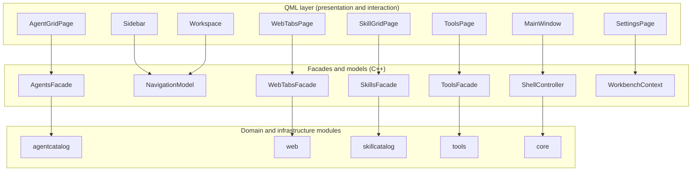
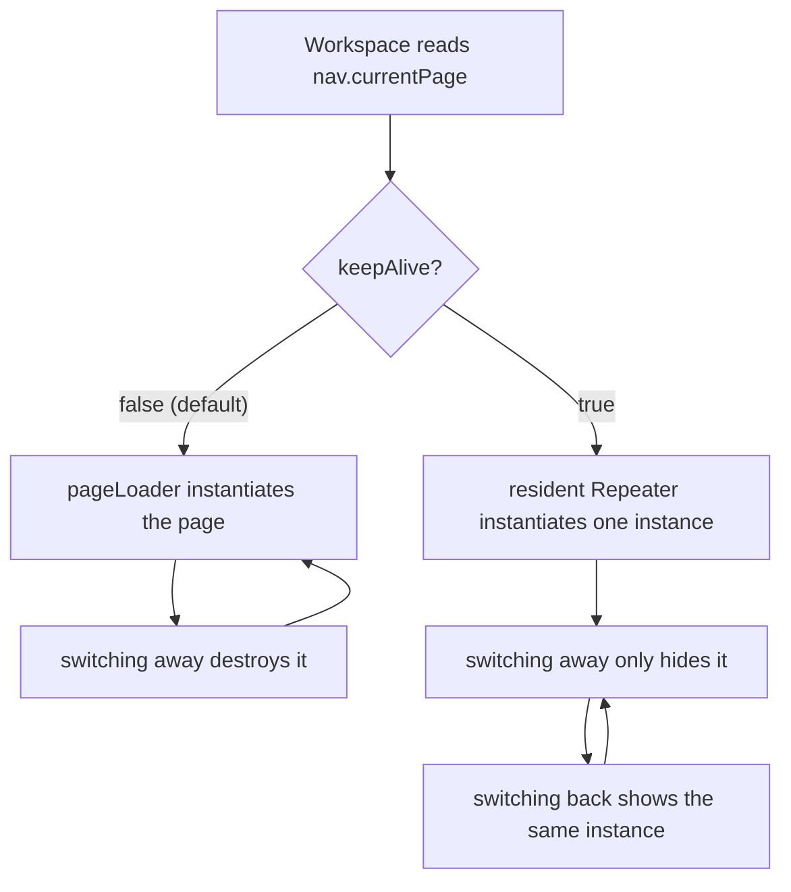

# Front-end design

This page is for developers joining the project who have to add or change a page. It explains what the QML layer is responsible for, how the window is assembled, which rules a new page must follow, and where the boundary between QML and C++ runs. The visual catalogue itself lives in `designs.md`; this document explains the reasoning behind those rules and the contracts that are not visible in a screenshot.

## What the front-end is, and where its boundary lies

QML is the presentation and interaction layer only. Every piece of business state — which agent is running, which tabs are open, the filtered skill list, the stored workspace — lives in C++ behind a facade object or a model. A page reads state through facades, calls `Q_INVOKABLE` methods on them, and renders models as delegates. It does not read or write files, does not start processes, and does not call `Qt.openUrlExternally` directly; each of those actions has an entry point on a facade.

The root object is `src/shell/qml/MainWindow.qml`, an `ApplicationWindow`. It owns the layout skeleton, the global shortcuts, the exit-confirmation dialog and the toast host, and it declares the lowercase aliases that pages use to reach C++. Pages are loaded from `qrc:/qt/qml/AgentWorkbench/<area>/<Name>.qml` through the `Workspace` loader.

The figure shows which object a page talks to and how those facades reach the C++ modules. Every arrow points in the real dependency direction: QML depends on the facades, and the facades depend on the domain modules.

The consequence of this boundary is that a page can be destroyed and rebuilt at any time without losing anything important, because it does not own anything important. That property is what makes the page lifecycle rules below safe.

## The window skeleton is not negotiable

The application is a left sidebar, a right workspace and a bottom status bar, assembled in `src/shell/qml/MainWindow.qml` from `Sidebar.qml`, `Workspace.qml` and `StatusBar.qml`. The sidebar runs the full window height as a translucent glass panel; the status bar occupies only the workspace column, starting at the sidebar's right edge. The full anatomy is in `designs.md` section 1 (the glass recipe in its section 2.4); the parts that a page author must not fight are:

- **The sidebar answers "where do I go" and nothing else.** It renders `NavigationModel`, not business data. A page never adds a business action to the sidebar.
- **A page's position is decided by its `section`, not by layout code.** When a page is registered with `PageDescriptor::section` set to `main`, `extensions` or `system`, its place is fixed. `system` pages are pinned to the bottom of the sidebar and rendered as icon-only buttons with the title carried by a tooltip and the current destination filled through `AIconButton.active`. Adding a pinned page (an About page or a log viewer) means registering it as `system`, not writing new layout QML.
- **The sidebar starts directly with a scrollable workflow list (`main` and `extensions`, separated by a divider), followed by a separator and a pinned footer.** There is deliberately no app-icon-and-name header at the top: the window title bar already carries the application identity, and the sidebar does not repeat it. The footer holds the `system` pages and the collapse handle side by side: expanded, the icons sit on the left and the handle on the right; collapsed, they stack vertically and centre.
- **The main area's outer padding is `theme.spacingL`.** Do not invent margins per page.
- **The page toolbar is optional.** A page that has page-level actions or filtering renders a `PageHeader`; an empty-state page or a simple list does not have to.

Two sizing details in the skeleton are load-bearing and easy to get wrong again. `Sidebar.qml` provides its width through `implicitWidth`, not `width`, because `MainWindow.qml`'s `RowLayout` owns it — assigning `width` directly leaves the workspace frozen at its old size and opens a gap next to the collapsed sidebar. `StatusBar.qml` provides its height through `implicitHeight` for the same reason: a direct `height` binding fights the layout's reallocation and, on Qt 5, makes the layout engine report a recursive rearrange.

## Page lifecycle

A page that is registered without `keepAlive` is hosted by the `Loader` in `src/shell/qml/Workspace.qml`. Switching to another page destroys the instance and switching back rebuilds it from its QML source. This is the default contract, and it means that any state which must survive a page switch belongs in C++, not in QML properties.

The single exception is a page registered with `PageDescriptor::keepAlive` set to true. Today only the Web page sets it. Such a page is instantiated once by a resident `Repeater` inside `Workspace.qml`; switching away only hides it, because the state of a `WebEngineView` cannot be moved into C++ and destroying it would reload the whole page. Two rules follow from being resident:

- Every `ApplicationShortcut` the page declares outlives the page switch, so it must disable itself when the page is not current. `WebTabsPage.qml` exposes a `pageCurrent` property for exactly this and gates `Ctrl+W`, `F5`, `F12` and the zoom keys on it.
- The page is created at 0x0 and receives its real size only when it becomes visible, so it necessarily goes through one relayout. Layout children must supply their size through `implicitWidth` / `implicitHeight`; a direct `width` or `height` binding is overwritten by that relayout. The Web page's tab bar once disappeared entirely this way.

The figure shows how the two lifecycles differ.

## The component shelf (Reuse-first)

Before writing any new UI element, look through the shelf. The components under `src/shell/qml/components/` are the only legal general-purpose widgets, and a page that hand-writes one of them is a defect. The table lists every file on the shelf.

| Component | Purpose | When to use |
|---|---|---|
| `AButton` | Text button | Every text button. Variants are `primary`, `secondary`, `ghost` and `danger`; `primary` accepts an `accentColor` for runtime colouring (an agent's own colour). |
| `AIconButton` | Icon button | Every icon button. The tooltip is mandatory. In navigation contexts use `active` to fill the current destination. |
| `ATextField` | Single-line input | Every text input, including the `invalid` red border and the 2px focus ring. Its height (32) aligns with `AButton`. |
| `ATextArea` | Multi-line editor | Every multi-line text input. It uses the `surface` background — deliberately different from `ATextField`'s `surfaceAlt`, because a long editing area needs a whiter base in the light theme. A `TextArea` never scrolls its own text, so an input that must scroll (a long prompt) attaches it to a `Flickable` through the `TextArea.flickable` attached property; that keeps the frame and the focus ring pinned to the viewport and scrolls the caret into view (see Agent Tools). |
| `AFormLabel` | Form label row | Field labels, with a required asterisk and an info tooltip. |
| `ASearchField` | Search box | List filtering input, with icon and clear key. |
| `AComboBox` | Dropdown select | Every dropdown. The `Default`/`Basic` style's palette is hardcoded light and unreadable in the dark theme, so the themed one is required. Override `contentItem` or `delegate` at the use site to customise the popup. |
| `AColorField` | Colour input row | Any "#RRGGBB input plus swatch" form field. The text field is the source of truth; clicking the swatch opens `AColorPicker`. |
| `AColorPicker` | Colour picker | The Office/WPS-style popup: a 10-column theme palette with light and dark steps, fixed standard colours, and a custom colour with the last ten remembered in-process. Opened with `openBelow(anchor)`. |
| `AColorSwatch` | Colour cell | One cell of the picker grid, or a mini swatch. An empty value shows a neutral base with a diagonal; a checked ring and tick mark the current colour. |
| `ACard` | Card container | A card frame (surface, radius, border, hover). Currently it has no call sites — the agent and skill cards bring their own stateful border colouring — so treat it as available but unproven rather than as the default. |
| `ASpotlight` | Pointer spotlight overlay | The hover emphasis of a glass card: a light spot that follows the pointer plus a gradient border sheen. The host supplies `active` (the merged hover criterion) and `spotX` / `spotY`; the component takes no input and does not probe hover itself. |
| `AWorkspaceGlow` | Page backlight | The bottom layer of a glass card grid page: two very low-opacity radial blobs that give the translucent cards something to let through. Declared at the page root before the content; pure decoration, no input. |
| `AListRow` | List row | A single row in a settings page or list: rounded rectangle plus an injectable content `RowLayout`, default height 48. |
| `APill` | Badge pill | Counts and source labels. |
| `AEmptyState` | Empty state | The whole-block placeholder for "no data" or "no match". Its `extra` slot takes additional content such as a list. |
| `ADialog` | Modal skeleton | Every modal dialog. The `danger` variant gives a red title and border. |
| `AConfirmDialog` | Confirmation dialog | Dangerous or ordinary confirmation, with confirm and cancel buttons; the `detailData` slot carries contextual warnings. |
| `AAlertDialog` | Alert dialog | Errors and notices: message plus scrollable monospaced detail plus a dismiss button. |
| `ASectionHeader` | Settings group header | Sectioning a form or settings page; `extra` right-aligns a trailing action. |
| `AStatusDot` | Status dot | On/off indication. Size, colour and tooltip are configurable; never rely on colour alone. |
| `AToastStack` | Notification stack | The bottom-right toast stack. `MainWindow.qml` hosts it through `Toasts.qml`. |
| `AMenu` | Context menu base | Every menu. Glass surface, outward soft shadow and a top sheen. |
| `AMenuItem` | Menu entry | An entry of `AMenu`, with an always-reserved 16px icon slot and an accent translucent rounded hover block. |
| `AMenuSeparator` | Menu group line | Grouping inside `AMenu`. |
| `AgentAvatar` | Icon plus status badge | The visual entry point of an agent: its icon and a running/stopped corner badge. |
| `AScrollBar` | Themed scrollbar | Attach as `ScrollBar.vertical: AScrollBar {}` on a `ScrollView` or a bare `Flickable`. It stays visible whenever the content overflows; the `Basic` style's own scrollbar is a 6px temporary bar that fades out, which users read as "this page does not scroll". |
| `PageHeader` (not `A*`) | Page title bar | The top of a page: title, subtitle and a right-aligned page-action slot. |

The rules that go with the shelf:

- **Never hand-write a bare `Button` with a custom background.** Use `AButton` or `AIconButton`. If `primary` needs a colour, set `accentColor`; if a variant is missing (a size, for instance), add the property to the `A` component instead of bypassing it. The one exception is a page-private micro-control such as the 16px download/update/close corners inside `AgentCard`.
- **Never hand-write a dialog skeleton** — no `Popup` plus overlay background plus `ColumnLayout` plus title, body and buttons. Confirmation goes through `AConfirmDialog`, errors and notices through `AAlertDialog`, and unusual shapes (the three-button exit confirmation) build directly on `ADialog`.
- **Never hand-write a menu.** `AMenu` plus `AMenuItem` and, for grouping, `AMenuSeparator`.
- **Never reimplement a status dot**, and never hand-write a themed text field.
- New general-purpose components go into `src/shell/qml/components/`, are named with an `A` prefix, use theme tokens only, and must be registered both in the `_component_qml` list in `app/CMakeLists.txt` and in `AWB_TS_SOURCES` in `cmake/AwbTranslations.cmake` when they contain `qsTr()`. A page-private component stays under its module's `qml/` directory and does not join the shelf.

## The AMenu family is the only menu shape

Qt Quick Controls' `Default` (Qt 5) and `Basic` (Qt 6) styles hardcode the menu highlight colour over `palette.light`, the near-white side of the palette, independently of the theme. In the dark theme the highlighted item's text becomes unreadable — an actual symptom in 0.4.0, which is why all five menus in the repository were migrated to `AMenu`, `AMenuItem` and `AMenuSeparator`. `AMenu` draws itself entirely from theme tokens, so there is no palette to fight.

The visual contract is a translucent `surfaceBg` (0.90 in the dark theme, 0.95 in the light one) so the content underneath shows faintly through, an outward two-layer `overlayBg` soft shadow, and an inner 1px highlight in the dark theme only. Qt Quick has no backdrop blur and a true blur is not portable across Qt major versions, so translucency plus a top sheen is the deliberate compromise. Do not reach for `QtGraphicalEffects` or `Qt5Compat` to get a real blur. Entries reserve a 16px icon slot unconditionally, so entries with and without icons align, following the Windows convention; hover is an accent translucent rounded block inset by 2px, not a full-row background swap. Transitions fade in with a 0.95 to 1 scale expansion over `durationFast` and only fade out on exit.

A menu that mixes a toolbar with entries is the supported shape for top tool rows: declare a plain `Item` as the first child of the menu, because the menu's `contentItem` stacks direct children in declaration order. Give it no background and left-align its icons, and separate it from the entries with a faint `theme.separator` line. `src/tools/qml/MarkdownContextMenu.qml` is the reference. Before popping up, set the target the menu will act on into a property of the menu, and route every action through a `run()` helper that closes the menu, returns focus to the target, and only then performs the action; otherwise input and selection writes land on the menu instead of the target.

There is no pointer-following light inside a menu. That is `ASpotlight`'s job on cards, and menus do not need it.

## Visual language

- Pages and components use `theme.*` semantic tokens only. A literal colour — `#rrggbb`, `#rgb`, or `Qt.rgba()` built from numeric literals — is rejected at build time by `check_architecture` rule 2. `"transparent"` and expressions such as `Qt.rgba(theme.accent, …)` are allowed.
- Both themes must be readable. After changing UI, switch to the other theme and check it. Selection colours come from `theme.selectionBg` and `theme.selectionText`; the text components already build those in, so a page must not set `selectionColor` or `selectedTextColor` itself.
- **State is never expressed by colour alone.** A status dot or badge carries a tooltip or text as well, for colour-blind users and for both themes.
- Animation durations come from `theme.durationFast` and `theme.durationNormal`. Do not invent new ones.

### The font ladder has exactly four steps

All text uses one of four tokens, and a fixed pixel size (`font.pixelSize: 14`) or a fifth token is a defect:

| Token | Default (px) | Role |
|---|---|---|
| `theme.fontSizePageTitle` | 24 | Page titles, large dialog titles |
| `theme.fontSizeSubtitle` | 16 | Subtitles, card titles |
| `theme.fontSizeBody` | 13 | Body text, forms, buttons, navigation |
| `theme.fontSizeCaption` | 11 | Captions, hints, badges, paths and other auxiliary text |

The historical `fontSizeSmall` and `fontSizeCardTitle` tokens were removed (2026-09: the former merged into `caption`, the latter into `subtitle`); do not reintroduce them. A dedicated glyph inside an icon (`AColorSwatch`'s tick mark) counts as a graphic element that scales with the icon, not as a text step.

### Icons render 1:1, never scaled

A blurry icon means the rasterised size differs from the displayed size: an SVG's `sourceSize` is the rasterisation target in logical pixels (Qt multiplies it by the DPR for SVGs), and a mismatch between it and the Image's displayed size goes through a scaling path — upscaling is always blurry, downscaling soft. Three rules follow:

- The displayed size must equal `sourceSize`. Without `sourceSize`, an SVG rasterises at its natural 24px, so any smaller display is a downscale and also blurs (the file-tree arrows in `ToolsPage.qml` did).
- An icon must not be a Control's `contentItem` directly: the Control forces the contentItem to its own available size (`AIconButton` is 28×28), and `PreserveAspectFit` then upscales the 16px raster — every icon button was simultaneously too large and too blurry for this reason. Wrap the icon in an `Item` and centre it, letting the `Image` render at its implicit size (see `AIconButton`).
- A larger icon inside a bigger button (the 22px icon in a 44px button) follows the same rule: give `sourceSize` the actual raster size.

## The glass card recipe

The project's cards are frosted glass, not flat fills. `AgentCard` and `SkillCard` are the reference implementations, and a new card copies the same recipe:

1. **Page backlight.** Glass can only "let through" if the page has light behind it. A card grid page lays `AWorkspaceGlow` at the very bottom: two very low-opacity large radial blobs (accent plus an agentPalette warm tone), static and repainted only on theme or size changes. Declare it at the page root, before all content.
2. **Glass base.** `theme.alpha(surfaceBg, 0.62)`, rising to `theme.alpha(hover(surfaceBg), 0.78)` on hover. The translucency lets the backlight through, and `theme.hover` moves each theme in its readable direction. A card with a per-item semantic colour uses that colour as a tint instead.
3. **Colour veil.** A very faint vertical gradient wash (accent or the semantic colour), plus a second wash that only fades in on hover. A near-diagonal veil is a vertical `Gradient`; do not introduce an effects module for an exact angle.
4. **Inner highlight.** A 1px inset border of `theme.alpha(textOnAccent, 0.07)`, drawn in the dark theme only, because a white highlight is invisible on light.
5. **Hover spotlight.** `ASpotlight` follows the pointer and adds a border sheen. Its `active` binds the host's merged hover criterion, and `spotX` / `spotY` bind the pointer position from a `HoverHandler`.
6. **Border.** `borderSubtle` rising to `borderStrong` on hover, animated with `ColorAnimation` over `durationFast`. Running and error states have their own semantic border.
7. **Hover lift.** A `Translate` transform (up by `spacingXs`) plus `z: 1`, falling back on press. Only visual transforms — never change `x` or `y`, because those are what the grid and layout engines write. Keep the lift within the card spacing.
8. **Batch rendering.** A grid of hundreds of cards must use `GridView` with lazy instantiation, `reuseItems` and `cacheBuffer`. `Flow` plus `Repeater` instantiates every delegate at once; because each card carries its own overlays and menus, that measured a page-switch freeze of 2s or more at 151 skills. A heavy `Popup` inside a card (a detail overlay) is created lazily through a `Loader`. Cell size is the card plus the spacing, the column count adapts to the viewport width, and `cellWidth` is rounded to avoid a floating-point overflow that produces a horizontal scrollbar.

Both themes must be checked: the lighter veil density in the light theme and the empty highlight rule exist for that.

## Scale and performance

The performance rules are consequences of the recipe, and they are not optional for collections that can grow large:

- **A collection in the hundreds uses `GridView` with `reuseItems` and `cacheBuffer`.** The skill grid is the reference; the launcher grid still uses `Flow` plus `Repeater` because it holds a handful of agents, and a handful is fine. The rule bites when the item count can reach the hundreds.
- **Heavy `Popup`s are created lazily through a `Loader`** so a card that is never expanded never pays for its overlay.
- **A `modelReset` destroys and rebuilds every delegate on the page**, so it is a very expensive signal. `SkillModel::setSkills` short-circuits the reset when the new result equals the current one, exactly so that the background scan after a cache restore does not tear down the whole grid. A model that can avoid a reset should.

## The QML ↔ C++ contract

This section is the part of front-end design that has produced the most silent defects, so it is stated as rules.

**Registration.** C++ global objects are registered with `qmlRegisterSingletonInstance` on the pure C++ URI `AgentWorkbench.App`, and the type name must be capitalised, because Qt 6 rejects lowercase singleton names. Do not use `setContextProperty`, and do not hand-register a singleton on the `AgentWorkbench` URI: that URI is the QML module generated by `qt_add_qml_module`, which has a `qmldir`, and registering there reports a protected module. The unresolved-import warning for `AgentWorkbench.App` in the build log is an expected artifact of qmlcachegen on a pure C++ URI and must not be "fixed" by changing the registration design.

**The lowercase contract names.** A page never uses the capitalised names directly (except `MarkdownEdit`, noted below). The root of `src/shell/qml/MainWindow.qml` declares lowercase aliases that bridge to the singletons, and every descendant resolves them through that root:

| Alias | Singleton | What a page uses it for |
|---|---|---|
| `theme` | `Theme` | Theme tokens and derived colours |
| `nav` | `NavigationModel` | The page registry, the current page and badges |
| `shell` | `ShellController` | Window-level state: sidebar collapse and width, window size, last page |
| `ui` | `UiServices` | Clipboard, external URLs, file manager, native folder and colour dialogs |
| `toasts` | `Notifications` | Pushing toast notifications (`toasts.notify(…)`) |
| `agents` | `AgentsFacade` | Agent definitions, models and the launcher actions |
| `web` | `WebTabsFacade` | Tab lifecycle, the active tab and surface kinds |
| `skills` | `SkillsFacade` | The skill model, scan state and root configuration |
| `tools` | `ToolsFacade` | Workspace memory, the prompt draft and the file tree |
| `workbench` | `WorkbenchContext` | Cross-domain intents and general actions |
| `environment` | `EnvironmentService` | Python and Node.js detection for the status bar badges and the Settings → Environment rows (cached between starts, re-checked in the background) |

`MarkdownEdit` is registered on the same URI but has no lowercase alias; the editor's context menu uses the capitalised name directly. `WebProfiles` and `WebEngineCompat` are likewise registered for use inside the embedded surface only.

**Callability.** Every method QML calls must be `Q_INVOKABLE` (or a slot or signal), and every property QML assigns must have a `WRITE` accessor. A bare method is absent from the meta-object method table, so the call throws "…is not a function" at click time, and a getter-only `Q_PROPERTY` throws "read-only property". Page-load smoke tests never click, so the failure is invisible to them; `check_architecture` rule 5 catches it at build time, and `tst_shell::testQmlCalledMethodsAreInvokable` reproduces QML's real resolution path through `QMetaObject::invokeMethod`.

**Delegate roles.** A delegate's `required property` is matched by name against the model's `roleNames()`: the property must be named exactly like the role. Renaming either side leaves the delegate without the role and the instance silently renders nothing. There is a second trap when the delegate root is a type that has a visual property of the same name. `WebTabsPage.qml`'s tab delegate has a role named `color`; on a `Rectangle` root that property would shadow the visual `color`, the theme binding would land on the string and the tab body would keep its default white forever. That is why the delegate root is an `Item` and the visual background is an inner `Rectangle`. `AgentCard` follows the same pattern and goes one step further: because its root is an `Item` carrying many roles, it aliases each one into a `_p` property (`agentId_p`, `name_p`, `running_p`, …) before binding visuals to it. When you add a delegate, check the role names it consumes and the root type's own properties before choosing the root.

**Custom return types.** An `Q_INVOKABLE` whose return type is a custom class or gadget must spell the return type with its fully qualified name, for example `awb::core::OpResult` in `src/shell/UiServices.h`, `src/skillcatalog/SkillsFacade.h` and `src/tools/ToolsFacade.h`. Qt 5's moc records the type name exactly as written in the header, while the QML call site resolves it by the registered `QMetaType` name, which is the fully qualified class name. A short name fails to resolve and the call throws "Unknown method return type" and is silently dropped, with the C++ side looking perfectly fine.

## i18n and copy

Every user-facing string in QML is wrapped in `qsTr()`, and the source string must be English ASCII; `check_architecture` rule 3 rejects non-ASCII source strings because the source language of this internationalised project is English. Translations live in `translations/`. When a new QML file contains `qsTr()`, it must be added to `AWB_TS_SOURCES` in `cmake/AwbTranslations.cmake`, and after changing a source string, run `scripts/update-ts.sh` once before committing, because `lupdate` is an explicit step and not part of the build. Forgetting it only means the new string falls back to English in translated locales; it never breaks the build.

## Two global conventions: hover and tooltips

**Hover is exclusive delivery.** A `MouseArea` with `hoverEnabled: true` and a `Control` such as `AButton` swallow hover, so a `HoverHandler` at the card root loses the state while the pointer is over them. The consequence is that the spotlight and highlight criterion must be merged by the host: `AgentCard` composes its `hovered` property from the root `HoverHandler` plus every hover-enabled child that can swallow the state. A new child that swallows hover must be folded into the same criterion, or the spotlight flickers off as soon as the pointer reaches it. A `HoverHandler` is passive and does not affect the existing tooltip delivery, which is why it is the right primitive for the root side of the merge.

**Tooltips are attached and uniform.** Use the attached `ToolTip.x` form with `delay: 300` and `timeout: 10000`. When the host is a delegate, it must add `Component.onDestruction: ToolTip.hide()`: a shared tooltip outlives the delegate, so without this it freezes on screen after the row or card is destroyed by a model change or a page switch.

## Qt 5 and Qt 6 differences on the QML side

The project supports Qt 6.5 and later as the main line, and Qt 5.15.16 LTS as a fallback, and the QML must load on both. The failure mode of getting this wrong is asymmetric: declaring a property or signal that exists in only one major version makes the whole page or surface fail to load, while the C++ tests stay green because they never load that QML. The concrete case was the popup signal, which is `newWindowRequested` in Qt 6 and `newViewRequested` in Qt 5; declaring either name in QML makes the other engine reject the entire embedded surface with "Cannot assign to non-existent property", leaving a blank page.

The rule is therefore: do not put version-dependent names in QML. Move the difference into a C++ bridge that exposes a version-neutral name, as `awb::web::WebEngineCompat` does for the popup signal, the download-state enums and the older engine's JavaScript polyfill injection. The remaining details of the embedded surface, including the polyfill gap and the white-screen detection, are in `../development/webengine-adapter.md`; the C++ side of the compatibility strategy is in `cpp-design.md`.

## Pre-commit checklist for UI changes

- The layout still respects the sidebar, main area and status bar skeleton, and the pinned pages are still pinned.
- No new literal colours or numeric `Qt.rgba()` calls, and both themes have been checked.
- Font sizes use only the four ladder tokens with no fixed pixel values, and every icon's displayed size matches its `sourceSize`.
- New cards reproduce the glass recipe, and a collection in the hundreds uses `GridView` with lazy instantiation rather than `Flow` plus `Repeater`.
- The shelf table was checked first, and no bare `Button`, hand-written dialog or hand-written menu was introduced.
- State is not expressed by colour alone, and every tooltip string is an English `qsTr()` source.
- A page that declares `keepAlive` disables all of its shortcuts when it is not current and sizes its children through `implicitWidth` / `implicitHeight`.
- Any added or moved `.qml` file is registered in `app/CMakeLists.txt` and, when it contains `qsTr()`, in `AWB_TS_SOURCES`.
- `bash scripts/build.sh --test` is green, including `check_architecture`.

## Related documents

- [Layers and dependencies](layers-and-dependencies.md) — the module map this front-end sits on top of.
- [C++ design](cpp-design.md) — facades, models, value types and the QML-facing API rules.
- [Shell and navigation](../development/shell-and-navigation.md) — how pages are registered and how the sidebar and workspace are wired.
- [WebEngine adapter](../development/webengine-adapter.md) — the embedded surface and the Qt 5 / Qt 6 bridges in detail.
- `designs.md` at the repository root — the layout skeleton, the component catalogue and the glass card recipe in full.
