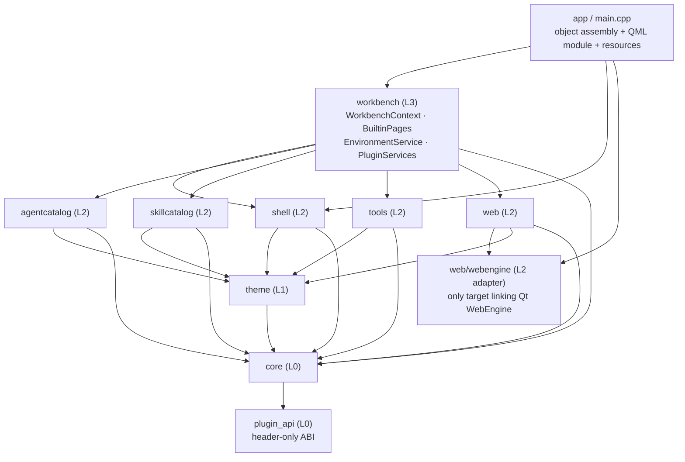
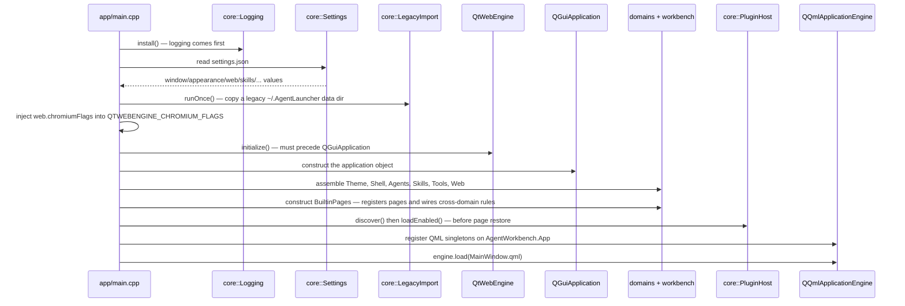
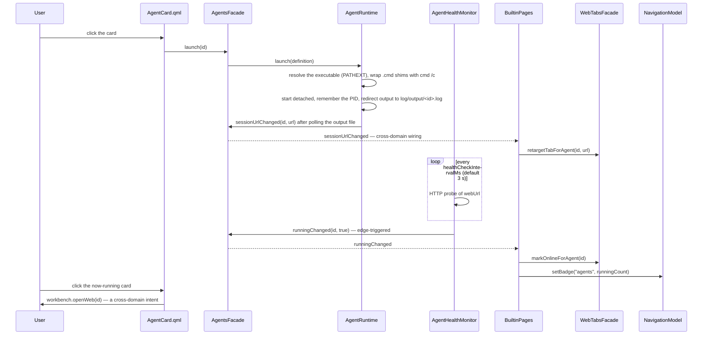
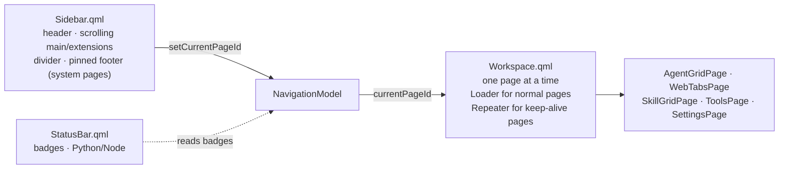

# Architecture overview

This section explains **how AgentWorkbench is put together**: which layers exist, what each module owns, how an object graph becomes a running window, and which rules the build enforces. It is written for someone who has just cloned the repository and needs a mental model before touching anything.

- Users: see [User guide](../guide/index.md).
- Changing one feature: see [Development](../development/index.md).
- Writing or editing these pages: see [docs/AGENTS.md](../AGENTS.md).

## What the application is

AgentWorkbench is a desktop shell with one job: **launch external AI coding agent CLIs and give their local web interfaces a place to live**. It does not implement an agent, does not talk to a model, and does not wrap a CLI — it catalogs tools that are already installed, starts their local web server, and embeds the resulting page.

Three consequences shape most of the design:

1. **It owns no agent logic.** An agent is data (a JSON object), not a class. Adding a tool means editing a config file, not writing C++ — see [Extension points](extension-points.md).
2. **Everything the user changes is persisted outside the application.** Which agents exist, their order and colors, which page was open, which skills folders to scan — all of it lives in files under one data directory, and the C++ classes are typed readers and writers of those files. See [State and persistence](state-and-persistence.md).
3. **A browser engine is embedded, but is optional.** The WebEngine dependency is isolated in one adapter target so that a build without it still works, with the web surface degrading to the system browser.

## Module map

Every module is a static library with its own `src/<module>/CMakeLists.txt`. The layering is real: it is what the `awb_*` link lines express and what `check_architecture` enforces (see [Layers and dependencies](layers-and-dependencies.md)).

| Module | Layer | Owns | Expanded in |
|---|---|---|---|
| `app` | executable | assembly only: `main.cpp`, resource manifest, QML module | this page |
| `src/workbench` | L3 | cross-domain intents, built-in page registration, environment detection, plugin services | [Development: workbench and pages](../development/workbench-and-pages.md) |
| `src/shell` | L2 | window skeleton, navigation, window/toast/clipboard services, the shared `A*` component shelf | [Development: shell and navigation](../development/shell-and-navigation.md) |
| `src/agentcatalog` | L2 | the agent catalog: definitions, persistence, process lifecycle, health, one-shot commands | [Development: agent launcher](../development/agent-launcher.md) |
| `src/skillcatalog` | L2 | local skill discovery and presentation | [Development: skill browser](../development/skill-browser.md) |
| `src/tools` | L2 | the Agent Tools page: workspace memory, lazy file tree, prompt draft, Markdown support | [Development: agent tools](../development/agent-tools.md) |
| `src/web` | L2 | tab model, surface selection, memory policy (no WebEngine here) | [Development: web tabs](../development/web-tabs.md) |
| `src/web/webengine` | L2 adapter | the only target linking Qt WebEngine | [Development: WebEngine adapter](../development/webengine-adapter.md) |
| `src/theme` | L1 | JSON themes → semantic tokens → QML bindable properties | [Development: theme engine](../development/theme-engine.md) |
| `src/core` | L0 | paths, JSON store, settings, logging, processes, scripts, HTTP probe, plugin host, legacy import | [Development: core infrastructure](../development/core-infrastructure.md) |
| `src/plugin_api` | L0 | the header-only plugin ABI that external repositories link | [Extension points](extension-points.md) |

Two modules carry a rule that is easy to violate by accident:

- `src/shell` **does not know** about agents, skills, web tabs or tools. It renders pages it is handed and answers "where am I". Business pages are registered *into* it from `src/workbench`.
- `src/workbench` is **the only place allowed to know more than one domain**. Every cross-domain action (open this agent's web UI, open a config folder, notify) is a method on `WorkbenchContext`, not on a domain facade.

## The system at a glance

Dependencies point one way only: the executable assembles the layers, `workbench` combines domains, domains use the theme engine and the infrastructure, and nothing points back up.

`app` links every domain plus `workbench`, so the arrows into `workbench` stand for "the executable also builds these directly"; the meaningful constraint is that no arrow ever points back up or sideways between domains.

## Runtime assembly

The object graph is built by hand in `app/main.cpp`, bottom-up, and the order is a hard contract — several steps silently misbehave if run in the wrong place. The assembled objects are then registered as QML singletons and only at the very end does the QML engine load the window.

The steps that are load-bearing, and why:

- **`core::Settings` is read before `QGuiApplication` exists.** `web.chromiumFlags` has to reach the `QTWEBENGINE_CHROMIUM_FLAGS` environment variable, and the WebEngine module has to be initialized *before* the application object is constructed. Changing this order makes the Chromium flags silently ineffective.
- **`LegacyImport::runOnce` runs before the default `settings.json` is written**, because the import decides whether to act by looking at whether the data directory is still empty.
- **Plugins load before the last page is restored.** A plugin page is an ordinary sidebar entry, and pages are identified by id; if plugins were loaded after the current page was restored, a plugin page would not survive a restart.
- **Logging is installed first and uninstalled last.** The log backend is asynchronous; without the explicit uninstall on the way out, the tail of the log is lost.

Details of what is persisted, and where, are in [State and persistence](state-and-persistence.md).

## One interaction, end to end

The clearest way to see the layering work is to follow a single click. Starting an agent touches four domains plus the shell, but no domain ever calls another domain — every hop goes through `WorkbenchContext`, `BuiltinPages` or a Qt signal.

`runningChanged` is edge-triggered on purpose: re-emitting a stable "running" state every poll would push every error tab back into loading and produce an endless reload loop.

## The shell skeleton

The window is a sidebar, a workspace and a status bar, and the rule that keeps it coherent is that **the sidebar answers only "where do I go"** — never a business action.

Pages are described by `PageDescriptor` (id, title, icon, source URL, `section`, `order`, `keepAlive`) and registered through `NavigationModel::registerPage`. Normal pages are destroyed when you navigate away, so any state that must outlive a page belongs in C++; the single exception is a page declared `keepAlive`, which stays instantiated and is only hidden — that is how the embedded web views survive a page switch. Both rules are explained in [Frontend design](frontend-design.md).

## Design principles, and where they are expanded

| Principle | One-line statement | Expanded in |
|---|---|---|
| One-way dependencies | Domains never include each other; cross-domain behaviour lives in `workbench` | [Layers and dependencies](layers-and-dependencies.md) |
| Config over code | New agents, icons, themes and skill roots are data | [Extension points](extension-points.md) |
| Facades at the QML boundary | QML talks to facades and models only, never to files or processes | [C++ library design](cpp-design.md) |
| Semantic tokens only | Pages bind `theme.*`; literal colors fail the build | [Frontend design](frontend-design.md) |
| Persisted state is explicit | Cross-page/cross-restart state is in C++ or on disk; purely visual state stays in QML | [State and persistence](state-and-persistence.md) |
| Both Qt majors work | Qt 6 is the main line, Qt 5.15 LTS is a supported fallback | [C++ library design](cpp-design.md) |

## Reading order

If you are new here, this order gets you productive fastest:

1. [Layers and dependencies](layers-and-dependencies.md) — the rules you must not break.
2. [State and persistence](state-and-persistence.md) — where data lives, and what is deliberately not migrated.
3. [Frontend design](frontend-design.md) — how to write a page without inventing a style.
4. [C++ library design](cpp-design.md) — how to add a class without breaking a contract.
5. [Extension points](extension-points.md) — what you can extend without touching the core.
6. Then the [Development](../development/index.md) page for the feature you are about to change.
