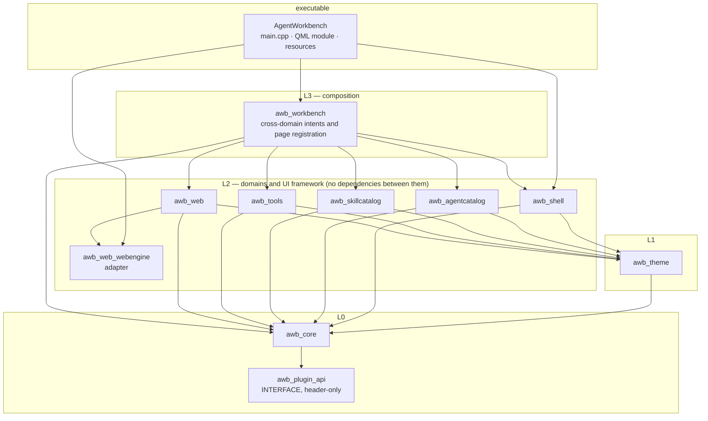

# Layers and dependencies

This page is the rulebook: **which module may know about which**, why the rule exists, where new code belongs, and what the build does when you break it. Read it before adding a module, a cross-domain action, or an include that feels slightly wrong.

Everything here is enforced by `scripts/check-architecture.sh`, which runs as the `check_architecture` ctest target — a violation fails the build rather than waiting for review. The rule table is in the "The gate" section below.

## The layers

The real CMake link lines, for reference:

| Target | Links (public unless noted) |
|---|---|
| `awb_plugin_api` | nothing — `INTERFACE` library, headers only |
| `awb_core` | `awb_plugin_api`, `Qt::Core`, `Qt::Network`; `spdlog` is `PRIVATE` |
| `awb_theme` | `awb_core`, `Qt::Core`, `Qt::Gui` |
| `awb_shell` | `awb_core`, `awb_theme`, `Qt::Core`, `Qt::Gui`; `comdlg32` on Windows |
| `awb_agentcatalog`, `awb_skillcatalog`, `awb_web` | `awb_core`, `awb_theme` |
| `awb_tools` | `awb_core`, `awb_theme`; `Qt::Quick` is `PRIVATE` (only the Markdown editor support touches Quick) |
| `awb_web_webengine` | `awb_web` + the Qt WebEngine target |
| `awb_workbench` | `awb_agentcatalog`, `awb_core`, `awb_shell`, `awb_skillcatalog`, `awb_theme`, `awb_tools`, `awb_web` |
| `AgentWorkbench` | every `awb_*` module, plus `awb_web_webengine` when WebEngine is enabled |

## The rules

### 1. Domains never depend on each other, or on the shell

`awb_agentcatalog`, `awb_skillcatalog`, `awb_tools` and `awb_web` must not include `shell/`, `workbench/`, or each other's directories.

The reason is not purity for its own sake: this is what makes the modules independently testable (each has its own test target that links only that module) and what keeps the dependency graph a tree instead of a tangle. In practice it means a domain must not assume anything about *where* it is being displayed.

If you need two domains to cooperate, the code belongs in `awb_workbench`. Concretely: the agent launcher must not know how to open a web tab, so `AgentsFacade` deliberately has no `openWeb` method — `WorkbenchContext::openWeb(agentId)` does that job. `BuiltinPages` then connects domain signals to each other (`runningChanged` → `markOnlineForAgent`, `sessionUrlChanged` → `retargetTabForAgent`) so no domain holds a pointer to another.

### 2. `core` and `theme` stay free of UI and of business knowledge

`src/core/` and `src/theme/` must not pull in Qt Quick, QML or WebEngine. Both are linked above Qt Core/Gui only.

- `core` is infrastructure: it knows about files, processes, HTTP and JSON, and nothing about agents, skills or pages. That is why `IconResolver` takes a caller-supplied fallback instead of hard-coding an application resource path.
- `theme` produces `QColor` and numbers. It cannot use `QQuickItem`, so the theme engine stays usable from a plain `QGuiApplication` and testable without a QML engine.

Corollary: a domain may not push UI types down into `core` to "share" them. If a helper needs a `QQuickItem`, it belongs in the module that owns that UI.

### 3. `plugin_api` is the one API an outside repository may link

`src/plugin_api` is an `INTERFACE` library containing `PluginApi.h`. It exists so that an out-of-tree plugin can be compiled against the host without linking the host's libraries. Only Qt value types cross that boundary — never a host C++ class. See [Extension points](extension-points.md) for the ABI and [Development: plugin host](../development/plugin-host.md) for the loader.

### 4. One-directional, and the direction is visible in CMake

Dependencies point downward: `app → workbench → domains → theme → core`. If you find yourself wanting an upward pointer (a domain calling back into `workbench`, or `core` needing something from `shell`), the answer is a signal or a callback, not an include. Every upward need so far has been solved that way — `WorkbenchContext` connects signals, `BuiltinPages` wires rules, `PluginServices` implements an interface declared in `plugin_api`.

## Where does new code go?

| You are adding | It belongs in | Because |
|---|---|---|
| A new sidebar page for a new domain concept | a new `src/<domain>/` module + registration in `BuiltinPages` | a page's logic is domain logic; `shell` must not learn it |
| A general-purpose widget used by several pages | `src/shell/qml/components/` (name it `A*`) | the shelf is the only sanctioned place for shared UI |
| An action that needs two domains (launch this agent *and* open its web UI) | `awb_workbench` / `WorkbenchContext` | the only layer allowed to know both |
| A dialog, a toast, clipboard access, a native file/folder picker | `awb_shell` (`UiServices`, `Notifications`, `A*` dialogs) | these are UI framework facilities, not domain features |
| A file, path, JSON, process or HTTP helper | `awb_core` | infrastructure belongs below everything; keep it UI-free |
| A colour, spacing or duration value | `resources/themes/*.json` + a `theme` property | never a literal in QML |
| A new agent, icon mapping, theme or skill root | data (`agents.json`, `file_icons.json`, a theme JSON, `skills.roots`) | see [Extension points](extension-points.md) |

## The gate: `check_architecture`

`scripts/check-architecture.sh` is registered through `tests/CMakeLists.txt` as a ctest test, so `bash scripts/build.sh --test` runs it. It is a shell script using `grep` — no compilation — and it fails with the offending file and line so the fix is obvious.

| # | Rule | Why it exists |
|---|---|---|
| 1 | Domain modules must not include `shell/`, `workbench/`, or each other | keeps the graph a tree; keeps modules testable in isolation |
| 2 | QML must not contain literal colours — no `#rrggbb`/`#rgb`, no `Qt.rgba(<number>, …)` | themes must be able to repaint everything; a literal colour is invisible until someone switches the theme. `"transparent"` and expression forms like `Qt.rgba(theme.accent, …)` are allowed |
| 3 | `tr()`/`qsTr()` source strings must be ASCII | the source language is English; non-English source strings silently break translation extraction |
| 4 | `src/core/` and `src/theme/` must not reference Qt Quick, QML or WebEngine | see rule 2 above; a QML-engine include in `core` is how this rule was originally discovered |
| 5 | Every `<alias>.<method>(` call in QML must resolve to a `Q_INVOKABLE` method, and `<alias>.<prop> =` must resolve to a `Q_PROPERTY` with `WRITE` | a bare method is not in the meta-object method table: QML throws "…is not a function" at click time, and page-load smoke tests never click. This exact gap hid three broken sidebar/settings interactions until a manual run caught them |

Rule 5 is worth internalising: it is the only one whose violations are invisible to every other check. When you add a method intended for QML, mark it `Q_INVOKABLE`; when you add a property QML will assign, give it a `WRITE` accessor. `tst_shell::testQmlCalledMethodsAreInvokable` reproduces the same class of bug through `QMetaObject::invokeMethod`.

## Two things that look like exceptions but are not

- **`shell` ships `A*` components.** The component shelf lives in `awb_shell` because it is generic UI framework, not because `shell` knows about business. The components themselves reference only `theme.*` tokens and their own properties.
- **`workbench` links every domain.** That is its definition, not a layering violation — it is L3, and the layers below it still do not link each other.

## Related

- [Architecture overview](index.md) — the module map and runtime assembly.
- [C++ library design](cpp-design.md) — the patterns that make cross-module contracts safe (facades, model roles, `OpResult`).
- [Frontend design](frontend-design.md) — the QML side of rules 2 and 5.
- [Extension points](extension-points.md) — the sanctioned ways to add behaviour without breaking these rules.
