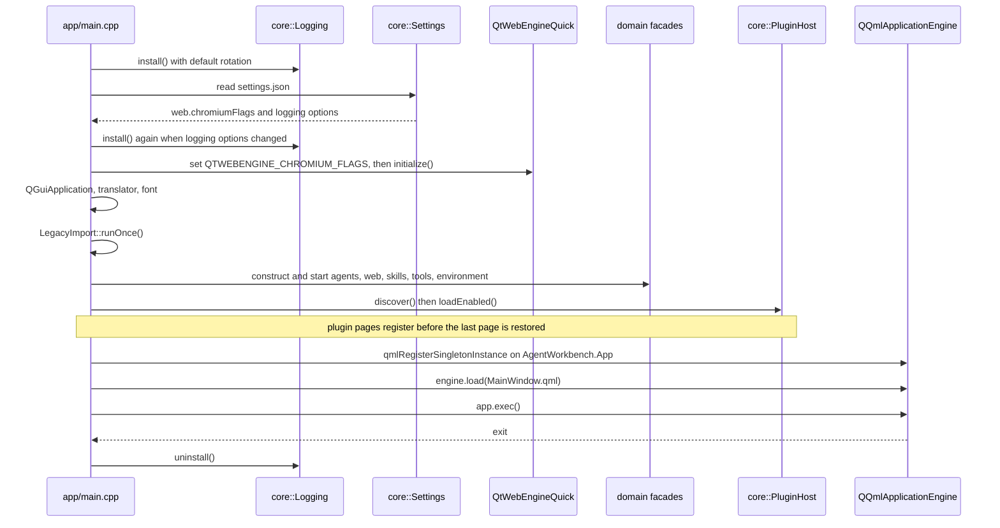

# State and persistence

This page is for developers who are about to touch configuration or persistence
logic. It answers: **what does AgentWorkbench keep, where does it keep it, and
what happens to that state across a restart.**

## The data directory is the single source of truth

Everything the app writes lives under one root, returned by
`core::Paths::dataRoot()`. Sub-paths are derived there and nowhere else:
`themesDir()`, `pluginsDir()`, `logsDir()`, `webProfilesDir()`,
`skillCacheFile()` and `downloadsDir()`. **No other module may assemble these
paths itself** — if you need a new file, add a derived accessor to `core::Paths`.

`dataRoot()` resolves in this order: a root injected by
`Paths::setDataRootForTesting()`, then the redirected location when
`QStandardPaths::setTestModeEnabled(true)` is active, then
`~/.AgentWorkbench`. The test-mode branch matters because test mode does not
redirect `HomeLocation`; a test that read the home directory directly would read
and write the developer's real configuration. **No test may read or write the
developer's real data directory** — tests use test mode or inject a
`QTemporaryDir`.

On the first start after upgrading from the pre-0.4 `AgentLauncher`,
`core::LegacyImport::runOnce()` **copies** `agents.json`, `agent_state.json` and
everything under the old `log/` from `~/.AgentLauncher` into the new root. It
never moves or deletes the old directory, it runs at most once (it bails out as
soon as the new root contains anything other than `log/`), and it shows the user
a one-time notice. That is why `app/main.cpp` delays the first
`Settings::save()` until after the import: writing `settings.json` early would
make the "untouched root" check fail forever.

## What lives where

| File | Written by | Content | Read/written through |
|---|---|---|---|
| `agents.json` | launcher page / Settings | user agents plus the root-level `removed` list | `AgentRepository` |
| `agent_state.json` | one-time setup | which agents finished their `setupCommand` | `AgentStateStore` |
| `settings.json` | Settings page | all application settings | `core::Settings` — the only entry point |
| `tools.json` | Agent Tools page | workspace MRU list (max 20), current workspace, prompt draft | `ToolsStore` via `ToolsFacade` |
| `skills_cache.json` | the skill scanner | last scan result, for first-screen rendering | `SkillCache` |
| `environment_cache.json` | the runtime probe | last Python/Node verdict (version, install path, or "nothing usable on PATH"), for first-screen rendering | `EnvironmentCache` |
| `file_icons.json` | you | icon-table overrides / additions | `FileIcons` (via `FileTreeModel`) |
| `themes/*.json` | you | themes (same `id` overrides a built-in) | `ThemeRegistry` / `ThemeLoader` |
| `plugins/<id>/` | you | plugin manifest and library | `core::PluginHost` |
| `webprofiles/<agentId>/` | Web tabs | per-agent cookies and localStorage | `WebProfilePaths` / `WebEngineProfileStore` |
| `log/agentworkbench.log` | the app | rotating event log (5 MB × 3 files) | `core::Logging` |
| `log/output/<agentId>.log` | `AgentRuntime` | an agent process's stdout + stderr, polled to extract the session URL | `AgentRuntime` |

`settings.json` has no other reader by design; all access goes through the typed
structs in `core::Settings`, so there is exactly one place where a key name and
its default live.

## In-memory state vs on-disk state

The dividing line is deliberate. Things that survive a restart are the ones the
user chose or paid for; everything else is rebuilt from scratch.

| State | Where it lives | Lifetime |
|---|---|---|
| `AgentRuntime` PID bookkeeping (`m_pids`) | memory | current session only |
| Captured session URL (`m_sessionUrls`) | memory | dropped when the process stops |
| Agent running / installed / version / console output (`AgentState`) | memory (except `setupDone`) | until app exit or the next health check |
| `WebTab` state, load progress, zoom, LRU timestamp | memory | until the tab is closed or the app exits |
| Purely visual state (expanded rows, current filter …) | memory | until the view is destroyed |
| Agent definitions | `agents.json` | across restarts |
| Application settings, including the last sidebar page | `settings.json` | across restarts |
| One-time setup completion | `agent_state.json` | across restarts |
| Workspace memory and prompt draft | `tools.json` | across restarts |

The draft is the one piece of memory state with a tuned write path. Editing the
prompt does not write on every keystroke: `ToolsFacade::setDraft()` returns
immediately when the text is unchanged, otherwise it arms a single-shot 500 ms
timer, and `persistDraft()` writes once the typing pauses. The destructor
flushes a still-pending draft, so quitting mid-edit does not lose it. This keeps
a fast typist from turning every keystroke into a disk write while still being
crash-tolerant down to half a second.

Two concrete consequences of keeping PIDs and session URLs in memory:

- **After the launcher restarts it cannot stop an agent it started before.**
  Health checking still reports it as running, but there is no PID to kill, so
  `stop()` only shows a notice. The escape hatch is the context menu's
  **Force stop**, which resolves the PID from the port via `netstat -ano`
  (`AgentRuntime::forceStop`).
- **Deleting an agent intentionally leaves its process running.** Removal calls
  `forget()` on the runtime, which drops the bookkeeping only — the process keeps
  serving, and its Web tabs are closed. Killing it is a separate, explicit
  action.

## The no-migration policy

The absence of migration code is a design decision, not an omission, and the
rule is explicit: **do not add any.**

For `settings.json`, a missing key takes its default value in place, and an
unknown key is warned about and ignored. Adding a setting therefore means adding
a default value to the corresponding struct in `core::Settings` and a read in
`load()` — nothing else.

For `agents.json`, the built-in definitions are regenerated from the bundled
default on every start, and the root-level `removed` array keeps deleted
built-ins deleted. So there is no compatibility layer for older configs at all.

One root-level field was retired this way: `agents.json`'s old `title` is no
longer read — the window title comes from `window.title` in `settings.json` — and
a leftover value is reported once at INFO level rather than migrated.

The cost is real and worth stating:

- **a built-in agent can only be changed by editing the bundled default and
  rebuilding**; a change made in the UI lasts only for the current run;
- **a self-made agent that reuses a built-in id is overwritten** on the next
  start, because the bundled definition wins by id.

## Atomic writes and safety

Every JSON file is read and written through `core::JsonStore`:
`writeFile()` uses `QSaveFile`, so a reader never sees a half-written file,
creates missing parent directories, and writes a consistent indentation;
`writeBytes()` is the byte-for-byte variant used when `agents.json` matches the
bundled default. A read failure degrades to an empty object with one log line
rather than aborting the app — a single corrupt file never brings the
application down.

The log rotates at `logging.maxFileSize` (5 MB) and keeps `logging.maxFiles`
files (3), so it never grows past roughly 15 MB; the oldest backup is deleted.
Writes happen on a background thread, so a chatty log never stalls the UI, and
warnings and above are flushed on arrival.

Token handling is deliberately conservative, because a leaked bearer token is a
security problem:

- the token is appended as a URL **fragment** (`AgentUrls::finalUrl()` builds
  `#token=…`), and a fragment is not sent to the server, so it never reaches the
  server's access log or a `Referer` header;
- the URL redaction helper in `src/web/WebTabsFacade.cpp` strips **both** the
  `#token=…` fragment and a `?token=…` query item before a URL is logged or put
  into a toast, keeping the rest of the fragment/query intact;
- **no token-bearing URL ever reaches the log.**

## Startup assembly order

The order in `app/main.cpp` is a hard contract; swapping two steps breaks
something silently. The diagram below shows the sequence.

Why this order and not another:

- **Logging first.** After `Logging::install()`, any later failure has a disk
  record. It is installed once with default rotation so warnings emitted while
  `Settings` is constructed still land; it is installed a second time only if
  the user actually changed a logging option.
- **Settings before `QGuiApplication`.** The user's `web.chromiumFlags` must be
  put into `QTWEBENGINE_CHROMIUM_FLAGS` before `QtWebEngineQuick::initialize()`,
  and WebEngine must be initialized before `QGuiApplication` exists. Reading
  settings later would silently drop the flags.
- **Assembly bottom-up.** core → theme → shell → agentcatalog → skillcatalog →
  web → tools, each module constructed after what it depends on.
- **Plugins before page restore.** `PluginHost` loads enabled plugins before
  `BuiltinPages` restores the last page. A plugin page id can therefore survive a
  restart; if plugins loaded after the restore, the remembered page would not
  resolve.
- **QML singletons, then `engine.load`.** Globals are registered on the pure C++
  `AgentWorkbench.App` URI, and only then is `MainWindow.qml` loaded.

On the exit path, `Logging::uninstall()` must run: it drains the async queue and
stops the writer thread, and skipping it drops the last few (possibly
below-warning) lines. This is done both on a successful exit and on the UI-load
failure path. Terminating the agent process trees started this session is a
separate, user-driven step: the window's exit dialog calls `agents.stopAll()`
when the user chooses to close them (`AgentRuntime::stopAll()` kills each tracked
PID and clears the bookkeeping).

## Adding a new persisted file

When you add a file that outlives a run:

1. write it through `core::JsonStore` (atomic, consistent formatting, tolerant
   reads) rather than raw `QFile`;
2. add its path as a derived accessor in `core::Paths` — do not assemble the
   data-root path at the call site;
3. decide explicitly whether it is **on-disk state** or **memory state**, and
   document that decision where the reader needs it;
4. think through the no-migration policy: what happens to an existing file that
   lacks your new key, and what happens to a stale key you no longer read;
5. update this page and the matching [development](../development/index.md)
   document in the same change.

## Related

- [Extension points](extension-points.md) — the extension points that read and
  write the data described here.
- [Configuration](../configuration.md) — the field reference for
  `settings.json` and `agents.json`.
- [Development](../development/index.md) — per-feature implementation notes.
