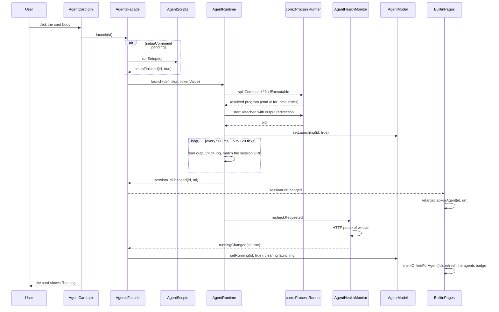

# Agent Launcher

The launcher is the feature behind the **Agent Launcher** page: it catalogs external AI
coding agents, starts their long-running local server, probes whether they are up, executes
their one-shot install/update/version/setup commands, and stops the process trees it started.
It is the entry point of the whole application, and every other page either consumes its state
(the web tabs, the sidebar badge) or links back to it.

User view: see [Agent Launcher](../guide/agent-launcher.md).
Architecture context: [Layers and dependencies](../architecture/layers-and-dependencies.md) and
[State and persistence](../architecture/state-and-persistence.md).

## What this feature does, and where its boundary is

The launcher is a **catalog plus a process supervisor for tools it did not write**. It does not
implement an agent, does not talk to a model, and does not wrap a CLI. Its responsibilities are:

- read the agent list from `agents.json` and keep the bundled defaults in sync;
- start the long-running `command` as a detached process, remember the PID for this session,
  and stop exactly that process tree on request;
- detect "running" by probing `webUrl` over HTTP, never by sniffing processes;
- run the one-shot `installCommand` / `updateCommand` / `versionCommand` / `setupCommand`
  through the shared script runner;
- produce the **final URL** for the agent's web UI (session URL when one was captured, otherwise
  `webUrl` with an optional token fragment) and hand it to the cross-domain layer.

It explicitly does **not** own opening the web UI. `AgentsFacade` has no `openWeb`; that is the
cross-domain intent `workbench.openWeb(id)`, implemented by `WorkbenchContext`, because opening
a page needs the web domain and the navigation model at the same time. The one directory action
that stayed on the facade is `openConfigDir()`, because `WorkbenchContext` delegates straight
to it.

## Files and classes

Every source file in `src/agentcatalog/` participates in this feature. The table is the complete
map; the sections below expand the interesting ones.

| File | Class / component | Responsibility | Collaborates with |
|---|---|---|---|
| `src/agentcatalog/AgentDefinition.h` | `AgentDefinition` | Header-only struct holding the persisted fields of one agent (`id`, `name`, `command`, `webUrl`, `configDir`, `icon`, `color`, `cardColor`, `installCommand`, `updateCommand`, `versionCommand`, `setupCommand`, `tokenFile`) | `AgentRepository`, `AgentModel`, `AgentRuntime` |
| `src/agentcatalog/AgentState.h` | `AgentState` | Header-only struct holding the runtime state of one agent (`running`, `launching`, `installed`, `version`, `versionKnown`, `installing`, `setupDone`, `setupping`, `checkingVersion`, `consoleOutput`) | `AgentModel`, `AgentScripts`, `AgentHealthMonitor` |
| `src/agentcatalog/AgentStateStore.{h,cpp}` | `AgentStateStore` | Reads/writes `agent_state.json`, which records only which agents finished their one-shot setup | `AgentScripts`, `AgentsFacade` |
| `src/agentcatalog/AgentRepository.{h,cpp}` | `AgentRepository` | Loads and saves `agents.json`, re-applies bundled defaults on every start, keeps the `removed` list, assigns palette colors, turns a name into a slug, resolves the icon | `AgentsFacade`, `AgentUrls` (icon) |
| `src/agentcatalog/AgentModel.{h,cpp}` | `AgentModel` | `QAbstractListModel` merging the persistent definitions with per-id runtime state; owns every runtime setter and the role contract for QML | `AgentRuntime`, `AgentScripts`, `AgentHealthMonitor`, `AgentGridPage.qml` |
| `src/agentcatalog/AgentRuntime.{h,cpp}` | `AgentRuntime` | Launches the long-running process, tracks PIDs for this session, stops/force-stops the process tree, polls the captured output for the session URL | `AgentModel`, `AgentUrls`, `core::ProcessRunner`, `AgentHealthMonitor` |
| `src/agentcatalog/AgentScripts.{h,cpp}` | `AgentScripts` | Runs the one-shot install/update/version/setup commands through its own `core::ScriptRunner`, updates card state and streams output | `AgentModel`, `AgentStateStore`, `core::ScriptRunner` |
| `src/agentcatalog/AgentHealthMonitor.{h,cpp}` | `AgentHealthMonitor` | Polls every distinct `webUrl` over HTTP on a fixed interval and emits edge-triggered `runningChanged` | `AgentModel`, `core::HttpProbe` |
| `src/agentcatalog/AgentUrls.{h,cpp}` | `AgentUrls` | Builds the final opened URL (token handling), reads the token file, extracts a session URL out of the agent's own output | `AgentRuntime`, `AgentsFacade`, `WorkbenchContext` |
| `src/agentcatalog/AgentsFacade.{h,cpp}` | `AgentsFacade` | The single QML facade: assembles the objects above, wires their signals, forwards launch/stop/CRUD, and keeps the 0.3.0 Q_INVOKABLE/signal names | everything in this module; `BuiltinPages` |
| `src/agentcatalog/qml/AgentGridPage.qml` | `AgentGridPage` | The launcher page: header actions, search field, display filter, card grid, empty states, error popup | `AgentsFacade`, `AgentEditDialog` |
| `src/agentcatalog/qml/AgentCard.qml` | `AgentCard` | One agent card: open/start, install/update, version indicator, console output panel, quiet stop button, context menu, in-place error flash | `AgentGridPage`, `AgentsFacade`, `WorkbenchContext` |
| `src/agentcatalog/qml/AgentEditDialog.qml` | `AgentEditDialog` | The add/edit form for one agent, with its validation rules and save/cancel | `AgentGridPage`, `AgentsFacade`, `AgentModel` |
| `src/agentcatalog/CMakeLists.txt` | `awb_agentcatalog` | The module's static-library target | `awb_core`, `awb_theme` |
| `config/default_agents.json` | bundled defaults | The built-in agent definitions compiled into the binary as a Qt resource | `AgentRepository` |

## Frontend design

### `AgentGridPage.qml`

The page is a `ColumnLayout` under a `PageHeader` titled "Agent Launcher". The header carries the
two page-level actions: **Add Launcher** (opens `AgentEditDialog` in add mode) and **Restore
Defaults** (calls `restoreDefaults()` and opens the error popup when the write fails).

Below the header is a filter row with an `ASearchField` ("Search launchers...") and three
display filters — **All**, **Running**, **Not installed** — rendered as `AButton`s whose variant
switches between `primary` and `ghost` to show the active choice. Search and filter are combined
in `matchesFilter()`: text matches case-insensitively against `name`, `command` and `webUrl`;
`Running` keeps only `running`, `Not installed` keeps only rows where `installed` is false.

Two `AEmptyState` blocks cover the "no launchers at all" and "no match" cases. The visible card
grid is a `Flow` inside a `ScrollView` with one `AgentCard` per model row, `visible` bound to
`matchesFilter(model)`.

One subtlety is worth keeping: the count of visible cards is **not** derived from
`Item.visible`. Visible reads back the *effective* visibility, so cards created inside the
`ScrollView` — which is hidden while `shownCount === 0` — would always read `false` and the count
would dead-lock at zero, pinning the "no matching launchers" empty state on top of a full model.
Instead a hidden `Repeater` (`counterBox`) mirrors the filter result in its own `matches`
property and `recountShown()` aggregates those flags.

### `AgentCard.qml`

The card is the interaction surface for one agent. Its root is an `Item`, not a `Rectangle`
(see the role-shadowing note below).

- **Clicking the card body**: if the agent is running, `workbench.openWeb(id)`; otherwise
  `agents.launch(id)` when it is neither launching nor setting up.
- **Primary button row**: the main `AButton` says **Open** when running and **Start** otherwise.
  While running it becomes a dropdown whose arrow opens a one-entry menu with
  **Open in browser**; while launching or setting up it is disabled and shows a spinner. The
  second button is **Configure**, which emits `configureRequested(id)` so the page opens the edit
  dialog (the card does not own the dialog).
- **Version indicator** (top-left): a spinner while `checkingVersion` or `installing`; a version
  label plus a small **↻** update button when a probe concluded "installed"; a download icon when
  a probe concluded "not installed" (clicking installs, and refuses with an in-place flash while
  running); **blank while there is no verdict** — no probe ran yet, or the probe timed out (see
  the version-probe semantics below).
- **Console output panel**: a scrollable monospace view between the status line and the buttons.
  It appears while an install/update/setup run is in flight, stays for 5 s after a failure, and is
  hidden immediately on success. A × in its corner collapses it; the context menu entry
  **Show output** brings it back.
- **Stop**: a deliberately low-key × in the top-right corner, visible only while running. It calls
  `agents.stop(id)` and shows a spinner until `running` flips false.
- **Context menu** (right click on the card) contains **Close**/**Start**, **Force Stop** (opens
  the `AConfirmDialog`), **Open in browser**, **Update**/**Install**, **Re-detect version**
  (re-runs the version command; disabled while a check is in flight), **Show output**,
  **Configure**, **Open config folder**, and **Re-initialize** (only enabled when a
  `setupCommand` exists).
- **In-place error feedback**: a `Connections` block on `agents.launchFailed` sets `flashMessage`
  and `flashing` for the matching id, which turns the border red, repurposes the status label to
  show the truncated reason, and restarts a 4 s timer. The full message is shown at the same time
  by the page-level `AAlertDialog`. `flashing` is an explicit boolean, not a binding on
  `Timer.running`, because `Timer.running` has no NOTIFY signal and the update would not propagate.

### `AgentEditDialog.qml`

The dialog has two modes: an empty `agentId` means **add**, otherwise **edit**. It is parented to
`Overlay.overlay` so its height cap uses the *window*, not the screen — a popup is clipped by its
window, so a screen-derived height would put the Save button out of reach on a short window.

Fields are grouped under four section labels:

- **Basics** — Name, Command, Web URL, ID, Config directory;
- **Appearance** — Icon (with a live preview and four built-in icon shortcuts), Color, Card color;
- **Install & Maintenance** — Install command, Update command, Version command;
- **Advanced** — First-run setup command, Token file.

Validation lives in read-only properties and is combined into `formValid`:

| Field | Rule |
|---|---|
| `name` | non-empty after trim (required) |
| `command` | non-empty after trim (required) |
| `webUrl` | matches `^https?://\S+$` (required) |
| `color`, `cardColor` | empty, or `#RRGGBB` (six hex digits) |
| `id` | in add mode only, and only when non-empty: matches `[A-Za-z0-9_-]+` and `agents.model.indexOf(t) < 0`; empty means "generate it" |

`save()` collects all field texts into a map and calls `agents.addAgent(fields)` or
`agents.updateAgentFull(agentId, fields)`; on failure the dialog stays open and shows an
`AAlertDialog` naming `agents.configFilePath()`.

Because the dialog maps the whole `agentData` object onto field texts, the property that holds
that map must **not** be named `data` — it would collide with `QQuickItem`'s built-in `data`
property group and silently break every field binding.

## Model and role contract

`AgentModel` is the only model the launcher QML binds. Its roles and their names are a contract;
the names come from `roleNames()` and must stay stable because the cards consume them directly.

| Role enum | QML name | Source |
|---|---|---|
| `IdRole` | `agentId` | definition |
| `NameRole` | `name` | definition |
| `CommandRole` | `command` | definition |
| `WebUrlRole` | `webUrl` | definition |
| `ConfigDirRole` | `configDir` | definition |
| `IconRole` | `icon` | definition |
| `ColorRole` | `color` | definition |
| `CardColorRole` | `cardColor` | definition |
| `RunningRole` | `running` | state |
| `LaunchingRole` | `launching` | state |
| `InstallCommandRole` | `installCommand` | definition |
| `UpdateCommandRole` | `updateCommand` | definition |
| `VersionCommandRole` | `versionCommand` | definition |
| `SetupCommandRole` | `setupCommand` | definition |
| `InstalledRole` | `installed` | state |
| `VersionRole` | `version` | state |
| `VersionKnownRole` | `versionKnown` | state (appended after the 0.3.0 set) |
| `InstallingRole` | `installing` | state |
| `SetupDoneRole` | `setupDone` | state |
| `SetuppingRole` | `setupping` | state |
| `CheckingVersionRole` | `checkingVersion` | state |
| `ConsoleOutputRole` | `consoleOutput` | state |

Two structural rules follow from how Qt Quick delegates match model roles:

- **A delegate's `required property` matches by "property name = role name".** The id role is
  therefore named `agentId` (not `id`) and the delegate must declare exactly that name.
- **`AgentCard`'s root is an `Item` and it aliases every role into a `*_p` property**
  (`agentId_p`, `name_p`, `color` → `agentColor`, `cardColor_p`, …). If the root were a
  `Rectangle`, a role named `color` or `width` would **shadow** the visual property, the theme
  binding would land on a string, and the card would silently keep its default look. The visual
  body (`card`) is an inner `Rectangle`; the role aliases are read-only plumbing.

Runtime state is stored per id, independent of row order. `setDefinitions()` resets the model but
keeps the state of every id that still exists, so replacing the definition list (for example after
**Restore Defaults**) never blanks a running card. Every runtime setter is a slot that changes one
field and emits `dataChanged` with that role; unknown ids and unchanged values emit nothing.

`AgentModel::agent(id)` returns a flattened map of definition + runtime state for the edit dialog.
It is the only place `tokenFile` is exposed (the card roles do not include it), and it deliberately
omits `consoleOutput`.

## Backend design

### `AgentRepository`

`AgentRepository` owns `agents.json` and the "bundled defaults always win" rule.

- `load()` reads `<data directory>/agents.json` (missing or unreadable starts from an empty list),
  parses the root-level `removed` array, then re-applies `config/default_agents.json` on top: the
  built-in agents come first in bundled order (skipping ids in `removed`), followed by the user's
  own agents in their existing order. Any difference is written back immediately.
- `save()` is byte-for-byte `config/default_agents.json` when the model matches the bundled
  defaults exactly (no user agents, no removals). That makes the two files diffable while
  developing the default list. Otherwise it writes `{ "agents": [...], "removed": [...] }` through
  `core::JsonStore`'s atomic write.
- A root-level `title` field is dead: the window title now comes from `settings.json`
  (`window.title`). A leftover value logs one INFO line.
- Palette assignment fills in `color` for any agent that left it empty. It prefers the current
  theme's `agentPalette` (injected through `setAgentPalette()`), and falls back to the built-in
  Catppuccin Mocha palette in `paletteColorAt()`. `paletteColorFor(index)` is the modulo-safe
  accessor used by both `load()` and the CRUD paths.
- `resolveIcon()` applies the icon fallback (`qrc:/icons/default.svg`); `slugFromName()` lowercases
  a display name, strips punctuation, folds whitespace/underscores into hyphens, and falls back to
  `agent`.

### `AgentDefinition`, `AgentState`, `AgentStateStore`

The split is deliberate: `AgentDefinition` is what `agents.json` stores, `AgentState` is what only
exists in memory — except `setupDone`, which is persisted by `AgentStateStore` into
`agent_state.json`. `AgentStateStore::load()` runs once at startup; a missing or corrupt file means
"no setup has ever completed". `markSetupDone()` returns false when the file cannot be written, and
`reset()` clears one id so the setup command runs again before the next start.

### `AgentsFacade`

`AgentsFacade` is the single QML facade and the assembly point of the domain. It creates
`AgentRepository`, `AgentStateStore`, `AgentModel`, `AgentRuntime`, `AgentScripts` and
`AgentHealthMonitor`, and wires them:

- runtime and script failures bubble out as `launchFailed(id, message)` (the 0.3.0 signal name);
- `AgentScripts::installFinished` is forwarded unchanged;
- `recheckRequested` from the runtime triggers an immediate health probe;
- `runningChanged` is forwarded outward **and** applied locally (clear `launching` on a confirmed
  running state, log real flips, `setRunning`);
- `sessionUrlChanged` is forwarded outward;
- a successful `setupFinished` re-enters `launch()`.

The QML-facing surface is:

| Member | Kind | Purpose |
|---|---|---|
| `model` | property | the `AgentModel` as a `QAbstractItemModel` |
| `launch(id)` | invokable | run setup first if pending, then launch |
| `stop(id)` | invokable | stop this session's process tree; returns false and reports when no PID is tracked |
| `forceStop(id)` | invokable | kill whatever listens on the agent's port |
| `openConfigDir(id)` | invokable | open `configDir` in the file manager |
| `install(id)`, `updateTool(id)` | invokable | one-shot commands |
| `checkVersion(id)` | invokable | re-run the version command for one agent (context menu); resets its retry budget and ignores the start-up switch — it is the user's escape hatch from an "unknown" verdict |
| `resetSetup(id)` | invokable | clear the setup record so it runs again |
| `hasLaunchedAgents()` | invokable | whether this session started anything (quit confirmation) |
| `stopAll()` | invokable | stop everything this session started |
| `addAgent(fields)`, `updateAgentFull(id, fields)`, `removeAgent(id)`, `restoreDefaults()` | invokable | CRUD, all persisted to `agents.json` |
| `isDefaultAgent(id)` | invokable | whether the id comes from the bundled defaults |
| `sessionUrl(id)` | invokable | the captured authenticated session URL, empty when none |
| `configFilePath()` | invokable | path shown in error messages |
| `launchFailed`, `installFinished`, `runningChanged`, `agentRemoved`, `sessionUrlChanged` | signals | outward events (see below) |
| `start()` | method | apply persisted setup state, pre-mark version checks, then start polling |

CRUD is written so that a failed disk write rolls the model back: `addAgent()` removes the just
inserted row, `updateAgentFull()` restores the previous definition, `removeAgent()` puts the row and
the `removed` entry back. `addAgent()` generates an id from the name when none was given, de-duplicating
with `-2`, `-3`, … suffixes, and assigns a palette color on the spot so the card does not render
broken for one frame. `removeAgent()` records a deleted built-in id in `removed` (bundled defaults
are regenerated on every start), and then calls `AgentRuntime::forget(id)` — the process deliberately
keeps running.

`start()` loads the setup state onto the cards, pre-marks every agent with a `versionCommand` as
`checkingVersion` so the first frame already shows a spinner, then starts health polling and the
version checks.

`openWeb` is intentionally absent from this facade. Opening a web UI is `workbench.openWeb(id)`,
because it has to combine the agentcatalog URL with the web domain and the navigation model.

## Business logic: the process lifecycle

`AgentRuntime` is the only class that starts long-running processes. The full launch path is:

1. Clear the previous console output so a running card never shows stale text.
2. `core::ProcessRunner::splitCommand()` splits the `command` string into program + arguments
   (a portable reimplementation, because `QProcess::splitCommand` is Qt 6 only). An empty command
   fails with "Startup command is empty."
3. `core::ProcessRunner::findExecutable()` resolves a bare program name through `PATH`, applying
   `PATHEXT` on Windows. `CreateProcess` does not try `.cmd`/`.bat` extensions by itself, so an
   npm-style shim such as `qwen.cmd` would otherwise fail silently.
4. A resolved `.cmd`/`.bat` is wrapped as `cmd /c <resolved> <args>`. This is also what makes a
   single `taskkill /T` cover the whole `cmd → qwen.cmd → node` tree.
5. The working directory is the user's home (`QStandardPaths::HomeLocation`).
6. When the definition has a `tokenFile`, its value is injected as the `QWEN_SERVER_TOKEN`
   environment variable. The token value never enters the log.
7. stdout and stderr are redirected to `<data directory>/log/output/<agentId>.log`
   (`core::Paths::logsDir()`). The file is truncated on each launch.
8. The PID is remembered in memory only, keyed by id.
9. When `webUrl` is non-empty, a session-URL watch is armed: a 500 ms timer, 120 ticks (60 s).
   Each tick reads the output file and calls `AgentUrls::sessionUrlFromOutput()`; a match is merged
   with the token file through `AgentUrls::finalUrl()` and emitted as `sessionUrlChanged`. If the
   budget runs out the watch is dropped silently — some agents never print a URL.
10. The card is marked `launching`; a 30 s `QTimer::singleShot` clears it unless a newer launch
    bumped the per-id epoch (so an old timer cannot clear a new launch). A 1.5 s recheck asks the
    health monitor to probe soon.

| Behavior | Rule |
|---|---|
| `stop(id)` | Kills only the PID this session recorded (the whole tree). Without a recorded PID it logs and emits `launchFailed` telling the user to stop the agent with its own command. It drops the session URL at the same time, because the per-process token died with the process. |
| `forceStop(id)` | Resolves the port from `webUrl` via `core::HttpProbe::portFromUrl()`, finds PIDs by port, and kills each. This also works for agents this launcher never started. It clears any tracked PID for the id so a later plain `stop()` does not target a dead PID. |
| `findPidsForPort(port)` | On Windows reads `netstat -ano -p tcp` and keeps only `LISTENING` rows whose **local** address column ends in `:<port>`. Matching the local column with a leading colon avoids both the remote column and a `:3000` / `:53000` false hit. Elsewhere it uses `lsof -ti :<port>`. |
| `stopAll()` | Kills every recorded PID (called on quit) and clears all state. |
| `forget(id)` | Drops the PID, the launch epoch and the session URL while leaving the process running — used when an agent is removed from the configuration. |
| `hasLaunchedAgents()` | True when at least one PID is tracked; used by the quit confirmation. |

The sequence below follows a card click through to the running state. The initial launch is a
one-shot command path when a `setupCommand` is still pending, otherwise the agent process starts
directly.

## Business logic: one-shot commands

`AgentScripts` owns install, update, version and setup. Every run goes through its own
`core::ScriptRunner` under a key of the form `"<operation>:<id>"`. One key per operation means
concurrent operations on the same agent (querying the version while an install is running) never
kill each other. The runner's per-key epoch additionally makes stale callbacks harmless.

| Operation | Runner call | Timeout | Channels | Notes |
|---|---|---|---|---|
| install | `runShell` | none | merged | refuses while the agent is running; refuses when no command is configured |
| update | `runShell` | none | merged | same preconditions as install |
| setup | `runBatch` | 30 s | merged | writes the command into a temporary `.cmd` file first |
| version | `runShell` | 20 s | split | some tools print the version to stderr; a timed-out run is retried once (see below) |

`runSetup()` uses a batch file because `QProcess` escapes embedded quotes as `\"`, which `cmd.exe`
reads incorrectly; running the file sidesteps the quoting problem. On success it calls
`AgentStateStore::markSetupDone()`; only then does the model flip `setupDone`, and a failed write
just warns that setup will run again next time. Setup failure is reported through
`launchFailed` with the command text and the captured output.

Version detection tries `core::TextUtils::extractVersion()` on stdout first, then on stderr. An
exit code of 0 **or** a non-empty version string counts as installed — some tools exit non-zero for
`--version`. The spinner is guaranteed to stay visible for at least 500 ms, guarded by a per-id
epoch so a delayed timer cannot clear a newer check.

The verdict has three states, carried by the `versionKnown` role:

- **Command ran** (any exit code, output captured): a **definitive** verdict. `installed` and
  `version` are written and `versionKnown` becomes true — the card shows the version label or the
  download icon.
- **Timed out or failed to start**: "unknown", **not** "not installed". The previous `installed`
  and `version` are kept untouched, `versionKnown` flips false, and the card shows neither label
  nor icon. On machines where endpoint security serially scans new processes, spawning the
  version command can take longer than the timeout (measured: cold starts of 5–12 s); reporting
  that as "not installed" left every card wrongly blank for the whole session — the bug this
  three-state design fixes.
- **Never probed** (start-up check disabled, or the command is not configured): also "unknown",
  same display.

A transient failure schedules **one automatic retry** after 3 s (`kVersionRetryLimit`), guarded by
the same epoch: a newer explicit check cancels the pending retry. When the budget is exhausted the
verdict stays "unknown" and one warning is logged; the next explicit `checkVersion()` — the
context-menu entry, or the automatic re-check after an install/update — resets the budget.

At start-up the per-agent checks are **staggered** (1.5 s apart, first one immediate) instead of
all launching at once: N concurrent `cmd /c` spawns queue up behind the same process-creation
bottleneck and collectively blow the timeout — the failure mode above was observed exactly there.
The spinner is pre-lit by `AgentsFacade::start()` before any QML frame, so the stagger only
delays when the child process actually starts, with no visible gap. Stagger, timeout and retry
delay are instance members so tests can inject millisecond-scale values
(`setVersionProbeTimingForTesting()`).

Install/update stream output into the model while running, then write the authoritative full text
at the end (the chunks only carried increments). After install/update finishes, the version check
runs again to refresh the card.

## Business logic: health probing

`AgentHealthMonitor` polls each distinct non-empty `webUrl`. The semantics come from
`core::HttpProbe`: **any** HTTP response, including 4xx/5xx, means running; a refused connection or
a timeout means stopped. There is no process sniffing, by design.

- The interval is `launcher.healthCheckIntervalMs` (default 3000 ms), passed in by `AgentsFacade`.
- A URL already in flight is skipped for the round, so a slow old answer can never overwrite a newer
  state, and several agents sharing one `webUrl` cost one request per round instead of one each.
- `runningChanged` is **edge-triggered**: an unchanged state emits nothing. This is a hard
  requirement, not an optimization — a stable "running" re-emitted every round would keep pushing
  every `error` tab back into `loading` (the token-gated pages showed an endless load/retry loop at
  one second intervals before this was fixed).

`launch()` and `stop()` ask for an immediate recheck so the card flips promptly: 1.5 s after a
launch, 0.5 s after a kill.

## Cross-domain wiring

The launcher's state has to reach the web domain and the sidebar, and the only place allowed to
know both is `BuiltinPages`.

- `runningChanged(id, running)` drives `WebTabsFacade::markOnlineForAgent()` or
  `markOfflineForAgent()`, so a tab follows the agent's life.
- `agentRemoved(id)` closes that agent's tab through `closeTabsForAgent()`.
- `sessionUrlChanged(id, url)` retargets an already open tab via `retargetTabForAgent()`, so it
  does not stay on a bare `webUrl` that the token gate would answer with 401.
- The **agents** sidebar badge shows the number of running agents, and is hidden when that number is
  zero. It is refreshed on `dataChanged` limited to `RunningRole`, plus `rowsInserted` /
  `rowsRemoved`, with an initial pass at startup.

`WorkbenchContext::openWeb(id)` is what actually opens a UI: it prefers the captured session URL
over `AgentUrls::finalUrl(def)`, fills in `agentId`, `url`, `title`, `icon` and `color`, calls
`WebTabsFacade::openTab()`, and navigates to the `web` page when a tab id came back.

## Pitfalls and conventions

Each of these has a reason; do not "simplify" them away.

- **Role shadowing in delegates.** A `required property` matches a role by name, and a role named
  `color` on a `Rectangle` root shadows the visual `color`, so the theme binding lands on a string
  and the card stays default. `AgentCard` therefore uses an `Item` root with `*_p` aliases and an
  inner `Rectangle`; `WebTabsPage`'s tab delegate uses the same pattern.
- **Hover is exclusive.** In this repository a `MouseArea`/`Control` with `hoverEnabled` consumes
  hover delivery, so a root `HoverHandler` loses state over those children. `AgentCard` merges
  every hover-hungry child into one `hovered` predicate; a new child that swallows hover must be
  added to it, or the spotlight/brightening flickers off when the pointer enters that child.
- **Tooltip convention.** Attached `ToolTip` with `delay: 300`, `timeout: 10000`, and
  `Component.onDestruction: ToolTip.hide()` on delegate hosts. The shared tooltip outlives a
  delegate and would otherwise freeze on screen when the card is destroyed by a filter change.
- **Never name a property `data`.** `AgentEditDialog`'s carrier for the mapped agent fields must not
  use that name; it collides with `QQuickItem`'s `data` property group and silently breaks the field
  bindings.
- **Never read `Item.visible` to count rows.** The empty-state counters use an always-hidden
  delegate and an explicit `matches` flag (see `AgentGridPage.qml`). Reading effective visibility
  dead-locks the count at zero inside a hidden `ScrollView`.
- **Token and URL handling.** `AgentUrls::finalUrl()` appends the token as a `#token=` fragment,
  never as a query parameter, because fragments are not sent to the server and so stay out of
  access logs and the `Referer` header. A base that already contains `token=` is returned unchanged,
  so the dsh session URL is not double-tokenized; if the base already has a fragment the token is
  joined with `&`. `launch()` redirects stdout+stderr into `log/output/<agentId>.log`, but **the
  session URL itself is never logged** — it carries the token. Anywhere a URL might be read by a
  human or a third party, use the redacted form (see [Web tabs](web-tabs.md)).

## Related

- [Web tabs](web-tabs.md) — the tab model that consumes `runningChanged`, `agentRemoved` and
  `sessionUrlChanged`.
- [WebEngine adapter](webengine-adapter.md) — the embedded surface that renders the opened URL.
- [Workbench and pages](workbench-and-pages.md) — `BuiltinPages` and `WorkbenchContext`, where the
  cross-domain rules live.
- [Development index](index.md)
- User guide: [Agent Launcher](../guide/agent-launcher.md)
- Architecture: [State and persistence](../architecture/state-and-persistence.md),
  [Layers and dependencies](../architecture/layers-and-dependencies.md),
  [Frontend design](../architecture/frontend-design.md)
