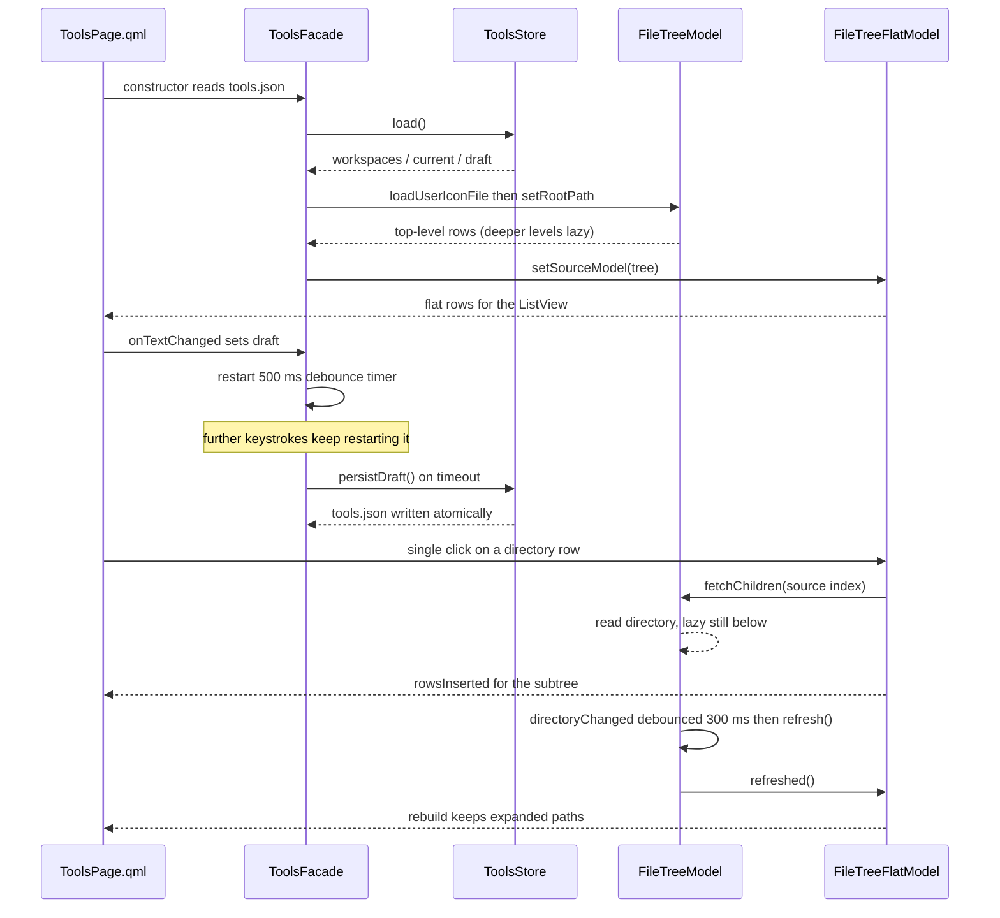
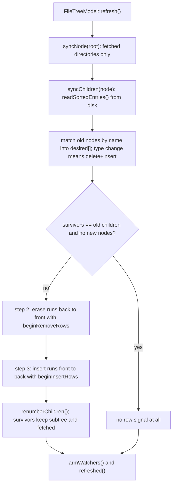

# Agent Tools

## What this feature does

The Agent Tools page is a prompt workbench. It exists to solve two concrete
pain points:

1. Referencing a file in a prompt normally means hand-building a relative path.
2. Typing a prompt straight into an agent CLI risks hitting Enter on a
   half-finished message and sending it.

The page therefore has **no send action**. Enter inserts a newline; nothing
leaves the page. When the prompt is ready the user copies it and pastes it into
the target agent. The right-hand panel browses the current workspace and can
insert a `` `./relative/path` `` file reference into the editor by drag-and-drop
or double-click.

Boundaries: the page does not talk to any agent, does not run anything, and does
not edit repository files. Its only reads are the workspace tree and its only
writes are `tools.json` (workspace memory plus draft) and the system clipboard.
The file tree is browse-only.

## Files and classes

| File | Class / component | Responsibility | Collaborates with |
|---|---|---|---|
| `src/tools/ToolsStore.h` | `ToolsStore` | `tools.json` state: MRU workspace list, current workspace, prompt draft; `kMaxWorkspaces` = 20 | `ToolsFacade`, `core::JsonStore` |
| `src/tools/ToolsStore.cpp` | `ToolsStore::load()/save()` | Read/write and list semantics (MRU touch, cap eviction) | `ToolsFacade` |
| `src/tools/ToolsFacade.h` | `ToolsFacade` | QML facade: workspace properties, draft property, `addWorkspace`/`removeWorkspace`/`refresh`/`fileReference`; the flat model is exposed as `model` | `ToolsPage.qml`, `app/main.cpp` (`tools` alias), `tools::FileTreeFlatModel` |
| `src/tools/ToolsFacade.cpp` | `ToolsFacade` | Wiring, 500 ms draft debounce plus destructor flush, root selection | `FileTreeModel`, `FileTreeFlatModel`, `ToolsStore` |
| `src/tools/FileTreeModel.h` | `FileTreeModel` (with private `Node`) | Lazy directory tree over one workspace root; `Roles`; incremental `refresh()`; `QFileSystemWatcher` | `ToolsFacade`, `FileTreeFlatModel` |
| `src/tools/FileTreeModel.cpp` | `FileTreeModel` | Node ownership, fetch, three-step reconciliation, watcher arming | `FileTreeFlatModel` |
| `src/tools/FileTreeFlatModel.h` | `FileTreeFlatModel` (with private `Row`) | Flattened projection consumed by the QML `ListView`; owns the expanded-path set | `ToolsPage.qml`, `FileTreeModel` |
| `src/tools/FileTreeFlatModel.cpp` | `FileTreeFlatModel::rebuild()/toggleExpanded()` | Projection, expand/collapse, source-signal consumption | `FileTreeModel` |
| `src/tools/FileIcons.h` | `FileIcons` | Three lookup tables (file names / suffixes / folder names) plus fallbacks; `forFile()`/`forFolder()` | `FileTreeModel` (`IconRole`), `core::IconResolver` |
| `src/tools/FileIcons.cpp` | `FileIcons::FileIcons()/loadUserFile()` | Built-in table from `:/config/default_file_icons.json`, overlay of `<dataRoot>/file_icons.json` | `core::JsonStore` |
| `src/tools/MarkdownEdit.h` | `MarkdownEdit` | QML singleton (`MarkdownEdit` on `AgentWorkbench.App`): `attach()`, `applyBold()`, `applyCode()`, `applyBullet()` | `MarkdownContextMenu.qml`, `ToolsPage.qml`, `theme::Theme` |
| `src/tools/MarkdownEdit.cpp` | `MarkdownEdit` | Static cursor operations, theme-driven colours, highlighter bookkeeping | `MarkdownHighlighter` |
| `src/tools/MarkdownHighlighter.h` | `MarkdownHighlighter`, `MarkdownColors` | Lightweight per-block Markdown highlighter; colour tokens | `MarkdownEdit` |
| `src/tools/MarkdownHighlighter.cpp` | `MarkdownHighlighter::highlightBlock()` | Fence state machine plus inline regex rules | `MarkdownEdit` |
| `src/tools/qml/ToolsPage.qml` | `ToolsPage` | The page: header, workspace combo, add/refresh/copy toolbar, `SplitView` with editor and file tree | `tools.*`, `ui.pickFolder`, `MarkdownEdit`, `MarkdownContextMenu` |
| `src/tools/qml/MarkdownContextMenu.qml` | `MarkdownContextMenu` | `AMenu` with a top formatting toolbar and undo/redo/cut/copy/paste items | `MarkdownEdit`, `AMenu`/`AMenuItem` |
| `src/tools/CMakeLists.txt` | build target `awb_tools` | Static library; `Qt::Quick` is a PRIVATE link (only `MarkdownEdit` touches `QQuickTextDocument`) | — |

Outside the module the page leans on `core::Paths::dataRoot()`,
`config/default_file_icons.json`, `theme::Theme`, the shell `A*` components,
`workbench.copyText()`/`notify()` and `ui.pickFolder()`.

## Frontend design

### `ToolsPage.qml` layout

A `ColumnLayout`: `PageHeader` (title `Agent Tools`) → toolbar row → `SplitView`.

- **Toolbar.** A `Workspace` label, the workspace `AComboBox`, an
  `Add Folder...` button, a refresh `AIconButton` (disabled without a workspace)
  and, right-aligned above the editor, the `Copy` primary action.
- **Workspace `AComboBox`.** `model: tools.workspaces`, `currentIndex:
  page.currentWorkspaceIndex()`. Both `contentItem` and `delegate` are
  overridden: the default `ItemDelegate` background is a hard-coded light
  palette that is unreadable in dark themes, so the delegate supplies its own
  `background` (hover/highlight → `theme.surfaceHoverBg`) and a `contentItem`
  row with the path and a per-item remove `AIconButton`.
- **Editor `ATextArea` (`objectName: "promptEditor"`).** `SplitView.fillWidth`,
  `minimumWidth: 260`. Its text is initialised once in `Component.onCompleted`
  (`text = tools.draft`) rather than two-way bound: a permanent binding would
  fight the user's typing. `onTextChanged: tools.draft = text` is the write
  path. `MarkdownEdit.attach(promptEditor)` runs in the same handler.
- **Drop target.** A `DropArea` filling the editor accepts only drags from the
  file tree (`drop.source.isFileReferenceDrag`), computes an insertion offset
  with `promptEditor.positionAt(drop.x, drop.y)` and inserts `drop.text`. A
  `TextArea` is not a `Flickable`, so control coordinates are used directly.
- **Right-click.** A `MouseArea` accepting only `Qt.RightButton` with
  `cursorShape: Qt.IBeamCursor` sets `editorMenu.editor = promptEditor` and
  `popup(mouse.x, mouse.y)`.
- **`SplitView` handle.** The visual line is `spacingXs` wide, but a
  `containmentMask` `Item` widens the hit area to 12 px. The mask offsets must
  reference the handle by `id`, because `parent` is `null` at first evaluation.
- **File tree `ListView` (`objectName: "fileTree"`).** `model: tools.model` (the
  flat projection), `AScrollBar.vertical`, and an empty-state label when the
  workspace is set but `tools.model.visibleCount === 0`, plus an
  `AEmptyState` when no workspace is selected.
- **File tree delegate.** Every role is declared as a `required property`
  (`name`, `path`, `relativePath`, `isDir`, `iconSource`, `depth`, `expanded`,
  `hasChildren`) **and** `index`. Declaring any required property clears
  `contextObject` in Qt 5.15, so a bare `index` would throw a `ReferenceError`
  and abort the single-click expand handler. The row carries a `rebinding` flag
  toggled by a `Connections` on `tools.model`'s `onModelReset`, so the chevron
  rotation animation stays quiet while the model resets. Drag-out uses
  `Drag.dragType: Drag.Automatic` with `Drag.mimeData` text from
  `tools.fileReference(relativePath)` and `Drag.active: rowDragHandler.active`.
  Two `TapHandler`s do single-click expand and double-click insert; a
  right-button `MouseArea` opens a two-item `AMenu` for copying the relative or
  absolute path.
- **`AEmptyState` constraint.** Its root is a plain `Item` and must not carry
  `anchors` (undefined behaviour); it sizes itself from the layout. Inside it,
  use `Column` rather than `ColumnLayout` to avoid a Qt 5 recursive re-arrange.

### `MarkdownContextMenu.qml`

An `AMenu` whose first child is a plain `Item` — a 34 px toolbar holding three
`AIconButton`s (Bold, Code, Bulleted list). Because an `AMenu`'s content item
stacks direct children vertically, mixing this `Item` with `AMenuItem`s yields
"toolbar on top, items below", with a faint divider. Actions run through
`run(action)`, which closes the menu, returns focus to `editor`, and only then
executes the action — the editor's selection and insertion must receive focus
first, otherwise input and selection writes land nowhere.

## Backend design

### `ToolsStore`

Owns `tools.json` under the data root. The keys are `workspaces` (string array,
MRU first), `current` (current workspace absolute path) and `draft` (the full
prompt). **The key names are part of the on-disk format; renaming one loses user
data.** `load()` skips non-string entries and dedupes, and clears `current` when
it no longer appears in the list. `addWorkspace()` removes the path and prepends
it (a single MRU-touch path), evicts from the tail past `kMaxWorkspaces` = 20,
and sets it current. `removeWorkspace()` removes the path and, if it was
current, promotes the remaining head (or clears). `setCurrentWorkspace()` accepts
the empty string (legitimate "no workspace") and prepends a non-empty path.
`setDraft()` returns without writing when the text is unchanged. `save()` writes
atomically through `core::JsonStore`.

### `ToolsFacade`

Properties: `model` (CONSTANT, the flat projection), `workspaces`,
`currentWorkspace` (WRITE), `draft` (WRITE). Invokables: `addWorkspace`,
`removeWorkspace`, `refresh`, `fileReference`. The `awb::core::OpResult` return
type of `addWorkspace`/`removeWorkspace` must stay fully qualified: Qt 5's moc
records the written name while QML resolves the `QMetaType` registration name,
so a short name yields "Unknown method return type" and the button does nothing.

- **Draft debounce.** `setDraft()` updates the buffer, emits `draftChanged()` and
  restarts a single-shot 500 ms `QTimer`. `persistDraft()` runs on timeout; the
  destructor also flushes if the timer is still active, so the last keystrokes
  survive shutdown.
- **Icon table ordering.** The constructor calls
  `m_model->loadUserIconFile(dataRoot + "/file_icons.json")` **before** setting
  the root, because the model does not retroactively emit `dataChanged` for
  rows already rendered.
- **Root selection.** `applyCurrentToModel()` sets the tree root only when the
  remembered directory exists; otherwise the tree stays empty rather than
  showing a permanently empty fake root.
- **`refresh()`.** Async-shaped but synchronously completed today; it forwards to
  `FileTreeModel::refresh()`, whose `refreshed` signal is forwarded to
  `refreshFinished()` so QML cannot tell watcher-triggered refreshes from
  manual ones.

### `FileTreeModel`

A lazy tree over one root. Each `Node` holds `name`, `path`, `relativePath`,
`isDir`, `fetched`, `parent`, `row` and `children`; `internalPointer` stores the
`Node *`.

- **Lazy loading.** `hasChildren()` returns true for any unfetched directory, so
  the view can show an expander before reading; after a fetch an empty directory
  reports false and the expander disappears. `canFetchMore()` is true for an
  unfetched directory; `fetchMore()` reads it. `fetchChildren()` is an idempotent
  `Q_INVOKABLE` fallback for when the view does not drive `fetchMore`.
- **`setRootPath()` does the top level before the reset.** The whole staging tree
  (including the top level) is built outside `beginResetModel`; a reset followed
  immediately by inserted rows is double-counted by the view (observed in the
  2026-09 smoke test). After the reset, watchers are re-armed and
  `topLevelCountChanged()` is emitted.
- **Incremental `refresh()`.** `syncNode()` walks every *fetched* directory
  (fetched but collapsed directories are reconciled too, or their stale rows
  would show on the next expand). `syncChildren()` is a three-step
  reconciliation, each step strictly inside `begin`/`end`:
  1. match old nodes by name to build the `desired` sequence (survivors reuse
     pointers, new names are created; a name whose type changed is treated as
     delete-plus-insert);
  2. delete from back to front in runs, so earlier row numbers stay valid during
     the pass;
  3. insert from front to back in runs, using a single cursor because survivors
     are in the same order in `desired` and `children`.
  Survivors keep their subtrees, `fetched` state and view expansion state. When
  nothing changed, no row signal is emitted at all. `refreshed()` is emitted
  regardless of whether anything changed.
- **Watcher.** `QFileSystemWatcher::directoryChanged` is connected (only
  `directoryChanged`; there is no single-file rename requirement) through a
  300 ms single-shot debounce to `refresh()`. `armWatchers()` rebuilds the watch
  list from the set of fetched directories after any structural change.
- **Sort.** Directories first, then case-insensitive file name, with a
  case-sensitive tie-break for stability.

### `FileTreeFlatModel`

Projects the tree into a linear row order a `ListView` can consume, holding the
expanded state itself (Qt 6.3's QML `TreeView` does not exist in Qt 5.15, so both
versions share one delegate). It consumes only two source signals:
`QAbstractItemModel::modelReset` (root change → clear `m_expandedPaths`, rebuild)
and `FileTreeModel::refreshed` (end of one refresh → rebuild). The per-directory
`rows*` signals during a refresh are not consumed, avoiding a rebuild storm.
Expanded state is held as a set of paths relative to the root, so it survives a
refresh. `toggleExpanded(row)` expands (fetch fallback, recursive projection into
one `rowsInserted`) or **recursively** collapses (clearing expansion keys of all
descendants). The role enum is mapped explicitly to the source model's enum
because the numeric values differ (the source has `SuffixRole` before
`IconRole`), so they cannot be forwarded by number.

### `FileIcons`

Three tables — `fileNames`, `suffixes`, `folderNames` — plus a fallback per kind.
The constructor merges the built-in `:/config/default_file_icons.json`;
`loadUserFile()` overlays `<dataRoot>/file_icons.json`, with user keys winning.
Lookup is case-insensitive and ordered complete file name → suffix → fallback.
Every value is normalized through `core::IconResolver`, and empty/illegal values
are dropped rather than inserted.

### `MarkdownEdit` and `MarkdownHighlighter`

`MarkdownEdit` is the QML singleton that gives the prompt editor its Markdown
support. `attach(textArea)` reads the `QQuickTextDocument` from the control's
`textDocument` property and installs a `MarkdownHighlighter` parented to the
document; a second call for the same document is a no-op. Colours come from the
current `theme::Theme` (`colorsFromTheme`) and are re-applied on `Theme::changed`
followed by `rehighlight()`; dead highlighter pointers are pruned via
`QPointer`.

The three formatting actions are pure static cursor operations, so tests can
drive them against a `QTextDocument`:

- `applyBoldToCursor()`: empty selection inserts `****` and parks the cursor in
  the middle; otherwise it wraps the trimmed selection in `**`, leaving outer
  whitespace outside the markers, and re-selects the content.
- `applyCodeToCursor()`: empty selection inserts ` `` `; a single-line selection
  gets inline backticks; a selection containing a newline gets a fenced block
  (```` ``` ```` lines are placed after the leading newline and before the
  trailing newline so existing separators are reused).
- `applyBulletToCursor()`: adds `- ` at the start of every line in the selection
  (or the cursor's line when there is no selection) and re-selects the whole
  affected range.

Each action runs inside one `beginEditBlock`/`endEditBlock`, so a single undo
reverts it. `editTextArea()` reads the selection through the control's
`selectionStart`/`selectionEnd` properties and writes the result back through
`select()`. The selection read does **not** depend on focus, which is why the
menu can take focus and still operate on the editor's selection.

## Business logic

The first diagram shows the draft debounce and the lazy file tree from the QML
and facade side; the second shows the incremental refresh reconciliation inside
`FileTreeModel`.





### Workspace memory semantics

The workspace list is MRU-ordered, capped at 20, and the current entry is always
either in the list or empty. Deleting the current entry promotes the head of the
remaining list. The empty string is a legitimate current value. Draft content
that has not changed does not trigger a write.

### File reference format

`ToolsFacade::fileReference()` produces `` `./relative/path` `` — backtick
wrapped, forward slashes, no `./` in the input. Drag-and-drop and double-click
both use it, so the prompt always receives the same shape.

## Pitfalls and conventions

- **Role names and order are a contract.** `FileTreeModel::Roles`,
  `FileTreeFlatModel::Roles` and the delegate's `required property` names must
  stay in sync; the flat model's explicit `case` mapping from its enum to the
  source enum exists because the numbers differ.
- **No pooling signal on `ListView`.** Unlike `TreeView`, `ListView` gives no
  pooled/reused signal, so the chevron rotation animation is muted during a
  model reset via the `Connections` on `onModelReset` plus the `rebinding` flag.
- **Icon table timing.** `loadUserIconFile()` must run before `setRootPath()`;
  there is no retroactive `dataChanged` for rendered rows.
- **`AEmptyState` recursive re-arrange.** Its root is a plain `Item` without
  anchors; use `Column`, not `ColumnLayout`, inside it on Qt 5.
- **Draft debounce.** Never write `tools.json` per keystroke; the 500 ms debounce
  plus the destructor flush is the contract.
- **`awb::core::OpResult` fully qualified** on the facade invokables.
- **`ui.pickFolder` is the folder picker.** The QML `FolderDialog` is exclusive
  to Qt 6 QuickDialogs2; the C++ native dialog (`UiServices::pickFolder`) is the
  only route that behaves identically on Qt 5 and Qt 6.
- **`objectName`s are test contracts.** `tests/tools/tst_toolsui.cpp` locates
  `promptEditor`, `editorMenu` and `fileTree` by `objectName`; renaming them
  breaks the interaction smoke test.

## Change checklist

- [ ] New `.cpp`/`.h` files are added to `src/tools/CMakeLists.txt`; if a new
      source uses `tr()`, add it to `cmake/AwbTranslations.cmake`.
- [ ] New or moved `.qml` files are registered in `app/CMakeLists.txt`
      (`_tools_qml` plus the alias) and in `AWB_TS_SOURCES` if they use `qsTr()`.
- [ ] `objectName`s used by `tests/tools/tst_toolsui.cpp` are unchanged, or the
      test is updated in the same commit.
- [ ] Model `roleNames()` still match the delegate's `required property` names.
- [ ] `FileIcons` key names in `config/default_file_icons.json` were not renamed.
- [ ] `tools.json` key names are unchanged.
- [ ] `bash scripts/build.sh --test` is green, including `check_architecture`.

## Related

- [Skills browser](skill-browser.md) — the other directory-scanning page, and
  the first consumer of the shared `A*` components.
- [Shell and navigation](shell-and-navigation.md) — how the page is registered
  and loaded, and the settings page that reuses `SettingsSkillsPage` patterns.
- [Settings](settings.md) — the `A*` form controls this page reuses.
- [Agent Tools (guide)](../guide/agent-tools.md) — the user-facing description.
- [Frontend design](../architecture/frontend-design.md) — the `A*` component
  shelf and the `AMenu` family.
- [Layers and dependencies](../architecture/layers-and-dependencies.md) — why
  `tools` may not depend on `shell`.
