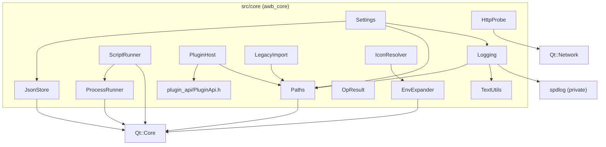

# Core infrastructure

## What it does, and where it stops

`src/core` is layer L0: the infrastructure every other module is built on. It owns paths, JSON files, typed settings, logging, external processes and scripts, the HTTP health probe, the plugin loader, the legacy-data import, icon and environment-variable resolution, a few text helpers, and the fallible-result type.

The boundary is enforced, not merely conventional:

- **No UI.** `scripts/check-architecture.sh` rule 4 fails the build if `QtQuick`, `QQuick*`, `QQml*`, `Qt6::Quick` or `QtWebEngine` appears anywhere under `src/core/`. Core does not know what a QML page is.
- **No business knowledge.** Core does not know what an agent, a skill, a Web tab or a theme is. `Settings` stores `web.chromiumFlags` as an opaque string; `PluginHost` loads a library and hands it an abstract `plugin::Services`; `ProcessRunner` runs a command without caring which one. Domain semantics live above, in the L2 modules.
- **The only sanctioned Qt dependency is Core plus Network** (`QNetworkAccessManager` for `HttpProbe`) and, privately, spdlog for `Logging`. spdlog headers are `PRIVATE` to `awb_core`, so no other layer sees them.

## Files and classes

| File | Class / struct | Responsibility | Collaborates with |
|---|---|---|---|
| `src/core/Paths.h` / `.cpp` | `awb::core::Paths` | The single source of the data directory and every path derived from it (`themesDir()`, `pluginsDir()`, `logsDir()`, `webProfilesDir()`, `skillCacheFile()`, `downloadsDir()`); test injection | every module that touches disk |
| `src/core/JsonStore.h` / `.cpp` | `awb::core::JsonStore` | Atomic JSON read/write: `readFile()`, `writeFile()`, `writeBytes()` | `Settings`, `agentcatalog`, `tools`, test fixtures |
| `src/core/Settings.h` / `.cpp` | `awb::core::Settings` + `WindowSettings`, `AppearanceSettings`, `LocaleSettings`, `LauncherSettings`, `WebSettings`, `SkillsSettings`, `LoggingSettings`, `PluginsSettings` | The typed accessor for `settings.json`; nothing else may read that file | `Paths`, `JsonStore`, `Logging::isValidLevelName` |
| `src/core/Logging.h` / `.cpp` | `awb::core::Logging`, `RotatingFileSink` (internal), macros `AWB_DEBUG`/`AWB_INFO`/`AWB_WARNING`/`AWB_CRITICAL`/`AWB_PERF` | Asynchronous rotating file log plus stderr mirror; installs the Qt message handler | `Paths`, `TextUtils`, spdlog |
| `src/core/ProcessRunner.h` / `.cpp` | `awb::core::ProcessRunner`, `awb::core::ProcessResult` | External-command mechanics: PATH/PATHEXT resolution, detached start with optional output capture, synchronous run with timeout, process-tree kill, command-line splitting, output decoding | `agentcatalog` (launch, version checks), `workbench::EnvironmentService` |
| `src/core/ScriptRunner.h` / `.cpp` | `awb::core::ScriptRunner` (+ private `Slot`) | Keyed one-shot command executor with streaming output and the epoch rule | `agentcatalog` (install/update/version/setup), `workbench::EnvironmentService` |
| `src/core/HttpProbe.h` / `.cpp` | `awb::core::HttpProbe` | Asynchronous reachability probe with fixed semantics, plus `portFromUrl()` | `agentcatalog::AgentHealthMonitor` |
| `src/core/PluginHost.h` / `.cpp` | `awb::core::PluginHost` (+ `PluginHost::Manifest`) | Discover plugin manifests and load the enabled libraries via the exported C entry points | `plugin_api`, `workbench::PluginServices`; details in [Plugin host](plugin-host.md) |
| `src/core/LegacyImport.h` / `.cpp` | `awb::core::LegacyImport` | One-time copy of the pre-0.4 `~/.AgentLauncher` data directory into the new data root | `Paths`, `main.cpp` |
| `src/core/IconResolver.h` / `.cpp` | `awb::core::IconResolver` | Resolve a configured icon string to a displayable URL, with a caller-supplied fallback | `EnvExpander`; `agentcatalog`, `tools` |
| `src/core/EnvExpander.h` / `.cpp` | `awb::core::EnvExpander` | Expand `%VAR%` and a leading `~/` in paths | `IconResolver`, `skillcatalog`, `agentcatalog` |
| `src/core/TextUtils.h` / `.cpp` | `awb::core::TextUtils` | `extractVersion()`, `formatCommandLine()`, `clampOutput()` | `Logging`, `EnvironmentService`, `agentcatalog` |
| `src/core/OpResult.h` / `.cpp` | `awb::core::OpResult` (`Q_GADGET`) | Fallible synchronous result `{ ok, error }` that no module throws across | every module boundary, especially towards QML |
| `src/plugin_api/PluginApi.h` | `awb::plugin::ApiVersion`, `PageDescriptor`, `Services`, `AWB_PLUGIN_EXPORT` | The header-only plugin ABI | external plugin repositories; see [Plugin host](plugin-host.md) |
| `src/core/CMakeLists.txt` | target `awb_core` | Declares `AWB_PERF_ENABLED` for Debug only and links spdlog privately | all |

The diagram below shows what each core class owns and which core classes it depends on; the only arrows leaving the group point at Qt itself.

## Per-class notes

### Paths

`Paths::dataRoot()` resolves in this order, and the order is the whole contract:

1. a directory injected by `Paths::setDataRootForTesting()` (used by tests with a `QTemporaryDir`);
2. when `QStandardPaths::setTestModeEnabled(true)` is active, `AppConfigLocation` — because test mode **does not** redirect `HomeLocation`, and using home would make unit tests read and write the developer's real data directory;
3. otherwise `<HomeLocation>/.AgentWorkbench`.

Every subdirectory is derived from `dataRoot()`; **do not assemble these paths anywhere else**. `setDataRootForTesting()` also clears the override when passed an empty string, and `isDataRootOverridden()` reports whether an override is active. A home directory containing non-ASCII characters must be handed to `QFile`/`QDir`; never pass such a path to a narrow-character API.

### JsonStore

- `readFile()` on a **missing** file returns an empty object **without warning** — that is the normal first-start path. An unreadable file or malformed JSON logs a `qWarning` and also returns an empty object, so one corrupt file never takes the application down; callers fall back to defaults.
- `writeFile()` serialises with `QJsonDocument::Indented` and delegates to `writeBytes()`.
- `writeBytes()` creates the parent directory, then writes through `QSaveFile`: the temporary file is committed only at the end, so a crash mid-write never leaves a half file. It is also the entry point for byte-identical writes (the bundled agent definitions). Failures — cannot open, short write, failed commit — come back as a `failure()` with an English reason.

### Settings

`Settings` is the only reader and writer of `settings.json`. The eight section structs and their defaults are declared in `src/core/Settings.h`; the complete field-by-field key table is in [Settings](settings.md) — this page deliberately does not repeat it. What matters here:

- **Missing key → default value; unknown key → warning and ignore; wrong type or out-of-range value → warning and default.** No key's failure affects any other key.
- **There is no migration code, and none should be added.** Adding a key means adding a default.
- `save()` writes the whole object atomically and returns an `OpResult`.
- Setters exist for the keys the UI changes and each emits `valueChanged(key)` with a dotted key such as `appearance.theme`: `setWindowTitle`, `setThemeId`, `setFollowSystem`, `setFontFamily`, `setWindowSize`, `setSidebarCollapsed`, `setLastPageId`, `setWebSurface`, `setWebChromiumFlags`, `setSkillRoots`, `setPluginsDisabledIds`, `setPluginsGloballyEnabled`. Writing a setter does not persist — the caller calls `save()`.
- `Settings` is constructed before `QGuiApplication` in `main.cpp`, because `web.chromiumFlags` must reach the environment before WebEngine initialises.

### Logging

`Logging` sits in front of spdlog's async backend:

- `install()` creates the log directory, installs the Qt message handler, and builds a backend consisting of a rotating file sink (`<dataRoot>/log/agentworkbench.log`) and, unless `logging.mirrorToStderr` is false, a stderr sink. The queue is an **8192-slot MPMC queue with a single worker thread**, configured with `overrun_oldest`: under extreme back-pressure the oldest line is dropped rather than blocking the caller (usually the UI thread). Warnings and above flush immediately (`flush_on(warn)`); everything else is flushed at most one second later by a periodic worker.
- Rotation defaults: **5 MB per file, 3 files total** (current plus two backups). The custom `RotatingFileSink` keeps the repository's existing backup naming (`agentworkbench.log.1`) instead of spdlog's (`agentworkbench.log.1.txt`-style insertion before the extension).
- The level comes from `logging.level` (validated by `Logging::isValidLevelName()`; accepted names are `debug`, `info`, `warning`, `critical`, `off`, default `debug`). `install()` may be called again — `main.cpp` does so once, only when the user changed a rotation or level option — and it tears the old backend down before building the new one. The emitting thread only formats the line and enqueues it; never assume a line reached disk when the call returns.
- **`uninstall()` must be called on every exit path**, otherwise the tail of the queue is lost. `main.cpp` calls it both on the normal return and on the QML-load-failure branch.
- The line format is a contract (`[yyyy-MM-dd hh:mm:ss.zzz] [LEVEL][category][file:line] msg`); the timestamp, level, category and source location are assembled on the calling thread, and spdlog's pattern is just `%v`. A `QtFatalMsg` is written synchronously around the queue because the process may die immediately after.
- `AWB_DEBUG` / `AWB_INFO` / `AWB_WARNING` / `AWB_CRITICAL` bind the category to the fixed `awb.event` category; the level is the macro name. A category declared with `Q_LOGGING_CATEGORY` (the convention is `awb.<module>`) is **enabled by default**, so its debug lines do reach the log; use `QT_LOGGING_RULES` to silence or enable a specific one. `AWB_PERF` is compiled out entirely in release: `awb_core`'s CMake defines `AWB_PERF_ENABLED` only for the Debug configuration, and without it the macro expands to an empty statement (its argument expression is not even evaluated). In Debug the `awb.perf` category can be turned on with `QT_LOGGING_RULES="awb.perf.debug=true"`.
- `Logging::formatCommandLine()` and `Logging::clampOutput()` forward to `TextUtils`, so there is one canonical implementation.

### ProcessRunner

- `findExecutable(program)` uses `QStandardPaths::findExecutable`, which searches `PATH` and **on Windows applies `PATHEXT`** — that is how an npm-style shim (`qwen` → `qwen.cmd`) is found, because `CreateProcess` does not try these extensions itself. An empty result means "not found".
- `startDetached(program, args, pid, error, workingDirectory, env, outputFile)` resolves the program again, then starts it detached so the child outlives the launcher. When `outputFile` is set, stdout and stderr are merged into that file with truncation on every start; `agentcatalog` relies on that capture to pick the per-process session URL out of the agent's own console output. Whether a `.cmd`/`.bat` needs a `cmd /c` wrapper is the **caller's** decision.
- `run(program, args, timeoutMs)` is the synchronous variant and returns a `ProcessResult { started, exitCode, stdOut, stdErr, error }`. A non-positive timeout waits forever; on timeout the process is killed, `exitCode` stays `-1` and `error` says so.
- `killTree(pid)` runs `killProgram()` with `killProgramArgs(pid)` — `taskkill /F /T /PID <pid>` on Windows, covering the `cmd → qwen.cmd → node` chain — via `startDetached`, fire-and-forget. The program and its arguments are exposed separately so callers can log the exact command before running it.
- `splitCommand(command)` is `QProcess::splitCommand` on Qt 6 and a portable twin on Qt 5; an odd number of quotes yields an empty list, matching Qt 6.
- `decodeOutput(data)` decodes as UTF-8 and, on the first invalid sequence, falls back to the system locale encoding (GBK on a zh-CN Windows), so old `cmd` output still decodes instead of turning into mojibake.

### ScriptRunner

`ScriptRunner` executes one-shot commands (install, update, version, setup) identified by a `key`, usually the agent id, and is the piece most likely to be edited and least obvious to get right:

- **The epoch rule.** Every run bumps the slot's `epoch`. `run()` calls `invalidate()` first, which kills the previous process, disconnects its signals and deletes its temporary batch file; every callback compares its captured epoch (and process pointer) with the slot and returns early when stale. A slow finished-callback from an old run can therefore never touch the new run's state.
- `run()` executes a program plus arguments directly; `runShell()` wraps the raw command in `cmd /c`; `runBatch()` writes the command into a temporary `.cmd` file (`@echo off`) and runs that file. `runBatch()` exists because `QProcess` escapes an embedded `"` as `\"` (C convention) while `cmd.exe` treats the backslash literally, corrupting the path — running a batch file avoids the argument-quoting problem entirely. The `QTemporaryFile` is owned by the slot until the run ends, because `cmd.exe` is still reading it.
- Output is streamed through `outputChunk(key, text)` and also accumulated, because `readyRead` consumes the bytes and `finished()` must report everything seen plus the final tail. If a chunk ends in the middle of a multi-byte UTF-8 sequence, the incomplete tail is held back and decoded with the next chunk, so a split character never becomes a replacement glyph. At end of stream the held bytes are flushed as-is.
- `finished(key, ok, exitCode, stdOut, stdErr, error)` fires exactly once per accepted run. `ok` is true only on a clean exit (code 0, not timed out, actually started); a failure to start reports `exitCode = -1` through a queued one-shot so a caller that connects after `run()` still receives it.
- `isRunning(key)` reports whether the slot currently holds a process.

### HttpProbe

The semantics are fixed and shared by every tool: **any HTTP response counts as reachable**, including 4xx and 5xx (a `401` proves the server is running); a refused connection or a timeout is unreachable. The default timeout is **5000 ms**; on timeout the request is aborted and reported unreachable, and the timer is parented to the reply so no orphan timer is left behind. `probe()` is safe to call concurrently. `portFromUrl()` returns the explicit port, otherwise the scheme default (443/80), and `-1` for an empty or unparseable URL. There is deliberately no process sniffing anywhere.

### PluginHost

`PluginHost` scans `<dataRoot>/plugins/*/plugin.json`, validates the ABI version, and loads enabled libraries through the exported C entry points. Every failure is logged and skipped — a plugin can never block startup. The host-side bridge and the full contract are covered in [Plugin host](plugin-host.md); this page only notes that it lives in core because loading libraries is infrastructure, while the services it hands out are implemented in `awb_workbench`.

### LegacyImport

`LegacyImport::runOnce(newRoot, outNotice)` copies the pre-0.4 `~/.AgentLauncher` directory into the data root **once, by copying only — the old directory is never moved or deleted**. It acts only when the data root is still "untouched", which is defined as "does not exist, or contains nothing but a `log/` directory": `Logging::install()` runs before everything, so on the first start after an upgrade the only entry is `log/`. Any other entry means the new version has already written user data and the import must not overwrite it. The import covers `agents.json`, `agent_state.json` and every file in the old `log/` directory. It returns whether anything was copied and hands back a one-time English notice; subsequent calls are no-ops, which is why calling it on every start is safe. `importOnce()` is the injectable-directories variant used by tests.

### IconResolver

`IconResolver::resolve(raw, fallback)` passes through `qrc:/…`, `http://…`, `https://…` and `file://…` unchanged; anything else is treated as a local file path (after `EnvExpander::expand()`, so `%USERPROFILE%/icons/x.svg` works) and, when it exists, converted to a `file:///` URL. Everything else — including an empty string — returns the fallback. **The fallback is supplied by the caller; core never hard-codes an application resource path.**

### EnvExpander

`EnvExpander::expand(path)` expands `%VAR%` (Windows style) through `qEnvironmentVariable()` and replaces a leading `~/` with the home directory. An unknown `%VAR%` is left **verbatim** rather than replaced by an empty string, so a mistake is visible instead of silently rewriting the path.

### TextUtils

- `extractVersion(output)` returns the first `x.y.z` match, allowing a pre-release suffix (`1.2.3`, `v1.2.3-beta`, `1.2.3.4`); no match returns an empty string.
- `formatCommandLine(program, args)` renders a copy-pasteable command line, quoting only arguments that contain whitespace or a quote (and rendering an empty argument as `""`). The `[cmd]` log lines use it so the log shows what actually ran.
- `clampOutput(text, limit)` truncates to `limit` characters and appends `… (N more characters not logged)`, so a chatty command cannot flood the log. A non-positive limit disables truncation.

### OpResult

`OpResult` is a `Q_GADGET` with `ok` and `error`, a `success()` / `failure(reason)` factory pair, and `explicit operator bool`. It exists because **nothing throws across a module boundary**, and exceptions cannot cross the C++/QML boundary at all; the division of labour is `OpResult` (and signals) at boundaries, exceptions *inside* a module. Because it is a gadget with `Q_PROPERTY` members, QML can read `.ok` and `.error` directly off the return value of a `Q_INVOKABLE`.

**A function that returns it and is called from QML must spell the return type fully qualified as `awb::core::OpResult`.** Qt 5's moc records the return type exactly as written in the header, while the QML call site resolves it through the `QMetaType` registry by the type's full name; the short form does not resolve, and the symptom is an `"Unknown method return type"` error with a button that silently does nothing. `qRegisterMetaType<awb::core::OpResult>()` is called once in `app/main.cpp` for the same reason.

### plugin_api/PluginApi.h

`src/plugin_api/PluginApi.h` is a **header-only interface target** (`awb_plugin_api`) that external plugin repositories link against. It depends on Qt Core only and never on a host module, and it declares the ABI version, the value-type `PageDescriptor`, the abstract `Services` interface, and the two `extern "C"` entry points every plugin exports. The host-side contract is in [Plugin host](plugin-host.md).

## Adding a core utility class

- [ ] If it needs a path, add a derived getter to `Paths` (and its `dataRoot()`-based implementation) instead of assembling the path at the call site.
- [ ] Keep it UI-free: no `QtQuick` / `QQuick*` / `QQml*` / `QtWebEngine` (rule 4 of `check_architecture`). Prefer Qt value types and Core/Network only.
- [ ] Write a unit test under `tests/core/` (cases in `private Q_SLOTS:`), and never touch the real data directory — inject a `QTemporaryDir` via `Paths::setDataRootForTesting()`.
- [ ] Add the file to `src/core/CMakeLists.txt` if it needs compiling (header-only utilities do not).
- [ ] Update this page and the [C++ library design](../architecture/cpp-design.md) page.
- [ ] If it is fallible and QML-facing, return `awb::core::OpResult` (fully qualified) and register the metatype if a new type is involved.

## Related pages

- [Theme engine](theme-engine.md) — the L1 layer that sits directly on `Paths`, `JsonStore` and `Settings`.
- [Workbench and pages](workbench-and-pages.md) — where core objects are constructed and wired.
- [Plugin host](plugin-host.md) — the full plugin contract that starts in `PluginHost`.
- [C++ library design](../architecture/cpp-design.md) — the layering and error-handling contracts core obeys.
- [Layers and dependencies](../architecture/layers-and-dependencies.md) — why core depends on nothing above it.
- [Guide index](../guide/index.md) — the user-facing behaviour of logging, data directories and settings.
- [Configuration](../configuration.md) — the `settings.json` key table.
