# Internationalisation

## The rules, and why they are shaped this way

This is an internationalised open-source project: every user-facing string is translatable. Four rules follow from that, and each one has a concrete failure it prevents.

1. **The source language is English.** Never put Chinese (or any non-English language) inside `tr()` or `qsTr()`. `check_architecture` rule 3 scans every `tr(...)` / `qsTr(...)` call for non-ASCII bytes and fails the build if it finds any. The reason is mechanical, not stylistic: the source string is the lookup key, so if different developers write it in different languages the same message ends up with several keys and translators lose the ability to reuse one translation.
2. **`translations/` holds the translations.** Chinese and any other language live in `.ts` files there, never in source strings.
3. **The build only runs `lrelease`** — compiling `.ts` into `.qm` and embedding those under the `:/i18n/` resource prefix. `lupdate` (source → `.ts` sync) is **not** part of the build.
4. **`lupdate` is an explicit step**: `bash scripts/update-ts.sh`, equivalently `cmake --build build --target update_ts`.

Rule 3 is the one that looks like an omission and is deliberate. `lupdate` rewrites every `<location>` element with the current source line numbers, so if it ran during the build the working tree would carry a modified `translations/agentworkbench_zh_CN.ts` after every compile even when no string changed — a permanent phantom diff in a repository that is routinely developed in several worktrees at once. Keeping `lupdate` explicit means the `.ts` changes only when a developer asks for it.

The pipeline, with the explicit step drawn separately:

```mermaid
flowchart LR
    Sources["C++ tr() and QML qsTr()<br/>in AWB_TS_SOURCES"]
    Lupdate["lupdate — explicit<br/>scripts/update-ts.sh / update_ts target"]
    Ts["translations/agentworkbench_zh_CN.ts"]
    Lrelease["lrelease — part of every build<br/>qt_add_translation()"]
    Qm["agentworkbench_zh_CN.qm"]
    Resource[":/i18n/ resource in the executable"]
    Translator["QTranslator installed by app/main.cpp"]

    Sources -.->|"only when asked"| Lupdate
    Lupdate --> Ts
    Ts --> Lrelease
    Lrelease --> Qm
    Qm --> Resource
    Resource --> Translator
```

## Files and the flow

| File | Role | Notes |
|---|---|---|
| `translations/agentworkbench_zh_CN.ts` | The only translation file | XML `<TS version="2.1" language="zh_CN">`, one `<context>` per class or QML component, each message holding a `<location>` and a `<source>` / `<translation>` pair |
| `cmake/AwbTranslations.cmake` | Declares `AWB_TS_SOURCES`, the **list of source files** `lupdate` scans | A new `.cpp` / `.h` / `.qml` containing `tr()` / `qsTr()` must be added here, otherwise its strings never reach translators |
| `CMakeLists.txt` (root) | `include(cmake/AwbTranslations.cmake)`, then `qt_add_translation(QM_FILES translations/agentworkbench_zh_CN.ts)`; `awb_translations` is an order-only target so `rcc` cannot run before `lrelease` | Also defines the `update_ts` target, which runs `lupdate` over an `@file` list (90+ paths exceed the Windows command-line limit) and writes the single `.ts` |
| `app/CMakeLists.txt` | `add_dependencies(AgentWorkbench awb_translations)`, sets `QT_RESOURCE_ALIAS "agentworkbench_zh_CN.qm"`, and embeds `${QM_FILES}` under `PREFIX "/i18n"` | The `.qm` files are registered here because resource embedding lives with the executable |
| `scripts/update-ts.sh` | Drives `cmake --build <build dir> --target update_ts` and reports whether `translations/` changed | Requires an already-configured build directory; it does **not** run `lupdate` directly |
| `app/main.cpp` | Creates a `QTranslator`, loads it with `translator.load(locale, "agentworkbench", "_", ":/i18n")` and installs it | `locale` is `QLocale()` (the system locale) unless `core::Settings`'s `locale.override` is set; the prefix is `agentworkbench` |
| `scripts/check-architecture.sh` | Rule 3: `tr()` / `qsTr()` source strings must be ASCII | Enforced at build time by `check_architecture` |

The QML side is identical in spirit: `qsTr()` is used exactly like `tr()`, and the QML file must be in `AWB_TS_SOURCES`.

## Day-to-day workflow

1. **New source file containing `tr()` / `qsTr()`?** Add it to `AWB_TS_SOURCES` in `cmake/AwbTranslations.cmake`. Miss this and the file's strings simply never appear in the `.ts`.
2. **Added or changed a user-facing string?** Run `bash scripts/update-ts.sh` (equivalently `cmake --build build --target update_ts`). This requires a configured build directory; if `build/` does not exist, run `bash scripts/build.sh` once first.
3. **Commit the `.ts` together with the code change** in the same commit, after filling in any new `<translation type="unfinished">` entry.
4. **Forgetting step 2 is not a build failure.** The new strings simply fall back to English in already-translated languages. That is a mild penalty, not a broken build — but it is still a defect worth avoiding.
5. **`.ts` line-number differences are noise.** When merging, take either side of a conflict whose only change is `<location>` line numbers; only merge by hand when the translated text itself differs.

Only user-facing strings are wrapped. `QStringLiteral` is used for everything not meant to be translated (JSON keys, command lines, URL fragments, log prefixes), and `tr()` must not be applied to those.

## Adding a new language

1. Create `translations/agentworkbench_<locale>.ts` (for example `agentworkbench_de.ts`), with a matching `language` attribute.
2. Register it in the root `CMakeLists.txt`'s `qt_add_translation()` call so `lrelease` compiles it and `app/CMakeLists.txt` embeds the resulting `.qm`. The `update_ts` target currently writes only `agentworkbench_zh_CN.ts`, so it needs the new file added as well (or a sibling target), or `lupdate` will not populate it.
3. `AWB_TS_SOURCES` lists the **source** files to scan, not `.ts` files; it stays as it is unless you also added new sources in step 1 of the workflow above.
4. Run `bash scripts/update-ts.sh` so `lupdate` fills the new file with every message and the empty `<translation>` entries to be translated.
5. Translate the entries, rebuild, and the translator is picked up automatically for users whose system locale matches.
6. Update the site's language handling: the locale is also listed in the i18n plugin's `nav` in `mkdocs.yml` (both `locale` entries use the same relative page paths), and you should note the new language wherever supported languages are listed.

## What not to translate

- **Identifiers** — class, function, property and file names stay English.
- **Log messages** — logs are English (`qInfo()` / `qWarning()` and the `AWB_*` macros). A log line is diagnostic, not user-facing, and never carries a translation.
- **Commit messages** — English.
- **Code comments** — Chinese, per the [coding standard](../standards/coding-standard.md). Comments are not user-facing strings, so this does not conflict with rule 1.
- **Localised documentation** — `docs/zh/`, `README-zh.md` and the language-name labels in `mkdocs.yml` are legitimate localised content, not source strings, and are exempt.

The split in one line: **identifiers, user-facing strings, logs and commit messages are English; code comments are Chinese.**

## Change checklist

- [ ] No non-ASCII text inside any `tr()` / `qsTr()` (rule 3 of `check_architecture`).
- [ ] New sources with `tr()` / `qsTr()` added to `AWB_TS_SOURCES`.
- [ ] `bash scripts/update-ts.sh` has been run and the resulting `.ts` changes are committed in the same commit as the string change.
- [ ] New translations are filled in; no leftover `type="unfinished"` entries in a language you claim to support.
- [ ] Existing translations for a changed source string were updated rather than left stale.
- [ ] **Documentation is kept in both languages**: when you change an English page, add or update the `docs/zh/` mirror with the same headings, tables and links (see [docs/AGENTS.md](../AGENTS.md) and the `zh/` convention). Source code, by contrast, never carries more than its Chinese comments.
- [ ] `bash scripts/build.sh --test` is green, `check_architecture` included.

## Related pages

- [Core infrastructure](core-infrastructure.md) — `core::Logging`, where the English-only log rule is applied, and `core::Settings`' `locale.override`.
- [Workbench and pages](workbench-and-pages.md) — where the translator is installed during startup.
- [Theme engine](theme-engine.md) — its two user-facing labels (`Dark`, `Light`) are `tr()` source strings.
- [Coding standard](../standards/coding-standard.md) — the comment-language rule and the `tr()` / `QStringLiteral` split.
- [docs/AGENTS.md](../AGENTS.md) — the bilingual documentation policy this page cross-references.
- [Configuration](../configuration.md) — the `locale.override` key.
