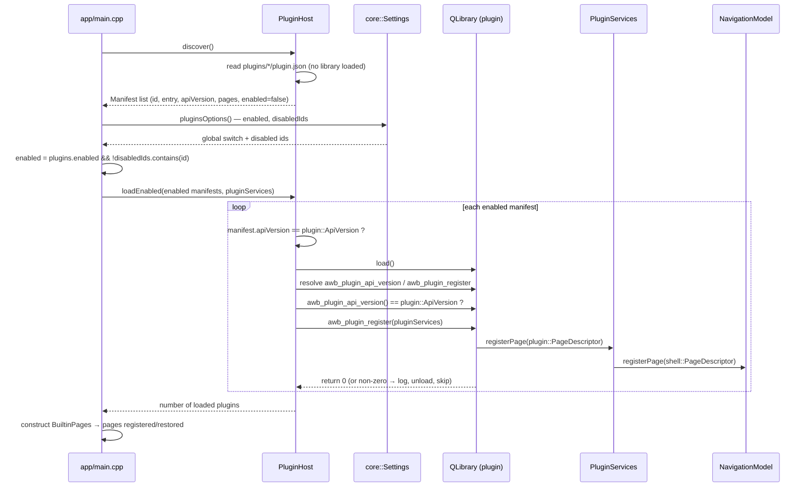

# Plugin host

## What it does, and the current state

Plugins are the out-of-tree extension mechanism: a shared library dropped into `<data directory>/plugins/<id>/` next to a `plugin.json` manifest. The host discovers manifests, validates the ABI version against the exported symbol, loads enabled libraries and hands each one a services object so it can register sidebar pages and Web surfaces.

The feature is **experimental and disabled by default**, and that is the honest framing rather than a shipping caveat:

- A plugin runs **inside the application process with no sandbox**. Its trust level is the same as the application's own code, and a crash or a memory error can take the whole application down. Only a plugin the user trusts should be enabled.
- Because libraries can only be loaded once, at startup, an enable/disable change **takes effect on the next start**, and the Settings page says so.
- Every failure in discovery, version checking, loading or registering is logged and the plugin is skipped. A bad plugin can never block startup, and it can never affect another plugin.
- The ABI is intentionally small and versioned; breaking it means bumping `ApiVersion` and refusing to load old plugins, not attempting compatibility.

## Files and classes

| File | Class / type | Responsibility | Collaborates with |
|---|---|---|---|
| `src/plugin_api/PluginApi.h` | `awb::plugin::ApiVersion`, `awb::plugin::PageDescriptor`, `awb::plugin::Services`, `AWB_PLUGIN_EXPORT` | The header-only ABI: the version constant, the page value type, the service interface plugins call, and the export macro | external plugin repositories; `PluginHost`; `PluginServices` |
| `src/plugin_api/CMakeLists.txt` | interface target `awb_plugin_api` | Qt Core only, never a host module; external repos link this | `awb_core` |
| `src/core/PluginHost.h` / `.cpp` | `awb::core::PluginHost`, `PluginHost::Manifest` | Scan manifests (`discover()`), load enabled libraries and validate them (`loadEnabled()`), unload them (`shutdown()`) | `Paths::pluginsDir()`, `PluginServices` |
| `src/workbench/PluginServices.h` / `.cpp` | `awb::workbench::PluginServices` | The host-side implementation of `plugin::Services`: page registration, Web surfaces, per-plugin data dir, log, notify, theme color, whitelisted settings | `NavigationModel`, `WebTabsFacade`, `Theme`, `Settings`, `Notifications`, `UiServices` |
| `src/shell/qml/SettingsPluginsPage.qml` | — | The Settings → Plugins section: trust notice, global switch, plugin list with per-plugin switches | `WorkbenchContext` (`workbench.*`) |
| `src/workbench/WorkbenchContext.h` / `.cpp` | `WorkbenchContext` | The QML-facing plugin API: `pluginList()`, `setPluginEnabled()`, `pluginsEnabled()`, `setPluginsEnabled()`, `pluginTrustNotice()` | `Settings`, the discovered list pushed by `main.cpp` |
| `app/main.cpp` | — | Discovers manifests, resolves each plugin's enabled flag, loads them before pages are restored, registers nothing itself | `PluginHost`, `PluginServices`, `WorkbenchContext` |
| `docs/plugins.md` | — | The author-facing guide (what a plugin is, how to enable and write one) | this page |

## The ABI contract

`awb::plugin::ApiVersion` is the integer version the header describes; **any breaking change must increment it.** It is checked twice — the manifest's declared `apiVersion` and the library's exported `awb_plugin_api_version()` — precisely so a stale manifest cannot smuggle an incompatible implementation in.

Each plugin exports two symbols. `AWB_PLUGIN_EXPORT` expands to `__declspec(dllexport)` on Windows and `__attribute__((visibility("default")))` elsewhere:

- `int awb_plugin_api_version()` — returns the ABI version the plugin was built against;
- `int awb_plugin_register(awb::plugin::Services *services)` — the registration entry point; returning `0` means success, any other value makes the host log and ignore the plugin.

`plugin::PageDescriptor` is a plain value type: `id`, `title`, `icon` (a `qrc:/…` URL from the plugin's own resources), `source` (a `qrc:/…` QML URL), `section` (`"main" | "extensions" | "system"`, defaulting to `"extensions"` at the manifest point) and `order` (default `50`). It has **no `keepAlive` field**, so a plugin page is always a normal page that is destroyed when you navigate away.

`plugin::Services` is a pure abstract interface the host implements and the plugin calls:

| Method | Meaning |
|---|---|
| `registerPage(page)` | Register a sidebar page; a duplicate id is rejected by the navigation model with a warning |
| `unregisterPage(id)` | Unregister a page by id |
| `addWebSurface(kind, componentUrl)` | Register an additional Web surface, mapping a kind to a QML component URL |
| `dataDir(pluginId)` | The plugin's private writable directory, `<dataRoot>/plugins/<pluginId>/data` (created on demand) |
| `log(level, message)` | One log line; `level` is `0` = info, `1` = warning, `2` = error |
| `notify(level, title, text)` | One toast; the same level encoding |
| `themeColor(token)` | The current value of a color token as `#rrggbb`, or an empty string for an unknown token |
| `settingsValue(key)` | A **read-only whitelisted** settings value; a key outside the whitelist is warned about and returns an empty string |

## The host side

`PluginHost::discover()` scans `<dataRoot>/plugins/*/` in name order. A directory without `plugin.json`, an unreadable or non-object manifest, or a manifest missing `id` or `entry` is logged and skipped — discovery **never loads a library**, which is why the Settings page can list plugins while they are disabled. The parsed `Manifest` carries `id`, `name`, `version`, `apiVersion`, `description`, `author`, `entry`, `dir`, the declared `pages`, and an `enabled` flag that the caller resolves.

`PluginHost::loadEnabled(manifests, services)` does the loading, and every guard is a "skip this one, keep going" path:

1. manifests whose `enabled` flag is false are skipped;
2. the manifest's declared `apiVersion` must equal `plugin::ApiVersion`, otherwise the plugin is refused;
3. the library is loaded with `QLibrary`;
4. both `awb_plugin_api_version` and `awb_plugin_register` must resolve, otherwise the library is unloaded and skipped;
5. the exported `awb_plugin_api_version()` value must equal `plugin::ApiVersion` (the second check);
6. `awb_plugin_register(services)` must return `0`.

Only after all six does the library join the loaded list. The **global switch and the per-plugin disabled list are applied in `main.cpp`, not here**: `enabled` is `plugins.enabled && !plugins.disabledIds.contains(id)`, and only enabled manifests are copied into the list passed to `loadEnabled()`. `main.cpp` passes a null `services` guard through `loadEnabled()` returning `0`.

`shutdown()` unloads every loaded library. Libraries stay alive for the process lifetime because registered pages and surfaces may still reference them, so there is no mid-run unload. In `main.cpp` the host is a stack object; its destruction at the end of `main` unloads the libraries it owns, and `shutdown()` is the explicit equivalent on the exit path.

The sequence diagram below follows one plugin from discovery to a registered page.

## The host bridge: PluginServices

`PluginServices` maps each ABI call onto an existing host capability; it contains no logic of its own beyond that mapping.

- `registerPage()` builds a `shell::PageDescriptor` from the plugin's page and calls `NavigationModel::registerPage()` — **exactly the same path built-in pages use**; an empty `section` defaults to `extensions`. There is no separate "plugin mode".
- `unregisterPage()` forwards to `NavigationModel::unregisterPage()`.
- `addWebSurface()` forwards to `WebTabsFacade::registerSurface()`.
- `dataDir()` sanitises the plugin id by replacing every character outside `[A-Za-z0-9._-]` with `_` (the id comes from a manifest and must not be concatenated into a path unchecked), then creates and returns `<dataRoot>/plugins/<safe id>/data`.
- `log()` prefixes the message with `[plugin] `; levels 2 and 1 go to `qWarning()`, level 0 to `qInfo()`.
- `notify()` maps the ABI level to a toast level (1 → `warning`, 2 → `error`, otherwise `info`).
- `themeColor()` reads the token from `Theme::color()` and returns `QColor::name(QColor::HexRgb)`; an unknown token returns an empty string. A plugin never touches a `QColor` — the ABI boundary carries basic types only.
- `settingsValue()` answers four whitelisted keys — `appearance.theme`, `window.title`, `web.surface`, `locale.override` — and for any other key logs a warning and returns an empty string. Plugins can read these four values and nothing else; they can never write settings.

## The Settings page

`SettingsPluginsPage.qml` is the user-facing surface and shows four things:

- a trust notice whose text comes from `WorkbenchContext::pluginTrustNotice()`: plugins run inside the application process, their trust level equals the application's, and changes take effect after a restart;
- the global switch, bound to `workbench.pluginsEnabled()` and written by `workbench.setPluginsEnabled()`, which writes `plugins.enabled`;
- the plugin list, from `workbench.pluginList()`, with each row showing the name (falling back to the id) and version, plus the description;
- a per-plugin switch bound to the entry's `enabled`, written by `workbench.setPluginEnabled()`, which adds or removes the id from `plugins.disabledIds`.

Both writes go through `Settings` and call `save()` immediately, and both update the in-memory snapshot so the page reflects the new state at once. The effect is deferred to the next start because libraries are loaded once at startup. The empty-state text tells the user to drop a plugin into the plugins folder.

## Security boundary

What a plugin **can** do: register and unregister sidebar pages, register a Web surface, write files inside its own `dataDir`, log, raise toasts, read the current color values of theme tokens, and read the four whitelisted settings keys. Its QML may `import AgentWorkbench.App` and read the singletons like any built-in page.

What it **cannot** do through the ABI:

- write `agents.json`, `settings.json` or any other application state — the settings surface is read-only and there is no write method;
- change the active theme or font — only read colors;
- receive or return a host C++ class. **Only Qt value types cross the boundary** (`QString`, `int`, `PageDescriptor`, and the `Services` interface itself); the ABI header must never name a host module type, and adding one would couple every plugin to internal structure;
- keep a page alive across navigation — `plugin::PageDescriptor` has no `keepAlive`;
- be unloaded while the application runs.

What it can do **outside** the ABI is limited only by the process: a plugin is native code in the host process and can call anything the operating system allows. This is why the docs, the ABI header and the Settings page all repeat the trust warning, and why plugins are off by default. The same trust framing applies to the embedded web views (see the [WebEngine embedding research](../research/webengine-embedding.md)).

## Changing the ABI

- [ ] Increment `awb::plugin::ApiVersion` for any breaking change.
- [ ] Update the author-facing guide in both languages: [Plugins](../plugins.md) and its `zh` mirror.
- [ ] Update this page and [Extension points](../architecture/extension-points.md).
- [ ] Keep every new type a Qt value type; never expose a host C++ class.
- [ ] If a new capability is added to `plugin::Services`, implement it in `PluginServices` and state its security limits (read-only? whitelisted?) in both documents.
- [ ] Rebuild and confirm an outdated plugin is refused rather than loaded (`PluginHost::loadEnabled()` logs the refusal).

## Related pages

- [Core infrastructure](core-infrastructure.md) — where `PluginHost` sits and what it may depend on.
- [Workbench and pages](workbench-and-pages.md) — the assembly order that loads plugins before page restore.
- [Extension points](../architecture/extension-points.md) — where plugins sit among the other extension mechanisms.
- [Plugins](../plugins.md) — the author-facing guide and a complete example.
- [Settings guide](../guide/settings.md) and [guide index](../guide/index.md) — the Settings → Plugins page as the user sees it.
- [Configuration](../configuration.md) — the `plugins.enabled` and `plugins.disabledIds` keys.
