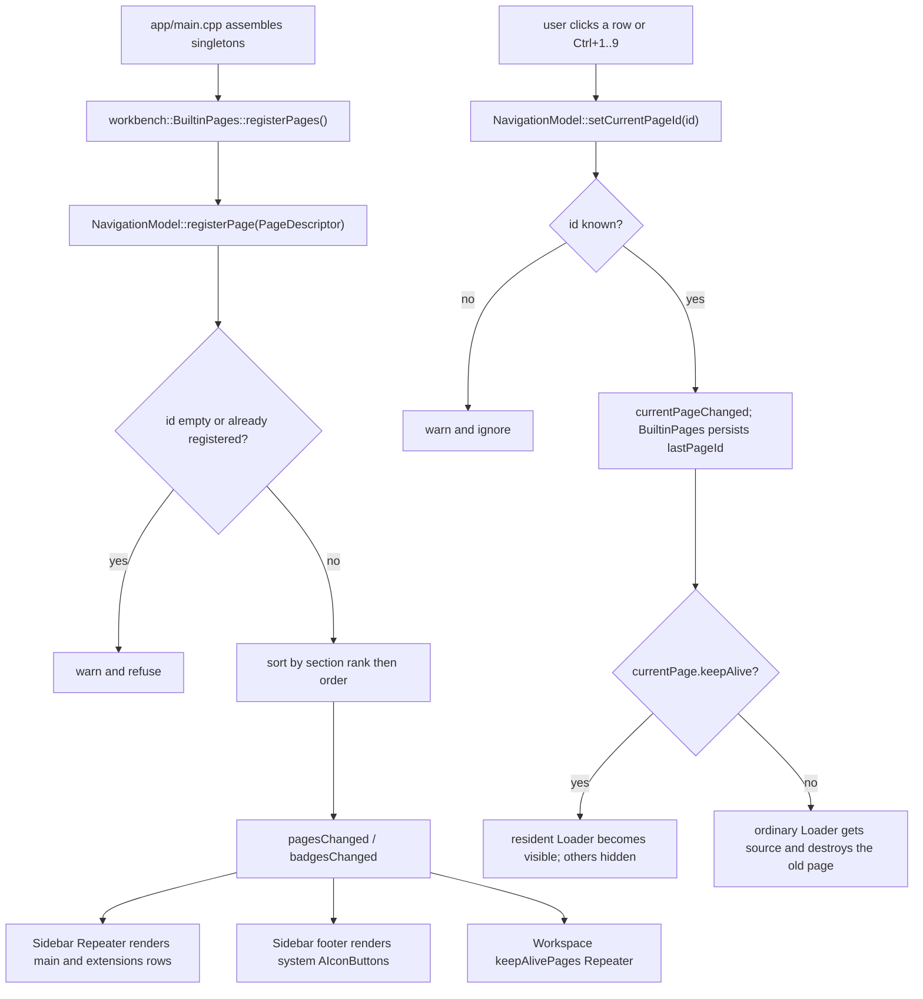

# Shell and navigation

## What this feature does

The shell is the application's outer frame and UI framework: the sidebar, the
workspace host, the status bar, the toast overlay, the page registry and the
shared `A*` component shelf. It knows about pages, sections, badges and window
geometry — and **nothing about agents, skills, web tabs or tools**. Those are
business concepts that arrive through page *registration* from the assembly
layer (`awb_workbench`), never as shell dependencies.

Boundaries:

- The shell does not create pages. `workbench::BuiltinPages` registers
  `PageDescriptor`s; the shell only sorts, renders and switches between them.
- The shell does not perform business actions. The sidebar answers "where do I
  go", never "do something".
- Page state that must survive a page switch lives in C++; the workspace
  destroys ordinary pages on switch. The one exception is a page declaring
  `keepAlive` (currently the Web page), which the workspace hosts permanently.

## Files and classes

| File | Class / component | Responsibility | Collaborates with |
|---|---|---|---|
| `src/shell/PageDescriptor.h` | `PageDescriptor` | The shell's view of a page: `id`, `title`, `iconSource`, `source`, `section`, `order`, `badgeText`, `enabled`, `keepAlive` | `NavigationModel`, `BuiltinPages` |
| `src/shell/NavigationModel.h` | `NavigationModel` | Page registry plus the sidebar/workspace list model; properties `currentPageId`, `currentPage`, `badges`, `keepAlivePages`; `Roles` | `Sidebar.qml`, `Workspace.qml`, `StatusBar.qml`, `MainWindow.qml`, `BuiltinPages` |
| `src/shell/NavigationModel.cpp` | `NavigationModel` | Registration validation, section sort, badge updates, ordered page ids | `BuiltinPages` |
| `src/shell/ShellController.h` | `ShellController` | Window-level state persisted to `settings.json`: title, size, sidebar width/collapse, `lastPageId`, Web surface and Chromium flags | `MainWindow.qml`, `Sidebar.qml`, `SettingsWebPage.qml`, `core::Settings` |
| `src/shell/ShellController.cpp` | `ShellController` | Getters/setters, `saveWindowSize()`, `valueChanged` re-broadcast | `core::Settings` |
| `src/shell/UiServices.h` | `UiServices` | Clipboard, external URL/file-manager, native folder/colour dialogs, recent-colour memory; colour-picker support data | `ToolsPage.qml`, `AgentEditDialog.qml`, `AColorPicker.qml`, `WorkbenchContext` |
| `src/shell/UiServices.cpp` | `UiServices` | Native Win32 `IFileDialog` / `ChooseColor` implementations, `OpResult` errors | `core::OpResult` |
| `src/shell/Notifications.h` | `Notifications` | Non-blocking toast queue model: `IdRole`/`LevelRole`/`TitleRole`/`TextRole`, `notify()`, `dismiss()`, `durationFor()`, `maxVisible()` | `AToastStack.qml`, `Toasts.qml`, `WorkbenchContext`, `BuiltinPages` |
| `src/shell/Notifications.cpp` | `Notifications` | Append/remove only; all timing lives in QML | `AToastStack.qml` |
| `src/shell/qml/MainWindow.qml` | `MainWindow` | Window assembly: size clamping, lowercase alias bridge, global shortcuts, exit confirmation, legacy-import notice, font binding | all singletons, `Sidebar`, `Workspace`, `StatusBar`, `Toasts` |
| `src/shell/qml/Sidebar.qml` | `Sidebar` | Sectioned navigation: scrollable `main`/`extensions`, pinned `system` footer with the collapse handle, badges | `nav`, `shell`, `AIconButton`, `APill` |
| `src/shell/qml/Workspace.qml` | `Workspace` | Loads exactly one page; `keepAlive` pages via a resident `Repeater`, ordinary pages via a destroying `Loader` | `nav`, `PageHeader` consumers, `workbench` |
| `src/shell/qml/StatusBar.qml` | `StatusBar` | Running-agent and tab counters from `nav.badges`, Python/Node badges from `environment` | `nav`, `environment`, `core::Settings` via `ShellController` |
| `src/shell/qml/Toasts.qml` | `Toasts` | Anchors `AToastStack` to the bottom-right of the window | `Notifications` |
| `src/shell/qml/PageHeader.qml` | `PageHeader` | Title + subtitle + an `actions` slot pushed to the right edge | every page |
| `src/shell/qml/SettingsPage.qml` | `SettingsPage` | Settings shell: left section nav + right `StackLayout`, pinned app version | `Settings*Page.qml` (see [Settings](settings.md)) |
| `src/shell/qml/Settings{Appearance,Launchers,Environment,Skills,Web,Plugins,Advanced}Page.qml` | seven section pages | One settings section each; kept instantiated by the `StackLayout` | `theme`, `agents`, `environment`, `skills`, `shell`, `workbench` |
| `src/shell/qml/components/*.qml` | the `A*` shelf | 26 reusable themed components (see the shelf table below) | every page |
| `src/shell/CMakeLists.txt` | build target `awb_shell` | Static library | — |

Cross-module pieces that participate in page registration and the status bar
live outside `src/shell/` and are listed here because the shell is useless
without them:

| File | Class | Role |
|---|---|---|
| `src/workbench/BuiltinPages.h` / `.cpp` | `BuiltinPages` | Registers the five built-in pages, wires sidebar badges, persists the last page, wires the cross-domain Web rules |
| `src/workbench/EnvironmentService.h` / `.cpp` | `EnvironmentService` | Python/Node detection behind the status-bar badges and the Settings rows |
| `src/workbench/WorkbenchContext.h` / `.cpp` | `WorkbenchContext` | The `workbench` singleton: `showPage()`, `notify()`, `copyText()`, plugin switches and `legacyImportNotice` |
| `app/main.cpp` | `main()` | Assembly order and singleton registration on the `AgentWorkbench.App` URI |

## Frontend design

### `MainWindow.qml`

The window assembles the frame:

- **Layout.** A `RowLayout` holds the `Sidebar` and a `ColumnLayout` of
  `Workspace` plus `StatusBar`: the sidebar runs the full window height, and
  the status bar occupies only the workspace column, starting at the sidebar's
  right edge. The pinned system-page icons and the collapse handle therefore
  sit flush against the window bottom instead of one status-bar height above
  it.
- **Size clamping.** `width`/`height` come from `shell.windowWidth`/`windowHeight`
  clamped by `Screen.desktopAvailableWidth`/`Height`, with a 1024×540 minimum.
  The title is `shell.windowTitle` or the untranslated brand name.
- **The lowercase alias bridge.** The root declares `readonly property var`
  aliases `theme`, `nav`, `shell`, `ui`, `toasts`, `agents`, `web`, `skills`,
  `tools`, `workbench`, `environment`, each bound to its capitalized singleton.
  Every descendant resolves `theme.` / `nav.` through this root, so the QML
  contract name is lowercase while the registered type name is uppercase.
- **Global shortcuts.** `Ctrl+B` toggles `shell.sidebarCollapsed`; `Ctrl+,` calls
  `workbench.showPage("settings")`; `Ctrl+1`…`Ctrl+9` call `goToPageNumber(n)`,
  which reads `nav.pageIdsInOrder()` and calls `nav.setCurrentPageId()`. Pinned
  pages sort last, so Ctrl+9 reaching a `system` page is expected.
- **Font binding.** `font.family: theme.family.length > 0 ? theme.family :
  undefined`, so an empty token falls back to the system default; `theme.changed`
  makes it live.
- **Exit confirmation.** `onClosing` first calls `shell.saveWindowSize()`, then,
  if `agents.hasLaunchedAgents()` and the user has not confirmed, blocks the
  close and opens an `ADialog` with three buttons (close background terminals
  via `agents.stopAll()`, exit anyway, cancel).
- **Legacy notice.** An `AAlertDialog` opens once in `Component.onCompleted`
  when `workbench.legacyImportNotice` is non-empty.

### `Sidebar.qml`

Renders the navigation model grouped by section. The root is an `Item` because
the sidebar is a frosted-glass panel whose visual body is a stack of declared
layers, bottom to top: an `AWorkspaceGlow` backdrop (the light the glass lets
through), a translucent base `theme.alpha(theme.sidebarBg, 0.72)` dark /
`0.88` light, a top reflection veil, the content column, and on the right edge
a `borderSubtle` divider line plus a dark-theme-only 1 px inner highlight. Real
backdrop blur is deliberately out (the same conclusion as `AMenu`: not
portable across Qt major versions; desktop-level acrylic would need native
composition and is not attempted either). See `designs.md` section 2.4 for the
full recipe.

- **Scrollable region.** A `Flickable` over a `ColumnLayout` with a `Repeater`
  bound to `nav`; each `NavRow` is visible only when `model.enabled` and
  `model.section !== "system"`. Section dividers are drawn by the first row of
  every non-`main` section (`index === nav.rowOfFirstInSection(model.section)`).
- **Current row.** `nav.currentPageId === model.pageId` drives a `surfaceBg`
  background and a 3 px accent bar.
- **Width.** `implicitWidth` is `theme.sidebarCollapsedWidth` when collapsed,
  otherwise `shell.sidebarWidth` (falling back to `theme.sidebarWidth` when the
  setting is 0). Using `implicitWidth` matters because the parent `RowLayout`
  only reflows on implicit-size changes.
- **Resize handle.** A 6 px strip on the right edge (hidden when collapsed):
  hovering it turns the cursor into a split-horizontal arrow; dragging adjusts
  the width. During the drag the width follows a local `pendingWidth` (the
  `Behavior on implicitWidth` is disabled so the edge tracks the pointer
  frame-by-frame), and releasing commits once via `shell.setSidebarWidth()`,
  which clamps to `[180, 480]` and persists. Pointer positions are mapped to
  `sidebar.parent` before differencing — the parent `RowLayout`'s geometry does
  not change while the sidebar resizes, so raw `mouse.x` (which moves with the
  edge) would cancel itself out. The release order matters: `setSidebarWidth()`
  runs **before** `resizing = false`, so when the `implicitWidth` binding
  switches back to the `shell.sidebarWidth` branch the two values are already
  equal and no write happens. The other order snaps the width back to the
  previous persisted value for one write (the `Behavior.enabled` binding
  re-evaluates *after* the `implicitWidth` binding, so the intermediate write
  lands directly) and then animates from there to the released width.
- **Pinned footer.** The `system`-section pages render as plain `AIconButton`s
  (`active` when current, title in the tooltip) in a fixed footer, together with
  the collapse handle; expanded puts icons left and the handle right, collapsed
  stacks them vertically centred.
- **Tooltips.** Collapsed rows show the title in a tooltip; `NavRow` and the
  footer buttons both carry `Component.onDestruction: ToolTip.hide()`.

### `Workspace.qml`

Shows exactly one page at a time.

- **`keepAlive` pages** come from `nav.keepAlivePages` and are instantiated once
  by a resident `Repeater` of `Loader`s. Visibility is
  `nav.currentPageId === pageId`; they are never destroyed on switch.
- **Ordinary pages** use a single `Loader` whose `source` is
  `nav.currentPage.source`, but only when the current page is *not* a `keepAlive`
  page (`isKeepAliveCurrent`); otherwise the same page would be instantiated
  twice. Switching away destroys the old page.
- **Load failures** are reported through `workbench.notify("error", ...)` on
  `Loader.Error`.
- **Empty state.** A centred "Pick a page from the sidebar" label shows while
  `nav.currentPageId` is empty (a transitional state, since the last page is
  restored at startup).

### `StatusBar.qml`

Lives at the bottom of the workspace column, starting at the sidebar's right
edge (the sidebar runs the full window height, so the bar no longer spans the
full width). A `RowLayout` inside a `Rectangle` whose height comes from
`implicitHeight: theme.statusBarHeight` (a direct `height` binding would
trigger Qt 5's recursive re-arrange); a 1 px `theme.separator` line on the top
edge separates it from the workspace — the colour difference alone became too
weak once the sidebar went translucent. It shows `Running: %1` from
`nav.badges["agents"]` and the Python/Node badges bound to `environment.*` (a
red `×` when missing, with a tooltip explaining the consequence). The
application version is not here any more; it moved to the pinned footer of
`SettingsPage`. The web-tab count is **deliberately absent**: the sidebar
already shows it as the `web` page badge (`BuiltinPages::wireBadges()`), and an
earlier `Tabs: %1` label here never rendered because its condition
(`nav.countInSection("web")`) counts page sections, of which none is `web` — it
was removed rather than wired to a second source of the same number.

### `PageHeader.qml`

A `RowLayout` with a title/subtitle column, a flexible spacer, and a `default
property alias actions` slot so pages can inject action buttons that stick to
the right edge.

## Backend design

### `PageDescriptor`

The shell's page shape. `id` is the registration key; `title` is an English
source string translated at the display edge; `iconSource` is a `qrc:` URL;
`source` is the page QML URL.

| Field | Meaning |
|---|---|
| `id` | Registration key; must be unique |
| `title` | English source string, translated with `qsTr()` at render time |
| `iconSource` | `qrc:` icon URL |
| `source` | Page QML URL, e.g. `qrc:/qt/qml/AgentWorkbench/agentcatalog/AgentGridPage.qml` |
| `section` | `main` \| `extensions` \| `system`; `system` pins to the sidebar footer |
| `order` | Sort key inside the section; equal values keep registration order |
| `badgeText` | Sidebar badge; empty means none |
| `enabled` | When false the page is hidden from the sidebar |
| `keepAlive` | When true the workspace keeps it instantiated and only hides it |

### `NavigationModel`

- **Registration validation.** `registerPage()` refuses an empty id or a
  duplicate (both warn, neither is fatal — the shell never guesses which page
  was meant). Acceptance resets the whole model because the insert position is
  decided by the sort, then broadcasts `pagesChanged()` and `badgesChanged()`.
- **Section ordering.** `sort()` is a `stable_sort` by `sectionRank`
  (`main` < `extensions` < `system`) then `order`; equal `order` keeps
  registration order.
- **Persistence.** `NavigationModel` itself does not persist; `BuiltinPages`
  calls `ShellController::setLastPageId()` on `currentPageChanged()` and restores
  it at startup.
- **Properties that must have NOTIFY.** `currentPageId` and `currentPage` drive
  the workspace `source` binding; `badges` lets `StatusBar` bind
  `nav.badges["agents"]` (the `page(id)` invokable has no notify signal);
  `keepAlivePages` lets the workspace `Repeater` re-evaluate on registration.
  All three are `Q_PROPERTY`s with NOTIFY for exactly these bindings.
- **`setCurrentPageId` is `Q_INVOKABLE`.** A bare `Q_PROPERTY` WRITE accessor is
  not in the meta-object method table, so `nav.setCurrentPageId(...)` would throw
  "is not a function"; sidebar clicks and Ctrl+N switching failed silently
  before this was fixed. Assignment (`nav.currentPageId = x`) also still works.
- Helpers `pageIdsInOrder()`, `countInSection()` and `rowOfFirstInSection()` are
  invokables used by the shortcuts and the sidebar's section rendering.

### `ShellController`

Projects window-level state as bindable properties; values live only in
`core::Settings`, with no local cache. Setters write the setting and call
`save()` immediately. The constructor connects `core::Settings::valueChanged` so
external edits to `settings.json` re-broadcast `window.sidebarCollapsed`,
`window.sidebarWidth`, `window.width`/`height`, `window.title`, `web.surface` and
`web.chromiumFlags`. `setWebSurface`/`setWebChromiumFlags`/`setSidebarWidth` are
`Q_INVOKABLE` because they have no WRITE accessor. `setSidebarWidth` (the sidebar
drag handle's commit entry point) clamps to the `sidebarMinWidth`/`sidebarMaxWidth`
properties (180/480, `CONSTANT`) and also exposes them to QML; the read side stays
tolerant so a hand-edited `window.sidebarWidth` of 0..1024 keeps its existing
"0 = theme fallback" meaning.

### `UiServices`

The single place for system-level UI operations: `copyText()`,
`openExternalUrl()`, `revealFile()`, `openFolder()`, `pickFolder()`,
`pickColor()`, `rememberColor()`, and the colour-picker support data
(`colorThemes`, `standardColors`, `recentColors`). All fallible operations return
`awb::core::OpResult` **written fully qualified**: Qt 5's moc records the return
type as written while QML resolves the `QMetaType` registration name (the
classes' fully qualified name), so a short type name throws "Unknown method
return type" and the call silently fails. `pickFolder`/`pickColor` use native
Win32 dialogs because `QFileDialog`/`QColorDialog` need QtWidgets (this is a
`QGuiApplication`) and QML's `FolderDialog` is Qt 6 QuickDialogs2 only; the
native route is the only version-independent one. Recent colours are an
in-process, non-persisted list capped at 10, newest first.

### `Notifications`

A `QAbstractListModel` that only appends and removes toasts. `notify(level,
title, text)` ignores an empty toast and generates a string id; `dismiss(id)`
removes by id and ignores unknown ids. `durationFor(level)` returns the dwell
time — warning 5000 ms, error 8000 ms, everything else 3000 ms — but the actual
timing and hover-pause live in `AToastStack.qml`, not in C++. `maxVisible()` is
3.

### `EnvironmentService`

Backs the Python/Node badges in the status bar and the two rows of the Settings
page; `statusBar` binds `pythonInstalled` / `pythonVersion` (and the `node`
twins, plus `pythonStatus` / `nodeStatus` to tell "not installed" from "no
verdict yet") through one `changed()` signal. The detection itself does not run
here: `EnvironmentProbe::run()` is a pure worker that `EnvironmentService`
dispatches to the thread pool, and the result comes back through a
`QFutureWatcher` finished handler on the GUI thread. `detecting` is true while
such a round is in flight, and `refresh()` (the Re-detect action) dispatches a
new one unless a round is already running.

The behaviour, the three-way verdict rule and the caching are documented in
[Workbench and pages](../development/workbench-and-pages.md); the key point for a
reader of this page is that the status bar shows an ellipsis while no verdict
exists, because "the check has no answer yet" is not the same message as "not
installed".

## Component shelf

`src/shell/qml/components/` is the only legal source of reusable widgets; the
visual recipes are owned by `designs.md`, which is authoritative over this list.

| Component | Purpose |
|---|---|
| `AButton` | Text button with primary/secondary/ghost/danger variants and `accentColor` |
| `AIconButton` | Icon button (28 px, 44 px large), mandatory tooltip, `active` nav state |
| `ATextField` | Single-line themed input with focus ring and invalid state |
| `ATextArea` | Multi-line themed editor (surface background) |
| `AFormLabel` | Form label row with required star and info tooltip |
| `ASearchField` | Search input with leading icon and clear button |
| `AComboBox` | Fully themed combo box; override `contentItem`/`delegate` at use sites |
| `AColorField` | `#RRGGBB` input plus mini swatch, backed by `AColorPicker` |
| `AColorPicker` | Office-style colour picker (theme colours, standards, custom, recent) |
| `AColorSwatch` | Colour cell/swatch with a "no colour" state |
| `ACard` | Card container (surface, radius, border, hover) |
| `ASpotlight` | Pointer spotlight + border shimmer overlay for glass cards |
| `AWorkspaceGlow` | Page backdrop of two faint radial glows under glass cards |
| `AListRow` | List/settings row with an injected content `RowLayout` |
| `APill` | Badge pill for counts and source labels |
| `AEmptyState` | Whole-block empty state with an `extra` slot and an action |
| `ADialog` | Modal dialog skeleton (centred, scrim, Esc, first-focus) |
| `AConfirmDialog` | Confirm dialog built on `ADialog` |
| `AAlertDialog` | Alert/error dialog with a scrollable mono detail block |
| `ASectionHeader` | Settings section header with a trailing `extra` action |
| `AStatusDot` | On/off status dot, never colour-only |
| `AToastStack` | Bottom-right toast stack (max 3 visible, hover pauses) |
| `AScrollBar` | Always-visible themed scrollbar |
| `AMenu` | The only menu base (glass surface, soft shadow, top sheen) |
| `AMenuItem` | Menu item with a fixed 16 px icon slot |
| `AMenuSeparator` | Menu group divider |
| `AgentAvatar` | Agent icon plus status corner badge |

## Business logic

The diagram traces how a page travels from the assembly layer into the sidebar
and the workspace, and how a switch is applied.

The workspace and sidebar communicate only through `nav`; the shell never imports
a domain type. `BuiltinPages` bridges domains: it reads the agent model for the
`agents` badge, the web tab model for the `web` badge, and wires the cross-domain
Web rules (offline overlay, session-URL retarget, close-on-remove, external-open
toast).

## Pitfalls and conventions

- **QML only talks to facades and models.** Pages do not read files and do not
  call `Qt.openUrlExternally` directly; they go through `ui.*`, `workbench.*` or
  their own facade.
- **Delegate tooltips.** Any row that is a delegate (sidebar rows, settings
  list rows, toast hosts) needs `Component.onDestruction: ToolTip.hide()`, or the
  shared tooltip freezes on screen when the hover host dies.
- **ComboBox echo uses a loop, not `indexOfValue`.** A binding that only depends
  on the id (via `indexOfValue(theme.themeId)`) evaluates to -1 when the internal
  delegate model is not ready and is never recomputed; iterating a NOTIFY
  property (`theme.availableThemes`) re-evaluates when the list is ready. Both
  the theme and font combos in `SettingsAppearancePage.qml` use the loop.
- **The `system` section never enters the scrollable list.** Pinned pages are
  rendered only in the footer; putting them in the `Repeater` as well would
  duplicate them.
- **`keepAlive` pages are created at 0x0.** Layout children of a resident page
  must supply sizes through `implicitWidth`/`implicitHeight`; direct `width`/
  `height` bindings are overwritten by the first reflow.
- **`implicitWidth` for layout children.** The sidebar uses it so the workspace
  reflows; writing `width` directly leaves the workspace frozen at its old size.
- **`nav.badges[...]`, not `nav.page(id)`.** The invokable has no notify signal,
  so a binding through it never recomputes when a badge changes.

## Adding a page

To add a page you touch, at minimum:

1. **The page QML** in the owning module's `qml/` directory.
2. **`app/CMakeLists.txt`** — add the file to the module's `_*_qml` list (which
   sets the `QT_RESOURCE_ALIAS` that forms its URL).
3. **`cmake/AwbTranslations.cmake`** — add it to `AWB_TS_SOURCES` if it contains
   `qsTr()`.
4. **`src/workbench/BuiltinPages.cpp`** — build a `PageDescriptor` and call
   `registerPage()`, choosing `id`, `title`, `iconSource`, `source`, `section`
   and `order`.
5. **Wiring** — if the page needs a badge, update it from the relevant facade in
   `BuiltinPages`; if it needs a shortcut, add it in `MainWindow.qml` (remember
   `keepAlive` pages must disable their own shortcuts when not current).
6. **Documentation** — update this document and the corresponding Guide page.

## Related

- [Skills browser](skill-browser.md) — a page registered through the same path.
- [Agent Tools](agent-tools.md) — another page and a heavy consumer of the `A*`
  shelf.
- [Settings](settings.md) — the `system`-section page and its sections.
- [Interface (guide)](../guide/index.md) — the user-facing description.
- [Frontend design](../architecture/frontend-design.md) — the visual recipes and
  the reuse-first rule.
- [Layers and dependencies](../architecture/layers-and-dependencies.md) — why
  the shell may not import a domain module.
