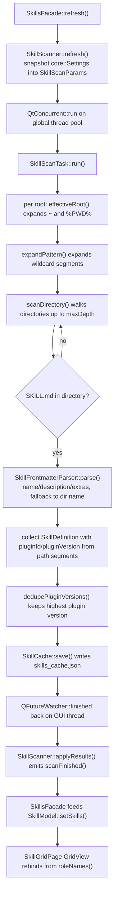

# Skills browser

## What this feature does

The Skills page catalogs the `SKILL.md` files that already exist on this
machine: it scans a configurable set of roots, parses each file's YAML
frontmatter, presents the result as a searchable, filterable card grid, and
offers copy/open actions on the discovered paths.

Its boundary is deliberately narrow:

- It does **not** execute, install, update or validate a skill. A skill is just
  a directory containing a `SKILL.md`; nothing on this page runs it.
- It does **not** edit `SKILL.md` or create skills. The only writes the feature
  performs are to `settings.json` (the root list) and to its own cache file
  `skills_cache.json`.
- It does **not** own the page geometry. `SkillGridPage.qml` is loaded by the
  shell's `Workspace` and can be destroyed and rebuilt at any time; all list
  state lives in `SkillModel` on the C++ side.

User-facing usage (what the buttons do, how to configure roots) belongs to the
Guide. This document describes how the feature is implemented.

## Files and classes

| File | Class / component | Responsibility | Collaborates with |
|---|---|---|---|
| `src/skillcatalog/SkillDefinition.h` | `SkillDefinition` | One scanned skill record: frontmatter fields plus locating/stat fields; `operator==`/`operator!=` give whole-record equality | `SkillModel`, `SkillScanTask`, `SkillCache` |
| `src/skillcatalog/SkillFrontmatter.h` | `SkillFrontmatter`, `SkillFrontmatterParser` | Parse result struct and the tiny YAML-subset parser for the `---` block | `SkillScanTask` |
| `src/skillcatalog/SkillFrontmatter.cpp` | `SkillFrontmatterParser::parse()` | The parser implementation (quotes, flattening, block scalars) | `SkillScanTask` |
| `src/skillcatalog/SkillRoot.h` | `SkillRoot`, `SkillRoots` | One scan root; `SkillRoots::defaults()` and `fromJson()` convert the configured list | `SkillScanner`, `SkillScanTask`, `SkillsFacade` |
| `src/skillcatalog/SkillRoots.cpp` | `SkillRoots` | Built-in root list and `skills.roots` entry parsing | `SkillScanner`, `SkillScanTask` |
| `src/skillcatalog/SkillScanTask.h` | `SkillScanParams`, `SkillScanTask` (with `Stats`, `Result`) | The whole input snapshot and the pure static scan worker | `SkillScanner` |
| `src/skillcatalog/SkillScanTask.cpp` | `SkillScanTask::run()` | Traversal, frontmatter parsing, plugin version de-duplication, per-root timing | `SkillScanner` |
| `src/skillcatalog/SkillScanner.h` | `SkillScanner` | GUI-side coordinator: keeps the root list and last result, dispatches the worker to the thread pool, debounces `refresh()` | `SkillsFacade`, `SkillCache`, `core::Settings` |
| `src/skillcatalog/SkillScanner.cpp` | `SkillScanner` | `refresh()`, `adoptResults()`, `setRootEnabled()` | `SkillCache`, `SkillScanTask` |
| `src/skillcatalog/SkillCache.h` | `SkillCache` (with `Snapshot`) | First-paint cache: read/write `<dataRoot>/skills_cache.json` | `SkillScanner`, `SkillsFacade::start()` |
| `src/skillcatalog/SkillCache.cpp` | `SkillCache::load()/save()/filePath()` | JSON (de)serialization and atomic write | `core::Paths`, `core::JsonStore` |
| `src/skillcatalog/SkillModel.h` | `SkillModel` | List model with in-memory search, multi-select facet filter and sort | `SkillsFacade`, `SkillGridPage.qml` |
| `src/skillcatalog/SkillModel.cpp` | `SkillModel::setSkills()`, `refilter()` | Main-data replacement and projection rebuild | `SkillsFacade` |
| `src/skillcatalog/SkillsFacade.h` | `SkillsFacade` | The QML facade: model, roots property, stats, scan signals, copy/open invokables | `SkillGridPage.qml`, `SkillCard.qml`, `SkillDetailFlyout.qml`, `SettingsSkillsPage.qml`, `MainWindow.qml` alias `skills` |
| `src/skillcatalog/SkillsFacade.cpp` | `SkillsFacade` | Wiring, `start()`, root add/remove/enable, clipboard and file-manager actions | `core::Settings`, `core::OpResult`, `SkillScanner` |
| `src/skillcatalog/qml/SkillGridPage.qml` | `SkillGridPage` | The page: header with Rescan, search field, kind facets, sort combo, skeleton, two empty states, `GridView`, stats footer | `skills.*`, `SkillCard`, `PageHeader`, `ASearchField`, `AComboBox`, `AEmptyState`, `AWorkspaceGlow` |
| `src/skillcatalog/qml/SkillCard.qml` | `SkillCard` | Glass-card delegate: hover lift, 400 ms delayed `SkillDetailFlyout`, context menu, copy/open actions | `skills.*`, `SkillDetailFlyout`, `AMenu`, `AIconButton`, `APill`, `ASpotlight` |
| `src/skillcatalog/qml/SkillDetailFlyout.qml` | `SkillDetailFlyout` | Non-modal hover popup: metadata table plus `extras` expansion, edge flip, delayed close | `skills.skill()`, `APill` |
| `src/skillcatalog/CMakeLists.txt` | build target `awb_skillcatalog` | Static library linking `awb_core`/`awb_theme`/`Qt::Gui`/`Qt::Concurrent` | — |

Outside the module, the feature leans on `core::Settings::SkillsSettings`
(`skills.roots` / `includePluginCaches` / `maxDepth`), `core::EnvExpander`,
`core::Paths::skillCacheFile()`, `core::OpResult`, the shell's `A*` components
and the workbench facade (`workbench.showPage()`, `workbench.notify()`).

## Frontend design

### `SkillGridPage.qml`

The page is a `ColumnLayout`: `PageHeader` → toolbar row → skeleton/empty
states/grid → stats footer.

- **Backdrop.** `AWorkspaceGlow` is declared first, filling the page, so the
  semi-transparent glass cards on top have something to let through.
- **`PageHeader`.** Title `Skills`, subtitle about `SKILL.md` roots, and a
  `Rescan` action whose `busy` property is bound to `skills.scanning` while
  `onClicked` calls `skills.refresh()`.
- **Toolbar.** An `ASearchField` writing `skills.model.searchText`, a `Flow` of
  facet buttons (an `All` button plus a `Repeater` over the six kind ids calling
  `skills.kindLabel()`), and an `AComboBox` mapping its three entries to
  `skills.model.sortMode`.
- **Facet toggling.** `applyFacet(kind)` keeps a local array, removes the kind
  if already present, appends it otherwise, and assigns the array to
  `skills.model.activeKinds`; the empty-string call clears the selection.
- **Skeleton.** A `Flow` of six pulsing `Rectangle`s plus a caption is visible
  only while `skills.scanning && skills.model.totalCount === 0`, i.e. the very
  first scan with no cache. A background rescan with data already on screen does
  not disturb the grid.
- **Two empty states.** One for "no skill at all" (offers `workbench.showPage("settings")`),
  one for "filtered to nothing" (clears the search text and `activeKinds`).
  They are disambiguated by `skills.model.totalCount`.
- **`GridView`.** The grid uses integer column math
  (`Math.max(1, Math.floor((width + theme.spacingL) / (page.cardMinWidth + theme.spacingL)))`)
  and a rounded `cellWidth` so `columns * cellWidth <= width`; `cellHeight` is
  the card height plus one gap. `cacheBuffer: 360`, `reuseItems: true`, a
  one-`spacingXs` `header` item for the hover lift, and `AScrollBar.vertical`.
  Its delegate is `SkillCard`, fed from the model's roles.
- **Stats footer.** A `Label` bound to `skills.statsText`, colored
  `theme.warning` when `skills.partialFailure` is true.

### `SkillCard.qml`

Each card is a glass card replicating the `AgentCard` recipe: semi-transparent
`surfaceBg` (0.62, raised to 0.78 on hover), a faint accent veil, a hover-deepened
veil, a 1 px inner highlight (dark variant only), and `ASpotlight` for the
pointer spotlight. The hover lift is a `Translate` transform plus `z`, never a
change to the card's `x`/`y` (the grid writes those).

- **Hover merge.** `hovered: hoverHandler.hovered || copyButton.hovered`. Qt's
  hover delivery is exclusive; the copy `AIconButton` is a `Control` whose
  `hovered` would otherwise steal it from the card.
- **Deferred flyout.** A `Timer` (400 ms) opens the `SkillDetailFlyout` on hover
  and cancels a pending close first; leaving stops the timer and calls
  `tryCloseLater()` on the flyout.
- **Lazy popup.** The flyout lives behind a `Loader` with `active: false`; it is
  created on first hover and reused, so cards never hovered pay no `Popup` cost.
- **`onSkillFilePathChanged`.** Because `reuseItems` recycles delegates, a card
  may be rebound to another skill; the handler stops the hover timer and closes
  the flyout so the old card's hover state is not carried over.
- **Actions.** Left click and Enter call `copyPath()`; Ctrl+Enter opens the
  folder; right click opens an `AMenu` with Copy path / Copy SKILL.md path /
  Copy name / Open containing folder / Reveal SKILL.md. All go through
  `skills.*` and report via `workbench.notify()`.
- **Wheel.** `onWheel` closes the flyout and sets `wheel.accepted = false` so the
  grid keeps scrolling (see the pitfalls section on `WheelHandler.blocking`).
- **Keyboard.** `activeFocusOnTab: true` (not `focus: true`) and
  `Component.onDestruction: ToolTip.hide()`.

### `SkillDetailFlyout.qml`

A `Popup` with `modal: false`, `focus: false`, `closePolicy: Popup.NoAutoClose`,
a 420 px width, and a content-driven height provided by an outer `ColumnLayout`
whose `Flickable` caps at `320 - 2 * padding` and scrolls beyond that.

- `info` is a `readonly property var` populated by `skills.skill(skillFilePath)`.
- A `HoverHandler` on the popup cancels a pending close on enter and re-arms it
  on leave; `tryCloseLater()` sets `closePending` and restarts a 300 ms `Timer`;
  `cancelClose()` clears the flag. Leaving the popup toward empty page space has
  no card hover left to trigger a close, which is exactly why the popup's own
  leave handler exists.
- The body shows name + kind pill, root label, description, a `GridLayout`
  metadata table (SKILL.md path, modified, size) and one `Repeater` row per
  `extras` key.
- The flyout's `Flickable` `contentHeight` is filled asynchronously via
  `Qt.callLater` after layout and on `implicitHeight` changes, avoiding the
  binding loop that synchronous reads produced.
- Key handling is attached to the card, not the popup (`Keys` only attaches to
  `Item`s; a `Popup` is a `QObject`).

## Backend design

### `SkillDefinition`

A plain value struct: `name`, `description`, `skillFilePath`, `dirPath`,
`rootId`, `rootLabel`, `kind`, `pluginId`, `pluginVersion`, `lastModified`,
`sizeBytes`, `extras`. Its `operator==` compares every field and exists so
`SkillModel::setSkills()` can short-circuit: when a background scan produces the
same definitions as the cache already restored, a `modelReset` is skipped and
QML does not destroy and rebuild the whole grid.

### `SkillFrontmatterParser`

A deliberately small YAML subset, not a general parser:

- The block must start with a `---` line and end with another `---`; an
  unclosed block means "no frontmatter" (`valid == false`).
- UTF-8 BOM and CRLF/CR are tolerated.
- `key: value` lines: the key charset is letters, digits, `.`, `-`, `_`.
- Values may be single- or double-quoted; `\"`, `\\` and `''` are unescaped.
- Nested mappings are flattened to `parent.child` keys (e.g.
  `metadata.author`).
- `>` folded and `|` literal block scalars (including the `>-`/`>+`/`|-`/`|+`
  chomping forms) are collected across indented lines and folded.
- Indented continuation lines and `- item` list lines are appended to the
  current key's value as text; the subset does not distinguish lists from
  multi-line text.
- Comments are recognized only as whole-line `#`; blank lines are skipped.
- `name` and `description` have dedicated fields; every other scalar key goes
  into `extras`.

When parsing fails, or when `name` is empty, the scanner falls back to the
directory name.

### `SkillRoot` / `SkillRoots`

`SkillRoot` is `{id, label, path, kind, enabled, recursive, dedupeScope}` with
`isValid()` requiring both `id` and `path`. Paths are stored **raw** (see the
business-logic section).

`SkillRoots::defaults()` returns six roots: `agents` (`~/.agents/skills`),
`claude` (`~/.claude/skills`), `codex` (`~/.codex/skills`), `zcode-plugins`
(`~/.zcode/cli/plugins/cache/*/*/*/skills`, `kind == "plugin"`,
`dedupeScope == "marketplace-plugin"`), and the project roots
`project-agents` / `project-claude` (`%PWD%/.agents/skills`,
`%PWD%/.claude/skills`).

`SkillRoots::fromJson()` skips non-object entries and entries with an empty
`path`; `kind` defaults to `custom`, `id` defaults to `kind + "-" + index`,
`enabled` defaults to true, and `kind == "plugin"` gets the dedupe scope. An
empty array yields an empty list, which callers treat as "use the defaults".

### `SkillScanner`

Holds the current root list and last result, and is the only piece with threads:

- `roots()` returns the configured list, or the defaults when none is
  configured.
- `setRootEnabled(id, enabled)` persists the **complete effective list** back to
  `skills.roots` (once non-empty, `skills.roots` fully replaces the defaults),
  then reparses it.
- `refresh()` returns immediately. It snapshots `core::Settings` into a value
  type `SkillScanParams`, sets `m_scanning`, emits `scanningChanged()` and
  `scanStarted()`, then runs `SkillScanTask::run()` via `QtConcurrent::run()` on
  the global thread pool. Inside the same worker lambda it calls
  `SkillCache::save()` so disk I/O never touches the GUI thread. A
  `QFutureWatcher` parented to the scanner delivers `finished` back on the GUI
  thread, where the result is applied and `m_scanning` cleared.
- `adoptResults()` feeds cache-restored data through the same `applyResults()`
  path as a real scan, but emits neither `scanStarted()` nor `scanningChanged()`.
- `scanningChanged()` is emitted only on a real edge of `m_scanning`; the
  skeleton animation and the Rescan spinner bind to it, so repeated emission
  would replay animations.

### `SkillScanTask`

A stateless, pure static worker. `SkillScanParams` carries `roots`, `maxDepth`
and `includePluginCaches`; `run()` returns `Result { definitions, stats }`.
Because the input is a value-type snapshot with no `QObject` pointers, it can
run entirely off the GUI thread (`core::Settings` is a `QObject` and must stay
on the GUI thread). Per root the worker expands placeholders, expands
wildcards, scans directories and records per-root timing through `AWB_PERF`.

### `SkillCache`

Wraps `<dataRoot>/skills_cache.json` (via `core::Paths::skillCacheFile()`). Its
`kFormatVersion` is checked by `load()`; a version mismatch, a missing file or
corrupt JSON all yield an invalid `Snapshot` with no warning, because "first
start" and "stale cache" are normal paths and the subsequent scan self-heals.
There is no cross-version migration. `save()` writes atomically through
`core::JsonStore` and is called from the worker thread.

### `SkillModel`

A `QAbstractListModel` whose main data is `m_all` (the full scan result) and
whose visible projection is `m_visible`. `setSkills()` replaces `m_all` and
short-circuits when the incoming list equals the current one. `refilter()`
filters by kind set and by a lowercased substring match over name, description
and dirPath, sorts, then calls `beginResetModel()`/`endResetModel()`.
Properties: `searchText`, `activeKinds` (empty = all), `sortMode`
(`name`/`modified`/`kind`) and `count`/`totalCount`. The custom `Roles` enum and
`roleNames()` are a contract for QML delegates.

### `SkillsFacade`

The QML entry point. Properties: `model` (CONSTANT), `scanning`, `roots`
(NOTIFY `rootsChanged`), `statsText` and `partialFailure` (NOTIFY
`statsChanged`). Invokables: `refresh()`, `setRootEnabled(id, enabled)`,
`addRoot(path)`, `removeRoot(id)`, `copyPath()`, `copySkillFile()`, `copyName()`,
`openFolder()`, `revealSkillFile()`, `skill(skillFilePath)`, `kindLabel(kind)`.
`start()` is called by `app/main.cpp` at assembly time, never by QML: it restores
the cache synchronously so the page has data immediately, then kicks off the
background scan.

`kindLabel()` lives in C++ rather than QML because the same literal switch was
duplicated in QML where `lupdate` could not see it; one C++ implementation keeps
the translations maintainable.

## Business logic

The following diagram traces one `skills.refresh()` from the GUI thread into the
worker and back. Nodes are the real classes and functions involved.

### `skills.roots` versus the built-in defaults

An empty `skills.roots` means "use the six built-in roots". Once any root list
is persisted, it **completely replaces** the defaults, including their enabled
flags. That is why `setRootEnabled()` serializes the full effective list rather
than just the toggled root: a user who never customized anything can still have
a disabled root survive a restart.

### Raw paths

Paths are stored in their raw form (`~`, `%PWD%`, wildcards). Expansion happens
only during scanning, in `SkillScanTask::effectiveRoot()` (which substitutes
`%PWD%` with the current directory and calls `core::EnvExpander::expand()` for
`~` and `%VAR%`) and in `expandPattern()` for `*` segments. The reason is
persistence: if roots were expanded on read, `setRootEnabled()` / `addRoot()`
would write the expanded form back and bake one machine's home directory or
working directory into `settings.json`. The raw form must never be written back
expanded.

### `includePluginCaches` and `maxDepth`

`includePluginCaches` (default true) controls whether `kind == "plugin"` roots
are scanned at all. `maxDepth` (default 6, clamped by `core::Settings` to
1..32) bounds directory recursion. The moment a directory contains `SKILL.md` it
is treated as one skill and the traversal stops there; otherwise the scanner
descends, including into hidden directories.

### Plugin cache version de-duplication

Plugin caches keep several versions of the same plugin side by side. After the
walk, `dedupePluginVersions()` keeps only the highest version of each skill:

- The key is `<rootId>|<pluginId>|<skill name>` because one plugin publishes
  several skills and only the same skill competes across versions.
- `pluginId` / `pluginVersion` are extracted from the path segments relative to
  the root's fixed prefix: in the layout
  `<base>/<marketplace>/<plugin>/<version>/skills/<skill>`, the segment before
  `skills` is the version and everything before it is the plugin id.
- `versionLess()` compares dotted segments numerically when both parse as
  integers and lexically otherwise; missing segments compare as empty.
- Equal versions are also dropped (first one wins). Each drop increments
  `Stats::duplicatesDropped`.

### First-paint cache

`SkillsFacade::start()` loads `skills_cache.json` synchronously on the GUI
thread (a small file, milliseconds) and adopts the results so the page renders
immediately; then `refresh()` starts the real scan. The cache does no
invalidation of its own: startup always launches a scan, and root or directory
changes are corrected when that scan lands.

### Threading contract

The GUI-thread coordinator (`SkillScanner`) and the pure static worker
(`SkillScanTask::run()`, `SkillCache::save()`) are separate. The worker only
touches value-type copies because `core::Settings` is a `QObject` that cannot
cross threads; the parameters are snapshotted into `SkillScanParams` before
dispatch and results come back through `QFutureWatcher::finished`.

### Scan debounce

While `m_scanning` is true, a second `refresh()` is ignored. The root list is
already a live snapshot of `settings`, so queueing a second scan is pointless;
`scanningChanged()` is emitted only when `m_scanning` actually flips.

### Bad roots

A root that is disabled, is a plugin root excluded by `includePluginCaches`, or
does not exist on disk is skipped and counted in `Stats::rootsSkipped` with its
label appended to `skippedRoots`. One bad root never fails the whole scan;
`SkillsFacade::partialFailure()` reports it and the page footer shows it.

## Pitfalls and conventions

- **`roots` must be a `Q_PROPERTY` with NOTIFY.** A plain `roots()` method never
  triggers a QML rebind after `addRoot`/`removeRoot`/`setRootEnabled`; the
  property plus `rootsChanged` is what makes the settings list refresh.
- **`awb::core::OpResult` must be written fully qualified** as the return type of
  `copyPath`/`copySkillFile`/`copyName`/`openFolder`/`revealSkillFile`. Qt 5's
  moc records the return type as written, while QML resolves it by `QMetaType`
  registration name (the fully qualified class name); a short name throws
  "Unknown method return type" and the call silently does nothing.
- **`kindLabel()` is the single source** for kind display names, shared by the
  Skills facet buttons and the settings root list, so `lupdate` sees the strings.
- **`GridView` integer math.** Columns are integer division, so `cellWidth` is
  rounded down to keep `columns * cellWidth <= width`; a floating-point
  over-count produces a horizontal scrollbar. `cellWidth` also has a
  `spacingL` lower bound so the card width never goes negative.
- **`WheelHandler.blocking` is Qt 6.2+.** Assigning it makes the whole
  `SkillCard` fail to load on Qt 5, so the card passes the wheel through with
  `wheel.accepted = false` instead.
- **`activeFocusOnTab`, not `focus`.** Giving every delegate `focus: true` lets
  the last-created card steal the page's initial focus; `activeFocusOnTab` makes
  cards tab-reachable without doing that.
- **`Component.onDestruction: ToolTip.hide()`** on the card and on the flyout's
  extras rows: attached `ToolTip` shares one visual tooltip per window, so a
  dying hover host would freeze it on screen.
- **Hover is exclusive.** Inside the card, use passive `HoverHandler`s (not a
  `hoverEnabled` `MouseArea`) so the card's own hover state and tooltips keep
  working.

## Change checklist

- [ ] New or renamed files under `src/skillcatalog/` are added to
      `src/skillcatalog/CMakeLists.txt`.
- [ ] New or moved `.qml` files are registered in `app/CMakeLists.txt`
      (`_skillcatalog_qml` plus the alias) and, if they contain `qsTr()`, in
      `cmake/AwbTranslations.cmake`'s `AWB_TS_SOURCES`.
- [ ] If the cache structure changes, bump `SkillCache`'s `kFormatVersion`;
      old files are treated as "no cache", not migrated.
- [ ] Model `roleNames()` and their order still match `SkillGridPage.qml`'s
      delegate.
- [ ] `awb::core::OpResult` return types stayed fully qualified.
- [ ] `bash scripts/build.sh --test` is green, including `check_architecture`.

## Related

- [Agent Tools](agent-tools.md) — the other page that scans a user directory,
  and the second consumer of the shared `A*` components.
- [Shell and navigation](shell-and-navigation.md) — how `SkillGridPage.qml` is
  registered and loaded.
- [Settings](settings.md) — the settings page's Skills section and the
  `skills.*` keys.
- [Skills (guide)](../guide/skills.md) — the user-facing description.
- [Frontend design](../architecture/frontend-design.md) — the glass-card recipe
  and the `A*` component shelf.
- [Layers and dependencies](../architecture/layers-and-dependencies.md) — why
  `skillcatalog` may not depend on `shell` or other domains.
