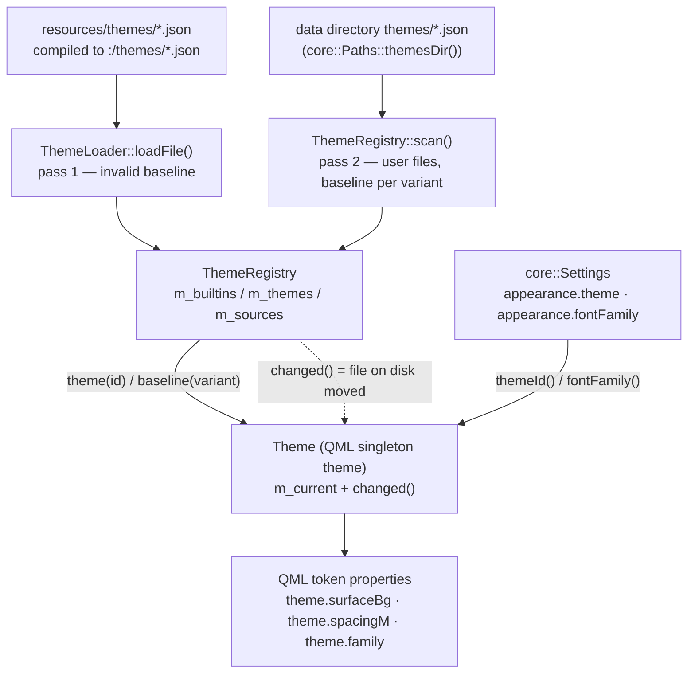

# Theme engine

## What it does, and where it stops

The theme engine turns a JSON file into a flat set of **semantic tokens** that QML binds directly: a page writes `theme.surfaceBg`, `theme.spacingM` or `theme.durationFast`, and the value behind that name changes when the user picks another theme. Pages never learn what a color *is*, only what role it plays.

The boundary is deliberately narrow. The engine owns three things: reading and validating theme files, keeping a registry of the themes that exist, and exposing the current theme as named properties. It does **not** contain layout, component styling recipes (`designs.md` owns those) or any UI type at all — `src/theme` is one of the two directories the build gate forbids from mentioning Qt Quick (rule 4), so it depends only on Qt Core plus Qt Gui's `QColor`. It also does not act on `appearance.followSystem`: that key is read into `core::Settings` but no code switches themes automatically today.

## Files and classes

| File | Class / struct | Responsibility | Collaborates with |
|---|---|---|---|
| `src/theme/ThemeFile.h` | `awb::theme::ThemeFile` | One parsed theme: identity (`id`, `name`, `variant`) plus `colors`, `metrics`, `fonts`, `agentPalette`; `isValid()` is true when `id` is non-empty | produced by `ThemeLoader`, stored by `ThemeRegistry`, held by `Theme` |
| `src/theme/ThemeLoader.h` / `.cpp` | `awb::theme::ThemeLoader` | Parse and validate a single theme JSON; `parse()` applies every rule, `loadFile()` reads a disk or `:/` path | `ThemeFile`, `ThemeRegistry::baseline()` |
| `src/theme/ThemeRegistry.h` / `.cpp` | `awb::theme::ThemeRegistry` | The set of available themes: built-ins from `:/themes/*.json` plus user files from `<data directory>/themes/*.json`; user files override a built-in with the same id; watches the user directory and files and re-emits `changed()` | `core::Paths::themesDir()`, `ThemeLoader`, `Theme` |
| `src/theme/Theme.h` / `.cpp` | `awb::theme::Theme` | The QML singleton behind `theme`: one `Q_PROPERTY` per token, all sharing the `changed()` signal; `applyTheme()`, `setFontFamily()`, `color()`, `metric()`, `alpha()`, `hover()`, `pressed()` | `core::Settings` (current id, font override), `ThemeRegistry` |
| `src/theme/CMakeLists.txt` | build target `awb_theme` | Links `Qt::Core` and `Qt::Gui` only | `app` |
| `resources/themes/mocha-dark.json` | — | Built-in dark theme, compiled to `:/themes/mocha-dark.json`; also the `dark` baseline and the unknown-id fallback | `ThemeRegistry`, `ThemeLoader` |
| `resources/themes/latte-light.json` | — | Built-in light theme, compiled to `:/themes/latte-light.json`; the `light` baseline | `ThemeRegistry`, `ThemeLoader` |
| `src/core/Paths.h` / `.cpp` | `awb::core::Paths` | Provides `themesDir()` (`<dataRoot>/themes`) — the only place the user theme directory is derived | `ThemeRegistry` |
| `src/core/Settings.h` / `.cpp` | `awb::core::AppearanceSettings` | Holds `theme`, `followSystem`, `fontFamily`; `Settings::setThemeId()` and `setFontFamily()` emit `valueChanged()` | `Theme` |
| `app/main.cpp` | — | Constructs `ThemeRegistry` then `Theme` and registers `Theme` as a QML singleton on `AgentWorkbench.App` | all of the above |
| `scripts/check-architecture.sh` | — | Rule 2 rejects literal colors in QML, rule 4 keeps `src/theme` free of UI types | CI / `check_architecture` |
| `tests/theme/tst_themeloader.cpp`, `tst_themeregistry.cpp`, `tst_themefontfamily.cpp` | — | Cover the validation rules, override behaviour and font precedence | `tst_theme` |

## Data model

`ThemeFile` is a plain struct, not a `QObject`. It carries:

- `id` — the theme id, and it **must equal the bare file name** without `.json`. An empty `id` means "invalid file".
- `name` — the display name shown in the theme picker.
- `variant` — exactly `"dark"` or `"light"`; nothing else is accepted.
- `colors` — `QHash<QString, QColor>`, keyed by token name.
- `metrics` — `QHash<QString, double>` for radii, spacing, font sizes, fixed sizes and animation durations.
- `fonts` — `QHash<QString, QString>`, only the keys `family` and `monoFamily` exist.
- `agentPalette` — a list of `#rrggbb` strings; `agentcatalog` cycles through it to color agent cards by position.

The top-level keys the loader accepts are a fixed whitelist: `id`, `name`, `variant`, `author`, `description`, `colors`, `metrics`, `fonts`, `agentPalette`. Any other top-level key is logged as unknown and ignored.

A theme file usually declares only what it changes; a trimmed built-in example is:

```json
{
  "id": "mocha-dark",
  "name": "Catppuccin Mocha (Dark)",
  "variant": "dark",
  "colors": {
    "windowBg": "#1e1e2e",
    "surfaceBg": "#313244",
    "textPrimary": "#cdd6f4",
    "selectionBg": "#45475a",
    "selectionText": "#cdd6f4",
    "scrollbar": "#45475a"
  },
  "metrics": {
    "radiusCard": 16,
    "spacingM": 12,
    "fontSizeBody": 13,
    "durationNormal": 180,
    "sidebarWidth": 240
  },
  "fonts": { "family": "", "monoFamily": "Consolas, Monaco, Courier New, monospace" },
  "agentPalette": ["#f38ba8", "#fab387", "#a6e3a1", "#89b4fa"]
}
```

`colors` holds the color tokens, `metrics` the numeric ones, `fonts` the two font families (`family` may be empty, meaning "follow the system"), and `agentPalette` the per-card accent rotation.

## Loading and validation

`ThemeLoader::parse()` is the whole contract, and each rule exists to protect a different failure mode:

- **Unknown keys** inside `colors`, `metrics` or `fonts`, and unknown top-level keys, are warned about and ignored. A third-party theme that carries extra metadata still loads.
- **A file missing `id`, `name` or `variant`, or declaring a variant other than `dark`/`light`, is skipped entirely.** A file that cannot state its own identity is worse than a missing theme.
- **`id` must equal the file name.** `id` is the primary key shared by the registry and `settings.json`; a file whose name and id disagree is skipped with a warning rather than half-registered.
- **An invalid color or a non-numeric metric falls back to the same-variant baseline.** Non-color `agentPalette` entries are dropped; a non-array `agentPalette` is warned about and ignored.
- **`fonts` values must be strings.** A non-string is ignored rather than coerced; there is deliberately no baseline substitution because an empty string is a legal "follow the system".
- **Missing tokens are filled in from the baseline** — the built-in theme of the same variant (`mocha-dark` for `dark`, `latte-light` for `light`). A theme therefore only declares the tokens it wants to change.
- **An empty `agentPalette` is replaced wholesale by the baseline's.**

The built-in themes themselves are parsed with an **invalid baseline** (`ThemeFile()`), which means "no fallback and no unknown-token filtering": they define the canonical, complete token set. `ThemeLoader::loadFile()` returns an invalid `ThemeFile` on any failure — unreadable file, non-object JSON, or a file rejected by `parse()` — so callers treat it as "this theme does not exist".

## Registry and hot reload

The diagram below shows how theme files flow into the QML tokens.



`ThemeRegistry` loads the built-ins in its constructor in a fixed order (`mocha-dark` first, because it is the fallback, then `latte-light`), then creates the user theme directory (`<dataRoot>/themes`) so the watcher has something to arm against, scans it, and arms a `QFileSystemWatcher` on the directory and every user file. Both `directoryChanged` and `fileChanged` are routed to `refresh()`, which re-scans, re-arms the watchers and emits `changed()`. Saving a theme file therefore takes effect immediately, without a restart.

Two behaviours are worth stating explicitly because they look redundant and are not:

- **`Theme::loadCurrent()` replaces its `ThemeFile` unconditionally and always emits `changed()`**, even when the theme id has not changed. The content behind the same id may have changed on disk, so skipping by id would silently break hot reload.
- **`Theme::applyTheme()` validates before persisting.** An unknown id is refused with a warning; if it were written first, every subsequent start would walk the "unknown → fall back + warn" path, which exists only to tolerate a hand-edited `settings.json`, not to be reachable from the picker. `setFontFamily()` follows the same write-then-reload shape.

When the id in settings is unknown, `loadCurrent()` falls back to `mocha-dark` and logs a warning.

The picker's order comes from `ThemeRegistry::themes()`: the built-ins in their fixed order first, then user-only themes sorted by id (case-insensitive). `Theme::availableThemes()` maps each entry to a map with `id`, `name`, `variant` and a short `display` label (`Dark` / `Light`, or the theme name for an unexpected variant).

## Tokens exposed to QML

`Theme` exposes two kinds of API: named `Q_PROPERTY`s, and helper methods. **Every property uses the single `changed()` signal as `NOTIFY`**, so switching theme, hot-reloading a file or changing the font all cause QML to rebind at once.

Meta properties:

| Property | Meaning |
|---|---|
| `variant` | `"dark"` or `"light"` of the current theme |
| `themeId` | current theme id |
| `availableThemes` | `QVariantList` of `{id, name, variant, display}` for the picker |
| `agentPalette` | `QStringList` of `#rrggbb` colors, rotated per agent card |
| `fontFamilies` | machine font families for the appearance picker; `CONSTANT` because it never changes within a process |

Color tokens (each has a matching getter, and a missing key returns an invalid `QColor`):

`windowBg`, `sidebarBg`, `workspaceBg`, `surfaceBg`, `surfaceAltBg`, `surfaceHoverBg`, `chromeBg`, `overlayBg`, `consoleBg`, `textPrimary`, `textSecondary`, `textMuted`, `textDisabled`, `textOnAccent`, `textLink`, `borderSubtle`, `borderStrong`, `separator`, `accent`, `focusRing`, `success`, `warning`, `danger`, `info`, `neutralOff`, `tooltipBg`, `tooltipText`, `badgeBg`, `tabActiveBg`, `tabInactiveBg`, `selectionBg`, `selectionText`, `scrollbar`.

Numeric tokens (a missing key returns `0.0`):

`radiusCard`, `radiusOverlay`, `radiusControl`, `radiusPill`, `spacingXs`, `spacingS`, `spacingM`, `spacingL`, `spacingXl`, `fontSizeCaption`, `fontSizeSmall`, `fontSizeBody`, `fontSizeSubtitle`, `fontSizeCardTitle`, `fontSizePageTitle`, `cardMinWidth`, `cardHeight`, `durationFast`, `durationNormal`, `sidebarWidth`, `sidebarCollapsedWidth`, `statusBarHeight`, `tabBarHeight`, `toastWidth`.

Font tokens: `family` and `monoFamily`.

Helper methods:

- `color(name)` and `metric(name)` look a token up by name — the same result as the named getters, for components that iterate over tokens. Unknown names return an invalid `QColor` / `0.0`.
- `alpha(color, a)` returns a copy with the alpha set, clamped to `0..1`.
- `hover(color)` and `pressed(color)` move lightness along HSL by `0.08` and `0.16` respectively, **in the direction of the current variant** — lighter on dark, darker on light — while preserving hue and saturation.

**QML must use `theme.hover()` / `theme.pressed()` instead of `Qt.darker()` / `Qt.lighter()`.** The Qt helpers have a fixed direction and are not aware of the light/dark variant, so a hover state built with them becomes unreadable in one of the two themes.

## fontFamily precedence

`Theme::family()` resolves in this order:

1. the user's `appearance.fontFamily` setting, when non-empty;
2. the current theme's `fonts.family`;
3. an empty string, which QML treats as "inherit the system default".

`monoFamily` has no user override — it is always the theme value. `app/main.cpp` also applies `appearance.fontFamily` to the `QGuiApplication` font before the engine is created; the runtime change is driven by `MainWindow.qml` binding `font.family` to `theme.family`.

## Build gate

Two rules in `scripts/check-architecture.sh` keep the token discipline honest:

- **Rule 2 rejects literal colors in QML**: `#rrggbb` / `#rgb` and `Qt.rgba(<number>, …)` built from numeric literals. `"transparent"` and `Qt.rgba(theme.…)` expressions are allowed. The reason is the light/dark requirement: a page that hard-codes a color cannot be correct under both themes, and the token layer is exactly what makes one page serve both.
- **Rule 4 keeps `src/core` and `src/theme` free of UI types** (no `QtQuick`, `QQuick*`, `QQml*`, `Qt6::Quick`, `QtWebEngine`). This is why the engine speaks `QColor` and nothing else, and why it never touches QML items.

## Adding or changing a theme

To add a theme you only edit data:

- **Built-in**: add `resources/themes/<id>.json`, register it in `app/CMakeLists.txt` as a `theme_resources` file with `QT_RESOURCE_ALIAS "<id>.json"` and `PREFIX "/themes"`, and add its id to the built-in list in `ThemeRegistry.cpp`. Keep the file name equal to `id`.
- **User**: drop `<id>.json` into `<data directory>/themes/`. It is picked up live; a file with the same id as a built-in overrides it for this user only.

To add a **new token** (not just a new value for an existing one) you must touch several places at once:

1. the key whitelist and parsing logic in `src/theme/ThemeLoader.cpp`;
2. the `Q_PROPERTY` and getter in `src/theme/Theme.h` / `Theme.cpp`;
3. **both** built-in JSON files, since they are the baselines every other theme is completed from;
4. `designs.md` component recipes if the token is meant for a shared component;
5. this document.

One pairing is not optional: **`selectionText` must be defined together with `selectionBg`.** A text editor without it falls back to the system palette's `HighlightedText` (near-black on Windows' light palette), which is almost invisible against a dark theme's selection background. `ATextField` / `ATextArea` / `ASearchField` already set `selectionColor` / `selectedTextColor` from these two tokens; do not set them again in a page.

## Change checklist

- [ ] Theme file name equals its `id`; `id`, `name`, `variant` present and `variant` is `dark`/`light`.
- [ ] A built-in theme is registered in `app/CMakeLists.txt` (`QT_RESOURCE_ALIAS` + `PREFIX "/themes"`) and listed in `ThemeRegistry`'s built-in ids.
- [ ] A new token updated the loader whitelist, `Theme`'s property, and both built-in JSON files.
- [ ] `selectionText` still ships alongside `selectionBg`.
- [ ] No literal color added to QML; both light and dark themes checked.
- [ ] `bash scripts/build.sh --test` is green, including `check_architecture`.

## Related pages

- [Core infrastructure](core-infrastructure.md) — `core::Paths`, `core::Settings` and the JSON store the engine sits on.
- [Workbench and pages](workbench-and-pages.md) — where `Theme` is constructed and registered as a singleton.
- [Frontend design](../architecture/frontend-design.md) — the token-only rule and the glass-card recipe.
- [Extension points](../architecture/extension-points.md) — themes as a data extension point.
- [Appearance guide](../guide/appearance.md) and [guide index](../guide/index.md) — the user-facing side of theme and font selection.
- [Configuration](../configuration.md) — the `appearance.*` settings keys.
