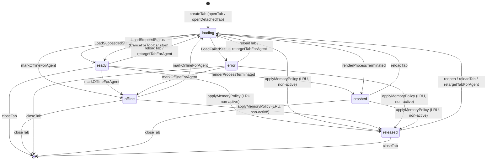

# Web tabs

The web feature turns an agent's local web UI into a **tab inside the application**. It owns the
tab model, the choice between the two ways of showing a page, and the memory policy that bounds how
many live views exist at once. It does not touch any WebEngine header — that is the sibling
adapter, documented in [WebEngine adapter](webengine-adapter.md).

User view: see [Agent Web UI](../guide/web-ui.md).
Architecture context: [Layers and dependencies](../architecture/layers-and-dependencies.md) and
[Frontend design](../architecture/frontend-design.md).

## What this feature does, and the two paths

There are two `surface` kinds, selected by the `web.surface` setting:

- **`embedded`** — an in-app view rendered by the WebEngine adapter. This is the default when the
  build includes WebEngine.
- **`external`** — no tab is created at all; the URL is handed to the system browser and the facade
  emits `externalOpened` so the shell can toast it. The `external` surface is always registered and
  deliberately has no QML component.

A build configured with `AWB_ENABLE_WEBENGINE=OFF` has no `embedded` surface registered. In that
case `openTab()` sees the request for `embedded`, logs one warning and silently degrades to
`external`, and `WebTabsFacade::engineAvailable()` returns false so the page can tell the user that
this build opens agent Web UIs in the system browser. The web page itself is fully usable in that
configuration.

## Files and classes

| File | Class / component | Responsibility | Collaborates with |
|---|---|---|---|
| `src/web/WebTab.{h,cpp}` | `WebTab` | Pure state object for one tab: the properties a view renders, the `state` machine, setters that do not emit on unchanged values, and `lastUsedMs()` for LRU | `WebTabsModel`, `WebTabsFacade`, `WebEngineSurface.qml` |
| `src/web/WebTabsModel.{h,cpp}` | `WebTabsModel` | `QAbstractListModel` over the tabs, role contract for QML, active-index bookkeeping on removal, `dataChanged` translation from `WebTab` signals | `WebTab`, `WebTabsFacade`, `WebTabsPage.qml` |
| `src/web/WebTabsFacade.{h,cpp}` | `WebTabsFacade` | The QML facade: tab lifecycle, surface selection, memory policy, redaction of logged URLs; exposes the model and policy settings | `WebTabsModel`, `WebSurfaceRegistry`, `core::Settings`, `BuiltinPages` |
| `src/web/WebSurfaceRegistry.{h,cpp}` | `WebSurfaceRegistry` | Maps a surface `kind` to its QML component URL; `external` exists from construction with no component | `WebTabsFacade`, `WebEngineSurfaceProvider` |
| `src/web/WebProfilePaths.{h,cpp}` | `WebProfilePaths` | The single source of the per-agent persistent profile path and storage name | `WebEngineProfileStore` |
| `src/web/qml/WebTabsPage.qml` | `WebTabsPage` | The page: its own tab bar, per-tab surface hosts, toolbar, empty state, released placeholder, shortcuts | `WebTabsFacade`, `WebEngineSurface.qml` |
| `src/web/CMakeLists.txt` | `awb_web` | The domain target; links `awb_core` and `awb_theme`, never WebEngine; adds the `webengine` subdirectory only when `AWB_ENABLE_WEBENGINE` is on | `awb_web_webengine` |

The cross-domain wiring that drives this feature from agent state lives in
`src/workbench/BuiltinPages.cpp` (`wireWebRules()`), covered under "Cross-domain wiring" below.

## Frontend design

### Why `WebTabsPage` is a `keepAlive` page

`BuiltinPages` registers the `web` page with `PageDescriptor::keepAlive = true`. It is the only
keep-alive page in the application, and the reason is that **a `WebEngineView`'s page state cannot
be lifted into C++**: destroying the page on navigation would reload the whole web UI and lose any
in-page state. `Workspace` therefore hides a keep-alive page instead of destroying it.

Two consequences are load-bearing:

- Because the page stays instantiated, its `ApplicationShortcut`s stay alive while another page is
  shown. Every global shortcut is gated on `pageCurrent` (`nav.currentPageId === "web"`), otherwise
  `Ctrl+W`, `F5` and `F12` would close or reload a hidden web tab from the Settings page.
- A keep-alive page is created at 0x0 and only gets its real size once it becomes visible, so a
  re-layout is guaranteed. The tab bar therefore provides its size through `implicitHeight`, which
  the `ColumnLayout` reads; binding `height` directly would be overwritten by the re-layout and the
  bar once collapsed to zero height and disappeared.

### The tab bar

The tab bar doubles as the page header. Tabs are a `Row` of delegates inside a `Flickable`, so many
tabs scroll instead of overflowing.

Each delegate declares `required property`s whose names must equal the model role names (`tabId`,
`title`, `url`, `state`, `color`, `iconSource`, `loadProgress`, `surfaceKind`). In particular the
colour role is named `color` and is declared as a `required property string color`, so the
**delegate root must be an `Item`, not a `Rectangle`**: on a `Rectangle` the role would shadow the
visual `color`, the theme binding would land on a string, and the tab body would always be painted
the default white. The visual background is an inner `Rectangle` (`tabBackground`). This is the
same pattern as `AgentCard`.

Interaction details worth preserving:

- Middle click closes a tab; left click activates it (and leaves the home view).
- Double click reloads.
- The close × must be declared **after** the full-size `MouseArea` so it sits on top; otherwise a
  click on it only activates the tab.
- The status dot colour distinguishes `crashed`/`error` (danger) from other states, and it is never
  the only signal — the tooltip carries the textual state.

### Toolbar actions

The toolbar acts on the active tab:

- **Home** shows the running-agent list as an overlay without closing any tab. It is disabled when
  there is nothing to go back to.
- **Reload / Stop** switches its icon and tooltip on `web.activeState`: while loading it is a stop
  that calls `surface.stopLoading()`, otherwise it calls `web.reloadTab()`.
- **Open in browser** is always available — the escape hatch must never be hidden.
- **More actions** opens an `AMenu` with **Copy URL**, **Zoom in / Zoom out / Reset zoom**,
  **Developer tools** (only when `web.devToolsEnabled`, i.e. Debug builds) and **Close tab**.

### Empty state and the released placeholder

The empty state is an `AEmptyState` visible while `web.tabCount === 0` or while the home view is
active. Its description depends on `web.engineAvailable`: with an embedded surface it points at the
running-agent list, without one it explains that this build opens web UIs in the system browser. It
also embeds a height-capped list of running agents, each with an **Open** button that calls
`workbench.openWeb(agentId)`.

A tab in the `released` state has no live view. `WebTabsPage` paints a grey placeholder ("View
released to free memory") with a **Restore view** button calling `web.reopen(tabId)`. The surface
`Loader` for that tab is inactive and its `source` is empty.

When a page requests full screen, `WebTabsPage` hides the whole tab bar (`chromeHidden`), and `Esc`
restores it.

## Backend design

### `WebTab`

`WebTab` is a pure `QObject` state object — properties, setters and a state string; it holds no
view. All properties have `NOTIFY` signals so the tab bar and the surface rebind automatically.

| Property | Type | Notes |
|---|---|---|
| `id` | `QString` | `tab-<n>`, stable key for the model and QML |
| `agentId` | `QString` | owning agent |
| `url` | `QUrl` | may contain a token fragment; redact before display |
| `title` | `QString` | page title, reported by the surface |
| `iconSource`, `color` | `QString` | taken from the agent definition, fixed after creation |
| `surfaceKind` | `QString` | `embedded` or `external` |
| `state` | `QString` | `loading` \| `ready` \| `offline` \| `crashed` \| `error` \| `released` |
| `loadProgress` | `int` | clamped to 0..100 |
| `lastError` | `QString` | shown in the `crashed`/`error` overlays |
| `zoom` | `double` | clamped to 0.5..2.0 |

The setters are edge-triggered: an unchanged value emits nothing, so the surface's `url` binding does
not re-evaluate in a loop. `lastUsedMs()` is refreshed by `touch()`; construction touches
immediately, and activation touches too, so a brand-new or just-activated tab counts as recently
used for the LRU policy.

### `WebTabsModel`

`WebTabsModel` is a `QAbstractListModel` that owns the tabs. Its roles are a contract:

| Role enum | QML name |
|---|---|
| `TabIdRole` | `tabId` |
| `AgentIdRole` | `agentId` |
| `UrlRole` | `url` |
| `TitleRole` | `title` |
| `IconRole` | `iconSource` |
| `ColorRole` | `color` |
| `SurfaceKindRole` | `surfaceKind` |
| `StateRole` | `state` |
| `LoadProgressRole` | `loadProgress` |
| `LastErrorRole` | `lastError` |
| `ZoomRole` | `zoom` |
| `TabObjectRole` | `tabObject` |

`TabObjectRole` returns the live `WebTab` pointer, which is how a surface host hands the object to
its loader — a `required property` cannot hold the object directly, so the surface binds its own
`tab` property to that role.

`appendTab()` takes ownership and connects every `WebTab` change signal (`state`, `title`,
`loadProgress`, `url`, `lastError`, `zoom`) to `notifyTabChanged()`, which emits a full-row
`dataChanged`. `setActiveIndex()` ignores out-of-range or unchanged values and calls `touch()`;
`removeTab()` maintains the active index so it keeps pointing at the *same tab object*: removing a
row before the active one decrements it, removing the active row leaves the index but now points at
the following tab, and an index past the end is clamped to the last row. Any of those emits
`activeIndexChanged()`.

### `WebTabsFacade`

The facade is the only object QML talks to. Its properties:

| Property | Kind | Meaning |
|---|---|---|
| `model` | constant | the `WebTabsModel` as a `QAbstractItemModel` |
| `activeTabId` | notifier | id of the active tab, empty when none |
| `tabCount` | notifier | number of tabs; QML cannot bind `rowCount()` because it has no NOTIFY |
| `activeState` | notifier | state of the active tab, empty when none (drives reload/stop) |
| `devToolsEnabled` | constant | true only in Debug builds |
| `freezeInactiveTabs` | notifier | `web.freezeInactiveTabs` |
| `downloadDir` | notifier | `web.downloadDir`, falling back to `core::Paths::downloadsDir()` |
| `engineAvailable` | constant | whether the `embedded` surface is registered |

Its QML-facing methods:

| Method | Purpose |
|---|---|
| `openTab(fields)` | open or activate a tab for `{agentId, url, title, icon, color}`; returns the tab id, or an empty string on the external path |
| `openDetachedTab(agentId, url, title)` | always create a new tab, bypassing agent de-duplication |
| `closeTab(id)` | close and delete a tab |
| `activateTab(id)` | activate a tab |
| `stepActiveTab(delta)` | cycle the active tab with wraparound (`Ctrl+Tab` passes 1, reverse passes -1) |
| `reloadTab(id)` | reopen a `released` tab, otherwise set it back to `loading` |
| `reopen(id)` | restore a `released` tab (state back to `loading`, progress 0) |
| `openExternal(id)` | hand the tab URL to the system browser, always available |
| `tabForAgent(agentId)` | snapshot `{id, agentId, url, title, state}` or an empty map |
| `tabObject(id)` | the live `WebTab` so QML can read `zoom`, `state`, … reactively |
| `surfaceUrl(kind)` | the QML component URL for a surface kind, empty when unregistered |
| `setTabState/setTabProgress/setTabTitle/setTabLastError/setTabZoom/setTabUrl` | surface/health report entry points |

Its signals are `activeTabChanged`, `tabCountChanged`, `activeStateChanged`, `policyChanged` and
`externalOpened`. `tabCountChanged` is driven by `rowsInserted`/`rowsRemoved`, and activation
tracking forwards the model's `activeIndexChanged` to both `activeTabChanged` and
`activeStateChanged`, plus any `dataChanged` on the active row to `activeStateChanged`.
`setTabState()` calls `touch()` when the new state is `ready`, so a finished load counts as
recently used.

### `WebSurfaceRegistry` and `WebProfilePaths`

`WebSurfaceRegistry` is a plain `kind → component URL` map. Its constructor inserts
`external` with an empty URL, so `hasSurface("external")` is always true while `surfaceUrl("external")`
is empty. `WebEngineSurfaceProvider` registers `embedded` at construction when WebEngine is built
in; its mere existence is what `engineAvailable()` reports.

`WebProfilePaths` is the only place the profile layout is derived:

- `profileDir(agentId)` returns `<data directory>/webprofiles/<agentId>` and creates it. The id is
  sanitized (`[^A-Za-z0-9._-]` becomes `_`) before being appended, so a hand-edited configuration can
  never escape the `webprofiles` directory.
- `storageName(agentId)` returns `awb-<agentId>`.

## Behaviour

### Opening a tab

`openTab()` validates the URL, applies the surface policy (degrade `embedded` to `external` when
the surface is unavailable), and — on the embedded path — **reuses an existing tab for the same
agent**: if the agent already has a tab it is activated instead of a new one being created. This is
why clicking a running card twice does not pile up duplicate tabs.

`openDetachedTab()` exists precisely to bypass that rule. Loopback popups — an OAuth window or a
`target=_blank` link from the same agent — would otherwise be folded into the existing tab by the
de-duplication. It only creates a tab when the embedded surface is available, otherwise it returns
an empty string and the QML popup routing sends the URL to the system browser.

### Closing a tab

`closeTab()` destroys the view but **does not stop the agent**. Session data lives in the
per-agent persistent profile, so reopening the tab restores the session. When the closed tab was
active, the active index moves to the row that occupied its position (clamped to the last row).

### Cross-domain transitions

These four methods are the exact contract used by `BuiltinPages`; the allowed transitions matter.

| Method | Allowed source states | Result | Why the set is restricted |
|---|---|---|---|
| `markOfflineForAgent(agentId)` | `ready`, `loading`, `error` | `offline` | `error` is included because an error page seen while the agent is down is really an "agent offline" page; recovery then follows the normal `offline → loading` path. A load error **while the agent is still running** (a token gate's HTTP 401) is left in `error` on purpose — reloading it every probe round would never succeed. |
| `markOnlineForAgent(agentId)` | `offline` only | `loading` (progress 0) | `released` stays released until the user restores it. `error`/`crashed` are not auto-reloaded: the health check already proved the agent is alive, so the failure was the load itself and only a retarget or a manual Retry can change the outcome. |
| `retargetTabForAgent(agentId, url)` | any, including `released` | `loading`, error cleared | Used when a captured session URL arrives. Changing the URL re-navigates the view and clears the `error`/`offline` overlay. |
| `closeTabsForAgent(agentId)` | any | tab removed | Used when the agent is deleted from the configuration. |

The state diagram below shows every `WebTab` state and which actor causes each transition. The
writers are `WebTabsFacade` (facade methods and cross-domain rules) and the surface, which reports
its own progress through `setTabState()`.

Note one asymmetry the diagram makes visible: `markOnlineForAgent` is the **only** transition out of
`offline`, and `retargetTabForAgent` is the only path that revives `error`/`crashed` without a user
action.

### Memory policy

Two independent mechanisms bound resource usage, both configured in `settings.json`.

**`web.maxLiveTabs` (default 8, minimum 1) — LRU release.** `applyMemoryPolicy()` counts every tab
that is not `released` (the active tab's view is included in the count, because the limit bounds
*all* live views) and, while the count exceeds the limit, releases the oldest **non-active** tab by
`lastUsedMs()`. Releasing means the view is destroyed and the tab is kept in the `released` state; the
page shows the grey placeholder and the user restores it with **Restore view**. Lowering the setting
takes effect immediately — the facade listens for `web.maxLiveTabs` changes and calls
`applyMemoryPolicy()` at once instead of waiting for the next tab to open. This policy is **not**
gated by `freezeInactiveTabs`: freezing is a CPU trade-off, the limit is a memory constraint and
must hold under either setting.

**`web.freezeInactiveTabs` (default false) — freeze the view.** When enabled, an inactive tab's
view goes to `LifecycleState.Frozen`. It is off by default because Chromium already throttles hidden
views, and `Frozen` additionally suspends JS and websockets, so switching back shows a visible
repaint of the agent Web UI. Two rules are non-negotiable in the lifecycle binding: a **loading** view
must never be frozen (a suspended page can never finish loading and would stick on the loading
overlay), and the **active** tab must stay `Active` regardless of state (Qt rejects freezing a
visible page and logs an error on every state change).

**`web.downloadDir`** — where downloads are saved; empty falls back to the platform download
directory. **`web.chromiumFlags`** — injected into the `QTWEBENGINE_CHROMIUM_FLAGS` environment
variable before WebEngine is initialized, so it only takes effect on the next restart.
**`web.homeUrl`** — the toolbar Home button's target when configured: `WebTabsFacade::openHome()`
opens it through `openTab()` with the reserved agent id `"home"` (so repeated clicks activate the
same tab instead of piling up new ones, and the tab keeps its own profile directory). The surface
policy applies as usual — an `external` surface hands the URL to the system browser. When
`web.homeUrl` is empty the Home button keeps its original behaviour: it shows the running-agent
list view over the open tabs without closing any. The settings field
(`SettingsWebPage` → `web.setHomeUrl()`) persists immediately; the `policyChanged` signal carries
the change so QML bindings re-evaluate.

## Security and redaction

The URL that opens a tab is chosen by `WorkbenchContext::openWeb()` with a fixed priority: the
**captured session URL** wins over `AgentUrls::finalUrl(definition)`. The bare `webUrl` is never used
directly, because a token-gated harness answers it with HTTP 401 — only the per-process URL printed
to the agent's own output is accepted. When no session URL was captured, `finalUrl()` appends the
token file's value as a `#token=` fragment (fragments are not sent to the server, so the token stays
out of access logs and the `Referer` header).

Everywhere a URL could be read by a human or a third party, it must first pass through
`WebTabsFacade`'s internal `redactedUrl()` helper. It removes **both** spellings: the `#token=…`
fragment (qwen's gate) and the `?token=…` query item (dsh's session URL), while preserving the rest
of the query string and fragment. The places that use it are the `externalOpened` signal (turned
into a toast), the successful/failed `openUrl` log lines, and the external-open log line.

## Cross-domain wiring

`BuiltinPages::wireWebRules()` installs four rules plus two badges:

1. `AgentsFacade::runningChanged(id, running)` → `markOnlineForAgent()` or `markOfflineForAgent()`.
2. `AgentsFacade::agentRemoved(id)` → `closeTabsForAgent(id)`.
3. `AgentsFacade::sessionUrlChanged(id, url)` → `retargetTabForAgent(id, url)`.
4. `WebTabsFacade::externalOpened(url)` → a `Notifications` toast titled "Opening in the browser"
   (the URL is already redacted).

The **web** sidebar badge shows the tab count, hidden at zero, refreshed on
`rowsInserted`/`rowsRemoved` of the tab model. `WorkbenchContext::openWeb()` assembles the fields and
navigates to the `web` page when a tab id comes back.

## Change checklist

When you touch this feature, walk this list:

- **A new tab state** means updating the state diagram above, the `WebTab::state` documentation, the
  overlay text branches in `WebEngineSurface.qml` and the tooltip text in `WebTabsPage.qml`, plus
  `../guide/web-ui.md`.
- **Changing `markOnlineForAgent` / `markOfflineForAgent`** — re-check the allowed source-state sets
  and the "error while the agent is still running stays error" rule; a broader set reintroduces the
  reload loop.
- **Changing the memory policy** — keep release ungated by `freezeInactiveTabs`, keep the active
  view inside the limit, and verify that lowering `web.maxLiveTabs` still applies immediately.
- **Changing the role names or order** in `WebTabsModel` — update the delegate `required property`
  names in `WebTabsPage.qml` in the same edit; a mismatch renders nothing or right-shifts the roles
  silently.
- **Adding a toolbar action or shortcut** — keep shortcuts gated on `pageCurrent`, and remember the
  page is `keepAlive`.
- **A new surface kind** — register it in `WebSurfaceRegistry`; `external` must stay component-less
  and always present.

## Related

- [Agent Launcher](agent-launcher.md) — produces the running state and the session URL this feature consumes.
- [WebEngine adapter](webengine-adapter.md) — the `embedded` surface implementation.
- [Workbench and pages](workbench-and-pages.md) — where `wireWebRules()` and `openWeb()` live.
- [Development index](index.md)
- User guide: [Agent Web UI](../guide/web-ui.md)
- Architecture: [Frontend design](../architecture/frontend-design.md),
  [State and persistence](../architecture/state-and-persistence.md)

