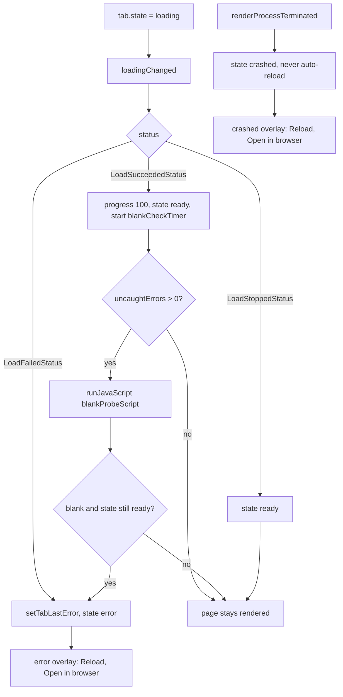

# WebEngine adapter

The adapter is the layer that isolates the embedded browser engine. It registers the `embedded`
web surface, owns one persistent browser profile per agent, bridges the Qt 5 / Qt 6 WebEngine API
differences, injects JavaScript polyfills for older engines, and renders each tab with overlay
fallbacks. It is also the **only** CMake target that links Qt WebEngine.

User view: see [Agent Web UI](../guide/web-ui.md).
Architecture context: [Layers and dependencies](../architecture/layers-and-dependencies.md) and
[C++ library design](../architecture/cpp-design.md).
Background research: [WebEngine embedding](../research/webengine-embedding.md).

## Why this is a separate layer

The domain module `awb_web` never includes a WebEngine header. Everything engine-specific lives in
the sibling target `awb_web_webengine`:

- `src/web/CMakeLists.txt` adds `webengine/` only when `AWB_ENABLE_WEBENGINE` is `ON`.
- That target is the only one linking `${AWB_WEBENGINE_TARGET}`
  (`Qt::WebEngineQuick` on Qt 6, `Qt::WebEngine` on Qt 5) and pulling the WebEngine private include
  directories.

The payoff is that `AWB_ENABLE_WEBENGINE=OFF` builds a fully working application: the `embedded`
surface is never registered, `WebTabsFacade::engineAvailable()` is false, and `openTab()` degrades to
the system browser. Nothing in the tab model has to know whether the engine exists.

`QQuickWebEngineView` is **private API on both majors** — the public include directory only ships
`Profile`, `Script` and `DownloadRequest`. The adapter therefore reaches it through the target's
private include dirs: `${Qt6WebEngineQuick_PRIVATE_INCLUDE_DIRS}` on Qt 6,
`${Qt5WebEngine_PRIVATE_INCLUDE_DIRS}` on Qt 5.

## Files and classes

| File | Class / component | Responsibility | Collaborates with |
|---|---|---|---|
| `src/web/webengine/WebEngineSurfaceProvider.{h,cpp}` | `WebEngineSurfaceProvider` | Registers the `embedded` kind with the URL of `WebEngineSurface.qml`; its existence is what `engineAvailable()` reports | `WebTabsFacade` |
| `src/web/webengine/WebEngineProfileStore.{h,cpp}` | `WebEngineProfileStore` | Caches and creates one persistent `QQuickWebEngineProfile` per agent; exposed to QML as the `WebProfiles` singleton | `WebProfilePaths`, `WebEngineCompat` |
| `src/web/webengine/WebEngineCompat.{h,cpp}` | `WebEngineCompat` | The Qt 5 / Qt 6 member bridge: popup signal names, download state constants, permissions, DevTools attachment, polyfill injection; exposed to QML as the `WebEngineCompat` singleton | `WebEngineProfileStore`, `WebEngineSurface.qml` |
| `src/web/webengine/compat-polyfills.js` | injected script | Feature-detected JavaScript polyfills for the older engine; a no-op on Qt 6's engine | `WebEngineProfileStore`, `WebEngineCompat` |
| `src/web/webengine/qml/WebEngineSurface.qml` | `WebEngineSurface` | One tab's embedded view: `WebEngineView`, platform-event handling, state overlays, JS/auth dialogs, DevTools window | `WebTabsFacade`, `WebEngineCompat`, `WebProfiles` |
| `src/web/webengine/CMakeLists.txt` | `awb_web_webengine` | The adapter target; links `awb_web`, `Qt::Core` and the version-dependent WebEngine target | `awb_web` |

## One persistent profile per agent

`WebEngineProfileStore::createProfile(agentId)` is the only way a view obtains a profile, and it
returns the same instance for the same agent forever. The layout comes from
`src/web/WebProfilePaths.{h,cpp}`:

- storage directory: `<data directory>/webprofiles/<sanitized agentId>`;
- storage name: `awb-<agentId>`.

Per-agent isolation is a hard requirement, not a nicety. Chromium keys cookies by **host and ignores
the port** (RFC 6265), so a single shared profile lets two local services on `127.0.0.1:58627` and
`127.0.0.1:4096` see each other's session cookies. Every built-in agent listens on `127.0.0.1` and
differs only by port, which makes the collision the normal case rather than an edge case. The
measurements are in [WebEngine embedding, section 3.1](../research/webengine-embedding.md):
a cookie set on one port was sent to another. `localStorage` is isolated per origin including the
port, so it was never the problem.

Two details in `createProfile()` are load-bearing:

- **The return type must be `QQuickWebEngineProfile`**, not `QWebEngineProfile`. `WebEngineView.profile`
  takes the Quick type, and QML refuses to call a method whose return type is not a registered QML
  type — returning the core type makes QML report "Unknown method return type" and every embedded tab
  silently falls back to the shared default profile.
- **`setOffTheRecord(false)` must be called explicitly.** The public constructor builds the adapter
  with an empty name, and the adapter decides at construction time that it is off-the-record;
  `setStorageName()` does not flip that decision. Omit the call and the profile stays silently
  in-memory, so cookies are lost on every restart (observed on Qt 6.7.3).

The remaining settings pin the persistence intent: `setPersistentStoragePath(WebProfilePaths::profileDir(agentId))`,
`setHttpCacheType(DiskHttpCache)` and `setPersistentCookiesPolicy(ForcePersistentCookies)`. All of
them must be set before the first view uses the profile, which is exactly when it is created.

`shutdown()` deletes and clears all cached profiles; it is called on application exit, and a later
`createProfile()` simply creates fresh ones.

## The compatibility bridge `WebEngineCompat`

QML cannot conditionally reference a type or signal that does not exist in the engine it is running
on — writing the name is enough to fail the whole component load. `WebEngineCompat` therefore owns
every member whose name or shape changed between the two majors, and `WebEngineSurface.qml` only
uses version-neutral names.

| Concern | Qt 6 | Qt 5 | How the bridge handles it |
|---|---|---|---|
| Popup signal | `newWindowRequested` | `newViewRequested` | Connected in C++ by `watchPopups()`; both are re-emitted as `popupRequested(sourceView, target)` |
| Popup reply | set the `accepted` property | do not call `openIn` (= discard) | The request is always answered in C++ before the URL is routed |
| Download item type | `WebEngineDownloadRequest` | `WebEngineDownloadItem` | The download state is exposed as `int` constants (`downloadCompleted`, `downloadCancelled`, `downloadInterrupted`) |
| Permission denial | `grantFeaturePermission(origin, feature, false)` | same | `denyFeature()`; no version branch |
| DevTools attachment | `inspectedView` | same | `attachDevTools()` sets `inspectedView` on the inspector view; `devToolsUrl()` always returns an empty URL |
| Polyfill injection | profile-level `scripts()` | view-level `userScripts` | Profile-level on Qt 6, view-level on Qt 5; `installCompatScript()` is a no-op on Qt 6 |

Why the popup signal must be connected in C++ specifically: `onNewWindowRequested` is a Qt 6 name. A
`QML` file that declares it is rejected wholesale by the Qt 5 engine with "Cannot assign to
non-existent property", which leaves the embedded page **blank** while all C++ tests still pass. That
is exactly the white-tab bug the bridge exists to prevent, and it is why the request is answered in
C++ and only the URL destination is decided in QML.

The state constants are protected against enum drift by `static_assert`s in `WebEngineCompat.cpp`
asserting that `DownloadCompleted`, `DownloadCancelled` and `DownloadInterrupted` keep the values 2, 3
and 4 on both item types.

`watchPopups()` and `installCompatScript()` are idempotent: they mark the view with a dynamic
property, so calling them twice cannot open two tabs for one popup.

### Popup routing in QML

The C++ side has already accepted or discarded the engine request; `WebEngineSurface.qml` only decides
where the URL goes. Matching on the source view (every tab has its own surface instance), it routes a
**loopback** target (`127.0.0.1`, `localhost`, `::1`, or any `127.x`) to
`web.openDetachedTab(agentId, url, host)` — always a new tab, because the de-duplication of `openTab`
would fold an OAuth or `target=_blank` window into the current tab — and everything else to
`workbench.openExternalUrl(url)`.

### Members that need no bridge

Some QML-visible request objects have the same shape in both majors and are used directly:

- **Full screen** (`fullScreenRequested`): the request is a gadget with `toggleOn` (direction) and
  `accept()`. Both are written in QML. Note that neither major has an `accepted` property or a
  `fullScreen` property on this request — using those names silently does nothing.
- **JS dialogs** (`javaScriptDialogRequested`) and **HTTP authentication**
  (`authenticationDialogRequested`): the surface owns both, always answers them (an `OK`/`Cancel`
  themed dialog, never an unanswered one), and rejects on cancel. The engine blocks the page's
  JavaScript until the request is answered, so a request left hanging freezes all further
  interaction.

## JavaScript polyfills and the blank-screen fallback

Qt 5.15 embeds **Chromium 87** (verifiable in the Qt source tree's `chrome/VERSION`). Modern agent
Web UIs are built for current browsers and call APIs that did not exist then; a single missing one is
a `TypeError` and a blank page. `compat-polyfills.js` fills the runtime-API gaps. Every item is
feature-detected, so the whole file is a no-op on Qt 6's engine (Chromium 118+).

The covered APIs, with the Chrome version that introduced each:

| API | Since |
|---|---|
| `Promise.withResolvers` | 119 |
| `Array`/`String`/all `TypedArray` `.at()` | 92 |
| `Array.prototype.findLast` / `findLastIndex` | 97 |
| `Array.prototype.toSorted` / `toReversed` / `toSpliced` / `with` | 110 |
| `Object.hasOwn` | 93 |
| `Object.groupBy` / `Map.groupBy` | 117 |
| `structuredClone` | 98 |
| `AbortSignal.timeout` / `AbortSignal.any` | 103 / 116 |
| `crypto.randomUUID` | 92 |
| `URL.canParse` | 120 |
| `Response.json` | 117 |

The file itself must stay parseable by Chromium 87: ES6 is fine, but ES2021+ syntax (class static
blocks, `#private` fields, …) is banned.

Injection happens in two places, because the two majors expose different hook points:

- **Qt 6** — `WebEngineProfileStore::createProfile()` inserts the script into the profile's
  `scripts()` collection with `MainWorld` + `DocumentCreation` and `runsOnSubFrames(true)`, so one
  insertion covers every view of that profile.
- **Qt 5** — the Quick profile is only a `QObject` wrapper and has no `scripts()`. The script is added
  at the view level through `WebEngineCompat::installCompatScript(view)`, which appends to the view's
  `userScripts` list. It must be called from `Component.onCompleted`, because the Qt 5 adapter
  initializes itself through a `singleShot(0)` that runs after the completion stage; appending there
  still catches the first load.

The source is read once from `:/web/compat-polyfills.js` and cached. If the resource is missing the
adapter warns and skips injection, degrading to "old engine without polyfills" rather than failing
the whole surface.

### Blank-screen detection

Some gaps cannot be polyfilled at all: **syntax-level** features such as class static blocks
(Chrome 94) make the parser fail on the bundle before any polyfill can run. Such a page returns HTTP
200, the state machine rests at `ready`, and the user faces a blank page with no explanation. The
surface therefore probes for a blank page after a successful load:

1. `LoadSucceededStatus` sets the tab to `ready` and starts a 3 s timer.
2. The probe only runs if the load produced at least one **uncaught** JS error (counted in the JS
   console handler). A normally blank page — a service just starting up — is not affected, and a page
   that rendered partially but logged a few errors is not covered either.
3. The probe walks the body's text nodes with a `TreeWalker`, ignoring `SCRIPT`, `STYLE`, `TEMPLATE`
   and `NOSCRIPT` (their source text would otherwise count as content), then checks for
   `canvas, svg, img, video, iframe`. It reports blank only if there is neither visible text nor
   media.
4. If it is blank **and** the state is still `ready`, the tab is moved to `error` with a message that
   names the engine's Chromium version and suggests an external browser. The `error` overlay carries
   the **Open in browser** escape hatch.

The flowchart below follows a load from start to either a rendered page or one of the three overlay
states.

## Logging and redaction

Connecting `WebEngineView.javaScriptConsoleMessage` **disables the engine's default `[js]` log
route** — on both majors the default handler returns as soon as it detects receivers. The surface
therefore forwards the messages itself, and it must redact before it does: the default route would
write a `?token=`/`#token=` URL into the log file verbatim. `redactedSource()` replaces every
`token=…` occurrence in the `sourceID` with `token=[redacted]` before logging. `Info`-level messages
are dropped to keep the log volume equal to the old default (whose `js` category defaulted to
warning).

Uncaught-exception counting happens in the same handler; it is the evidence the blank-page probe
needs (see above).

## `WebEngineSurface.qml` overlays

The surface binds `tab.url`, `tab.zoom` and the per-agent profile (`WebProfiles.createProfile(tab.agentId)`)
to its `WebEngineView`, and reports changes back through the facade: `onUrlChanged` →
`setTabUrl`, `onTitleChanged` → `setTabTitle`, `onLoadProgressChanged` → `setTabProgress`, and
`loadingChanged` → `setTabProgress`/`setTabState`.

A `Connections` block on `tab.stateChanged` calls `view.reload()` whenever the state becomes
`loading`. This is required because the `url` binding only fires when the URL *changes*, so a reload
that keeps the same URL — `reloadTab()`, `markOnlineForAgent()`, `reopen()` — would otherwise never
reach the engine, and the loading spinner would never stop.

| State | Trigger | Overlay text and actions |
|---|---|---|
| `loading` | `openTab`/`openDetachedTab` create, `reloadTab`, `reopen`, `markOnlineForAgent`, `retargetTabForAgent` | Spinner and "Loading `<host>`..."; **Cancel** calls `view.stop()` |
| `offline` | `markOfflineForAgent` while the agent is down | "This agent is not running" plus the URL (fragment stripped, monospace); **Restart agent** calls `workbench.launchAgent`, **Retry** calls `web.reloadTab` |
| `crashed` | `renderProcessTerminated` | "The page crashed" in danger colour plus `lastError`; **Reload** and **Open in browser**. It is never auto-reloaded — a crash loop is worse than a manual reload |
| `error` | `LoadFailedStatus`, or the blank-page probe | "Failed to load the page" in danger colour plus `lastError`; **Retry**, **Reload** and **Open in browser** |
| `released` | `applyMemoryPolicy` LRU release | Handled by `WebTabsPage`, not the surface: the view is hidden (`visible` excludes `released`) and the page paints the grey placeholder with **Restore view** |

The view is visible only when it has a tab and the state is neither `released` nor `offline`; the
overlay is visible for `loading`, `offline`, `crashed` and `error`.

### Lifecycle freezing

The `lifecycleState` binding returns `Active` when there is no tab, when `web.freezeInactiveTabs` is
off, when the tab is the active one, or when the state is `loading`; otherwise `Frozen`. The two
guards are not optional:

- a **loading** view must never be frozen — `Frozen` suspends the page, so a view frozen mid-load can
  never finish and sticks on the loading overlay;
- the **active** tab must stay `Active` regardless of state — Qt rejects freezing a visible page and
  logs an error on every state transition.

`LifecycleState` is a **scoped enum**: the value is written as
`WebEngineView.LifecycleState.Active`. A bare `WebEngineView.Active` is `undefined`, and assigning it
fails silently.

## Build-time differences

| Aspect | Qt 6 | Qt 5 |
|---|---|---|
| WebEngine link target | `Qt::WebEngineQuick` (`AWB_WEBENGINE_TARGET`) | `Qt::WebEngine` |
| Private include dirs | `Qt6WebEngineQuick_PRIVATE_INCLUDE_DIRS` | `Qt5WebEngine_PRIVATE_INCLUDE_DIRS` |
| Polyfill injection point | profile `scripts()` | view `userScripts` |

The `AWB_WEBENGINE_TARGET` variable is defined once in `cmake/AwbQtCompat.cmake`, and consumers only
reference it — never a concrete component name. That file also covers the Qt 5 QML differences:
`import QtWebEngine` is rewritten to `import QtWebEngine 1.10` (the Qt 5 compiler requires a version
on every library import), and `awb_add_qml_module` generates a `qmldir` plus a qrc that mirrors Qt
6's `/qt/qml/AgentWorkbench/...` URLs, so every `qrc:/qt/qml/AgentWorkbench/...` path in the C++ code
stays valid on both majors. The Qt 5 validation baseline is **5.15.16 LTS**, because the WebEngine
backports this adapter relies on (`lifecycleState`, `javaScriptDialogRequested`,
`authenticationDialogRequested`, profile-level `downloadRequested`) are in the LTS patches.

## Compatibility change checklist

- **Both majors must compile.** A change that only builds against your local Qt is not done; the
  Qt 5 branch must be explicitly considered and, when its failure mode is a blank surface or a
  silently ignored property, it cannot be caught by the Qt 6 test run.
- **Never write a member in QML that does not exist on both majors.** If a name or shape differs,
  add a version-neutral method to `WebEngineCompat` and call that instead.
- **Prefer bridging in C++.** QML has no static conditional references; connecting a version-specific
  signal in C++ is the only reliable pattern.
- **A polyfill change must be verified on both engines.** The file must stay parseable by Chromium 87,
  and the change must be a no-op on the new engine.
- **Never log an unredacted URL.** Any new console/log path must pass through the redaction helper
  first.
- **Changing the surface state set or overlay text** — update the table above, the state diagram in
  [Web tabs](web-tabs.md), and `../guide/web-ui.md`.

## Related

- [Web tabs](web-tabs.md) — the tab model and the `embedded`/`external` surface policy this adapter plugs into.
- [Agent Launcher](agent-launcher.md) — where the agent and its token file come from.
- [Workbench and pages](workbench-and-pages.md) — `openWeb()` and the popup/external routing entry points.
- [Development index](index.md)
- User guide: [Agent Web UI](../guide/web-ui.md)
- Architecture: [C++ library design](../architecture/cpp-design.md),
  [Layers and dependencies](../architecture/layers-and-dependencies.md)
- Research: [WebEngine embedding](../research/webengine-embedding.md)
