# Workbench and pages

## What it does, and where it stops

`src/workbench` is layer L3 and the **only layer allowed to know more than one domain**. Registering the built-in pages, combining an agent's URL with the Web tab domain, detecting the Python/Node runtimes and bridging the plugin ABI to the shell all belong here, because a single action spans several modules that must not include each other.

The boundary is vertical, not horizontal: `workbench` may depend on every L2 module, and nothing depends on `workbench` except the executable. Two things it deliberately does **not** do:

- It does not become a home for domain logic. Opening a Web tab is a request to `WebTabsFacade`; `WorkbenchContext` only decides *which* URL to use and *when* to navigate.
- It does not extend the shell's knowledge. `WorkbenchContext` and `BuiltinPages` call into `NavigationModel` / `ShellController`; `src/shell` still has no idea what an agent or a theme is.

## Files and classes

| File | Class | Responsibility | Collaborates with |
|---|---|---|---|
| `src/workbench/WorkbenchContext.h` / `.cpp` | `awb::workbench::WorkbenchContext` | The QML singleton behind `workbench`: navigation intents, cross-domain intents (`openWeb`, `launchAgent`, …), general actions (copy, notify, open URL/folder/config dir, quit) and the plugin toggle API | `NavigationModel`, `UiServices`, `Notifications`, `AgentsFacade`, `WebTabsFacade`, `Settings` |
| `src/workbench/BuiltinPages.h` / `.cpp` | `awb::workbench::BuiltinPages` | Registers the five built-in pages and wires badges, current-page persistence and the cross-domain Web rules | `NavigationModel`, `ShellController`, `AgentsFacade`, `WebTabsFacade`, `SkillsFacade`, `ToolsFacade`, `Notifications` |
| `src/workbench/EnvironmentService.h` / `.cpp` | `awb::workbench::EnvironmentService` | Python and Node.js detection for the status bar | `ScriptRunner`, `ProcessRunner`, `TextUtils` |
| `src/workbench/PluginServices.h` / `.cpp` | `awb::workbench::PluginServices` | The host-side implementation of `plugin::Services`; the bridge between the plugin ABI and shell/theme/web | `NavigationModel`, `UiServices`, `Notifications`, `Theme`, `WebTabsFacade`, `Settings`; details in [Plugin host](plugin-host.md) |
| `src/workbench/CMakeLists.txt` | target `awb_workbench` | Links every L1/L2 module plus core | `app` |
| `src/shell/PageDescriptor.h` | `awb::shell::PageDescriptor` | The descriptor a page registration consists of (`id`, `title`, `iconSource`, `source`, `section`, `order`, `badgeText`, `enabled`, `keepAlive`) | `NavigationModel`, `BuiltinPages`, `PluginServices` |
| `src/shell/qml/Workspace.qml` | — | Hosts one page at a time; a `Loader` for normal pages and a `Repeater` for `keepAlive` pages | `NavigationModel` |
| `src/shell/qml/MainWindow.qml` | — | Declares the lowercase root aliases, keyboard shortcuts, the exit confirmation and the one-time legacy-import dialog | all singletons |
| `app/main.cpp` | — | The object-graph assembly and the QML-singleton registration; the startup order is a contract | all modules |
| `app/CMakeLists.txt` | executable `AgentWorkbench` | Declares the QML module, the resource manifests and the translation resources | all QML modules |

## WorkbenchContext

`WorkbenchContext` is exposed to QML as the `workbench` alias. Its constructor only stores pointers and forwards `currentPageChanged` from the navigation model; page registration and rule wiring live in `BuiltinPages`.

Properties:

- `currentPageId` — a read-through to `NavigationModel::currentPageId()`.
- `legacyImportNotice` — the one-time import notice; empty on a normal start. The assembly layer sets it once. The `AAlertDialog` in `MainWindow.qml` reads it.

Navigation intent:

- `showPage(id)` — switches to a registered page.

Cross-domain intents:

- `openWeb(agentId)` — the default path for a card's "open". The URL priority is **the session URL captured from the launch output first, then `AgentUrls::finalUrl()`** (which appends `#token=<value>` when the agent configures a `tokenFile`). The bare `webUrl` is never used directly: a token-gated harness answers `401` to it, and only the per-process URL printed to stdout passes. The surface policy (embedded vs external) and de-duplication are decided inside `WebTabsFacade`. The navigation to the `web` page happens **only when a tab was actually created or re-activated** — `openTab()` returns a non-empty id; the external-surface path returns an empty id and no navigation, because the browser already opened and the Web facade has raised a toast.
- `openWebExternal(agentId)` — bypasses the surface policy and hands the URL to the system browser. Same URL priority, no tab.
- `closeWeb(agentId)` / `reloadWeb(agentId)` — find the agent's tab and close or reload it; silently return when there is no tab.
- `launchAgent(agentId)` — forwards to `AgentsFacade::launch()`; the outcome arrives through the facade's own signals.

General actions:

- `copyText(text)` — copies and raises a `success` or `error` toast.
- `notify(level, title, text)` — the generic toast entry point (`success` / `info` / `warning` / `error`).
- `openExternalUrl(url)`, `openFolder(path)` — via `UiServices`, with an error toast on failure.
- `openConfigDir(agentId)` — forwards to `AgentsFacade`.
- `quit()` — quits the application.

Plugin API (read-only list plus toggles; behaviours are in [Plugin host](plugin-host.md)): `pluginList()`, `setPluginEnabled()`, `pluginsEnabled()`, `setPluginsEnabled()`, `pluginTrustNotice()`.

## BuiltinPages

`BuiltinPages` registers the built-in pages into the shell's `NavigationModel` and then wires three groups of rules. The constructor order is `registerPages()`, `wireBadges()`, `wirePagePersistence()`, `wireWebRules()`.

The complete page registry:

| id | title (`tr()`) | icon | source | section | order | keepAlive |
|---|---|---|---|---|---|---|
| `agents` | Agent Launcher | `qrc:/icons/terminal.svg` | `qrc:/qt/qml/AgentWorkbench/agentcatalog/AgentGridPage.qml` | `main` | 10 | false |
| `web` | Agent Web UI | `qrc:/icons/web.svg` | `qrc:/qt/qml/AgentWorkbench/web/WebTabsPage.qml` | `main` | 20 | **true** |
| `skills` | Skills | `qrc:/icons/skills.svg` | `qrc:/qt/qml/AgentWorkbench/skillcatalog/SkillGridPage.qml` | `main` | 30 | false |
| `tools` | Agent Tools | `qrc:/icons/tools.svg` | `qrc:/qt/qml/AgentWorkbench/tools/ToolsPage.qml` | `main` | 40 | false |
| `settings` | Settings | `qrc:/icons/gear.svg` | `qrc:/qt/qml/AgentWorkbench/shell/SettingsPage.qml` | `system` | 100 | false |

`section` decides where a page lands in the sidebar and is the only mechanism for it: `system` pages are pinned to the bottom. `keepAlive` is a real trade-off — a normal page is destroyed when you navigate away, so any state that must outlive it belongs in C++. The `web` page is the sole exception because a `WebEngineView` cannot move its state into C++ and destroying it reloads the whole page; `Workspace.qml` instantiates it once and only hides it. A `keepAlive` page must disable its own shortcuts while it is not current.

A new feature page belongs in `registerPages()`, using the same `NavigationModel::registerPage()` path that plugins use — there is no separate registration mechanism.

The three wirings:

- `wireBadges()` — the `agents` badge is the number of agents whose state is `running`, refreshed on `AgentModel`'s `dataChanged` (restricted to `RunningRole`), `rowsInserted` and `rowsRemoved`, and computed once at startup. `setBadge` with an empty string hides the badge when the count is zero.
- `wirePagePersistence()` — restores `ShellController::lastPageId()` at startup when one was recorded, then saves the current page id on every `currentPageChanged`. Page restore happens here, which is why plugins must be loaded *before* `BuiltinPages` is constructed (see the startup order).
- `wireWebRules()` — the cross-domain rules that connect the agent domain to the Web domain: `AgentsFacade::runningChanged` calls `WebTabsFacade::markOnlineForAgent()` / `markOfflineForAgent()`; `agentRemoved` closes the agent's tabs; `sessionUrlChanged` calls `retargetTabForAgent()` so an already-open tab does not stay on the bare `webUrl` that the token gate would reject; `WebTabsFacade::externalOpened` raises a toast. It also maintains the `web` badge from the tab model's row count.

The diagram below shows page registration and the cross-domain wiring it shares the module with.

```mermaid
flowchart TD
    subgraph WB["awb_workbench (L3)"]
        BP["BuiltinPages"]
        WC["WorkbenchContext"]
        ES["EnvironmentService"]
        PS["PluginServices"]
    end
    Nav["NavigationModel (shell)"]
    Shell["ShellController (shell)"]
    UI["UiServices (shell)"]
    Notif["Notifications (shell)"]
    Agents["AgentsFacade (agentcatalog)"]
    Web["WebTabsFacade (web)"]
    Skills["SkillsFacade (skillcatalog)"]
    Tools["ToolsFacade (tools)"]
    Theme["Theme (theme)"]
    Settings["Settings (core)"]
    Workspace["Workspace.qml"]

    BP -->|registerPage / setBadge| Nav
    BP -->|lastPageId| Shell
    BP -->|runningChanged, sessionUrlChanged, agentRemoved| Agents
    BP -->|markOnline/markOffline, retargetTab, closeTabs| Web
    BP -->|notify| Notif
    BP -->|facade pointers only| Skills
    BP -->|facade pointers only| Tools
    WC -->|showPage / setCurrentPageId| Nav
    WC -->|openExternalUrl, copyText, openFolder| UI
    WC -->|openTab, tabForAgent, closeTab, reloadTab| Web
    WC -->|launch, openConfigDir, sessionUrl| Agents
    WC -->|notify| Notif
    WC -->|plugins.enabled, disabledIds| Settings
    ES -->|runShell --version| Settings
    PS -->|registerPage| Nav
    PS -->|registerSurface| Web
    PS -->|color token| Theme
    Workspace -->|currentPage, keepAlivePages| Nav
```



## EnvironmentService

`EnvironmentService` is exposed as the `environment` alias and drives the Python/Node badges in the status bar.

Detection per runtime: `ProcessRunner::findExecutable(program)` is tried first; if the executable is not on `PATH` the runtime is immediately marked not installed (no process is started). Otherwise it runs `<program> --version` through `ScriptRunner::runShell()` with a 10-second timeout and **separate channels**, because older Python versions print the version to stderr. In the `finished` handler the version is extracted from stdout first and from stderr second, and `installed` is true when there was no start error and either the exit code is 0 or a version string was found.

In-flight probes are tracked in a **key set** (`environment:Python`, `environment:Node`), not a counter. A second `refresh()` while a probe is still running makes `ScriptRunner` supersede the old run under the same key and discard its stale `finished`; with a counter that stale callback would never decrement and `detecting` would stay true forever — the set is idempotent because the superseding callback removes the same key.

All properties (`pythonVersion`, `pythonInstalled`, `nodeVersion`, `nodeInstalled`, `detecting`) share one `changed()` signal, so the status bar binds them uniformly. `refresh()` is the `Q_INVOKABLE` behind the refresh affordance.

## PluginServices

`PluginServices` is the host-side implementation of the abstract `plugin::Services` the ABI hands to a plugin. It lives in `awb_workbench` because only this layer is allowed to touch the navigation model, the theme, the Web surfaces and the settings at once. It is passed to `PluginHost::loadEnabled()`. Every method — page registration through the same path as built-in pages, the per-plugin data directory, logging and toasts, read-only theme colors and whitelisted settings — is documented in [Plugin host](plugin-host.md).

## Startup assembly

`app/main.cpp` builds the object graph by hand and the order is a hard contract; several steps silently misbehave when moved.

1. **Logging is installed first** (`Logging::install()`), so anything that fails afterwards is on disk. After `Settings` is read, the log backend is installed a second time only when the user actually changed a rotation or level option, so that warnings emitted while reading settings still land.
2. **`Settings` is read before `QGuiApplication` exists.** `web.chromiumFlags` must be pushed into `QTWEBENGINE_CHROMIUM_FLAGS`, and the WebEngine module must be initialised (`QtWebEngineQuick::initialize()` on Qt 6, `QtWebEngine::initialize()` on Qt 5) *before* the application object is constructed. Getting this wrong makes the user's Chromium flags ineffective.
3. `QGuiApplication` is created, the version and icon are set, and the Qt Quick Controls style is pinned (`Basic` on Qt 6, `Default` on Qt 5).
4. The translator is installed from `:/i18n` for the locale (or the `locale.override` value); see [Internationalisation](i18n.md).
5. The global UI font from `appearance.fontFamily` is applied to the application before the engine exists.
6. **`LegacyImport::runOnce()` runs before the default `settings.json` is written**, because the import decides whether to act by checking whether the data root is still untouched. Only then is a default `settings.json` saved if the file does not exist.
7. **The graph is assembled bottom-up**: `ThemeRegistry` → `Theme` → shell (`NavigationModel`, `ShellController`, `UiServices`, `Notifications`) → `AgentsFacade` (+ `start()`) → `WebTabsFacade` → `SkillsFacade` (+ `start()`) → `ToolsFacade` → `MarkdownEdit` → `EnvironmentService` → `WorkbenchContext`.
8. **Plugins are discovered and loaded before pages are registered and restored.** Manifests are always read (the Settings page lists them even while disabled); libraries are loaded only when the global switch is on, and each manifest's enable flag is resolved against `plugins.disabledIds`. The discovered list is pushed into `WorkbenchContext`. Because `BuiltinPages` is constructed *after* this, a plugin page id can survive a restart.
9. `BuiltinPages` is constructed, which registers the built-in pages and restores the last page.
10. When WebEngine is enabled, the surface provider, profile store and compat object are created, and `WebProfiles` / `WebEngineCompat` are registered as singletons.
11. `qRegisterMetaType<awb::core::OpResult>()` and the QML singletons are registered (see the table below).
12. A `QQmlApplicationEngine` is created, the import path `<applicationDirPath>/qml` is added (plus `qrc:/qt/qml` on Qt 5), and `MainWindow.qml` is loaded. If no root object was created, the import paths are logged, a Win32 message box explains the failure, the log queue is drained with `Logging::uninstall()` and the process exits with `-1`.
13. After `app.exec()`, `Logging::uninstall()` is called before returning. At the QML layer, `MainWindow.qml`'s `onClosing` saves the window size and shows the exit confirmation; choosing to close background terminals calls `agents.stopAll()`. Loaded plugin libraries stay alive for the process lifetime and are unloaded by `PluginHost::shutdown()` (its destruction at the end of `main` does the same).

Singleton names and their QML aliases. Every global is registered on the pure C++ URI `AgentWorkbench.App` with an uppercase type name; the lowercase contract names are `readonly property` aliases at the root of `MainWindow.qml`.

| Registered type name | QML alias (root of `MainWindow.qml`) | Notes |
|---|---|---|
| `Theme` | `theme` | |
| `Nav` | `nav` | |
| `Shell` | `shell` | |
| `Ui` | `ui` | |
| `Notifications` | `toasts` | the alias differs from the type name |
| `Agents` | `agents` | |
| `Web` | `web` | |
| `Skills` | `skills` | |
| `Tools` | `tools` | |
| `MarkdownEdit` | — | referenced directly as `MarkdownEdit` |
| `Workbench` | `workbench` | |
| `Environment` | `environment` | |
| `WebProfiles` | — | registered only with WebEngine; used directly inside `WebEngineSurface.qml` |
| `WebEngineCompat` | — | registered only with WebEngine; used directly by the compat bridge |

## Resources and the QML module

`app/CMakeLists.txt` calls `awb_add_qml_module(AgentWorkbench)` (Qt 6's `qt_add_qml_module`, or the generated `qmldir` + qrc on Qt 5). For every `.qml` file the manifest sets a `QT_RESOURCE_ALIAS`, so a page URL is always

```
qrc:/qt/qml/AgentWorkbench/<area>/<Name>.qml
```

where `<area>` is the directory-based area (`agentcatalog`, `web`, `shell`, `components`, `skillcatalog`, `tools`). Adding or moving a `.qml` therefore means editing the matching area list here **and** `cmake/AwbTranslations.cmake`'s `AWB_TS_SOURCES` when the file contains `qsTr()`.

QML resources are compiled into the **executable only**, never into a static library, because the linker drops qrc initialisers from static libraries; that is why module `CMakeLists.txt` files list C++ sources only. The other bundled resources (icons, `config/default_*.json`, the JS compat polyfills, the built-in themes) are registered here too, each with its own `PREFIX` and alias. The compiled translations are embedded under `:/i18n/` from the root `CMakeLists.txt`'s `qt_add_translation()` output (see [Internationalisation](i18n.md)).

The executable adds `<applicationDirPath>/qml` to the engine's import paths so a deployed Qt runtime next to the binary wins.

## Adding a built-in page or a cross-domain action

For a **new built-in page**:

- [ ] Create the page QML under the owning module's `qml/` directory and register it in the area list in `app/CMakeLists.txt` (and in `AWB_TS_SOURCES` if it has `qsTr()`).
- [ ] Register a `shell::PageDescriptor` in `BuiltinPages::registerPages()` with its id, `tr()` title, icon, source URL, `section` and `order`; set `keepAlive` only if the page has state that cannot live in C++.
- [ ] If the page needs cross-domain behaviour, wire it in `BuiltinPages` (a new `wireXxx()` private method following the existing pattern) rather than reaching across domains from QML.
- [ ] If the page shows in the sidebar and has a badge, extend `wireBadges()`; if it needs to be restorable, `wirePagePersistence()` already covers it.
- [ ] Update the [Extension points](../architecture/extension-points.md) page and this registry table, and add the page's own `guide/` and `development/` documents.

For a **new cross-domain action**:

- [ ] Add a `Q_INVOKABLE` method on `WorkbenchContext` (QML can only call methods that are `Q_INVOKABLE`, and the build gate checks this), keeping the domain calls inside it.
- [ ] If it moves between pages, go through `NavigationModel`; do not add a new navigation path.
- [ ] Report failures through `Notifications` rather than returning an error to QML, unless the caller needs a synchronous result — in which case return an `awb::core::OpResult` written fully qualified.
- [ ] Cover it in `tests/workbench/` and update this page.

## Related pages

- [Core infrastructure](core-infrastructure.md) — `Settings`, `Paths` and the objects assembled at startup.
- [Theme engine](theme-engine.md) — the `Theme` singleton registered by `main.cpp`.
- [Plugin host](plugin-host.md) — the plugin side of page registration and the services bridge.
- [C++ library design](../architecture/cpp-design.md) — the facade and `Q_INVOKABLE` contracts.
- [Layers and dependencies](../architecture/layers-and-dependencies.md) — why `workbench` is the only multi-domain layer.
- [Guide index](../guide/index.md) — the pages, navigation and shortcuts as the user sees them.
- [Configuration](../configuration.md) — the `window.lastPageId` and plugin keys the assembly reads.
