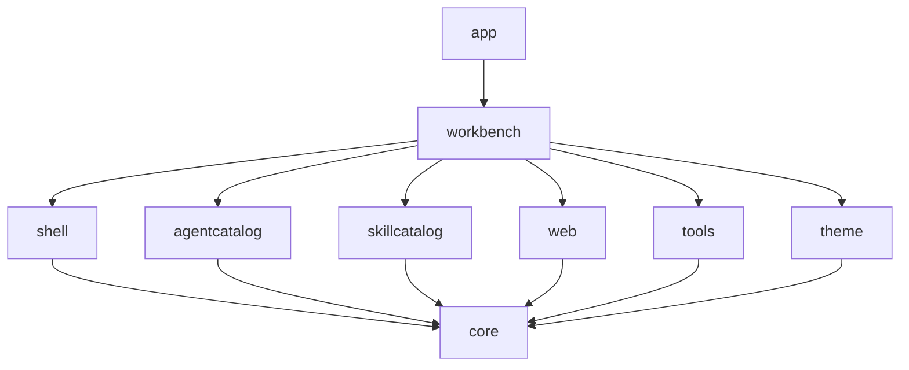
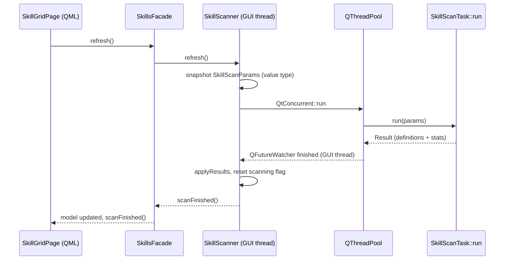

# C++ 设计

本页面向要新增或重构 C++ 代码的开发者。它说明库如何分层、为什么 QML 只与门面和模型交互、哪些类型可以跨过元对象边界、线程允许怎么用，以及新代码该放哪里。消费这些 API 的前端规则见[前端设计](前端设计.md)。

## L0 到 L3：分层与模块边界

库自底向上分四层，下图的箭头方向就是真实的依赖方向：`app` 依赖 `workbench`，`workbench` 依赖各领域模块与 `theme`，每个领域模块依赖 `core`。

- **L0** 是 `src/core/`（路径、JSON 存储、设置、日志、进程与脚本执行、HTTP 探测、插件宿主、图标解析、环境变量展开、文本助手、`OpResult`），外加只含头文件的插件 ABI `src/plugin_api/`。
- **L1** 是主题引擎 `src/theme/`。
- **L2** 是领域与 UI 框架模块：`src/agentcatalog/`、`src/skillcatalog/`、`src/web/`、`src/tools/` 与 `src/shell/`。
- **L3** 是应用层 `src/workbench/`。

领域模块之间零依赖，也都不依赖 `shell/` 或 `workbench/`。挂在 ctest 上的 `scripts/check-architecture.sh`（测试名 `check_architecture`）强制这一点：它的第一条规则 grep 每个领域模块的反向/横向 include，违反即构建失败。这就是为什么尽管打开 agent 的 Web UI 同时需要两边，`AgentsFacade` 也不能调用 `WebTabsFacade`；跨域动作住在 `awb_workbench` 里。完整的模块地图（含每个具体类落在哪一层）见[分层与依赖](分层与依赖.md)。

## 门面（Facade）模式

QML 只与门面和模型交互，不与别的东西交互。门面是一个 `QObject`，负责装配本模块内部的对象、粘合它们的信号、为 QML 保留一组稳定的 `Q_INVOKABLE` 方法与信号、并暴露模块的模型。每个领域一个门面，另加 shell 侧控制器与应用侧上下文：

- `agentcatalog::AgentsFacade` 持有 `AgentRepository`、`AgentStateStore`、`AgentModel`、`AgentRuntime`、`AgentScripts` 与 `AgentHealthMonitor`。
- `skillcatalog::SkillsFacade` 持有 `SkillModel` 与 `SkillScanner`。
- `tools::ToolsFacade` 持有 `ToolsStore`、`FileTreeModel` 与 `FileTreeFlatModel`。
- `web::WebTabsFacade` 持有 `WebTabsModel` 与 `WebSurfaceRegistry`。
- shell 侧，`ShellController` 持有窗口级状态，`UiServices` 持有通用 UI 操作，`NavigationModel` 是页面注册表与列表模型，`Notifications` 是 toast 队列。
- 应用侧，`WorkbenchContext` 是跨域意图与通用动作的唯一入口。

门面有两项职责容易被忽略。它**保留历史 Q_INVOKABLE 与信号名**——`AgentsFacade` 刻意保持 0.3.0 的 `launcher` 对象的 API 面，既有 QML 只需把前缀从 `launcher.` 改成 `agents.`。它也**为 QML 要绑定的东西派生带 `NOTIFY` 的属性**，而不是只暴露方法，因为对方法调用的绑定永远不会重新求值。`SkillsFacade::roots`、`WebTabsFacade::tabCount` 与 `NavigationModel::badges` 正为此存在。

**跨域动作属于 `WorkbenchContext`，不属于某个领域门面。** `AgentsFacade` 刻意没有 `openWeb`；打开 agent 的 Web UI 既需要该 agent 的 URL、又要驱动 `web` 与 `shell` 两个模块，因此它是 `workbench.openWeb(agentId)`。`WorkbenchContext` 是全工程唯一允许同时认识多个领域的层；它负责切页、开关 Web 视图、启动 agent、派发通知与复制文本。把这些知识集中在一处，才让领域模块彼此保持无知。

## 模型与角色契约

QML 消费的模型都是 `QAbstractListModel` / `QAbstractItemModel` 的子类。它们的 `roleNames()` 把 role 号映射到 delegate 看到的属性名，而这个映射是**对 QML 的公共契约**：名字与顺序都稳定，role 名会原样成为 delegate 的 `required property` 名。改名会让 role 与 delegate 静默脱钩。改动前先确认所有页面。

在用的 role 家族：

- `agentcatalog::AgentModel`：`agentId`、`name`、`command`、`webUrl`、`configDir`、`icon`、`color`、`cardColor`、`running`、`launching`、四条一次性命令（`installCommand`、`updateCommand`、`versionCommand`、`setupCommand`）、`installed`、`version`、`installing`、`setupDone`、`setupping`、`checkingVersion`、`consoleOutput`。
- `web::WebTabsModel`：`tabId`、`agentId`、`url`、`title`、`iconSource`、`color`、`surfaceKind`、`state`、`loadProgress`、`lastError`、`zoom`、`tabObject`。最后一个把活的 `WebTab` 对象交给 QML，让 surface 能直接绑它的 `Q_PROPERTY`。
- `skillcatalog::SkillModel`：`skillId`、`name`、`description`、`dirPath`、`skillFilePath`、`rootId`、`rootLabel`、`kind`、`pluginId`、`pluginVersion`、`lastModified`、`sizeBytes`、`extras`。
- `tools::FileTreeModel`（树）：`display`、`name`、`path`、`relativePath`、`isDir`、`suffix`、`iconSource`。`tools::FileTreeFlatModel`（QML 真正渲染的扁平投影）：`display`、`name`、`path`、`relativePath`、`isDir`、`iconSource`，外加扁平专属的 `depth`、`expanded`、`hasChildren`。两者都保留 `display`，让 delegate 仍然有默认的文本 role。
- `shell::NavigationModel`：`pageId`、`title`、`iconSource`、`source`、`section`、`order`、`badgeText`、`enabled`。
- `shell::Notifications`：`toastId`、`level`、`title`、`text`。

写任何「镜像另一个模型」的模型之前，值得先读 `FileTreeFlatModel`。它把树投影成线性列表，好让两个 Qt 版本共用同一份 `ListView` delegate，因为 Qt 5.15 没有 `TreeView`。它的 `data()` **显式映射每个转发 role**，而不是把 role 号直传给源模型。两份枚举到 `IsDirRole` 为止数值相同，但源模型在 `IsDirRole` 与 `IconRole` 之间多一个 `SuffixRole`，扁平模型没有，因此从那里起数值错位，直传会返回错误数据。镜像另一个模型的 role 时，镜像名字，然后手工映射数值。

## 值类型与元对象边界

项目里的小类型大多是没有任何元对象机制的普通结构体：`agentcatalog::AgentDefinition`（持久化字段）、`agentcatalog::AgentState`（运行期字段）、`skillcatalog::SkillDefinition`、`skillcatalog::SkillRoot`、`theme::ThemeFile`。它们在 C++ 内部按 `const &` 或值传递，在 QML 边界处转成 `QVariantMap` 快照，而不是注册成 gadget——`NavigationModel::page()` 返回页面描述符映射，`AgentModel::agent()` 合并定义与状态，`SkillsFacade::skill()` 返回 skill 映射。

`core::OpResult` 是例外：它是带 `ok` 与 `error` 属性的 `Q_GADGET`，因为 QML 要直接从 `Q_INVOKABLE` 的返回值（如 `UiServices::copyText`）上读这两个字段。类型只在 C++ 内部流动时用普通结构体；只有 QML 必须读返回值字段时才上 `Q_GADGET`，否则暴露 `QVariantMap`。

两者之间有一个陷阱。**`Q_GADGET` 返回类型必须在头文件里写全限定名。** `src/shell/UiServices.h`、`src/skillcatalog/SkillsFacade.h` 与 `src/tools/ToolsFacade.h` 都把返回类型写成 `awb::core::OpResult`，正因如此：Qt 5 的 moc 按书写形式记录类型名，而 QML 调用端按注册的 `QMetaType` 名（即类全名）解析。短名解析不到，调用抛「Unknown method return type」并静默失败——C++ 代码看起来完全正确。`app/main.cpp` 调 `qRegisterMetaType<awb::core::OpResult>()` 让该类型已知。

## 面向 QML 的 API 设计

- **默认异步**。面向 QML 的操作立即返回，结果经信号上报，例如 `refresh()` 之后是 `scanFinished()` / `refreshFinished()`。这不是装饰：它意味着以后把工作挪到工作线程时不用改一行 QML，`SkillsFacade::refresh()` 实际经历的就是这一步。
- **QML 要绑定的属性必须带 `NOTIFY`**。没有 notify 信号的 `Q_PROPERTY` 的绑定永不重新求值，而在绑定表达式里用 `Q_INVOKABLE` 只会求值一次、得到函数引用。状态栏曾因此不更新，这就是 `NavigationModel::badges`、`WebTabsFacade::tabCount` 与 `SkillsFacade::roots` 是带通知的属性而非方法的原因。
- **QML 要调的每个方法都必须 `Q_INVOKABLE` 或槽**，要赋值的每个属性都必须有 `WRITE`。这由构建期 `check_architecture` 规则 5 强制（失败表现见[前端设计](前端设计.md)）。

## 错误处理

当前的职责划分有两半。

- **模块内部**用抛异常表达可失败操作或可能缺失的值。编程规范明确拒绝用 `std::optional` 返回，因为调用方会忘记 `has_value()` 检查，失败就以空值静默传播、毫无诊断。完整表述见 `docs/standards/coding-standard.md`（中文版在 `docs/zh/standards/` 下）。
- **模块边界处、尤其面向 QML 时**，可失败的同步操作返回 `awb::core::OpResult`，即 QML 能直接读的 `{ ok, error }`。`UiServices::copyText`、`UiServices::openExternalUrl` 与 `ToolsFacade::addWorkspace` 是例子。异步工作则经信号上报失败。

唯一绝对的规则是：**绝不让异常跨过 C++/QML 边界。** QML 引擎无法捕获 C++ 异常，因此 QML 触碰的一切都必须用 `OpResult` 或信号。注意「异常 vs `OpResult`」的全局口径在项目里仍是开放问题——讨论它的两份文档并未完全一致，不应把它读成已定的统一政策。本页只描述代码今天的做法。

## 状态归属

分界是生命周期，不是方便与否：

> 跨页切换或跨重启要活下来的状态放进 C++ 模型或磁盘；只影响呈现的状态留在 QML。

具体地，内存态包括本次会话记账的 agent PID、从启动输出捕获的会话 URL、健康检查的运行标志、标签状态与提示词草稿缓冲。磁盘态包括 `agents.json`（agent 定义）、`settings.json`（应用设置）、`agent_state.json`（哪些 agent 做完了一次性 setup）、`tools.json`（工作区记忆与提示词草稿）与 skill 缓存。QML 属性用于浮层是否打开、当前高亮哪个过滤 facet 这类事情。逐文件清单（含数据目录的角色）见[状态与持久化](数据与状态.md)。

## 线程模型

GUI 线程拥有一切 QML 触碰的东西。后台工作严格只有一种模式：

1. GUI 侧协调者对象（活在 GUI 线程的 `QObject`）把输入快照成**值类型**；
2. 它把一个**纯静态函数**派发到线程池；
3. worker 只操作自己那份值类型副本，绝不碰协调者、`Settings` 或任何 GUI 对象；
4. `QFutureWatcher` 把结果交回 GUI 线程，协调者在那里更新成员并发信号。

`skillcatalog::SkillScanner` 与 `skillcatalog::SkillScanTask` 是基准实现。`SkillScanner` 活在 GUI 线程，持有根清单与最近一次结果；`SkillScanTask::run()` 是无状态静态函数，输入是 `SkillScanParams`——一个完全不含 `QObject` 指针的值快照。之所以必须快照，是因为 `core::Settings` 是 `QObject`、不能在工作线程里用，所以根清单在派发前被复制进值类型的 params。扫描经 `QtConcurrent::run` 投到全局线程池，`QFutureWatcher` 的 `finished` 信号回到 GUI 线程。

`core::Logging` 是同一原则在另一方向的应用。它装一个 Qt 消息处理器拼行并入队，由 spdlog 的后台线程完成写盘、轮转与 stderr 镜像。调用线程——通常是 GUI 线程——从不做 IO，因此日志量无法拖住它。一个后果是 `qInfo()` 返回时日志行不保证已落盘；退出路径上的 `Logging::uninstall()` 正是为此排空队列。

下图展示扫描的往返。

让这一切安全的规则写在编程规范里、值得重复：绝不从线程直接操作 GUI 控件。跨线程通信只有两种方式——信号槽连接（Qt 自动排队到接收者线程）或显式 `QMetaObject::invokeMethod`。每一行触碰 UI 的代码都住在主线程上运行的槽里。

## Qt 5 与 Qt 6 双版本策略

项目以 Qt 6.5 及以上为主线、Qt 5.15.16 LTS 为兜底。新增或修改的代码必须在两条路线上都能编译，而不是只保证你手上那条，版本判定一律走 `QT_VERSION_MAJOR` 或 `#if QT_VERSION`。

差异集中在两处，且不许散落：

- **构建期差异**在 `cmake/AwbQtCompat.cmake` 的包装函数里：组件改名、`qt_add_qml_module` 与生成的 qmldir 及 qrc、资源别名、`/utf-8`。
- **编译期差异**在用到的源文件就近，写成短小的 `#if QT_VERSION` 分支。

不要用 `setContextProperty` 或 QML 里的版本判断绕开差异。**兼容不等于降级**：Qt 6 有更好设施时就用它的最优实现，Qt 5 单独写一条显式降级分支，哪怕那条分支更朴素、能力略少。每个 agent 一个 WebEngine profile 的存储是同一思路在 API 层的体现，而 `WebEngineCompat` 桥是「吸收改名而不是把改名泄进 QML」的参考。

这条纪律之所以重要，是因为失败方式不对称。Qt 5 路线上通常是整页或整个表面加载失败或静默失效，而 Qt 6 构建与整套测试依旧全绿——所以在单一大版本上构建一次，证明不了另一个版本。

## 资源与注册

- **资源只能编进可执行文件。** 静态库里的 qrc 初始化器会被链接器丢弃，因此 `awb_add_resources` 调用写在 `app/CMakeLists.txt`，尽管图标与配置文件属于模块。模块自己的 `CMakeLists.txt` 只列 C++，绝不列 `.qml`。
- **QML 模块 `AgentWorkbench`** 由 `awb_add_qml_module` 生成（Qt 6 上是 `qt_add_qml_module`，Qt 5 上是生成的 qmldir 加 qrc）。其页面与组件 URL 形如 `qrc:/qt/qml/AgentWorkbench/<area>/<Name>.qml`，`<area>` 由 `app/CMakeLists.txt` 里的 `QT_RESOURCE_ALIAS` 决定。
- **纯 C++ URI `AgentWorkbench.App`** 承载用 `qmlRegisterSingletonInstance` 注册的单例，那里类型名必须大写。页面实际使用的小写别名层见[前端设计](前端设计.md)。

因此新增或移动一个 `.qml` 文件意味着同时改两份清单：`app/CMakeLists.txt` 里对应的区域清单（`_shell_qml`、`_component_qml`、`_agentcatalog_qml`、`_skillcatalog_qml`、`_web_qml`、`_webengine_qml`、`_tools_qml`），以及文件含 `qsTr()` 时的 `cmake/AwbTranslations.cmake` 的 `AWB_TS_SOURCES`。

## 命名、注释与日志

完整风格规则在 `docs/standards/coding-standard.md`（中文版 `docs/zh/standards/coding-standard.md`），新代码必须遵守。各一句话概括：注释用中文，而标识符、面向用户的字符串、日志与提交信息用英文；头文件里的成员函数只写简短普通注释，`.cpp` 里每个函数实现写完整 Doxygen 块；一律用大写 Qt 宏（`Q_OBJECT`、`Q_SIGNALS`、`Q_SLOTS`、`Q_EMIT`）；单语句 `if` 也带花括号；非 const Qt 容器经 `std::as_const()` 范围迭代；应用级事件经 `src/core/Logging.h` 的 `AWB_INFO` / `AWB_WARNING` 家族记录，模块内部消息用带 `[module]` 前缀的 `qInfo()` / `qWarning()`。

## 新代码放哪一层

| 你要加的东西 | 它属于哪里 |
|---|---|
| 一个新的功能页 | 它服务的领域模块（skill 的新页放 `src/skillcatalog/`，其 QML 放该模块的 `qml/` 下），由 `workbench::BuiltinPages` 向 `NavigationModel` 注册 |
| 一个不绑定单一领域的页 | 若是窗口框架类 UI 放 `src/shell/`，若协调多个领域放 `src/workbench/` |
| 一个跨域动作 | `workbench::WorkbenchContext`（如 `openWeb`），绝不放单个领域门面 |
| 一个纯工具函数 | `src/core/`——并让 `src/core/` 不沾 Qt Quick、QML 与 WebEngine，`check_architecture` 规则 4 强制这一点 |
| 主题令牌或主题加载行为 | `src/theme/` |
| 一个共享 QML `A*` 组件 | `src/shell/qml/components/`，然后把两份清单都登记上（见[前端设计](前端设计.md)） |
| 一个模块共享的值类型 | 放该模块其它类型旁边；是普通结构体，除非 QML 必须读它的字段——那就上 `Q_GADGET`（见上） |

## 相关文档

- [分层与依赖](分层与依赖.md)——完整模块地图，每个具体类的落位。
- [状态与持久化](数据与状态.md)——内存态与磁盘态逐文件划分。
- [前端设计](前端设计.md)——QML 如何消费这些模型与门面。
- `docs/standards/coding-standard.md`——文件与命名规则、Qt 最佳实践与注释规范全文。
