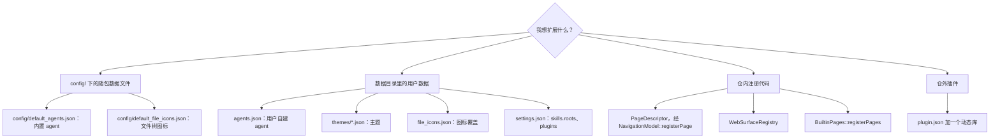

# 扩展点

本页面向想扩展 AgentWorkbench 的人——新增一个 agent、一个主题、一种文件类型图标、一个 Skill 扫描根、一个侧栏页面、一个 Web surface，或发布一个插件。它只回答一个问题：**这个软件能从哪些地方被扩展，每种扩展放在哪。**

## 扩展哲学：配置驱动优先，插件兜底

原则很简单：**能用数据表达的就用数据——改配置文件；配置文件承载不了的，才写仓内代码；只有必须在本仓库之外交付的，才写插件。**

`config/` 下的随包 JSON 是内置默认值；同样的形状可以在数据目录（`core::Paths::dataRoot()` 返回的根）里覆盖，无需重新编译。代码级注册（新增一个侧栏页面或一种 Web surface）是内建的扩展点；插件 ABI 则服务于必须以独立二进制交付的扩展。

下面这张图把「我想扩展什么」分派到四类扩展点。

## 扩展现有 agent 列表（数据，不是代码）

一个 agent 就是一个 JSON 对象，没有任何 agent 定义写在 C++ 里。内置定义只有一个来源——`config/default_agents.json`，编译进二进制后是 `:/config/default_agents.json`。你自己添加的则写在 `<data directory>/agents.json`，两者在每次启动时合并。

`AgentRepository::load()` 同步完成合并：id 命中内置的条目被随包定义整体替换，你自建的条目按原有顺序排在内置之后，根级 `removed` 数组里的 id 保持删除状态，`color` 为空的 agent 从当前主题取一个色板颜色。只要有任何变化，合并结果就写回磁盘。

由此派生出两个后果，二者都是有意为之：

- **在设置页修改内置 agent（比如端口）只在本次运行内有效。** 下次启动会被 `config/default_agents.json` 覆盖。要持久就改那个文件并重新编译。
- **自建 agent 必须使用非内置的 id**，否则下次启动会被随包定义覆盖。

`AgentRepository::save()` 便于 diff：当没有自建 agent、也没有删除记录时，定义数组与随包数组相等，文件按随包资源**逐字节**写回（`JsonStore::writeBytes`），因此干净安装不产生虚假改动。一旦你新增了 agent 或删除了内置 agent，才改为写常规的格式化对象（含 `agents`，若 `removed` 非空则一并写出）。

agent 条目的完整字段表见[配置参考](../configuration.md)，本页不重复。

## 扩展文件类型图标（数据）

文件树的图标映射是数据而不是代码。`config/default_file_icons.json` 含三张查找表加一个兜底：

| 表 | 键 | 示例 |
|---|---|---|
| `fileNames` | 完整文件名，小写 | `cmakelists.txt` |
| `suffixes` | 后缀，小写 | `qml` |
| `folderNames` | 目录名，小写 | `src` |
| `defaults` | — | 文件与目录的兜底图标 |

`tools::FileIcons` 解析一个文件时先查完整文件名，再查后缀，最后用默认图标；目录直接查 `folderNames`，再退回目录默认图标。查表大小写不敏感，所有值都经 `core::IconResolver` 归一，坏值退回默认图标而不是留空。

你可以在 `<data directory>/file_icons.json` 里覆盖或追加内置表：用户文件叠加在内置表之上，同名键用户赢（`FileIcons::loadUserFile()`）。

加一种图标意味着三处改动、零行代码：往 `icons/filetypes/`（或 `icons/foldertypes/`）放一个 SVG，往 JSON 表里加一行，并在 `app/CMakeLists.txt` 的资源清单里登记这个 SVG。这里刻意**不在 C++ 或 QML 里写后缀判断**——如果你发现自己正在写，那么该条目应该进表。

## 扩展主题（数据）

一个主题就是 `<data directory>/themes/` 下的一个 JSON 文件。与内置主题同 `id` 的用户主题覆盖内置主题，否则就是新增。文件名必须等于主题的 `id`——不符时 `ThemeLoader::parse()` 会告警并跳过整个文件。

缺失的 theme token 回退到同 `variant` 的内置主题（深色为 `mocha-dark`、浅色为 `latte-light`），非法颜色与数值同样如此，未知键告警后忽略。`ThemeRegistry` 用 `QFileSystemWatcher` 监视用户主题目录，因此**保存主题文件即刻热重载**，无需重启。

编辑流程与完整 token 清单见[配置参考](../configuration.md)；主题引擎如何加载、校验与热重载一个文件见[主题引擎](../development/theme-engine.md)。

## 扩展 Skill 扫描根（配置）

Skill 扫描从 `settings.json` 的 `skills.roots` 读取扫描根。**空数组表示使用内置默认清单**（`SkillRoots::defaults()`——通常的 `~/.agents/skills`、`~/.claude/skills`、`~/.codex/skills`、ZCode 插件缓存以及项目自身的 skill 目录）。**非空数组会完全取代**这份默认清单，而不是在其上追加。

每个条目是 `{ "id", "label", "path", "kind", "enabled" }`（内部结构 `SkillRoot` 还带 `recursive` 与一个 `dedupeScope`）。路径支持 `~`、`%VAR%` 展开与通配符，并且**原样存储**：展开由扫描器在扫描时完成，展开后的形式绝不回写 `settings.json`。这正是可移植配置保持可移植的原因。

扫描行为——递归深度、插件缓存去重、首屏缓存——见 [Skill 浏览](../development/skill-browser.md)。

## 注册一个页面（内建扩展点）

一个工作区页面由 `awb::shell::PageDescriptor` 描述，经 `awb::shell::NavigationModel::registerPage()` 注册。shell 本身不认识 agent、Skill 或 Web——它只渲染拿到的描述符，这正是内置页面与插件页面走同一条路径的原因。

| 字段 | 类型 | 默认值 | 含义 |
|---|---|---|---|
| `id` | string | — | 注册键；`NavigationModel` 按它查重与检索 |
| `title` | string | — | 英文源串，在展示边缘翻译 |
| `iconSource` | string | — | 图标 URL，如 `qrc:/icons/terminal.svg` |
| `source` | string | — | 页面 QML URL，如 `qrc:/qt/qml/AgentWorkbench/agentcatalog/AgentGridPage.qml` |
| `section` | string | `main` | 侧栏分节：`main`、`extensions` 或 `system` |
| `order` | int | `0` | 节内排序键；同分保持注册顺序（稳定排序） |
| `badgeText` | string | 空串 | 侧栏徽标文本；空串 = 无徽标 |
| `enabled` | bool | `true` | 为 false 时侧栏不显示该页 |
| `keepAlive` | bool | `false` | 为 true 时页面实例化一次，切走只隐藏（见下） |

`section` 决定页面落在哪里：`main` 是日常分组，`extensions` 是插件贡献的页面所去之处，`system` 钉在侧栏底部。内置的 Settings 页注册在 `system`。

`BuiltinPages::registerPages()` 是声明内置页面的唯一位置——launcher（`agents`）、Web（`web`）、Skills（`skills`）、Agent Tools（`tools`）与 Settings（`settings`）。新增一个内置页面就在那里加。

`keepAlive` 不是免费午餐。常驻页面只实例化一次并在切页后存活，Workspace 仅是隐藏它。这对状态搬不进 C++ 的页面是必需的——Web 页持有 `WebEngineView`，销毁一个就会让整个 agent Web UI 重载。代价是：

- 页面常驻，即使显示的是别的页面，它也在消耗资源；
- 它隐藏时全局快捷键仍然存活，因此必须在非当前页时自行禁用（Web 页把它们门控在 `nav.currentPageId` 上）；
- 它以 `0x0` 创建、变可见后才拿到真实尺寸，必然触发一次重排——绑定 `height` 而不是 `implicitHeight` 的组件可能因此被压成 0。

## 注册一个 Web surface（surface kind）

**surface** 是呈现 agent Web UI 的一种方式。`web::WebSurfaceRegistry` 把 surface 的 `kind` 映射到实现它的 QML 组件 URL。目前存在两种：

- `external` **永远存在且没有 QML 组件**。注册表的构造函数以空 URL 把它插入；它的语义是「把 URL 交给系统浏览器」。它是让应用在完全没有内嵌引擎时仍可用的兜底。
- `embedded` 在构建包含 WebEngine 时由 `WebEngineSurfaceProvider` 在构造函数里登记，指向 `qrc:/qt/qml/AgentWorkbench/web/WebEngineSurface.qml`。

`WebTabsFacade::engineAvailable()` 字面上就是「`embedded` 这个 kind 是否已登记」，未登记时设置页把嵌入选项置灰。当 `web.surface` 请求 `embedded` 而该 kind 未登记时，`openTab()` 记一条警告并降级为 `external`，而不是开一个空白标签。

插件可经 `PluginServices::addWebSurface(kind, componentUrl)` 贡献一种额外的 surface，它转发到同一个注册表。贡献的 kind 若组件 URL 为空，则该 kind 的行为与 `external` 相同——如何呈现由呈现侧决定。

## 插件 ABI（实验性）

插件是唯一在本仓库之外交付的扩展点。契约是 `src/plugin_api/PluginApi.h`，当前版本为 `awb::plugin::ApiVersion`（0.4.0 为 `1`）。**任何破坏性变更都必须递增这个常量**——版本不匹配的插件会被宿主拒绝。

插件是一个动态库，导出两个 `extern "C"` 符号，以 `AWB_PLUGIN_EXPORT` 标注：

- `awb_plugin_api_version()` 返回插件编译时使用的版本；
- `awb_plugin_register(Services *)` 完成注册，成功返回 `0`（其它值会让宿主记日志并忽略该插件）。

`Services` 接口是插件触碰宿主的唯一途径：

| 方法 | 用途 |
|---|---|
| `registerPage` / `unregisterPage` | 侧栏页面，走与内置页面相同的路径 |
| `addWebSurface` | 贡献一种额外的 Web surface kind |
| `dataDir` | 该插件私有的可写目录 |
| `log` / `notify` | 应用日志一行与一条 toast 通知 |
| `themeColor` | 只读 theme token 访问，返回 `"#rrggbb"` |
| `settingsValue` | 只读访问一个小范围设置白名单 |

发现逻辑扫描 `<data directory>/plugins/*/plugin.json`。读 manifest 从不加载代码，所以设置页能列出所有插件——包括未启用的。**插件默认禁用。** 总开关是 `plugins.enabled`，`plugins.disabledIds` 列出逐个的退出项；库只在启动时装载一次，因此改动这两者都要重启后生效。

装载要过两道独立的版本校验。manifest 声明的 `apiVersion` 必须与 `ApiVersion` 一致，**并且**库实际导出的 `awb_plugin_api_version()` 也必须一致；陈旧的 manifest 无法把不兼容的二进制偷运进来。任何失败——manifest 不可读、入口符号缺失、加载出错、版本不匹配，或 `awb_plugin_register` 返回非零——都**记日志后跳过**。插件永远不能阻止应用启动，其它插件也不受影响。

加固约束来自信任模型——**插件跑在应用进程内，没有沙箱**，所以只启用你信任的插件：

- 只有 Qt 值类型跨过 ABI 边界；宿主的 C++ 类绝不暴露；
- 插件不能写 `agents.json` 或 `settings.json`；主题与设置访问是只读的，`settingsValue` 只服务少数几个键（`appearance.theme`、`window.title`、`web.surface`、`locale.override`）；
- 来自 manifest 的插件 id 在用于路径前会被安全化（`PluginServices::dataDir`）。

含完整示例的插件作者指南见[插件](../plugins.md)。

## 刻意不做的扩展点

有些看起来可以配置的东西，是刻意不可配置的：

- **不在 C++ 中硬编码 agent 定义。** 它们住在 `config/default_agents.json`；硬编码会让内置集合绕开每个用户 agent 都要走的同一套合并与 diff 逻辑。
- **不用 `setContextProperty`。** 全局对象按带类型的单例注册，才能对工具可见并在构建期受检。
- **不往 `AgentWorkbench` URI 手工注册单例。** 那个 URI 是带 `qmldir` 的 `qt_add_qml_module` 模块，手工注册会以受保护模块报错。应用级全局对象一律注册在纯 C++ 的 `AgentWorkbench.App` URI 上。
- **不给 `settings.json`/`agents.json` 加迁移代码。** 缺键就地取默认值，未知键记警告。加一个键就是加一个默认值；原因见[数据与状态](state-and-persistence.md)。

## 相关文档

- [数据与状态](state-and-persistence.md)——这些扩展点所落脚的数据存在哪里。
- [配置参考](../configuration.md)——`agents.json` 与 `settings.json` 的完整字段表。
- [插件](../plugins.md)——如何编写、打包并启用一个插件。
