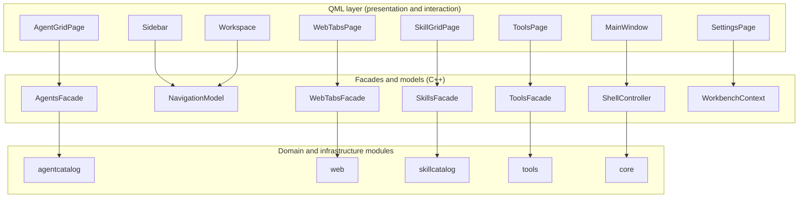
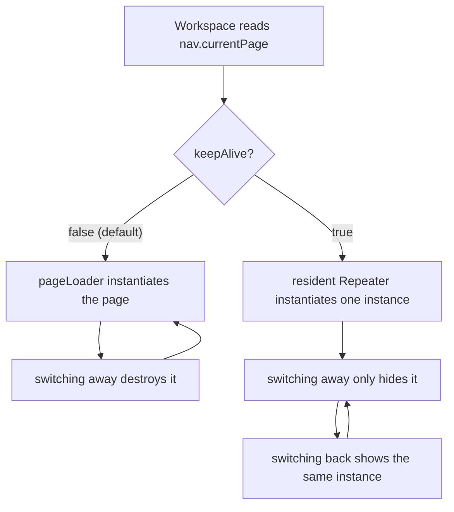

# 前端设计

本页面向新加入项目、需要新增或修改页面的开发者。它说明 QML 层负责什么、窗口是如何组装的、新页面必须遵守哪些规则，以及 QML 与 C++ 的边界划在哪里。视觉清单本身在 `designs.md`；本文解释那些规则背后的理由，以及截图上不可见的契约。

## 前端是什么、边界在哪

QML 只是呈现与交互层。所有业务状态——哪个 agent 在运行、开着哪些 tab、过滤后的 skill 列表、记住的工作区——都存在于 C++ 里，挂在门面对象或模型后面。页面经门面读状态、调它们的 `Q_INVOKABLE` 方法，并把模型渲染成 delegate。页面不读写文件、不启动进程、也不直接调 `Qt.openUrlExternally`；这些动作各有门面上的一个入口。

根对象是 `src/shell/qml/MainWindow.qml` 的 `ApplicationWindow`。它持有布局骨架、全局快捷键、退出确认弹窗与 toast 宿主，并声明页面用来访问 C++ 的小写别名。页面经 `Workspace` 的 Loader 从 `qrc:/qt/qml/AgentWorkbench/<area>/<Name>.qml` 装载。

下图说明一个页面和谁对话，以及这些门面如何抵达 C++ 模块。每条箭头都指向真实的依赖方向：QML 依赖门面，门面依赖领域模块。

这条边界带来的结果是：页面随时可以被销毁重建而不丢任何重要的东西，因为它并不持有任何重要的东西。正是这个性质让下面的页面生命周期规则成立。

## 窗口骨架不可协商

应用是左侧边栏、右侧工作区加一条底部状态栏，由 `src/shell/qml/MainWindow.qml` 从 `Sidebar.qml`、`Workspace.qml` 与 `StatusBar.qml` 组装。完整解剖见 `designs.md` 第 1 节；页面作者不可与之相争的部分是：

- **侧栏只回答「去哪里」**。它渲染 `NavigationModel`，不是业务数据。页面绝不往侧栏塞业务动作。
- **页面的位置由 `section` 决定，不由布局代码决定**。注册页时把 `PageDescriptor::section` 设为 `main`、`extensions` 或 `system`，落点就已定死。`system` 页钉在侧栏最底部，渲染为纯图标按钮，标题由 tooltip 承载、当前目的地经 `AIconButton.active` 填充。新增一个钉底页（About、日志查看器之类）意味着注册成 `system`，而不是另写布局 QML。
- **侧栏固定为 header、可滚动的工作流列表（`main` 与 `extensions`，两者间有分割线）、一条分割线、钉底 footer**。footer 里 `system` 页与折叠手柄同排：展开时图标在左、手柄在右，收起时垂直堆叠并居中。
- **主区外围留白统一 `theme.spacingL`**。不要按页自造边距。
- **页面工具栏是可选的**。有页面级动作或过滤需求的页面渲染 `PageHeader`；空状态页或简单列表页可以没有。

骨架里有两处尺寸细节是承重的，很容易再踩：`Sidebar.qml` 经 `implicitWidth` 而不是 `width` 提供宽度，因为它由 `MainWindow.qml` 的 `RowLayout` 接管——直改 `width` 会让工作区冻在旧尺寸，并在折叠后的侧栏旁留出空隙。`StatusBar.qml` 出于同样原因用 `implicitHeight` 提供高度：直接绑 `height` 会与布局的重分配互相触发，Qt 5 上布局引擎因此报 recursive rearrange。

## 页面生命周期

未声明 `keepAlive` 的页面由 `src/shell/qml/Workspace.qml` 的 `Loader` 承载。切到别的页会销毁该实例，切回来再从 QML 源重建。这是默认契约，意味着任何必须熬过切页的状态都归 C++，而不是 QML 属性。

唯一例外是把 `PageDescriptor::keepAlive` 设为真的页。目前只有 Web 页这么做。这种页由 `Workspace.qml` 里一个常驻 `Repeater` 实例化一次，切走只隐藏，因为 `WebEngineView` 的状态搬不进 C++，销毁它会让整页重载。常驻带来两条规则：

- 页面声明的每个 `ApplicationShortcut` 都会活过切页，因此非当前页时必须自行禁用。`WebTabsPage.qml` 正是为此暴露 `pageCurrent` 属性，并把 `Ctrl+W`、`F5`、`F12` 与缩放快捷键都门控在它上面。
- 页面以 0x0 创建、变可见后才拿到真实尺寸，因此必然经历一次重排。布局子项必须经 `implicitWidth` / `implicitHeight` 提供尺寸；直接绑 `width` / `height` 会被这次重排覆盖。Web 页的 tab bar 曾因此整条消失。

下图说明两种生命周期的差异。

## 组件货架（Reuse-first）

动手写任何新 UI 元素之前，先翻货架。`src/shell/qml/components/` 下的组件是唯一合法的通用件，页面手写其中任何一个都算缺陷。下表覆盖货架上的每个文件。

| 组件 | 用途 | 什么时候用 |
|---|---|---|
| `AButton` | 文字按钮 | 一切文字按钮。变体有 `primary`、`secondary`、`ghost`、`danger`；`primary` 可经 `accentColor` 注入运行期颜色（如 agent 自身颜色）。 |
| `AIconButton` | 图标按钮 | 一切图标按钮。tooltip 必填。导航场景用 `active` 填充当前目的地。 |
| `ATextField` | 单行输入框 | 一切文本输入，含 `invalid` 红边与 2px 焦点环。高度 32，与 `AButton` 对齐。 |
| `ATextArea` | 多行编辑器 | 一切多行文本输入。它有意使用 surface-alt 背景、不同于 `ATextField`，因为亮色主题下长文编辑区需要更白的底。 |
| `AFormLabel` | 表单标签行 | 字段标签，带必填星号与信息 tooltip。 |
| `ASearchField` | 搜索框 | 列表过滤输入，带图标与清除键。 |
| `AComboBox` | 下拉选择框 | 一切下拉选择。`Default`/`Basic` 样式的调色板硬编码为浅色系，深色主题下不可读，所以必须用主题化的这个。在使用点覆写 `contentItem` 或 `delegate` 来定制弹层。 |
| `AColorField` | 颜色输入行 | 一切「#RRGGBB 输入 + 色卡」的表单字段。文本框是真相源；点色卡弹 `AColorPicker`。 |
| `AColorPicker` | 颜色选择器 | Office/WPS 式弹层：主题色 10 列含深浅阶、固定标准色、自定义色（最近 10 个为进程内记忆）。经 `openBelow(锚点)` 弹出。 |
| `AColorSwatch` | 色块 | 选择器网格的一格，或迷你色卡。空值 = 中性底 + 斜线；checked 环 + 勾标记当前色。 |
| `ACard` | 卡片容器 | 卡片外框（surface、圆角、边框、hover）。目前零使用——agent 卡与 skill 卡自带状态化边框着色——因此把它当作「可用但未验证」，不要当默认。 |
| `ASpotlight` | 指针聚光覆盖层 | 玻璃卡的悬停强调：跟随指针的光斑加渐变描边流光。宿主提供 `active`（合并后的悬停判据）与 `spotX` / `spotY`；组件自身不接收输入、不探测 hover。 |
| `AWorkspaceGlow` | 页面底衬光斑 | 玻璃卡片网格页的最底层：两团极低透明度的大径向光斑，让半透明卡有可透的光。声明在页面根、先于内容；纯展示无输入。 |
| `AListRow` | 列表行 | 设置页/列表的单行：圆角矩形 + 注入式内容 `RowLayout`，默认高 48。 |
| `APill` | 徽标胶囊 | 计数、来源标签。 |
| `AEmptyState` | 空状态 | 「无数据/无匹配」的整块占位。`extra` 插槽可放列表等附加内容。 |
| `ADialog` | 模态弹窗骨架 | 一切模态弹窗。`danger` 变体给红标题 + 红边框。 |
| `AConfirmDialog` | 确认弹窗 | 危险/常规确认，确认 + 取消双按钮；`detailData` 插槽放上下文警告。 |
| `AAlertDialog` | 提示弹窗 | 错误/通知：消息 + 可滚动 mono 详情 + 关闭按钮。 |
| `ASectionHeader` | 设置分组标题 | 表单/设置页分节；`extra` 尾部动作右对齐。 |
| `AStatusDot` | 状态点 | on/off 指示。尺寸/颜色/tooltip 可配，永不只靠颜色。 |
| `AToastStack` | 通知栈 | 右下角 toast。`MainWindow.qml` 经 `Toasts.qml` 托管它。 |
| `AMenu` | 上下文菜单底座 | 一切菜单。玻璃表面、外扩软阴影、顶部反光纱。 |
| `AMenuItem` | 菜单条目 | `AMenu` 的条目，16px 图标槽恒占位，accent 半透明圆角悬停块。 |
| `AMenuSeparator` | 菜单分组线 | `AMenu` 内分组。 |
| `AgentAvatar` | 图标 + 状态角标 | agent 的可视化入口：图标加运行/停止角标。 |
| `AScrollBar` | 主题化滚动条 | 以 `ScrollBar.vertical: AScrollBar {}` 附加到 `ScrollView` 或裸 `Flickable`。内容溢出时它始终可见；`Basic` 样式自带的滚动条是 6px、停止滚动即淡出的临时条，用户会读成「这页滚不了」。 |
| `PageHeader`（非 `A*`） | 页面标题栏 | 页面顶部：标题、副标题与右对齐的页面动作插槽。 |

与货架配套的规则：

- **绝不手写裸 `Button` + 自定义 background**。用 `AButton` 或 `AIconButton`。`primary` 需要着色就设 `accentColor`；缺变体（比如某个尺寸）就给 `A` 组件加属性，而不是旁路它。唯一例外是页面私有的微型交互件，如 `AgentCard` 卡内的 16px 下载/更新/关闭角标。
- **绝不手写弹窗骨架**——不要 `Popup` 加 overlay 背景加 `ColumnLayout` 加标题/正文/按钮那一套。确认走 `AConfirmDialog`，错误/通知走 `AAlertDialog`，特殊形态（退出确认的三按钮）直接基于 `ADialog`。
- **绝不手写菜单**。一律 `AMenu` 加 `AMenuItem`，需要分组时加 `AMenuSeparator`。
- **不重复实现状态点**，也不手写主题化文本框。
- 新的通用件放 `src/shell/qml/components/`、名字以 `A` 开头、只用 theme 令牌，且必须**同时登记** `app/CMakeLists.txt` 的 `_component_qml` 与 `cmake/AwbTranslations.cmake` 的 `AWB_TS_SOURCES`（有 `qsTr()` 时）。页面私有件留在各模块 `qml/` 下，不进货架。

## AMenu 家族是唯一菜单形态

Qt Quick Controls 的 `Default`（Qt 5）与 `Basic`（Qt 6）样式把菜单高亮色硬编码在 `palette.light`（近白）上，与主题无关。深色主题下被高亮条目的文字因此完全不可读——0.4.0 的实际症状——这就是全仓 5 处菜单全部迁到 `AMenu`、`AMenuItem`、`AMenuSeparator` 的原因。`AMenu` 完全自绘、颜色只来自 theme 令牌，没有可争的调色板。

视觉契约是半透明 `surfaceBg`（深色 0.90、浅色 0.95）让下层内容隐约透出，外扩两层 `overlayBg` 软阴影，内缘 1px 高光只画在深色主题。Qt Quick 没有 backdrop blur，真模糊跨 Qt 大版本不可移植，因此半透明 + 顶部反光纱是有意的折衷。不要为了真模糊引入 `QtGraphicalEffects` 或 `Qt5Compat`。条目恒占位 16px 图标槽，使有图标与无图标的条目对齐（Windows 惯例）；悬停是内缩 2px 的 accent 半透明圆角块，不是整行换底色。进出场为淡入加 0.95 到 1 的微展开（`durationFast`），退出只淡出。

顶部工具栏与条目混排是工具行的受支持形态：把普通 `Item` 声明为菜单的第一个子项即可，因为菜单的 `contentItem` 按声明顺序竖排直接子项。它不带背景、图标左对齐，并与条目区之间用 `theme.separator` 极淡分隔线区分。`src/tools/qml/MarkdownContextMenu.qml` 是参考实现。弹出前把菜单要操作的目标设进菜单属性，所有动作统一经 `run()`：先关菜单、把焦点还给目标、再执行；否则输入与选区写入会落到菜单而非目标上。

菜单内没有指针光影跟随。那是 `ASpotlight` 在卡片上的职责，菜单不需要。

## 视觉语言

- 页面与组件只用 `theme.*` 语义令牌。字面颜色——`#rrggbb`、`#rgb`、或由数字字面量构造的 `Qt.rgba()`——会被构建期 `check_architecture` 规则 2 拒绝。`"transparent"` 与 `Qt.rgba(theme.accent, …)` 这类表达式允许。
- 深浅两套主题都必须可读。改完 UI 切到另一套主题检查一遍。选区颜色来自 `theme.selectionBg` 与 `theme.selectionText`；文本组件已内建它们，页面不得自行设置 `selectionColor` 或 `selectedTextColor`。
- **状态永远不只靠颜色表达**。状态点或徽标同时带 tooltip 或文字，兼顾色弱用户与两套主题。
- 动效时长只用 `theme.durationFast` 与 `theme.durationNormal`，不发明新的时长。

## 玻璃卡配方

本项目的卡片是磨砂玻璃，不是实色面。`AgentCard` 与 `SkillCard` 是基准实现，新卡片复刻同一套配方：

1. **页面底衬**。玻璃「透」的前提是页面有光可透。卡片网格页最底层铺 `AWorkspaceGlow`：两团极低透明度的大径向光斑（accent 加一个 agentPalette 暖色），静态、只在主题或尺寸变化时重绘。声明在页面根、先于一切内容。
2. **玻璃底**。`theme.alpha(surfaceBg, 0.62)`，hover 时升到 `theme.alpha(hover(surfaceBg), 0.78)`。半透明让底衬光斑透出，`theme.hover` 让每套主题各自往可读方向移动。带 per-卡语义色的卡片改用该色做 tint。
3. **色纱**。一层极淡的纵向渐变罩（accent 或语义色），外加一层 hover 才淡入的加深纱。近似斜向纱用纵向 `Gradient` 即可，不为精确角度引入效果模块。
4. **内缘高光**。整圈内缩 1px 的 `theme.alpha(textOnAccent, 0.07)` 描边，只画深色主题，因为浅色下白高光不可见。
5. **悬停聚光**。`ASpotlight` 让光斑跟随指针并描边流光。`active` 绑宿主**合并后的**悬停判据，`spotX` / `spotY` 绑 `HoverHandler` 的指针位置。
6. **边框**。`borderSubtle` 到 hover 的 `borderStrong`，用 `ColorAnimation` 配 `durationFast` 过渡。运行态与错误态另有语义色边框。
7. **悬停升举**。`Translate` 变换（y 上移 `spacingXs`）加 `z: 1`，按压时落回。只做视觉变换，**绝不改 `x` / `y` 本体**，因为网格与布局引擎写的正是它们。升举幅度压在卡片间距之内。
8. **批量渲染**。百级卡片的网格必须用 `GridView` 加惰性实例化、`reuseItems` 与 `cacheBuffer`。`Flow` 加 `Repeater` 会在创建时同步实例化全部 delegate；由于每张卡自带浮层与菜单，151 个 skill 实测换页冻结约 2s。卡内重量级 `Popup`（详情浮层）经 `Loader` 惰性创建。cell 尺寸 = 卡 + 间距，列数随视口宽度自适应，`cellWidth` 取整以防浮点溢出多算一列、出横向滚动条。

两套主题都要检查：浅色的纱密度与高光留空规则就是为此设的。

## 规模与性能

性能规则是配方的推论，对可能长大的集合不是可选项：

- **百级集合用 `GridView` 加 `reuseItems` 与 `cacheBuffer`**。skill 网格是参考；launcher 网格仍用 `Flow` 加 `Repeater`，因为它只有几个 agent，几个是可以的。规则在条目数能到百级时才咬人。
- **重量级 `Popup` 经 `Loader` 惰性创建**，从未展开的卡片就不必为浮层付出代价。
- **`modelReset` 会销毁重建整页 delegate**，因此是代价极高的信号。`SkillModel::setSkills` 在扫描结果与现状一致时短路跳过 reset，正是为了缓存恢复后的后台扫描不把整张网格拆掉。能避免 reset 的模型就应该避免。

## QML 与 C++ 的契约

这一节是前端设计里出过最多静默缺陷的部分，因此全部按规则陈述。

**注册**。C++ 全局对象用 `qmlRegisterSingletonInstance` 注册在纯 C++ URI `AgentWorkbench.App` 上，且类型名必须大写，因为 Qt 6 拒绝小写单例名。不要用 `setContextProperty`，也不要往 `AgentWorkbench` URI 手工注册单例：那个 URI 是 `qt_add_qml_module` 生成、带 `qmldir` 的 QML 模块，在那里注册会报 protected module。构建日志里 `AgentWorkbench.App` 的 unresolved-import 警告是 qmlcachegen 对纯 C++ URI 的预期现象，不要为消除它去改注册设计。

**小写契约名**。页面绝不直接用大写名（`MarkdownEdit` 除外，见下）。`src/shell/qml/MainWindow.qml` 根部声明小写别名桥接到单例，所有后代都经这个根解析：

| 别名 | 单例 | 页面用它做什么 |
|---|---|---|
| `theme` | `Theme` | 主题令牌与派生色 |
| `nav` | `NavigationModel` | 页面注册表、当前页与徽标 |
| `shell` | `ShellController` | 窗口级状态：侧栏折叠与宽度、窗口尺寸、上次页面 |
| `ui` | `UiServices` | 剪贴板、外部 URL、文件管理器、原生目录与颜色对话框 |
| `toasts` | `Notifications` | 推送 toast 通知（`toasts.notify(…)`） |
| `agents` | `AgentsFacade` | agent 定义、模型与启动器动作 |
| `web` | `WebTabsFacade` | 标签生命周期、激活标签与表面 kind |
| `skills` | `SkillsFacade` | skill 模型、扫描状态与根配置 |
| `tools` | `ToolsFacade` | 工作区记忆、提示词草稿与文件树 |
| `workbench` | `WorkbenchContext` | 跨域意图与通用动作 |
| `environment` | `EnvironmentService` | 状态栏的 Python 与 Node.js 检测 |

`MarkdownEdit` 注册在同一个 URI 上但没有小写别名，编辑器的右键菜单直接用大写名。`WebProfiles` 与 `WebEngineCompat` 同样只为内嵌表面内部使用而注册。

**可调用性**。QML 要调的每个方法都必须 `Q_INVOKABLE`（或槽/信号），要赋值的每个属性都必须有 `WRITE` 访问器。裸方法不在 meta-object 方法表里，调用时抛「…is not a function」；只有 getter 的 `Q_PROPERTY` 则抛「read-only property」。按页面加载的冒烟测试从不点击，因此对它们不可见；`check_architecture` 规则 5 在构建期挡，`tst_shell::testQmlCalledMethodsAreInvokable` 用 `QMetaObject::invokeMethod` 复现 QML 的真实解析路径。

**delegate 的 role**。delegate 的 `required property` 按名字与模型的 `roleNames()` 匹配：属性名必须与 role 名完全一致。任一侧改名都会让 delegate 拿不到 role、实例静默不渲染。当 delegate 根是一个有同名视觉属性的类型时还有第二个陷阱。`WebTabsPage.qml` 的 tab delegate 有一个名为 `color` 的 role；若根是 `Rectangle`，该属性会遮蔽视觉 `color`，主题绑定落到字符串上，标签体永远保持默认白色。这就是 delegate 根用 `Item`、视觉背景放内层 `Rectangle` 的原因。`AgentCard` 沿用同一模式并更进一步：它的根是承载许多 role 的 `Item`，于是在绑定视觉之前把每个 role 别名成 `_p` 属性（`agentId_p`、`name_p`、`running_p`……）。新增 delegate 时，先核对它消费的 role 名与根类型自身的属性，再决定根用什么。

**自定义返回类型**。返回自定义类或 gadget 的 `Q_INVOKABLE` 必须用全限定名拼写返回类型，例如 `src/shell/UiServices.h`、`src/skillcatalog/SkillsFacade.h` 与 `src/tools/ToolsFacade.h` 里的 `awb::core::OpResult`。Qt 5 的 moc 按头文件书写形式记录类型名，而 QML 调用端按注册的 `QMetaType` 名（即类全名）解析。短名解析不到，调用抛「Unknown method return type」并被静默丢弃，而 C++ 侧看起来完全正常。

## i18n 与文案

QML 里每个面向用户的字符串都用 `qsTr()` 包裹，源串必须是英文 ASCII；`check_architecture` 规则 3 拒绝非 ASCII 源串，因为这个国际化项目的源语言是英文。翻译放在 `translations/`。新增的 QML 文件含 `qsTr()` 时，必须加进 `cmake/AwbTranslations.cmake` 的 `AWB_TS_SOURCES`；改了源串后，提交前跑一次 `scripts/update-ts.sh`，因为 `lupdate` 是显式步骤、不挂进构建。忘了跑只是让新串在已翻译语言里回退英文，不会让构建失败。

## 悬停与 tooltip 的两个全局惯例

**hover 是独占投递**。`hoverEnabled: true` 的 `MouseArea` 与 `AButton` 这类 `Control` 会吞掉 hover，卡片根部的 `HoverHandler` 在指针移到它们上面时会丢态。结果是聚光与高亮判据必须由宿主合并：`AgentCard` 的 `hovered` 属性由根部 `HoverHandler` 加上每个会吞 hover 的悬停子项合成。新增一个会吞 hover 的子项时必须并入同一判据，否则指针一移上去聚光就闪断。`HoverHandler` 是被动的，不影响既有的 tooltip 投递，这正是它适合做合并的根部一侧的原因。

**tooltip 是附加式且统一的**。用附加式 `ToolTip.x` 形态，配 `delay: 300` 与 `timeout: 10000`。宿主是 delegate 时必须加 `Component.onDestruction: ToolTip.hide()`：共享 tooltip 比 delegate 长命，缺了这条，行或卡片被模型变化或切页销毁后它会冻在屏幕上。

## Qt 5 与 Qt 6 在 QML 侧的差异

项目以 Qt 6.5 及以上为主线、Qt 5.15.16 LTS 为兜底，QML 必须两版都能加载。做错时的失败方式是不对称的：声明只在某一个大版本存在的属性或信号，会让整页或整个表面加载失败，而 C++ 测试因为从不加载那份 QML 而保持全绿。具体案例是弹窗信号，Qt 6 叫 `newWindowRequested`、Qt 5 叫 `newViewRequested`；在 QML 里声明任一个名字，都会让另一个版本的引擎以「Cannot assign to non-existent property」拒绝整个内嵌表面，留下空白页。

因此规则是：不要把随版本变化的成员名写进 QML。把差异挪进 C++ 桥、暴露一个版本中立的名字，正如 `awb::web::WebEngineCompat` 对弹窗信号、下载状态枚举与旧引擎的 JavaScript polyfill 注入所做的那样。内嵌表面的其余细节，包括 polyfill 缺口与白屏检测，见 `../development/webengine-adapter.md`；兼容策略的 C++ 侧见 `cpp-design.md`。

## UI 改动提交前检查清单

- 布局没破坏侧栏、主区与状态栏骨架，钉底页仍然钉底。
- 没有新增字面颜色或数字 `Qt.rgba()`，且两套主题都检查过。
- 新卡片复刻了玻璃配方；百级集合用 `GridView` 惰性加载，而不是 `Flow` 加 `Repeater`。
- 先查过货架表，没有引入裸 `Button`、手写弹窗或手写菜单。
- 状态不只靠颜色表达；每个 tooltip 文案都是英文 `qsTr()` 源串。
- 声明了 `keepAlive` 的页在非当前页时禁用了全部快捷键，并用 `implicitWidth` / `implicitHeight` 给子项定尺寸。
- 新增/移动的 `.qml` 已登记进 `app/CMakeLists.txt`，含 `qsTr()` 的也登记进了 `AWB_TS_SOURCES`。
- `bash scripts/build.sh --test` 全绿（含 `check_architecture`）。

## 相关文档

- [分层与依赖](layers-and-dependencies.md)——前端所坐落的模块地图。
- [C++ 设计](cpp-design.md)——门面、模型、值类型与面向 QML 的 API 规则。
- [外壳与导航](../development/shell-and-navigation.md)——页面如何注册、侧栏与工作区如何接线。
- [WebEngine 适配器](../development/webengine-adapter.md)——内嵌表面与 Qt 5 / Qt 6 桥的细节。
- 仓库根目录的 `designs.md`——布局骨架、组件货架与玻璃卡配方的全文。
