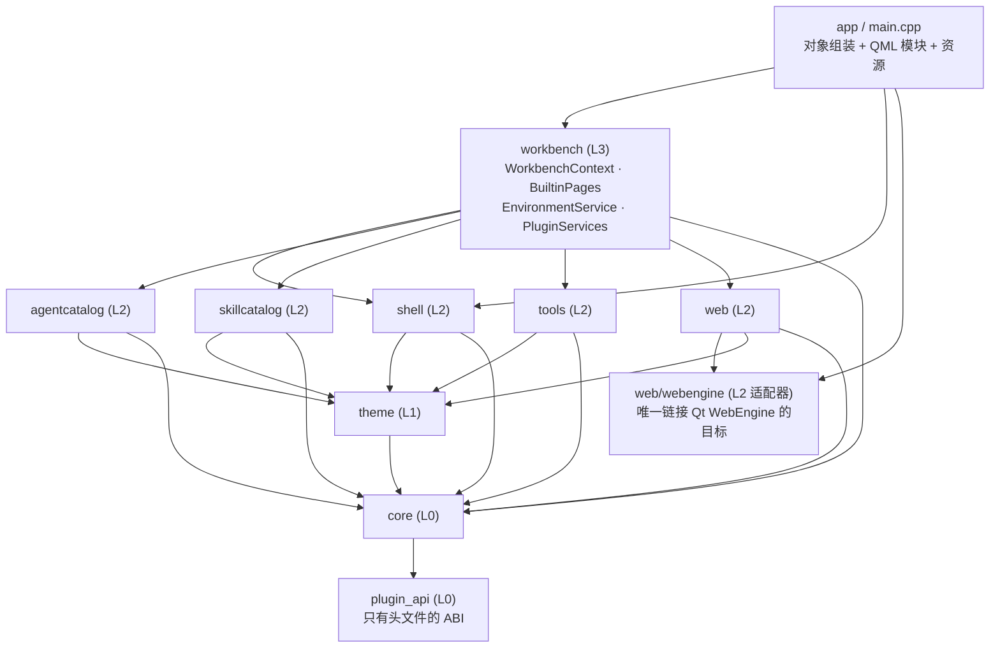
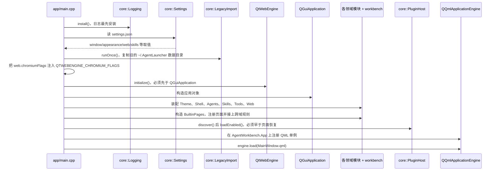
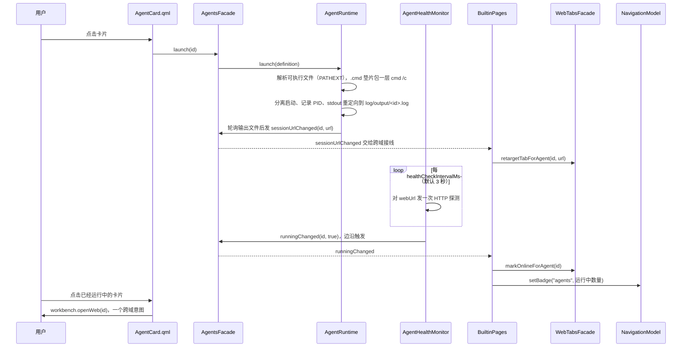
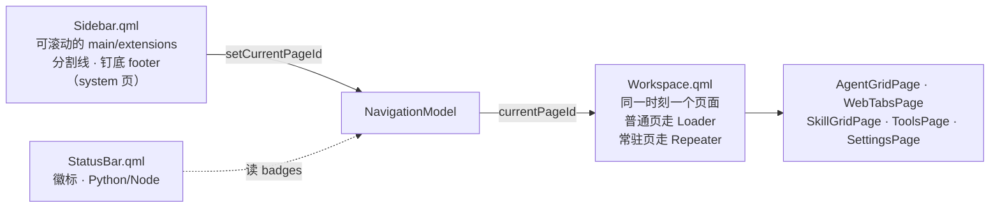

# 架构总览

这一板块讲的是 **AgentWorkbench 是怎么搭起来的**：有哪些层、每个模块归谁管、一串对象怎么变成一个能跑的窗口、以及构建期到底强制了哪些规则。它是写给「刚克隆仓库、动手前需要一个整体心智模型」的人的。

- 只想用软件：看[使用指引](../guide/index.md)。
- 只想改某个功能：看[开发文档](../development/index.md)。
- 要写或改这个板块的页面：先看[文档撰写原则](../AGENTS.md)。

## 这个软件是什么

AgentWorkbench 是一个只有一件事要做的桌面外壳：**启动外部的 AI 编码 agent 命令行工具，并给它们的本地网页界面一个容身之处**。它不实现 agent、不调用模型、也不包装命令行——它只负责编目你机器上已经装好的工具、把它们各自的本地服务起起来、把结果页面嵌进来。

这个定位决定了三件事，也决定了后面几乎所有设计取舍：

1. **它不拥有任何 agent 逻辑。** 一个 agent 是数据（一个 JSON 对象），不是一个类。新增一个工具是改配置文件，不是写 C++——见[扩展点](扩展点.md)。
2. **用户改的一切都存在程序之外。** 有哪些 agent、它们的顺序与配色、上次停在哪个页面、要扫描哪些 skill 目录——全部存在一个数据目录下的文件里，C++ 类只是这些文件的类型化读写者。见[数据与状态](数据与状态.md)。
3. **浏览器引擎是内嵌的，但可选。** WebEngine 依赖被隔离在一个适配目标里，因此不带它的构建依然完整可用，网页表面会降级为交给系统浏览器。

## 模块地图

每个模块都是一个静态库，各带自己的 `src/<模块>/CMakeLists.txt`。分层不是口头约定：它既是 `awb_*` 那些链接行表达的事实，也是 `check_architecture` 在构建期强制的内容（见[分层与依赖](分层与依赖.md)）。

| 模块 | 层 | 负责什么 | 详见 |
|---|---|---|---|
| `app` | 可执行文件 | 只做组装：`main.cpp`、资源清单、QML 模块 | 本页 |
| `src/workbench` | L3 | 跨域意图、内置页面注册、环境检测、插件宿主服务 | [开发：workbench 与页面](../development/workbench与页面.md) |
| `src/shell` | L2 | 窗口骨架、导航、窗口/通知/剪贴板服务、`A*` 组件货架 | [开发：外壳与导航](../development/外壳与导航.md) |
| `src/agentcatalog` | L2 | agent 目录：定义、持久化、进程生命周期、健康检查、一次性命令 | [开发：Agent 启动器](../development/Agent启动器.md) |
| `src/skillcatalog` | L2 | 本机 skill 的发现与呈现 | [开发：Skill 浏览](../development/Skill浏览.md) |
| `src/tools` | L2 | Agent Tools 页：工作区记忆、懒加载文件树、提示词草稿、Markdown 支持 | [开发：Agent Tools](../development/AgentTools.md) |
| `src/web` | L2 | 标签模型、表面选择、内存策略（不含 WebEngine） | [开发：Web 标签页](../development/Web标签页.md) |
| `src/web/webengine` | L2 适配器 | 唯一链接 Qt WebEngine 的目标 | [开发：WebEngine 适配层](../development/WebEngine适配层.md) |
| `src/theme` | L1 | JSON 主题 → 语义令牌 → QML 可绑定属性 | [开发：主题引擎](../development/主题引擎.md) |
| `src/core` | L0 | 路径、JSON 读写、设置、日志、进程、脚本、HTTP 探测、插件宿主、旧数据导入 | [开发：core 基础设施](../development/core基础设施.md) |
| `src/plugin_api` | L0 | 只有头文件的插件 ABI，供外部仓库链接 | [扩展点](扩展点.md) |

有两个模块带有很容易被无意破坏的规则：

- `src/shell` **不认识** agent、skill、web 标签、tools。它只负责渲染被交给它的页面，并回答「我现在在哪」。业务页面是从 `src/workbench` **注册进**它的。
- `src/workbench` 是**全工程唯一允许同时认识多个领域的地方**。任何跨域动作（打开这个 agent 的网页界面、打开它的配置目录、弹一条通知）都是 `WorkbenchContext` 上的方法，而不是某个领域门面上的方法。

## 系统全景

依赖只有一个方向：可执行文件组装各层，`workbench` 把领域组合起来，领域模块使用主题引擎与基础设施，没有任何箭头指回去。

`app` 会直接链接所有领域模块与 `workbench`，所以图上指进 `workbench` 的箭头同时代表「可执行文件也直接构建了这些库」；真正的约束是**没有任何箭头向上回指，领域模块之间也没有互相的箭头**。

## 运行期装配

对象图是 `app/main.cpp` 手工自底向上建起来的，而且顺序是硬契约——有好几步放在错的位置只会静默失效。装配完成后各对象被注册成 QML 单例，最后才把窗口交给 QML 引擎加载。

这几步是承重的，原因分别是：

- **`core::Settings` 在 `QGuiApplication` 之前就被读。** `web.chromiumFlags` 必须先进到 `QTWEBENGINE_CHROMIUM_FLAGS` 环境变量，而 WebEngine 模块必须在应用对象构造之前初始化。这个顺序一改，Chromium 启动参数就会静默失效。
- **`LegacyImport::runOnce` 早于默认 `settings.json` 落盘**，因为导入是靠「数据目录是否还是空的」来判断该不该动作的。
- **插件在最后一个页面被恢复之前加载。** 插件页面就是普通的侧栏条目，而页面是靠 id 标识的；如果插件在页面恢复之后才加载，插件页就活不过一次重启。
- **日志最先安装、最后卸载。** 日志后端是异步的，退出时不做显式卸载，日志尾部会丢。

至于具体持久化了什么、放在哪里，见[数据与状态](数据与状态.md)。

## 一次完整的交互

看清分层最直观的办法是跟一次点击走完。启动一个 agent 会碰到四个领域外加一个外壳，但没有任何一个领域直接调用另一个领域——每一跳都经 `WorkbenchContext`、`BuiltinPages` 或 Qt 信号。

`runningChanged` 是刻意做成边沿触发的：如果每轮探测都把稳定的「运行中」重发一次，会把每个 error 状态的标签页无限拉回 loading 重载。

## 外壳骨架

窗口由侧栏、工作区、状态栏三块组成，让它保持自洽的规则是：**侧栏只回答「去哪里」**，永远不放业务动作。

页面由 `PageDescriptor` 描述（id、标题、图标、组件 URL、`section`、`order`、`keepAlive`），经 `NavigationModel::registerPage` 注册。普通页面在切走时会被销毁，所以任何要活过页面切换的状态都必须放 C++；唯一的例外是声明了 `keepAlive` 的页面，它常驻、切换时只隐藏——内嵌网页视图正是靠这条规则活下来的。两条规则的展开见[前端设计](前端设计.md)。

## 设计原则与它们的出处

| 原则 | 一句话 | 展开在 |
|---|---|---|
| 依赖单向 | 领域模块之间零依赖，跨域行为写在 `workbench` | [分层与依赖](分层与依赖.md) |
| 配置优先于代码 | 新增 agent、图标、主题、skill 扫描根本质上都是数据 | [扩展点](扩展点.md) |
| QML 边界上是门面 | QML 只与门面和模型交互，不碰文件与进程 | [C++ 库设计](C++库设计.md) |
| 只用语义令牌 | 页面绑定 `theme.*`，字面颜色会被构建拒绝 | [前端设计](前端设计.md) |
| 状态归属要明确 | 跨页/跨重启的状态在 C++ 或磁盘上，纯呈现状态留在 QML | [数据与状态](数据与状态.md) |
| 两个 Qt 大版本都要能编译 | Qt 6 是主线，Qt 5.15 LTS 是受支持的兜底 | [C++ 库设计](C++库设计.md) |

## 建议的阅读顺序

如果你是第一次接触这个仓库，按下面这个顺序读上手最快：

1. [分层与依赖](分层与依赖.md)——先知道哪些规则不能破。
2. [数据与状态](数据与状态.md)——数据在哪，以及哪些「不迁移」是刻意为之。
3. [前端设计](前端设计.md)——怎么写一个页面而不自创风格。
4. [C++ 库设计](C++库设计.md)——怎么加一个类而不破坏契约。
5. [扩展点](扩展点.md)——哪些东西可以不改核心就扩出来。
6. 然后按你要改的功能去看[开发文档](../development/index.md)对应那一篇。
