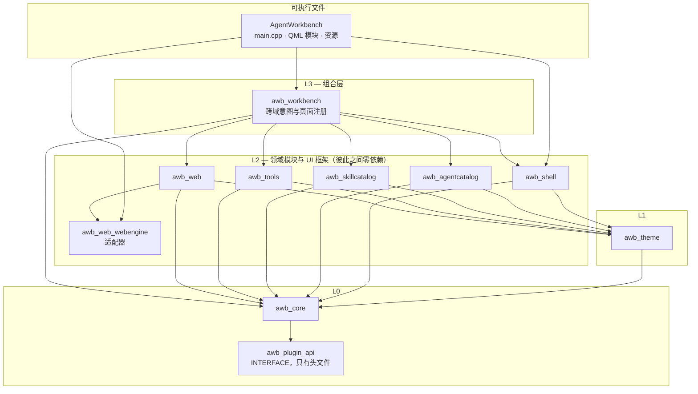

# 分层与依赖

这一页是规则手册：**哪个模块允许知道哪个模块**、这条规则为什么存在、新代码该放哪一层，以及你破坏它时构建会怎么反应。在新增模块、新增跨域动作，或者想写一行「感觉有点不对劲」的 include 之前，先读这里。

这一页的所有规则都由 `scripts/check-architecture.sh` 强制，它挂成 ctest 的 `check_architecture` 目标——违反即构建失败，不用等评审发现。规则表见下文「构建门禁」一节。

## 层次

实际的 CMake 链接关系如下，便于对照：

| 目标 | 链接（除注明外均为 PUBLIC） |
|---|---|
| `awb_plugin_api` | 不链接任何东西——`INTERFACE` 库，只有头文件 |
| `awb_core` | `awb_plugin_api`、`Qt::Core`、`Qt::Network`；`spdlog` 是 `PRIVATE` |
| `awb_theme` | `awb_core`、`Qt::Core`、`Qt::Gui` |
| `awb_shell` | `awb_core`、`awb_theme`、`Qt::Core`、`Qt::Gui`；Windows 上另有 `comdlg32` |
| `awb_agentcatalog`、`awb_skillcatalog`、`awb_web` | `awb_core`、`awb_theme` |
| `awb_tools` | `awb_core`、`awb_theme`；`Qt::Quick` 是 `PRIVATE`（只有 Markdown 编辑器支持会碰 Quick） |
| `awb_web_webengine` | `awb_web` + Qt WebEngine 目标 |
| `awb_workbench` | `awb_agentcatalog`、`awb_core`、`awb_shell`、`awb_skillcatalog`、`awb_theme`、`awb_tools`、`awb_web` |
| `AgentWorkbench` | 全部 `awb_*` 模块，量到 WebEngine 开启时再加 `awb_web_webengine` |

## 规则

### 1. 领域模块之间不许互相依赖，也不许依赖外壳

`awb_agentcatalog`、`awb_skillcatalog`、`awb_tools`、`awb_web` 不许 include `shell/`、`workbench/` 或彼此的目录。

理由不是「为了纯粹而纯粹」：这条规则正是各个模块**能被独立测试**的原因（每个模块有自己的测试目标，只链接它自己），也是依赖图能保持成树而不是一团乱麻的原因。实际含义是：一个领域模块不许对「自己正在被显示在什么地方」做任何假设。

如果你需要两个领域协作，代码属于 `awb_workbench`。具体例子：Agent 启动器不该知道怎么打开一个 Web 标签页，所以 `AgentsFacade` 里**刻意没有** `openWeb` 方法——这件事由 `WorkbenchContext::openWeb(agentId)` 做。随后 `BuiltinPages` 把领域之间的信号接起来（`runningChanged` → `markOnlineForAgent`、`sessionUrlChanged` → `retargetTabForAgent`），于是没有任何领域持有另一个领域的指针。

### 2. `core` 与 `theme` 必须与 UI、与业务知识无关

`src/core/` 与 `src/theme/` 不许引入 Qt Quick、QML 或 WebEngine，两者都只链接 Qt Core/Gui。

- `core` 是基础设施：它认识文件、进程、HTTP 和 JSON，不认识 agent、skill 和页面。正因如此，`IconResolver` 的兜底图标由调用方传入，而不是在 core 里写死一个应用资源路径。
- `theme` 产出的是 `QColor` 和数值。它不能用 `QQuickItem`，因此主题引擎在一个纯 `QGuiApplication` 里也能用、不需要 QML 引擎就能测。

推论：领域模块不许把 UI 类型往下塞进 `core` 来「共享」。一个辅助函数如果需要 `QQuickItem`，它就属于拥有那块 UI 的模块。

### 3. `plugin_api` 是外部仓库唯一可以链接的 API

`src/plugin_api` 是一个只含 `PluginApi.h` 的 `INTERFACE` 库。它存在的意义是：让仓库之外的插件能在不链接宿主库的前提下编译。跨这条边界的只有 Qt 值类型，绝不是宿主的 C++ 类。ABI 的细节见[扩展点](extension-points.md)，加载器的实现见[开发：插件宿主](../development/plugin-host.md)。

### 4. 单向，而且方向在 CMake 里看得见

依赖向下：`app → workbench → 领域模块 → theme → core`。如果你发现自己在想要一个向上的指针（领域模块回调 `workbench`，或者 `core` 需要 `shell` 里的东西），答案是信号或回调，不是 include。到目前为止所有「向上」的需求都是这么解决的——`WorkbenchContext` 接信号、`BuiltinPages` 接规则、`PluginServices` 实现 `plugin_api` 里声明的接口。

## 新代码该放哪一层

| 你要加的东西 | 放哪 | 理由 |
|---|---|---|
| 某个新领域概念的一个侧栏页面 | 新建 `src/<领域>/` 模块 + 在 `BuiltinPages` 里注册 | 页面的逻辑是领域逻辑，`shell` 不该学会它 |
| 多个页面共用的通用控件 | `src/shell/qml/components/`（命名 `A*`） | 组件货架是共享 UI 唯一被认可的位置 |
| 需要两个领域配合的动作（启动这个 agent **并且**打开它的网页界面） | `awb_workbench` / `WorkbenchContext` | 只有这一层允许同时认识两边 |
| 弹窗、通知、剪贴板、原生文件/目录选择器 | `awb_shell`（`UiServices`、`Notifications`、`A*` 弹窗） | 这些是 UI 框架能力，不是领域功能 |
| 文件、路径、JSON、进程、HTTP 的辅助函数 | `awb_core` | 基础设施属于最底层，且必须与 UI 无关 |
| 一个颜色、间距或动效时长 | `resources/themes/*.json` + 一个 `theme` 属性 | 绝不在 QML 里写字面值 |
| 一个新的 agent、图标映射、主题或 skill 扫描根 | 数据（`agents.json`、`file_icons.json`、主题 JSON、`skills.roots`） | 见[扩展点](extension-points.md) |

## 构建门禁

`scripts/check-architecture.sh` 经 `tests/CMakeLists.txt` 注册为 ctest 测试，所以 `bash scripts/build.sh --test` 会跑它。它是一个用 `grep` 的 shell 脚本，不编译任何东西，失败时会直接指出违规文件与行号，便于定位。

| # | 规则 | 为什么有这条 |
|---|---|---|
| 1 | 领域模块不许 include `shell/`、`workbench/` 或彼此的目录 | 让依赖图保持成树，让模块能被独立测试 |
| 2 | QML 里不许出现字面颜色——不许 `#rrggbb`/`#rgb`，不许 `Qt.rgba(<数字>, …)` | 主题必须能重绘一切；一个写死的颜色在别人切主题之前是不可见的。`"transparent"` 与 `Qt.rgba(theme.accent, …)` 这类表达式形式是允许的 |
| 3 | `tr()`/`qsTr()` 的源串必须是 ASCII | 源语言是英文；非英文源串会让翻译提取静默失效 |
| 4 | `src/core/` 与 `src/theme/` 不许引用 Qt Quick、QML 或 WebEngine | 同上第 2 条的理由；core 里混进 QML 引擎的 include 正是当初发现这条规则的起因 |
| 5 | QML 里每一处 `<别名>.<方法>(` 都必须对应 `Q_INVOKABLE` 方法，每一处 `<别名>.<属性> =` 都必须有 `Q_PROPERTY` 的 `WRITE` | 裸方法不在 meta-object 方法表里：QML 在点击时才抛「is not a function」，而按页面加载的冒烟测试从不点击。这个缺口曾让三处侧栏/设置交互长期静默失效，直到有人手动跑才被发现 |

规则 5 特别值得内化：它是唯一一条「违反后其它所有检查都看不见」的规则。为 QML 新增方法时标 `Q_INVOKABLE`；新增会被 QML 赋值的属性时给一个 `WRITE`。`tst_shell::testQmlCalledMethodsAreInvokable` 用 `QMetaObject::invokeMethod` 复现同一类缺陷。

## 两个看起来像例外、其实不是的地方

- **`shell` 里有 `A*` 组件。** 组件货架放在 `awb_shell` 是因为它是通用 UI 框架，而不是因为 `shell` 懂了业务。这些组件本身只引用 `theme.*` 令牌和自己的属性。
- **`workbench` 链接了所有领域模块。** 那是它的定义，不是分层违规——它是 L3，而它下面的各层之间依然互不链接。

## 相关

- [架构总览](index.md)——模块地图与运行期装配。
- [C++ 库设计](cpp-design.md)——让跨模块契约安全的那些模式（门面、模型角色、`OpResult`）。
- [前端设计](frontend-design.md)——规则 2 与规则 5 在 QML 一侧的展开。
- [扩展点](extension-points.md)——不破坏这些规则就能加功能的正当途径。
