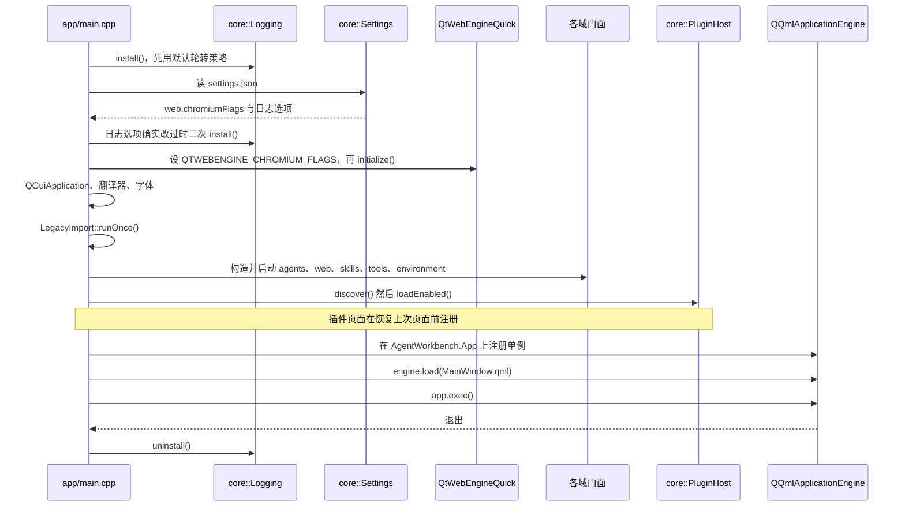

# 数据与状态

本页面向要动配置或持久化逻辑的开发者。它回答：**AgentWorkbench 保存哪些东西、放在哪、它们跨重启会怎样。**

## 数据目录是唯一来源

应用写入的一切都住在一个根下，由 `core::Paths::dataRoot()` 返回。子路径在那里派生，别处不许拼：`themesDir()`、`pluginsDir()`、`logsDir()`、`webProfilesDir()`、`skillCacheFile()` 与 `downloadsDir()`。**其它模块不得自行组装这些路径**——需要新文件时，往 `core::Paths` 加一个派生访问器。

`dataRoot()` 的取值优先级依次为：`Paths::setDataRootForTesting()` 注入的根，然后是 `QStandardPaths::setTestModeEnabled(true)` 生效时的重定向位置，最后是 `~/.AgentWorkbench`。测试模式这一分支很关键，因为测试模式不重定向 `HomeLocation`；直接读 home 目录的测试会读写开发者真实的配置目录。**任何测试都不许读写开发者真实的数据目录**——测试一律用测试模式或注入一个 `QTemporaryDir`。

从 0.4 之前的 `AgentLauncher` 升级后首次启动时，`core::LegacyImport::runOnce()` 把 `~/.AgentLauncher` 里的 `agents.json`、`agent_state.json` 与旧 `log/` 下的全部文件**复制**进新根。它从不搬移或删除旧目录，至多跑一次（一旦新根里出现 `log/` 以外的东西就作罢），并给用户看一条一次性提示。这也是 `app/main.cpp` 把首次 `Settings::save()` 推迟到导入之后的原因：过早写 `settings.json` 会让「根未被触碰」的判定永远失败。

## 什么放在哪

| 文件 | 谁写 | 里面是什么 | 读写经谁 |
|---|---|---|---|
| `agents.json` | launcher 页 / 设置页 | 用户 agent 加根级 `removed` 列表 | `AgentRepository` |
| `agent_state.json` | 一次性 setup | 哪些 agent 已完成 `setupCommand` | `AgentStateStore` |
| `settings.json` | 设置页 | 全部应用设置 | `core::Settings`——唯一入口 |
| `tools.json` | Agent Tools 页 | 工作区 MRU 列表（上限 20）、当前工作区、提示词草稿 | `ToolsStore`，经 `ToolsFacade` |
| `skills_cache.json` | skill 扫描器 | 上次扫描结果，供首屏渲染 | `SkillCache` |
| `environment_cache.json` | 运行时探测 | 上次的 Python/Node 结论（版本、安装路径，或「PATH 上没有可用的」），供首屏渲染 | `EnvironmentCache` |
| `file_icons.json` | 你 | 图标表的覆盖 / 追加 | `FileIcons`（经 `FileTreeModel`） |
| `themes/*.json` | 你 | 主题（同 `id` 覆盖内置） | `ThemeRegistry` / `ThemeLoader` |
| `plugins/<id>/` | 你 | 插件 manifest 与动态库 | `core::PluginHost` |
| `webprofiles/<agentId>/` | Web 标签 | 每个 agent 的 cookie 与 localStorage | `WebProfilePaths` / `WebEngineProfileStore` |
| `log/agentworkbench.log` | 应用 | 滚动事件日志（5 MB × 3 个文件） | `core::Logging` |
| `log/output/<agentId>.log` | `AgentRuntime` | 某 agent 进程的 stdout + stderr，轮询它以提取会话 URL | `AgentRuntime` |

`settings.json` 按设计没有别的读者；所有访问都经 `core::Settings` 里那组类型化结构体，因此键名与默认值都只有一个定义处。

## 内存态 vs 磁盘态

分界线是有意画下的。能跨重启留下来的，是用户明确选择过、或付出过代价的东西；其余全部重建。

| 状态 | 住在哪 | 生命周期 |
|---|---|---|
| `AgentRuntime` 的 PID 记账（`m_pids`） | 内存 | 仅本次会话 |
| 捕获的会话 URL（`m_sessionUrls`） | 内存 | 进程停止即丢弃 |
| agent 运行中 / 已安装 / 版本 / 控制台输出（`AgentState`） | 内存（`setupDone` 除外） | 应用退出或下轮健康检查前 |
| `WebTab` 的状态、加载进度、缩放、LRU 时间戳 | 内存 | 标签关闭或应用退出前 |
| 纯视图状态（展开的行、当前筛选…） | 内存 | 视图销毁前 |
| agent 定义 | `agents.json` | 跨重启 |
| 应用设置，含上次访问的侧栏页面 | `settings.json` | 跨重启 |
| 一次性 setup 完成记录 | `agent_state.json` | 跨重启 |
| 工作区记忆与提示词草稿 | `tools.json` | 跨重启 |

草稿是唯一走了精细写入路径的内存状态。编辑提示词不会每次按键都写盘：`ToolsFacade::setDraft()` 在文本未变化时立即返回，否则装上一次性的 500 ms 定时器，打字停顿时 `persistDraft()` 才写一次。析构函数会补写仍在挂起的草稿，因此编辑到一半退出不会丢。这让打字快的人不会把每次按键都变成一次磁盘写，同时把崩溃容错压到半秒。

把 PID 与会话 URL 留在内存里有两条具体后果：

- **启动器重启后，它无法停止重启前由自己启动的 agent。** 健康检查仍会报告它在运行，但没有 PID 可杀，`stop()` 只显示一条提示。逃生口是右键菜单的**强制停止**，它经 `netstat -ano` 由端口解析出 PID（`AgentRuntime::forceStop`）。
- **删除 agent 时，它的进程被有意保留运行。** 移除只对运行器调 `forget()`，仅丢掉记账——进程继续服务，它的 Web 标签被关掉。杀掉它是另一个显式动作。

## 无迁移策略

没有迁移代码是设计决策，不是遗漏，规则也很明确：**不要加。**

对 `settings.json` 而言，缺键就地取默认值，未知键记警告后忽略。因此加一个设置项就是往 `core::Settings` 对应结构体加一个默认值、在 `load()` 里加一次读取——别无他事。

对 `agents.json` 而言，内置定义每次启动都按随包默认重新生成，根级 `removed` 数组保持删除状态。所以根本没有针对旧配置的兼容层。

有一个根级字段就是这样被停用的：`agents.json` 旧的 `title` 不再被读取——窗口标题来自 `settings.json` 的 `window.title`——残留值只在 INFO 级别报告一次，而不迁移。

代价是实打实的，值得写明：

- **改内置 agent 只能改随包默认文件并重新编译**；在界面里做的修改只在本次运行内有效；
- **复用内置 id 的自建 agent 会在下次启动被覆盖**，因为按 id 相同时随包定义赢。

## 写入的原子性与安全

每个 JSON 文件都经 `core::JsonStore` 读写：`writeFile()` 用 `QSaveFile`，读方永远看不到写了一半的文件，会自动创建缺失的父目录，并写出统一的缩进；`writeBytes()` 是逐字节变体，用于 `agents.json` 与随包默认完全一致的场合。读取失败降级为空对象加一条日志，而不是中止应用——单个坏文件永远不能把应用拖垮。

日志按 `logging.maxFileSize`（5 MB）滚动、保留 `logging.maxFiles` 个文件（3 个），因此上限约 15 MB，最旧的备份被删除。写盘在后台线程进行，日志再密也不会占住 UI 线程的 IO，warning 及以上级别到达即刷。

token 处理刻意保守，因为泄漏一个 bearer token 就是安全问题：

- token 以 URL **片段**追加（`AgentUrls::finalUrl()` 拼出 `#token=…`），而片段不发给服务器，因此不会进服务器的访问日志或 `Referer` 头；
- `src/web/WebTabsFacade.cpp` 里的 URL 脱敏辅助函数在 URL 被写日志或转成 toast 之前，**同时**抹掉 `#token=…` 片段与 `?token=…` 查询项，其余片段/查询项原样保留；
- **带 token 的 URL 一律不进日志。**

## 启动装配顺序

`app/main.cpp` 里的顺序是硬契约；对调两步会静默弄坏某样东西。下面这张图给出时序。

为什么是这个顺序：

- **日志最先。** `Logging::install()` 之后，任何后续失败都有磁盘记录。它先用默认轮转策略装一次，好让 `Settings` 构造期间的告警也能落盘；只有用户确实改过某个日志选项时才二次 install。
- **设置在 `QGuiApplication` 之前。** 用户的 `web.chromiumFlags` 必须在 `QtWebEngineQuick::initialize()` 之前放进 `QTWEBENGINE_CHROMIUM_FLAGS`，而 WebEngine 又必须先于 `QGuiApplication` 初始化。读晚了会静默丢掉这些 flags。
- **自底向上装配。** core → theme → shell → agentcatalog → skillcatalog → web → tools，每个模块都在它依赖的东西之后构造。
- **插件在页面恢复之前。** `PluginHost` 在 `BuiltinPages` 恢复上次页面之前装载已启用的插件。插件页面的 id 因此才能活过一次重启；若插件在恢复之后才装载，被记住的页面就无法解析。
- **先注册 QML 单例，再 `engine.load`。** 全局对象注册在纯 C++ 的 `AgentWorkbench.App` URI 上，之后才加载 `MainWindow.qml`。

退出路径必须调 `Logging::uninstall()`：它排空异步队列并停掉写盘线程，漏掉就会丢掉最后几行（可能低于 warning 级别）日志。正常退出与 UI 加载失败路径都要调。结束本次会话启动的 agent 进程树则是另一个由用户驱动的步骤：用户选择关闭时，窗口的退出对话框调 `agents.stopAll()`（`AgentRuntime::stopAll()` 逐个杀掉记账的 PID 并清空记账）。

## 新增一个持久化文件时要做什么

当你新增一个能活过一次运行的文件时：

1. 经 `core::JsonStore` 读写（原子、格式统一、读取容错），不要直接用 `QFile`；
2. 把它的路径作为派生访问器加进 `core::Paths`——不要在调用点拼数据根路径；
3. 明确判定它属于**磁盘态**还是**内存态**，并在读者需要的地方写明这个判定；
4. 想清楚无迁移策略的后果：已有文件缺你的新键会怎样，你不再读的旧键又会怎样；
5. 同一次改动里同步更新本页与 `../development/` 对应文档。

## 相关文档

- [扩展点](扩展点.md)——读取与写入本页所述数据的那些扩展点。
- [配置参考](../configuration.md)——`settings.json` 与 `agents.json` 的字段表。
- [开发](../development/index.md)——逐功能的实现说明。
