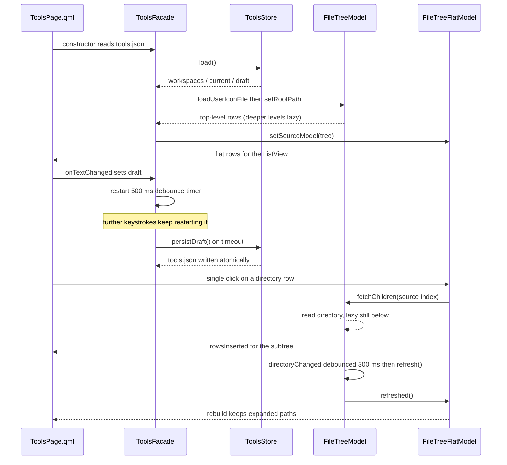
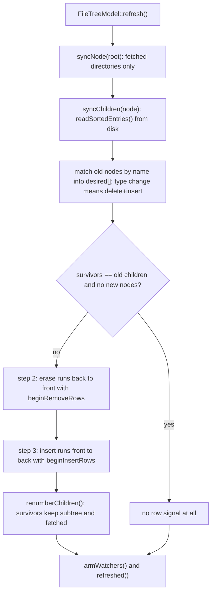

# Agent Tools

## 这个功能做什么

Agent Tools 页是一个提示词编写台，为两个具体痛点而存在：

1. 在提示词里引用文件，通常要手拼相对路径。
2. 直接把提示词敲进 agent CLI，有在半成品上误触回车、把消息发出去的风险。

因此本页**没有发送动作**。回车只换行，什么都不会离开这一页；提示词写好后由用户
复制粘贴进目标 agent。右侧面板浏览当前工作区，可经拖放或双击把
`` `./相对路径` `` 文件引用插进编辑器。

边界：本页不与任何 agent 通信、不运行任何东西、不编辑仓库文件。它唯一的读取是
工作区文件树，唯一的写入是 `tools.json`（工作区记忆 + 草稿）与系统剪贴板。文件
树是只读浏览。

## 文件与类清单

| 文件 | 类 / 组件 | 职责 | 与谁协作 |
|---|---|---|---|
| `src/tools/ToolsStore.h` | `ToolsStore` | `tools.json` 状态：MRU 工作区列表、当前工作区、提示词草稿；`kMaxWorkspaces` = 20 | `ToolsFacade`、`core::JsonStore` |
| `src/tools/ToolsStore.cpp` | `ToolsStore::load()/save()` | 读写与列表语义（MRU 触碰、上限淘汰） | `ToolsFacade` |
| `src/tools/ToolsFacade.h` | `ToolsFacade` | QML 门面：工作区属性、草稿属性、`addWorkspace`/`removeWorkspace`/`refresh`/`fileReference`；扁平模型经 `model` 暴露 | `ToolsPage.qml`、`app/main.cpp`（`tools` 别名）、`tools::FileTreeFlatModel` |
| `src/tools/ToolsFacade.cpp` | `ToolsFacade` | 装配、500 ms 草稿防抖加析构补写、根选择 | `FileTreeModel`、`FileTreeFlatModel`、`ToolsStore` |
| `src/tools/FileTreeModel.h` | `FileTreeModel`（含私有 `Node`） | 单个工作区根上的懒加载目录树；`Roles`；增量 `refresh()`；`QFileSystemWatcher` | `ToolsFacade`、`FileTreeFlatModel` |
| `src/tools/FileTreeModel.cpp` | `FileTreeModel` | 节点所有权、fetch、三步对账、watcher 布防 | `FileTreeFlatModel` |
| `src/tools/FileTreeFlatModel.h` | `FileTreeFlatModel`（含私有 `Row`） | 供 QML `ListView` 消费的扁平投影；持有展开路径集合 | `ToolsPage.qml`、`FileTreeModel` |
| `src/tools/FileTreeFlatModel.cpp` | `FileTreeFlatModel::rebuild()/toggleExpanded()` | 投影、展开/收起、消费源信号 | `FileTreeModel` |
| `src/tools/FileIcons.h` | `FileIcons` | 三张查找表（文件名 / 后缀 / 目录名）加兜底；`forFile()`/`forFolder()` | `FileTreeModel`（`IconRole`）、`core::IconResolver` |
| `src/tools/FileIcons.cpp` | `FileIcons::FileIcons()/loadUserFile()` | 内置表来自 `:/config/default_file_icons.json`，叠加 `<dataRoot>/file_icons.json` | `core::JsonStore` |
| `src/tools/MarkdownEdit.h` | `MarkdownEdit` | QML 单例（`AgentWorkbench.App` 上的 `MarkdownEdit`）：`attach()`、`applyBold()`、`applyCode()`、`applyBullet()` | `MarkdownContextMenu.qml`、`ToolsPage.qml`、`theme::Theme` |
| `src/tools/MarkdownEdit.cpp` | `MarkdownEdit` | 静态光标操作、主题配色、高亮器簿记 | `MarkdownHighlighter` |
| `src/tools/MarkdownHighlighter.h` | `MarkdownHighlighter`、`MarkdownColors` | 轻量逐块 Markdown 高亮器；配色令牌 | `MarkdownEdit` |
| `src/tools/MarkdownHighlighter.cpp` | `MarkdownHighlighter::highlightBlock()` | 围栏状态机加行内正则规则 | `MarkdownEdit` |
| `src/tools/qml/ToolsPage.qml` | `ToolsPage` | 页面：头部、工作区下拉、添加/刷新/复制工具栏、含编辑器与文件树的 `SplitView` | `tools.*`、`ui.pickFolder`、`MarkdownEdit`、`MarkdownContextMenu` |
| `src/tools/qml/MarkdownContextMenu.qml` | `MarkdownContextMenu` | `AMenu`：顶部格式化工具栏 + 撤销/重做/剪切/复制/粘贴条目 | `MarkdownEdit`、`AMenu`/`AMenuItem` |
| `src/tools/CMakeLists.txt` | 构建目标 `awb_tools` | 静态库；`Qt::Quick` 是 PRIVATE 链接（只有 `MarkdownEdit` 碰 `QQuickTextDocument`） | — |

模块之外，本页依赖 `core::Paths::dataRoot()`、`config/default_file_icons.json`、
`theme::Theme`、shell 的 `A*` 组件、`workbench.copyText()`/`notify()` 与
`ui.pickFolder()`。

## 前端设计

### `ToolsPage.qml` 布局

一个 `ColumnLayout`：`PageHeader`（标题 `Agent Tools`）→ 工具栏行 → `SplitView`。

- **工具栏。** 一个 `Workspace` 标签、工作区 `AComboBox`、`Add Folder...` 按钮、
  一个刷新 `AIconButton`（无工作区时禁用），以及靠右落在编辑区正上方的 `Copy`
  主动作。
- **工作区 `AComboBox`。** `model: tools.workspaces`、`currentIndex:
  page.currentWorkspaceIndex()`。`contentItem` 与 `delegate` 都被覆写：默认
  `ItemDelegate` 的背景是硬编码浅色系、深色主题下不可读，所以 delegate 自带
  `background`（悬停/高亮 → `theme.surfaceHoverBg`）与含路径和逐项删除
  `AIconButton` 的 `contentItem`。
- **编辑器（`objectName: "promptEditor"`）。** 一个纵向 `Flickable`
  （`objectName: "promptScroll"`、`clip`、`StopAtBounds`）挂
  `ScrollBar.vertical: AScrollBar {}`，内容体是经 `TextArea.flickable` 附加属性
  附上去的 `ATextArea`；`SplitView.fillWidth` 与 `minimumWidth: 260` 落在
  `Flickable` 上。`TextArea` 自己的文本滚不动——裸用会把超出可视区的内容画到
  够不着的地方——附加属性补齐了滚动需要的那三件事：文本随内容高度增长、每次
  `cursorRectangleChanged` 把光标滚回视野、以及把文本组件自身的背景（外框、
  焦点环）改挂到 `Flickable` 上并按它定尺寸，于是外框钉在视口上、文本在它下面
  移动。文本只在 `Component.onCompleted` 初始化一次（`text = tools.draft`），
  不做双向绑定：常驻绑定会与用户输入打架。`onTextChanged: tools.draft = text`
  是写路径。`MarkdownEdit.attach(promptEditor)` 在同一个处理器里执行。页面里的
  `promptEditor` 仍是 `ATextArea` 本身——拖放目标、右键菜单与交互级冒烟都按这个
  对象寻址。
- **拖放目标。** 铺满编辑器的 `DropArea` 只接受来自文件树的拖拽
  （`drop.source.isFileReferenceDrag`），用 `promptEditor.positionAt(drop.x, drop.y)`
  求插入偏移并把 `drop.text` 插进去。落点坐标本身就是文档坐标：滚动是整体平移
  编辑器，而 `TextArea` 自己没有 `contentY` 可折算。
- **右键。** 只接受 `Qt.RightButton`、`cursorShape: Qt.IBeamCursor` 的 `MouseArea`
  设 `editorMenu.editor = promptEditor` 再 `popup(mouse.x, mouse.y)`。
- **`SplitView` 手柄。** 视觉线只有 `spacingXs` 宽，但 `containmentMask` 的 `Item`
  把命中区放大到 12 px。mask 的偏移必须用 `id` 引用手柄，因为首次求值时
  `parent` 是 `null`。
- **文件树 `ListView`（`objectName: "fileTree"`）。** `model: tools.model`（扁平
  投影）、`AScrollBar.vertical`、工作区已设但 `tools.model.visibleCount === 0` 时的
  空提示，以及未选工作区时的 `AEmptyState`。
- **文件树 delegate。** 每个 role 都声明为 `required property`（`name`、`path`、
  `relativePath`、`isDir`、`iconSource`、`depth`、`expanded`、`hasChildren`）
  **外加** `index`。Qt 5.15 里一旦声明任何 required property `contextObject` 就被
  清空，裸 `index` 会抛 `ReferenceError`、单击展开的 handler 整段中止。行上还有一个
  由 `Connections` 监听 `tools.model` 的 `onModelReset` 翻转的 `rebinding` 标记，
  让模型 reset 期间箭头的旋转动画保持安静。拖出用
  `Drag.dragType: Drag.Automatic`、`Drag.mimeData` 取
  `tools.fileReference(relativePath)`，`Drag.active: rowDragHandler.active`。两个
  `TapHandler` 负责单击展开与双击插入；只吃右键的 `MouseArea` 弹一个复制相对/绝对
  路径的两条目 `AMenu`。
- **`AEmptyState` 的约束。** 它的根是普通 `Item`，不能带 `anchors`（未定义行为），
  尺寸由布局接管；内部用 `Column` 而不是 `ColumnLayout`，避免 Qt 5 的递归重排。

### `MarkdownContextMenu.qml`

一个 `AMenu`，第一个子项是普通 `Item`——一个 34 px 工具栏，放三个 `AIconButton`
（Bold、Code、Bulleted list）。因为 `AMenu` 的 contentItem 按声明顺序竖排直接子项，
把这个 `Item` 与 `AMenuItem` 混排就得到「工具栏在上、条目在下」的形态，中间一条极淡
分隔线。动作统一经 `run(action)`：先关菜单、把焦点还给 `editor`，再执行——编辑器的
选区与插入必须先拿到焦点，否则输入与选区写入都落不到目标上。

## 后端设计

### `ToolsStore`

持有数据根下的 `tools.json`。键是 `workspaces`（字符串数组，MRU 在前）、`current`
（当前工作区绝对路径）、`draft`（提示词全文）。**键名是磁盘格式的一部分，改键名
等于丢用户数据。** `load()` 跳过非字符串条目并去重，`current` 不在列表里时清空。
`addWorkspace()` 先移除再插队首（统一两条 MRU 触碰路径），超出 `kMaxWorkspaces`
= 20 从队尾淘汰，并设为当前。`removeWorkspace()` 移除该路径，若它正是当前项则把
剩余队首顺延上来（或清空）。`setCurrentWorkspace()` 接受空串（合法的「无工作区」），
非空路径插队首。`setDraft()` 内容未变时不写盘。`save()` 经 `core::JsonStore` 原子写。

### `ToolsFacade`

属性：`model`（CONSTANT，扁平投影）、`workspaces`、`currentWorkspace`（WRITE）、
`draft`（WRITE）。invokable：`addWorkspace`、`removeWorkspace`、`refresh`、
`fileReference`。`addWorkspace`/`removeWorkspace` 的 `awb::core::OpResult` 返回类型
必须保持全限定名：Qt 5 的 moc 按书写形式记录，而 QML 按 `QMetaType` 注册名解析，
短名会抛 "Unknown method return type"、按钮静默无响应。

- **草稿防抖。** `setDraft()` 更新缓冲、发 `draftChanged()` 并重启一个单次
  500 ms 的 `QTimer`。`persistDraft()` 在超时时执行；析构函数在计时器仍活跃时也补
  写一次，最后一次敲键能活过关闭。
- **图标表时序。** 构造函数在设根**之前**调
  `m_model->loadUserIconFile(dataRoot + "/file_icons.json")`，因为模型不会为已经
  渲染的行补发 `dataChanged`。
- **根选择。** `applyCurrentToModel()` 只在记忆的目录存在时才设树根；否则树保持空，
  而不是显示一个永远为空的假根。
- **`refresh()`。** 按异步形状设计、当前同步完成；它转发到
  `FileTreeModel::refresh()`，后者的 `refreshed` 信号被转到 `refreshFinished()`，
  所以 QML 分不出 watcher 触发的重扫与手动重扫。

### `FileTreeModel`

单个根上的懒加载树。每个 `Node` 持有 `name`、`path`、`relativePath`、`isDir`、
`fetched`、`parent`、`row` 与 `children`；`internalPointer` 存 `Node *`。

- **懒加载。** `hasChildren()` 对任何未读取的目录返回 true，视图据此提前显示展开
  箭头；读取后空目录返回 false，箭头消失。`canFetchMore()` 对未读取目录为 true；
  `fetchMore()` 读取它。`fetchChildren()` 是幂等的 `Q_INVOKABLE` 兜底，供视图没有
  驱动 `fetchMore` 时使用。
- **`setRootPath()` 在 reset 之外先读顶层。** 整棵 staging 树（含顶层）在
  `beginResetModel` 之外构造好；reset 之后立刻插入的行会被视图重复计入（2026-09
  冒烟实测）。reset 后重布防 watcher 并发 `topLevelCountChanged()`。
- **增量 `refresh()`。** `syncNode()` 遍历每个**已读取**目录（读过的收起目录也要
  对账，否则下次展开就是过期数据）。`syncChildren()` 是三步对账，每步严格夹在
  `begin`/`end` 之间：
  1. 按名字匹配旧节点得到目标序列 `desired`（幸存者复用指针、新面孔现建；名字还在
     但类型变了的按「删一个插一个」处理）；
  2. 删除阶段从后往前逐段 erase，前面的行号在本阶段内始终有效；
  3. 插入阶段从前往后逐段 insert，因为幸存者在 `desired` 与 `children` 里同序，
     一个游标就够。
  幸存者的子树、`fetched` 状态与视图展开状态全部保留。没有任何变化时一个行信号都
  不发。无论有无变化都会发 `refreshed()`。
- **watcher。** `QFileSystemWatcher::directoryChanged` 被连上（只连它，本模型没有
  监听单文件改名的需求），经 300 ms 单次防抖触发 `refresh()`。任何结构变化后
  `armWatchers()` 都按「已读目录」集合重建监听列表。
- **排序。** 目录在前，再按文件名大小写不敏感排序，同字母异大小写按原序保证稳定。

### `FileTreeFlatModel`

把树投影成 `ListView` 可消费的线性行序，展开状态由它自己持有（Qt 6.3 的 QML
`TreeView` 在 Qt 5.15 不存在，两个版本共用一份 delegate）。它只消费源模型的两个
信号：`QAbstractItemModel::modelReset`（换根 → 清 `m_expandedPaths` 并重投影）与
`FileTreeModel::refreshed`（一次 refresh 收尾 → 重投影）。refresh 过程中的逐目录
`rows*` 信号不消费，避免一个 burst 重建多次。展开状态用相对根的路径集合持有，因此
能跨 refresh 保留。`toggleExpanded(row)` 或展开（fetch 兜底，子树经一次
`rowsInserted` 递归投影）或**递归**收起（清掉所有后代的展开键）。role 枚举显式映射
到源模型的枚举，因为数值不同（源在 `IconRole` 前还有 `SuffixRole`），不能按编号
直传。

### `FileIcons`

三张表——`fileNames`、`suffixes`、`folderNames`——加每种一个兜底。构造函数并入内置
的 `:/config/default_file_icons.json`；`loadUserFile()` 叠加
`<dataRoot>/file_icons.json`，同名键用户赢。查表大小写不敏感，顺序是完整文件名 →
后缀 → 兜底。所有值经 `core::IconResolver` 归一，空值/非法值直接丢弃而不入库。

### `MarkdownEdit` 与 `MarkdownHighlighter`

`MarkdownEdit` 是给提示词编辑器提供 Markdown 支持的 QML 单例。
`attach(textArea)` 从控件的 `textDocument` 属性读 `QQuickTextDocument` 并挂一个以
文档为父的 `MarkdownHighlighter`；对同一文档重复调用无害。配色取自当前
`theme::Theme`（`colorsFromTheme`），在 `Theme::changed` 时重灌并 `rehighlight()`；
已死的高亮器指针经 `QPointer` 回收。

三个格式化动作是纯静态光标操作，测试可直接拿 `QTextDocument` 驱动：

- `applyBoldToCursor()`：空选区插入 `****` 并把光标停在中间；否则把去空白的选区包进
  `**`，两端空白留在标记外，再重新选中内容。
- `applyCodeToCursor()`：空选区插入 ` `` `；单行选区加行内反引号；含换行的选区改
  围栏块（```` ``` ```` 行插在首换行之后、尾换行之前，复用现成的行分隔）。
- `applyBulletToCursor()`：给选区（无选区时给光标所在行）每一行行首加 `- `，完成后
  重新选中整个受影响范围。

每个动作都在一次 `beginEditBlock`/`endEditBlock` 内完成，一次撤销即可回退。
`editTextArea()` 经控件的 `selectionStart`/`selectionEnd` 属性读选区，再把结果经
`select()` 写回。选区的读取**不**依赖焦点，这正是菜单可以拿走焦点、却仍能操作编辑器
选区的原因。

## 业务逻辑

第一张图展示草稿防抖与懒加载文件树（QML 与门面一侧）；第二张展示 `FileTreeModel`
内部的增量对账。





### 工作区记忆语义

工作区列表按 MRU 排序、上限 20，当前项要么在列表里要么为空。删除当前项会把剩余
列表的队首顺延上来。空串是合法的当前值。草稿内容未变化不触发写盘。

### 文件引用格式

`ToolsFacade::fileReference()` 产出 `` `./相对路径` ``——反引号包裹、正斜杠、输入
不带 `./`。拖放与双击都走它，提示词收到的形状始终一致。

## 坑与约定

- **role 名与顺序是契约。** `FileTreeModel::Roles`、`FileTreeFlatModel::Roles` 与
  delegate 的 `required property` 名必须同步；扁平模型的 `case` 映射显式转成源枚举，
  因为编号不同。
- **`ListView` 没有池化信号。** 与 `TreeView` 不同，`ListView` 不给池化/复用信号，
  因此模型 reset 期间用 `Connections` 的 `onModelReset` 与 `rebinding` 标记让箭头
  旋转动画闭嘴。
- **图标表时序。** `loadUserIconFile()` 必须在 `setRootPath()` 之前；已渲染行没有
  回溯的 `dataChanged`。
- **`AEmptyState` 的递归重排。** 它的根是不带 anchors 的普通 `Item`；Qt 5 下内部
  用 `Column` 而非 `ColumnLayout`。
- **草稿防抖。** 绝不逐字符写 `tools.json`；500 ms 防抖加析构补写是契约。
- **`awb::core::OpResult` 写全限定名**（门面 invokable）。
- **`ui.pickFolder` 是选目录入口。** QML 的 `FolderDialog` 是 Qt 6 QuickDialogs2
  独有；C++ 原生对话框（`UiServices::pickFolder`）是 Qt 5/Qt 6 行为一致的唯一路线。
- **`objectName` 是测试契约。** `tests/tools/tst_toolsui.cpp` 按 `objectName` 定位
  `promptEditor`、`editorMenu`、`fileTree`；改名会打断交互冒烟。

## 改动检查清单

- [ ] 新增的 `.cpp`/`.h` 已加进 `src/tools/CMakeLists.txt`；用了 `tr()` 的新源文件
      要加进 `cmake/AwbTranslations.cmake`。
- [ ] 新增/移动的 `.qml` 已登记进 `app/CMakeLists.txt`（`_tools_qml` 与 alias），
      含 `qsTr()` 时还要进 `AWB_TS_SOURCES`。
- [ ] `tests/tools/tst_toolsui.cpp` 依赖的 `objectName` 未改，或同一提交里改了测试。
- [ ] 模型 `roleNames()` 仍与 delegate 的 `required property` 名匹配。
- [ ] `config/default_file_icons.json` 里的键名未被改名。
- [ ] `tools.json` 的键名未变。
- [ ] `bash scripts/build.sh --test` 全绿，含 `check_architecture`。

## 相关

- [Skills 浏览器](Skill浏览.md) —— 另一个扫描目录的页面，也是共享 `A*` 组件的
  第一个消费者。
- [Shell 与导航](外壳与导航.md) —— 页面如何注册与装载，以及复用
  `SettingsSkillsPage` 形态的设置页。
- [设置](设置.md) —— 本页复用的 `A*` 表单控件。
- [Agent Tools（使用）](../guide/提示词编写台.md) —— 面向用户的描述。
- [前端设计](../architecture/前端设计.md) —— `A*` 组件货架与 `AMenu` 家族。
- [分层与依赖](../architecture/分层与依赖.md) —— 为什么 `tools` 不许
  依赖 `shell`。
