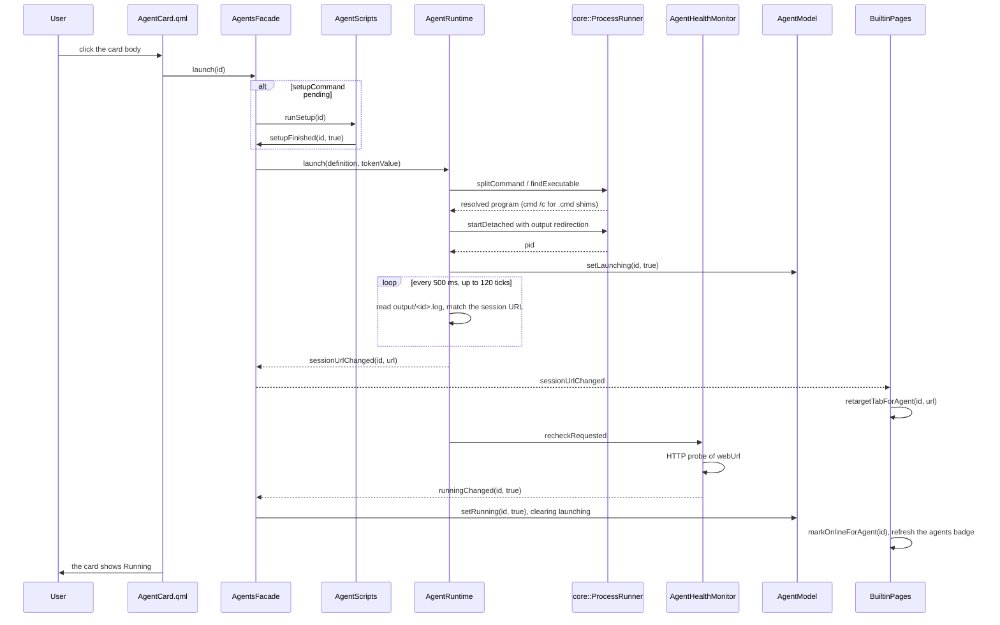

# Agent Launcher

launcher 是 **Agent Launcher** 页面背后的功能：它编目外部 AI 编码 agent、启动它们长期运行的本地
服务、探测它们是否在线、执行一次性 install/update/version/setup 命令，并结束它自己拉起的进程树。
它是整个应用的入口，其它页面要么消费它的状态（Web 标签、侧栏徽标），要么链回它。

用户视角见 [Agent Launcher](../guide/Agent启动器.md)。
架构背景见 [分层与依赖](../architecture/分层与依赖.md) 与
[状态与持久化](../architecture/数据与状态.md)。

## 这个功能做什么，边界在哪

launcher 是**一个目录，加一个针对自己没写过的工具的运行器**。它不实现 agent、不与模型对话、也不
包装 CLI。它的职责是：

- 从 `agents.json` 读 agent 列表，并让随包内置默认保持同步；
- 把长期运行的 `command` 作为 detached 进程启动，记住本次会话的 PID，并在请求时只结束那棵进程树；
- 用 HTTP 探测 `webUrl` 判定「运行中」，绝不嗅探进程；
- 通过共享的脚本运行器执行一次性 `installCommand` / `updateCommand` / `versionCommand` /
  `setupCommand`；
- 产出 agent Web UI 的**最终 URL**（抓到会话 URL 时用它，否则用带可选 token 片段的 `webUrl`），
  交给跨域层。

它明确**不**负责打开 Web UI。`AgentsFacade` 没有 `openWeb`；那是跨域意图
`workbench.openWeb(id)`，由 `WorkbenchContext` 实现——打开一个页面需要同时用到 web 域与导航模型。
留在门面上的目录动作只有 `openConfigDir()`，因为 `WorkbenchContext` 直接委托给它。

## 文件与类清单

`src/agentcatalog/` 下每个源文件都参与这个功能。下表是完整地图，后续小节展开其中值得注意的部分。

| 文件 | 类 / 组件 | 职责 | 与谁协作 |
|---|---|---|---|
| `src/agentcatalog/AgentDefinition.h` | `AgentDefinition` | 仅头文件的结构体，存一个 agent 的持久化字段（`id`、`name`、`command`、`webUrl`、`configDir`、`icon`、`color`、`cardColor`、`installCommand`、`updateCommand`、`versionCommand`、`setupCommand`、`tokenFile`） | `AgentRepository`、`AgentModel`、`AgentRuntime` |
| `src/agentcatalog/AgentState.h` | `AgentState` | 仅头文件的结构体，存一个 agent 的运行期状态（`running`、`launching`、`installed`、`version`、`versionKnown`、`installing`、`setupDone`、`setupping`、`checkingVersion`、`consoleOutput`） | `AgentModel`、`AgentScripts`、`AgentHealthMonitor` |
| `src/agentcatalog/AgentStateStore.{h,cpp}` | `AgentStateStore` | 读写 `agent_state.json`，它只记录哪些 agent 完成过一次性 setup | `AgentScripts`、`AgentsFacade` |
| `src/agentcatalog/AgentRepository.{h,cpp}` | `AgentRepository` | 读写 `agents.json`、每次启动重新套用随包默认、维护 `removed` 列表、分配色板颜色、名称转 slug、解析图标 | `AgentsFacade`、`AgentUrls`（图标） |
| `src/agentcatalog/AgentModel.{h,cpp}` | `AgentModel` | `QAbstractListModel`，把持久化定义与按 id 存的运行期状态合并；持有全部运行期 setter 与面向 QML 的 role 契约 | `AgentRuntime`、`AgentScripts`、`AgentHealthMonitor`、`AgentGridPage.qml` |
| `src/agentcatalog/AgentRuntime.{h,cpp}` | `AgentRuntime` | 启动长期运行的进程、按会话记账 PID、停止/强制停止进程树、轮询捕获的输出找会话 URL | `AgentModel`、`AgentUrls`、`core::ProcessRunner`、`AgentHealthMonitor` |
| `src/agentcatalog/AgentScripts.{h,cpp}` | `AgentScripts` | 用自己的 `core::ScriptRunner` 执行一次性 install/update/version/setup，更新卡片状态并流式上输出 | `AgentModel`、`AgentStateStore`、`core::ScriptRunner` |
| `src/agentcatalog/AgentHealthMonitor.{h,cpp}` | `AgentHealthMonitor` | 按固定间隔对每条不同的 `webUrl` 做 HTTP 探测，发出边沿触发的 `runningChanged` | `AgentModel`、`core::HttpProbe` |
| `src/agentcatalog/AgentUrls.{h,cpp}` | `AgentUrls` | 拼出最终打开的 URL（token 处理）、读 token 文件、从 agent 自身输出里提取会话 URL | `AgentRuntime`、`AgentsFacade`、`WorkbenchContext` |
| `src/agentcatalog/AgentsFacade.{h,cpp}` | `AgentsFacade` | 唯一的 QML 门面：组装上面的对象、接好信号、转发 launch/stop/CRUD，并保留 0.3.0 的 Q_INVOKABLE/信号名 | 本模块全部；`BuiltinPages` |
| `src/agentcatalog/qml/AgentGridPage.qml` | `AgentGridPage` | launcher 页：header 动作、搜索框、显示过滤、卡片网格、空状态、错误弹窗 | `AgentsFacade`、`AgentEditDialog` |
| `src/agentcatalog/qml/AgentCard.qml` | `AgentCard` | 单张 agent 卡片：打开/启动、安装/更新、版本指示、控制台输出面板、低调的停止按钮、右键菜单、就地闪红 | `AgentGridPage`、`AgentsFacade`、`WorkbenchContext` |
| `src/agentcatalog/qml/AgentEditDialog.qml` | `AgentEditDialog` | 单个 agent 的新增/编辑表单，含校验规则与保存/取消 | `AgentGridPage`、`AgentsFacade`、`AgentModel` |
| `src/agentcatalog/CMakeLists.txt` | `awb_agentcatalog` | 本模块的静态库目标 | `awb_core`、`awb_theme` |
| `config/default_agents.json` | 随包默认 | 编译进二进制的内置 agent 定义（Qt 资源） | `AgentRepository` |

## 前端设计

### `AgentGridPage.qml`

页面是 `PageHeader`（标题 "Agent Launcher"）下的一个 `ColumnLayout`。header 带两个页面级动作：
**Add Launcher**（以新增模式打开 `AgentEditDialog`）与 **Restore Defaults**（调
`restoreDefaults()`，写失败时打开错误弹窗）。

header 下面是过滤行：一个 `ASearchField`（"Search launchers..."）加三个显示过滤按钮
**All**、**Running**、**Not installed**，用 `AButton` 的 variant 在 `primary` 与 `ghost`
之间切换来表示当前选中项。搜索与过滤在 `matchesFilter()` 里合并：文本对 `name`、`command`、
`webUrl` 做大小写不敏感匹配；`Running` 只保留 `running`；`Not installed` 只保留 `installed`
为假的行。

两个 `AEmptyState` 覆盖「一个 launcher 都没有」与「没有匹配项」两种情况。可见的卡片网格是
`ScrollView` 里的 `Flow`，每个模型行一个 `AgentCard`，`visible` 绑到 `matchesFilter(model)`。

有一个细节必须保留：可见卡片数**不是**从 `Item.visible` 读出来的。visible 读回的是*有效*可见性，
而 `ScrollView` 在 `shownCount === 0` 时整块隐藏，其中的卡片永远读到 `false`——计数会死锁在 0，
把「无匹配 launcher」空状态钉死在完整的模型上面。因此这里用一个隐藏的 `Repeater`（`counterBox`）
在它自己的 `matches` 属性里镜像过滤结果，再由 `recountShown()` 汇总这些标记。

### `AgentCard.qml`

卡片是单个 agent 的交互面。它的根是 `Item` 而不是 `Rectangle`（原因见下面的角色遮蔽说明）。

- **点击卡片本体**：agent 运行中则 `workbench.openWeb(id)`；否则在不处于启动中/初始化中时
  `agents.launch(id)`。
- **主按钮行**：主 `AButton` 在运行时文案是 **Open**，否则 **Start**。运行时它变成下拉按钮，
  箭头区弹出只有一个条目的菜单 **Open in browser**；启动中或初始化中时禁用并显示转圈。第二个
  按钮是 **Configure**，它发出 `configureRequested(id)` 让页面打开编辑弹窗（卡片不持有弹窗）。
- **版本指示区**（左上）：`checkingVersion` 或 `installing` 时是转圈；探测得出「已安装」时是
  版本标签加一个小 **↻** 更新按钮；探测得出「未安装」时是下载图标（点击安装，运行中则就地闪红
  拒绝）；**没有结论时留空**——探测还没跑，或超时了（三态语义见下文）。
- **控制台输出面板**：状态行与按钮行之间可滚动的等宽文本视图。install/update/setup 运行期间出现，
  失败后保留 5 秒，成功立即隐藏。角上的 × 收起它；右键菜单的 **Show output** 重新调出。
- **停止**：右上角一个刻意低调的 ×，仅在运行时可见。它调 `agents.stop(id)`，并在 `running`
  翻假之前显示转圈。
- **右键菜单**（在卡片上右键）：**Close**/**Start**、**Force Stop**（打开
  `AConfirmDialog`）、**Open in browser**、**Update**/**Install**、**Re-detect version**
  （重跑版本命令；检查在途时禁用）、**Show output**、
  **Configure**、**Open config folder**、**Re-initialize**（仅在配了 `setupCommand` 时可用）。
- **就地错误反馈**：一个挂在 `agents.launchFailed` 上的 `Connections` 对匹配 id 设
  `flashMessage` 与 `flashing`，边框转红、状态标签改显（省略后的）原因，并重启 4 秒计时器。
  完整消息同时由页面级 `AAlertDialog` 展示。`flashing` 是显式布尔值而非绑到 `Timer.running`，
  因为 `Timer.running` 没有 NOTIFY 信号，更新不会传播。

### `AgentEditDialog.qml`

弹窗有两种模式：`agentId` 为空 = **新增**，否则 **编辑**。它挂在 `Overlay.overlay` 下，因此
高度上限以*窗口*而非屏幕为基准——popup 会被所在窗口裁剪，按屏幕算出的高度在窗口比屏幕矮时会把
保存按钮放到够不着的地方。

字段分在四个小节标签下：

- **Basics** —— Name、Command、Web URL、ID、Config directory；
- **Appearance** —— Icon（带实时预览与四个内置图标快捷选择）、Color、Card color；
- **Install & Maintenance** —— Install command、Update command、Version command；
- **Advanced** —— First-run setup command、Token file。

校验写在 readonly 属性里，汇总进 `formValid`：

| 字段 | 规则 |
|---|---|
| `name` | trim 后非空（必填） |
| `command` | trim 后非空（必填） |
| `webUrl` | 匹配 `^https?://\S+$`（必填） |
| `color`、`cardColor` | 空，或 `#RRGGBB`（六位十六进制） |
| `id` | 仅新增模式、且非空时校验：匹配 `[A-Za-z0-9_-]+` 且 `agents.model.indexOf(t) < 0`；留空表示「自动生成」 |

`save()` 收集全部字段文本成 map，调 `agents.addAgent(fields)` 或
`agents.updateAgentFull(agentId, fields)`；失败时弹窗不关，并显示一个点名
`agents.configFilePath()` 的 `AAlertDialog`。

由于弹窗把整个 `agentData` 对象映射到字段文本上，承载这个 map 的属性**不能**叫 `data`——它会
撞上 `QQuickItem` 内建的 `data` 属性组，并静默断掉每一个字段绑定。

## 模型与角色契约

`AgentModel` 是 launcher QML 绑定的唯一模型。它的 role 与名字是契约；名字来自 `roleNames()`，
必须保持稳定，因为卡片直接消费它们。

| Role 枚举 | QML 名 | 来源 |
|---|---|---|
| `IdRole` | `agentId` | 定义 |
| `NameRole` | `name` | 定义 |
| `CommandRole` | `command` | 定义 |
| `WebUrlRole` | `webUrl` | 定义 |
| `ConfigDirRole` | `configDir` | 定义 |
| `IconRole` | `icon` | 定义 |
| `ColorRole` | `color` | 定义 |
| `CardColorRole` | `cardColor` | 定义 |
| `RunningRole` | `running` | 状态 |
| `LaunchingRole` | `launching` | 状态 |
| `InstallCommandRole` | `installCommand` | 定义 |
| `UpdateCommandRole` | `updateCommand` | 定义 |
| `VersionCommandRole` | `versionCommand` | 定义 |
| `SetupCommandRole` | `setupCommand` | 定义 |
| `InstalledRole` | `installed` | 状态 |
| `VersionRole` | `version` | 状态 |
| `VersionKnownRole` | `versionKnown` | 状态（追加在 0.3.0 集合之后） |
| `InstallingRole` | `installing` | 状态 |
| `SetupDoneRole` | `setupDone` | 状态 |
| `SetuppingRole` | `setupping` | 状态 |
| `CheckingVersionRole` | `checkingVersion` | 状态 |
| `ConsoleOutputRole` | `consoleOutput` | 状态 |

由 Qt Quick delegate 匹配模型 role 的方式，衍生出两条结构性规则：

- **delegate 的 `required property` 按「属性名 = role 名」匹配。** 因此 id role 叫 `agentId`
  而不是 `id`，delegate 必须声明完全相同的名字。
- **`AgentCard` 的根是 `Item`，并把每个 role 别名成 `*_p` 属性**（`agentId_p`、`name_p`、
  `color` → `agentColor`、`cardColor_p`……）。如果根是 `Rectangle`，名为 `color` 或 `width`
  的 role 会**遮蔽**视觉属性，主题绑定落到字符串上，卡片会静默保持默认外观。视觉本体（`card`）
  是内层 `Rectangle`；role 别名只是只读的管道。

运行期状态按 id 存储，与行序无关。`setDefinitions()` 会 reset 模型，但保留所有仍然存在的 id 的
状态，因此替换定义列表（例如 **Restore Defaults** 之后）绝不会清空正在运行的卡片。每个运行期
setter 都是只改一个字段并用对应 role 发 `dataChanged` 的槽；未知 id 与值未变都不发信号。

`AgentModel::agent(id)` 返回定义与运行期状态拍平后的 map，供编辑弹窗使用。它是唯一暴露
`tokenFile` 的地方（卡片 role 不含它），并且有意不含 `consoleOutput`。

## 后端设计

### `AgentRepository`

`AgentRepository` 持有 `agents.json` 与「随包内置永远优先」的规则。

- `load()` 读 `<数据目录>/agents.json`（缺失或读不出则从空列表起步），解析根级 `removed`
  数组，然后把 `config/default_agents.json` 重新叠上去：内置 agent 按随包顺序在前（跳过
  `removed` 里的 id），用户自建 agent 保持各自顺序在后。任何差异立即写回。
- `save()` 在模型与随包默认完全一致（无自建、无删除）时逐字节写出
  `config/default_agents.json`。这样开发默认列表时两个文件可 diff。其余情况经
  `core::JsonStore` 的原子写写出 `{ "agents": [...], "removed": [...] }`。
- 根级 `title` 字段已死：窗口标题现在来自 `settings.json`（`window.title`）。残留值只记一条
  INFO 日志。
- 调色板分配会给任何留空 `color` 的 agent 补色。它优先用当前主题的 `agentPalette`（经
  `setAgentPalette()` 注入），回退到 `paletteColorAt()` 里的内置 Catppuccin Mocha 色板。
  `paletteColorFor(index)` 是取模安全的访问器，`load()` 与 CRUD 路径都用它。
- `resolveIcon()` 施加图标回退（`qrc:/icons/default.svg`）；`slugFromName()` 把显示名转小写、
  去标点、把空白与下划线折叠成连字符，最后回退到 `agent`。

### `AgentDefinition`、`AgentState`、`AgentStateStore`

这个拆分是有意的：`AgentDefinition` 是 `agents.json` 存的东西，`AgentState` 是只存在于内存里的
东西——除了 `setupDone`，它由 `AgentStateStore` 持久化进 `agent_state.json`。
`AgentStateStore::load()` 在启动时跑一次；文件缺失或损坏一律视为「从未完成过 setup」。
`markSetupDone()` 在文件写不下去时返回 false，`reset()` 清掉单个 id，让 setup 命令在下次启动前
重跑。

### `AgentsFacade`

`AgentsFacade` 是唯一的 QML 门面，也是本域的组装点。它创建 `AgentRepository`、
`AgentStateStore`、`AgentModel`、`AgentRuntime`、`AgentScripts` 与 `AgentHealthMonitor`，
并把它们接起来：

- 运行期与脚本失败以 `launchFailed(id, message)` 冒泡（0.3.0 的信号名）；
- `AgentScripts::installFinished` 原样转发；
- 运行时的 `recheckRequested` 触发一次立即健康探测；
- `runningChanged` 既向外转发**也**在本地应用（确认运行后清 `launching`、只记真实翻转、
  `setRunning`）；
- `sessionUrlChanged` 向外转发；
- setup 成功会重新进入 `launch()`。

面向 QML 的接口是：

| 成员 | 种类 | 用途 |
|---|---|---|
| `model` | 属性 | 以 `QAbstractItemModel` 暴露的 `AgentModel` |
| `launch(id)` | invokable | setup 未跑先跑 setup，然后启动 |
| `stop(id)` | invokable | 结束本次会话的进程树；没有记账 PID 时返回 false 并上报 |
| `forceStop(id)` | invokable | 杀掉占用该 agent 端口的进程 |
| `openConfigDir(id)` | invokable | 在文件管理器里打开 `configDir` |
| `install(id)`、`updateTool(id)` | invokable | 一次性命令 |
| `checkVersion(id)` | invokable | 重跑该 agent 的版本命令（右键菜单入口）；重置它的重试预算，且不看启动开关——它就是「结论停在不知道」时的出路 |
| `resetSetup(id)` | invokable | 清掉 setup 记录，让它重跑 |
| `hasLaunchedAgents()` | invokable | 本次会话是否启动过东西（退出确认） |
| `stopAll()` | invokable | 结束本次会话启动的全部进程 |
| `addAgent(fields)`、`updateAgentFull(id, fields)`、`removeAgent(id)`、`restoreDefaults()` | invokable | CRUD，全部落盘 `agents.json` |
| `isDefaultAgent(id)` | invokable | id 是否来自随包默认 |
| `sessionUrl(id)` | invokable | 抓到的鉴权会话 URL，没有时为空串 |
| `configFilePath()` | invokable | 错误提示里展示的路径 |
| `launchFailed`、`installFinished`、`runningChanged`、`agentRemoved`、`sessionUrlChanged` | 信号 | 向外事件（见下文） |
| `start()` | 方法 | 套用持久化的 setup 状态、预先标记版本检查，然后启动轮询 |

CRUD 的写法保证落盘失败会回滚模型：`addAgent()` 移除刚插入的行，`updateAgentFull()` 放回旧定义，
`removeAgent()` 放回该行与 `removed` 记录。`addAgent()` 在没给 id 时从名称生成一个，用 `-2`、
`-3`……后缀去重，并当场分配调色板颜色，这样卡片不会坏掉一拍。`removeAgent()` 把被删的内置 id
记进 `removed`（随包默认每次启动都重新生成），然后调 `AgentRuntime::forget(id)`——进程有意继续
运行。

`start()` 把 setup 状态套到卡片上，给每个配了 `versionCommand` 的 agent 预先标上
`checkingVersion` 让首帧就有转圈，然后启动健康轮询与版本检查。

`openWeb` 有意不出现在这个门面上。打开 Web UI 是 `workbench.openWeb(id)`，因为它必须把
agentcatalog 的 URL 与 web 域、导航模型组合起来。

## 业务逻辑：进程生命周期

`AgentRuntime` 是唯一启动长期运行进程的类。完整的启动路径是：

1. 清掉上一次的控制台输出，运行中的卡片绝不能停在过时文本上。
2. `core::ProcessRunner::splitCommand()` 把 `command` 串拆成程序 + 参数（可移植的孪生实现，
   因为 `QProcess::splitCommand` 只有 Qt 6 有）。空命令以 "Startup command is empty." 失败。
3. `core::ProcessRunner::findExecutable()` 经 `PATH` 解析裸程序名，Windows 上应用 `PATHEXT`。
   `CreateProcess` 自己不会试 `.cmd`/`.bat` 扩展名，npm 风格的垫片如 `qwen.cmd` 因此会静默失败。
4. 解析结果若是 `.cmd`/`.bat`，包成 `cmd /c <resolved> <args>`。这同样是一次
   `taskkill /T` 就能覆盖整棵 `cmd → qwen.cmd → node` 树的原因。
5. 工作目录是用户主目录（`QStandardPaths::HomeLocation`）。
6. 定义配了 `tokenFile` 时，其值作为 `QWEN_SERVER_TOKEN` 环境变量注入。token 值从不进日志。
7. stdout 与 stderr 重定向到 `<数据目录>/log/output/<agentId>.log`（`core::Paths::logsDir()`）。
   每次启动会截断该文件。
8. PID 只按 id 记在内存里。
9. `webUrl` 非空时挂一个会话 URL 监视：500 ms 一个刻度、共 120 刻度（60 秒）。每个刻度读输出
   文件并调 `AgentUrls::sessionUrlFromOutput()`；命中后经 `AgentUrls::finalUrl()` 合并 token，
   发 `sessionUrlChanged`。预算耗尽则安静放弃——有些 agent 从不打印 URL。
10. 卡片被标为 `launching`；一个 30 秒的 `QTimer::singleShot` 会清掉它，除非更新的启动推进了
    按 id 的代数（旧的定时器因此清不掉新的启动）。1.5 秒后要求健康监视器尽快复查。

| 行为 | 规则 |
|---|---|
| `stop(id)` | 只杀本次会话记账的 PID（整棵树）。没有记账 PID 时记日志并发 `launchFailed`，告知用户用该 agent 自己的命令停止。它同时丢弃会话 URL——每进程的 token 已随进程死亡。 |
| `forceStop(id)` | 经 `core::HttpProbe::portFromUrl()` 从 `webUrl` 解析端口，按端口找 PID，逐个杀掉。对本启动器从未启动过的 agent 同样有效。它会清掉该 id 记着的 PID，避免之后的普通 `stop()` 去杀一个已经死掉的 PID。 |
| `findPidsForPort(port)` | Windows 上读 `netstat -ano -p tcp`，只保留**本地**地址列以 `:<port>` 结尾的 `LISTENING` 行。用带前导冒号的本地列匹配，既避开外部地址列，也避开 `:3000` 误中 `:53000` 这类更长端口。其它平台用 `lsof -ti :<port>`。 |
| `stopAll()` | 杀掉全部记账 PID（退出时调用）并清空全部状态。 |
| `forget(id)` | 丢掉该 id 的 PID、launch 代数与会话 URL，但让进程继续运行——agent 从配置里被移除时用。 |
| `hasLaunchedAgents()` | 至少记着一个 PID 时为真；退出确认用它。 |

下面这张图从点击卡片一路跟到运行态。有未完成的 `setupCommand` 时，首次启动先走一次性命令路径，
否则直接启动 agent 进程。

## 业务逻辑：一次性命令

`AgentScripts` 持有 install、update、version 与 setup。每次运行都走它自己的
`core::ScriptRunner`，key 形如 `"<operation>:<id>"`。一个操作一个 key 意味着同一 agent 上的并发
操作（安装期间查版本）互不相杀。运行器按 key 的 epoch 还让陈旧回调无害。

| 操作 | 运行器调用 | 超时 | 通道 | 说明 |
|---|---|---|---|---|
| install | `runShell` | 无 | 合并 | agent 运行中拒绝；未配置命令时拒绝 |
| update | `runShell` | 无 | 合并 | 前置条件同 install |
| setup | `runBatch` | 30 秒 | 合并 | 先把命令写进临时 `.cmd` 文件 |
| version | `runShell` | 20 秒 | 分开 | 有些工具把版本打到 stderr；超时的那轮会重试一次（见下文） |

`runSetup()` 用批处理文件，是因为 `QProcess` 把内嵌引号转义成 `\"`，而 `cmd.exe` 读错；运行文件
绕开引号问题。成功时它调 `AgentStateStore::markSetupDone()`；只有这时模型才翻 `setupDone`，
写失败只告警说 setup 下次还会重跑。setup 失败经 `launchFailed` 上报，消息里带命令原文与捕获输出。

版本探测先对 stdout 调 `core::TextUtils::extractVersion()`，再对 stderr 调。退出码为 0 **或**
解析出非空版本串都算已安装——有些工具 `--version` 就是非零退出。转圈保证至少亮 500 ms，由按 id
的代数守卫，迟到的定时器清不掉更新的检查。

结论是三态的，由 `versionKnown` role 承载：

- **命令跑完了**（无论退出码，拿到了输出）：**权威**结论。写入 `installed` 与 `version`、
  `versionKnown` 翻真——卡片显示版本标签或下载图标。
- **超时或没能启动**：「不知道」，**不是**「未安装」。上次的 `installed` 与 `version` 原样保留，
  `versionKnown` 翻假，卡片两个都不显示。在杀软对新进程做串行扫描的机器上，拉起版本命令本身
  就可能超过超时（实测冷启动 5~12 秒）；把它报成「未安装」曾让整页卡片错白一整个会话——
  三态设计修的就是它。
- **从未探测**（启动开关关着，或没配命令）：同样是「不知道」，显示相同。

瞬时失败会安排**一次** 3 秒后的自动重试（`kVersionRetryLimit`），同样受代数守卫：更新的显式
检查会作废在途的重试。预算用尽后结论停在「不知道」并记一条告警；下一次显式 `checkVersion()`
——右键菜单条目，或 install/update 之后的自动复查——会重置预算。

启动时各 agent 的检查**错峰**出发（间隔 1.5 秒，第一个立即）：N 个并发的 `cmd /c` 会在同一
个进程创建瓶颈后面排队、集体超时——上面的故障模式正是在那里观察到的。转圈由
`AgentsFacade::start()` 在任何 QML 帧之前预先点亮，错峰只推迟真实起进程的时机，界面上没有
空档。错峰、超时与重试间隔是实例成员，测试可注入毫秒级数值
（`setVersionProbeTimingForTesting()`）。

install/update 运行期间把输出流式写进模型，结束时写入权威的完整文本（中途的 chunk 只带增量）。
install/update 结束后会重跑一次版本检查以刷新卡片。

## 业务逻辑：健康探测

`AgentHealthMonitor` 轮询每条不同的非空 `webUrl`。语义来自 `core::HttpProbe`：**任何** HTTP
响应（含 4xx/5xx）都算运行中；连接被拒或超时算已停止。有意不做进程嗅探。

- 间隔来自 `launcher.healthCheckIntervalMs`（默认 3000 ms），由 `AgentsFacade` 传入。
- 仍在途的 URL 在本轮跳过，慢到的旧应答因此永远盖不过更新的状态，且共享同一 `webUrl` 的多个
  agent 每轮只花一次请求而不是各发一次。
- `runningChanged` 是**边沿触发**：状态不变不发。这是硬要求而非优化——稳定「运行中」若每轮重发，
  会把每个 `error` 标签不停拉回 `loading`（修好之前，token 门禁页面实际出现过 1 秒一次的加载-
  重试死循环）。

`launch()` 与 `stop()` 会要求立即复查，让卡片尽快翻转：启动后 1.5 秒，杀掉后 0.5 秒。

## 跨域接线

launcher 的状态必须到达 web 域与侧栏，而唯一允许同时认识两者的地方是 `BuiltinPages`。

- `runningChanged(id, running)` 驱动 `WebTabsFacade::markOnlineForAgent()` 或
  `markOfflineForAgent()`，标签因此跟随 agent 的生命周期。
- `agentRemoved(id)` 经 `closeTabsForAgent()` 关掉该 agent 的标签。
- `sessionUrlChanged(id, url)` 经 `retargetTabForAgent()` 把已打开的标签指向新 URL，免得它停在
  会被 token 门禁回 401 的裸 `webUrl` 上。
- **agents** 侧栏徽标显示运行中的 agent 数，为 0 时不显示。它在限定 `RunningRole` 的
  `dataChanged` 与 `rowsInserted` / `rowsRemoved` 上刷新，启动时先算一次初值。

真正打开 UI 的是 `WorkbenchContext::openWeb(id)`：它优先用抓到的会话 URL 而不是
`AgentUrls::finalUrl(def)`，填好 `agentId`、`url`、`title`、`icon`、`color`，调
`WebTabsFacade::openTab()`，有标签 id 返回时导航到 `web` 页。

## 坑与约定

每一条都有原因，不要把它「简化」掉。

- **delegate 的角色遮蔽。** `required property` 按名字匹配 role，而 `Rectangle` 根上名为
  `color` 的 role 会遮蔽视觉 `color`，主题绑定落到字符串上、卡片保持默认外观。因此 `AgentCard`
  用 `Item` 根加 `*_p` 别名再加内层 `Rectangle`；`WebTabsPage` 的标签 delegate 用同一模式。
- **hover 独占投递。** 本仓库里 `hoverEnabled` 的 `MouseArea`/`Control` 会吞掉 hover 投递，
  根部 `HoverHandler` 在它们上面会丢态。`AgentCard` 把所有会吞 hover 的子项并进一个 `hovered`
  判据；新增会吞 hover 的子项必须同样并入，否则指针移到该子项上时聚光/增亮会闪断。
- **tooltip 约定。** 附加式 `ToolTip` 配 `delay: 300`、`timeout: 10000`，delegate 宿主加
  `Component.onDestruction: ToolTip.hide()`。共享 tooltip 比 delegate 长命，否则卡片被过滤变化
  销毁时会冻结在屏上。
- **不要把属性命名为 `data`。** `AgentEditDialog` 承载映射后 agent 字段的属性不能用这个名字；
  它会撞上 `QQuickItem` 的 `data` 属性组并静默断掉字段绑定。
- **不要用 `Item.visible` 数行。** 空状态计数器用永远隐藏的 delegate 加显式 `matches` 标记
  （见 `AgentGridPage.qml`）。在隐藏的 `ScrollView` 里读有效可见性会把计数死锁在 0。
- **token 与 URL 处理。** `AgentUrls::finalUrl()` 把 token 以 `#token=` 片段追加，绝不作为查询
  参数——片段从不发给服务器，因此不进访问日志与 `Referer` 头。base 已含 `token=` 时原样返回，
  dsh 的会话 URL 因此不会被叠第二个 token；base 已有片段时用 `&` 连接。`launch()` 把
  stdout+stderr 重定向到 `log/output/<agentId>.log`，但**会话 URL 本身从不进日志**——它带着
  token。任何可能被人或第三方读到的 URL 都要用脱敏形式（见 [Web 标签](Web标签页.md)）。

## 相关

- [Web 标签](Web标签页.md) —— 消费 `runningChanged`、`agentRemoved`、`sessionUrlChanged` 的标签模型。
- [WebEngine 适配层](WebEngine适配层.md) —— 渲染打开 URL 的内嵌表面。
- [Workbench 与页面](workbench与页面.md) —— `BuiltinPages` 与 `WorkbenchContext`，跨域规则所在。
- [开发板块索引](index.md)
- 用户视角：[Agent Launcher](../guide/Agent启动器.md)
- 架构：[状态与持久化](../architecture/数据与状态.md)、
  [分层与依赖](../architecture/分层与依赖.md)、
  [前端设计](../architecture/前端设计.md)
