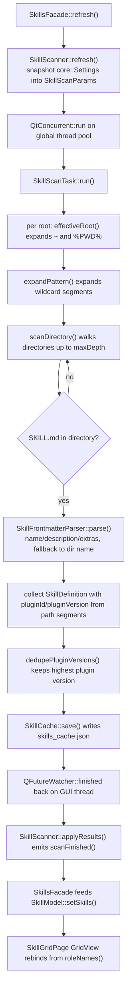

# Skills 浏览器

## 这个功能做什么

Skills 页把本机上已经存在的 `SKILL.md` 编目出来：扫描一组可配置的根、解析每个
文件的 YAML frontmatter、以可搜索可过滤的卡片网格呈现，并对发现的路径提供复制
与打开动作。

它的边界刻意收窄：

- 它**不**执行、不安装、不更新、不校验 skill。一个 skill 就是含 `SKILL.md` 的
  目录，这一页不运行它。
- 它**不**编辑 `SKILL.md`、不创建 skill。本功能唯一的写入是 `settings.json`
  （根清单）与自己的缓存文件 `skills_cache.json`。
- 它**不**拥有页面几何。`SkillGridPage.qml` 由 shell 的 `Workspace` 装载，随时
  可被销毁重建；列表状态全部在 C++ 侧的 `SkillModel` 里。

面向用户的操作方式（按钮做什么、怎么配置根）归 Guide；本文讲功能是怎么实现的。

## 文件与类清单

| 文件 | 类 / 组件 | 职责 | 与谁协作 |
|---|---|---|---|
| `src/skillcatalog/SkillDefinition.h` | `SkillDefinition` | 一条扫描记录：frontmatter 字段 + 定位/统计字段；`operator==`/`operator!=` 提供整记录相等 | `SkillModel`、`SkillScanTask`、`SkillCache` |
| `src/skillcatalog/SkillFrontmatter.h` | `SkillFrontmatter`、`SkillFrontmatterParser` | 解析结果结构体与 `---` 块的极小 YAML 子集解析器 | `SkillScanTask` |
| `src/skillcatalog/SkillFrontmatter.cpp` | `SkillFrontmatterParser::parse()` | 解析器实现（引号、展平、块标量） | `SkillScanTask` |
| `src/skillcatalog/SkillRoot.h` | `SkillRoot`、`SkillRoots` | 一个扫描根；`SkillRoots::defaults()` 与 `fromJson()` 负责清单转换 | `SkillScanner`、`SkillScanTask`、`SkillsFacade` |
| `src/skillcatalog/SkillRoots.cpp` | `SkillRoots` | 内置根清单与 `skills.roots` 条目解析 | `SkillScanner`、`SkillScanTask` |
| `src/skillcatalog/SkillScanTask.h` | `SkillScanParams`、`SkillScanTask`（含 `Stats`、`Result`） | 一次扫描的输入快照与纯静态 worker | `SkillScanner` |
| `src/skillcatalog/SkillScanTask.cpp` | `SkillScanTask::run()` | 遍历、frontmatter 解析、插件版本去重、逐根计时 | `SkillScanner` |
| `src/skillcatalog/SkillScanner.h` | `SkillScanner` | GUI 侧协调者：持有根清单与最近结果、派发 worker 到线程池、对 `refresh()` 防抖 | `SkillsFacade`、`SkillCache`、`core::Settings` |
| `src/skillcatalog/SkillScanner.cpp` | `SkillScanner` | `refresh()`、`adoptResults()`、`setRootEnabled()` | `SkillCache`、`SkillScanTask` |
| `src/skillcatalog/SkillCache.h` | `SkillCache`（含 `Snapshot`） | 首屏缓存：读写 `<dataRoot>/skills_cache.json` | `SkillScanner`、`SkillsFacade::start()` |
| `src/skillcatalog/SkillCache.cpp` | `SkillCache::load()/save()/filePath()` | JSON 序列化与原子写 | `core::Paths`、`core::JsonStore` |
| `src/skillcatalog/SkillModel.h` | `SkillModel` | 内存内搜索、分面多选过滤与排序的列表模型 | `SkillsFacade`、`SkillGridPage.qml` |
| `src/skillcatalog/SkillModel.cpp` | `SkillModel::setSkills()`、`refilter()` | 主数据替换与投影重算 | `SkillsFacade` |
| `src/skillcatalog/SkillsFacade.h` | `SkillsFacade` | QML 门面：模型、根属性、统计、扫描信号、复制/打开 invokable | `SkillGridPage.qml`、`SkillCard.qml`、`SkillDetailFlyout.qml`、`SettingsSkillsPage.qml`、`MainWindow.qml` 的 `skills` 别名 |
| `src/skillcatalog/SkillsFacade.cpp` | `SkillsFacade` | 装配、`start()`、根的增删启停、剪贴板与文件管理器动作 | `core::Settings`、`core::OpResult`、`SkillScanner` |
| `src/skillcatalog/qml/SkillGridPage.qml` | `SkillGridPage` | 主页：带 Rescan 的头部、搜索框、kind 分面、排序框、骨架屏、两个空状态、`GridView`、统计尾行 | `skills.*`、`SkillCard`、`PageHeader`、`ASearchField`、`AComboBox`、`AEmptyState`、`AWorkspaceGlow` |
| `src/skillcatalog/qml/SkillCard.qml` | `SkillCard` | 玻璃卡 delegate：悬停升举、400 ms 延迟开 `SkillDetailFlyout`、右键菜单、复制/打开动作 | `skills.*`、`SkillDetailFlyout`、`AMenu`、`AIconButton`、`APill`、`ASpotlight` |
| `src/skillcatalog/qml/SkillDetailFlyout.qml` | `SkillDetailFlyout` | 非模态悬停浮层：元数据表与 `extras` 展开、边缘翻转、延迟关闭 | `skills.skill()`、`APill` |
| `src/skillcatalog/CMakeLists.txt` | 构建目标 `awb_skillcatalog` | 静态库，链接 `awb_core`/`awb_theme`/`Qt::Gui`/`Qt::Concurrent` | — |

模块之外，本功能依赖 `core::Settings::SkillsSettings`（`skills.roots` /
`includePluginCaches` / `maxDepth`）、`core::EnvExpander`、
`core::Paths::skillCacheFile()`、`core::OpResult`、shell 的 `A*` 组件以及
workbench 门面（`workbench.showPage()`、`workbench.notify()`）。

## 前端设计

### `SkillGridPage.qml`

页面是一个 `ColumnLayout`：`PageHeader` → 工具栏行 → 骨架屏/空状态/网格 →
统计尾行。

- **底衬。** `AWorkspaceGlow` 声明在最前、铺满页面，让上层半透明玻璃卡有光可透。
- **`PageHeader`。** 标题 `Skills`、副标题写 `SKILL.md` 根；`Rescan` 动作的
  `busy` 绑 `skills.scanning`，`onClicked` 调 `skills.refresh()`。
- **工具栏。** 一个 `ASearchField` 写 `skills.model.searchText`；一个 `Flow` 分面
  按钮行（`All` 按钮 + 对六个 kind id 的 `Repeater`，文案经 `skills.kindLabel()`）；
  一个 `AComboBox`，三个条目分别对应 `skills.model.sortMode`。
- **分面切换。** `applyFacet(kind)` 维护局部数组：已选中的移除、未选中的追加，
  再把数组赋给 `skills.model.activeKinds`；传空串清空选择。
- **骨架屏。** 六个脉冲 `Rectangle` 加一行说明，仅在
  `skills.scanning && skills.model.totalCount === 0`（首次扫描且无缓存）时可见。
  已有数据时的后台重扫不打扰网格。
- **两个空状态。** 一个是「一个 skill 都没有」（动作跳
  `workbench.showPage("settings")`），一个是「过滤后为空」（清搜索文本与
  `activeKinds`）。二者用 `skills.model.totalCount` 区分。
- **`GridView`。** 列数走整数除法
  （`Math.max(1, Math.floor((width + theme.spacingL) / (page.cardMinWidth + theme.spacingL)))`），
  `cellWidth` 取整保证 `columns * cellWidth <= width`；`cellHeight` 是卡高加一列间距。
  `cacheBuffer: 360`、`reuseItems: true`、一个 `spacingXs` 高的 `header` 项（给悬停
  升举留余量）以及 `AScrollBar.vertical`。delegate 是 `SkillCard`，数据来自模型 role。
- **统计尾行。** 一个 `Label` 绑 `skills.statsText`，`skills.partialFailure` 为真时
  染 `theme.warning`。

### `SkillCard.qml`

每张卡是复刻 `AgentCard` 配方的玻璃卡：半透明 `surfaceBg`（0.62，悬停提亮到
0.78）、accent 极淡纱层、悬停加深纱层、1 px 内缘高光（仅深色主题）以及
`ASpotlight` 指针聚光。悬停升举用 `Translate` 变换加 `z`，绝不改卡的 `x`/`y`
（那是网格写的）。

- **悬停判据。** `hovered: hoverHandler.hovered`。Qt 的 hover 是独占投递，卡内因此
  不放带 hoverEnabled 的 `Control`（路径 tooltip 用被动的 `HoverHandler`）；任何
  会吞 hover 的子项都必须并进这个判据。
- **延迟浮层。** 一个 400 ms 的 `Timer` 在悬停时打开 `SkillDetailFlyout`，打开前
  先取消浮层待定的关闭；离开时停表并调浮层的 `tryCloseLater()`。
- **惰性弹层。** 浮层藏在 `active: false` 的 `Loader` 后，首次悬停才创建并常驻
  复用，从未悬停过的卡不付 `Popup` 全价。
- **`onSkillFilePathChanged`。** 因为 `reuseItems` 会回收 delegate，卡片可能被重绑
  到另一个 skill；该处理器停掉悬停计时并收起浮层，旧卡的悬停状态不跟着搬走。
- **动作。** 左键与回车调 `copyPath()`；Ctrl+Enter 打开目录；右键弹 `AMenu`：
  Copy path / Copy SKILL.md path / Copy name / Open containing folder /
  Reveal SKILL.md。全部经 `skills.*`，结果经 `workbench.notify()`。
- **滚轮。** `onWheel` 收起浮层并把 `wheel.accepted` 置 false，网格照常滚动
  （见「坑与约定」里的 `WheelHandler.blocking`）。
- **键盘。** `activeFocusOnTab: true`（不是 `focus: true`）且
  `Component.onDestruction: ToolTip.hide()`。

### `SkillDetailFlyout.qml`

一个 `Popup`：`modal: false`、`focus: false`、`closePolicy: Popup.NoAutoClose`、宽
420 px，高度由内容驱动——外层 `ColumnLayout` 提供隐式高度，`Flickable` 以
`320 - 2 * padding` 封顶、超出即滚动。

- `info` 是经 `skills.skill(skillFilePath)` 填充的 `readonly property var`。
- 弹层上的 `HoverHandler` 在进入时取消待定关闭、离开时重新武装；`tryCloseLater()`
  置 `closePending` 并重启 300 ms 的 `Timer`，`cancelClose()` 清标记。指针从浮层
  直接移到页面空白处时已没有卡片悬停可触发关闭，这正是浮层自己也要有离开处理器
  的原因。
- 主体展示名称 + kind 胶囊、根标签、描述、`GridLayout` 元数据表（SKILL.md 路径、
  修改时间、大小）以及每个 `extras` 键一行的 `Repeater`。
- 浮层 `Flickable` 的 `contentHeight` 在布局完成后与 `implicitHeight` 变化时经
  `Qt.callLater` 异步回填，避开同步读取造成的绑定循环。
- 按键处理挂在卡片上而非弹层（`Keys` 只能附加到 `Item`，而 `Popup` 是 `QObject`）。

## 后端设计

### `SkillDefinition`

一个纯值结构体：`name`、`description`、`skillFilePath`、`dirPath`、`rootId`、
`rootLabel`、`kind`、`pluginId`、`pluginVersion`、`lastModified`、`sizeBytes`、
`extras`。`operator==` 逐字段比较，存在的意义是让 `SkillModel::setSkills()` 能短路：
后台扫描产出的定义与缓存已恢复的一致时跳过 `modelReset`，QML 不会销毁重建整页。

### `SkillFrontmatterParser`

刻意只支持一个 YAML 子集，不是通用解析器：

- 块必须从 `---` 行开始、以另一条 `---` 行结束；未闭合按「没有 frontmatter」
  处理（`valid == false`）。
- 容忍 UTF-8 BOM 与 CRLF/CR。
- `key: value` 行：键名字符集是字母、数字、`.`、`-`、`_`。
- 值可用单引号或双引号包裹；`\"`、`\\`、`''` 会被反转义。
- 嵌套映射展平成 `parent.child` 键（如 `metadata.author`）。
- `>` 折叠与 `|` 字面块标量（含 `>-`/`>+`/`|-`/`|+` 变体）跨缩进行收集并折算。
- 带缩进的续行与 `- item` 列表行按文本拼到当前键的值上；本子集不区分列表与
  多行文本。
- 注释只按「整行 `#`」识别；空行跳过。
- `name` 与 `description` 有专属字段，其余标量键进 `extras`。

解析失败、或 `name` 为空时，扫描侧回退到目录名。

### `SkillRoot` / `SkillRoots`

`SkillRoot` 是 `{id, label, path, kind, enabled, recursive, dedupeScope}`，`isValid()`
要求 `id` 与 `path` 都非空。路径以**原样**形式存放（见业务逻辑一节）。

`SkillRoots::defaults()` 返回六个根：`agents`（`~/.agents/skills`）、`claude`
（`~/.claude/skills`）、`codex`（`~/.codex/skills`）、`zcode-plugins`
（`~/.zcode/cli/plugins/cache/*/*/*/skills`，`kind == "plugin"`、
`dedupeScope == "marketplace-plugin"`），以及项目根 `project-agents` /
`project-claude`（`%PWD%/.agents/skills`、`%PWD%/.claude/skills`）。

`SkillRoots::fromJson()` 跳过非对象条目与 `path` 为空的条目；`kind` 缺省
`custom`，`id` 缺省 `kind + "-" + 序号`，`enabled` 缺省 true，`kind == "plugin"`
的条目补去重域。空数组得到空列表，调用方按「用默认」处理。

### `SkillScanner`

持有当前根清单与最近结果，也是唯一涉及线程的地方：

- `roots()` 返回配置清单；未配置过时返回默认清单。
- `setRootEnabled(id, enabled)` 把**完整生效清单**写回 `skills.roots`（一旦
  非空，`skills.roots` 就完全取代默认清单），再重新解析。
- `refresh()` 立即返回。它先把 `core::Settings` 快照成值类型 `SkillScanParams`，
  置 `m_scanning`、发 `scanningChanged()` 与 `scanStarted()`，再用
  `QtConcurrent::run()` 在全局线程池跑 `SkillScanTask::run()`；同一个 worker
  lambda 里顺手调 `SkillCache::save()`，磁盘 IO 不占 GUI 线程。以 scanner 为父
  的 `QFutureWatcher` 把 `finished` 带回 GUI 线程落地结果并复位 `m_scanning`。
- `adoptResults()` 让缓存恢复的数据走与真扫描相同的 `applyResults()` 落地路径，
  但不发 `scanStarted()` 与 `scanningChanged()`。
- `scanningChanged()` 只在 `m_scanning` 真实翻转时发；骨架屏动画与 Rescan 转圈
  挂在它上，重复发射会重放动画。

### `SkillScanTask`

无状态的纯静态 worker。`SkillScanParams` 携带 `roots`、`maxDepth` 与
`includePluginCaches`；`run()` 返回 `Result { definitions, stats }`。输入是值类型
快照、不含任何 `QObject` 指针，因此可以整个跑在 GUI 线程之外（`core::Settings`
是 `QObject`，必须留在 GUI 线程）。worker 对每个根展开占位符、展开通配符、遍历
目录，并用 `AWB_PERF` 记录逐根耗时。

### `SkillCache`

封装 `<dataRoot>/skills_cache.json`（经 `core::Paths::skillCacheFile()`）。
`load()` 校验 `kFormatVersion`；版本不符、文件缺失或 JSON 损坏都得到 invalid 的
`Snapshot` 且不告警，因为「首次启动」与「缓存过期」都是正常路径、后续扫描会自愈。
没有跨版本迁移。`save()` 经 `core::JsonStore` 原子写，由 worker 线程调用。

### `SkillModel`

一个 `QAbstractListModel`，主数据是 `m_all`（完整扫描结果），可见投影是
`m_visible`。`setSkills()` 替换 `m_all`，并在新列表与现状相等时短路。`refilter()`
先按 kind 集合过滤、再按 name/description/dirPath 的小写子串匹配过滤，然后排序，
最后 `beginResetModel()`/`endResetModel()`。属性有 `searchText`、`activeKinds`
（空 = 全部）、`sortMode`（`name`/`modified`/`kind`）与 `count`/`totalCount`。
自定义的 `Roles` 枚举与 `roleNames()` 是对 QML delegate 的契约。

### `SkillsFacade`

QML 入口。属性：`model`（CONSTANT）、`scanning`、`roots`（NOTIFY
`rootsChanged`）、`statsText` 与 `partialFailure`（NOTIFY `statsChanged`）。
invokable：`refresh()`、`setRootEnabled(id, enabled)`、`addRoot(path)`、
`removeRoot(id)`、`copyPath()`、`copySkillFile()`、`copyName()`、`openFolder()`、
`revealSkillFile()`、`skill(skillFilePath)`、`kindLabel(kind)`。`start()` 由
`app/main.cpp` 在装配期调用、QML 不调：它同步恢复缓存让页面立刻有数据，随后发起
后台扫描。

`kindLabel()` 下沉到 C++，是因为同一段字面 switch 曾在 QML 里抄了两份、`lupdate`
看不见它；只有一处 C++ 实现才能保住翻译维护。

## 业务逻辑

下图追踪一次 `skills.refresh()` 从 GUI 线程进入 worker 再回来的过程，节点是
真实参与的类与函数。

### `skills.roots` 与内置默认的关系

`skills.roots` 为空表示「用六个内置根」。一旦持久化了任何根清单，它就**完全取代**
默认清单，包括各根的启用标志。这也是 `setRootEnabled()` 序列化完整生效清单、而
不是只序列化被切换那一个根的原因：从未自定义过的用户，也能让某个根的禁用状态活
过重启。

### 路径原样存取

路径以原样形式存放（`~`、`%PWD%`、通配符）。展开只发生在扫描期：`SkillScanTask`
的 `effectiveRoot()`（把 `%PWD%` 换成当前目录，并调 `core::EnvExpander::expand()`
展开 `~` 与 `%VAR%`）与 `expandPattern()`（展开 `*` 段）。理由是持久化：若在读取时
展开，`setRootEnabled()` / `addRoot()` 会把展开后的形式回写，把某台机器的 home
目录或工作目录固化进 `settings.json`。原样形式绝不许以展开形式写回。

### `includePluginCaches` 与 `maxDepth`

`includePluginCaches`（默认 true）决定是否扫描 `kind == "plugin"` 的根。`maxDepth`
（默认 6，由 `core::Settings` 钳制在 1..32）限定目录递归深度。目录一旦含
`SKILL.md` 就被当作一个 skill，遍历就此停止；否则继续下探（含隐藏目录）。

### 插件缓存版本去重

插件缓存会把同一插件的多个版本并存。遍历结束后 `dedupePluginVersions()` 对每个
skill 只保留最高版本：

- 键是 `<rootId>|<pluginId>|<skill name>`，因为一个插件会发布多个 skill，只有同名
  skill 才在版本之间竞争。
- `pluginId` / `pluginVersion` 从相对根固定前缀的路径段里剥出：在布局
  `<base>/<marketplace>/<plugin>/<version>/skills/<skill>` 中，`skills` 之前的那段
  是版本，再往前的都是插件 id。
- `versionLess()` 对点分段比较：两段都能转数字时按数字比，否则按字符串比；缺段按
  空串处理。
- 同版本重复也丢弃（先到者胜）。每次丢弃使 `Stats::duplicatesDropped` 加一。

### 首屏缓存

`SkillsFacade::start()` 在 GUI 线程上同步加载 `skills_cache.json`（小文件，毫秒级）
并采用其结果，让页面立刻可渲染；随后 `refresh()` 发起真扫描。缓存自身不做任何
失效判断：启动总会发一次扫描，根或目录的变化会在扫描落地时自然修正。

### 线程契约

GUI 线程协调者（`SkillScanner`）与纯静态 worker（`SkillScanTask::run()`、
`SkillCache::save()`）彼此分离。worker 只碰值类型副本，因为 `core::Settings` 是
`QObject`、不能跨线程；参数在派发前被快照进 `SkillScanParams`，结果经
`QFutureWatcher::finished` 回来。

### 扫描防抖

`m_scanning` 为真时再次 `refresh()` 会被忽略。根清单本来就是 settings 的实时
快照，排队第二次扫描没有意义；`scanningChanged()` 只在 `m_scanning` 真实翻转时发。

### 坏根

被禁用的根、被 `includePluginCaches` 排除的 plugin 根、或磁盘上不存在的根会被
跳过并计入 `Stats::rootsSkipped`，其 label 追加到 `skippedRoots`。一个坏根不会让
整次扫描失败；`SkillsFacade::partialFailure()` 报告它，页面尾行展示它。

## 坑与约定

- **`roots` 必须是带 NOTIFY 的 `Q_PROPERTY`。** 裸 `roots()` 方法在
  `addRoot`/`removeRoot`/`setRootEnabled` 之后永远不会触发 QML 重绑；属性加
  `rootsChanged` 才是设置页列表能刷新的原因。
- **`awb::core::OpResult` 必须写全限定名**，作为 `copyPath`/`copySkillFile`/
  `copyName`/`openFolder`/`revealSkillFile` 的返回类型。Qt 5 的 moc 按书写形式记录
  返回类型名，而 QML 调用端按 `QMetaType` 注册名（类全名）解析；短名会抛
  "Unknown method return type"，调用静默失效。
- **`kindLabel()` 是唯一来源**，Skills 的分面按钮与设置页根列表共用，让 `lupdate`
  看得见这些源串。
- **`GridView` 的整数除法。** 列数按整数除法算，`cellWidth` 向下取整才能保证
  `columns * cellWidth <= width`；浮点偏高会多算一列、出横向滚动条。`cellWidth`
  还有 `spacingL` 下限，保证卡宽不为负。
- **`WheelHandler.blocking` 是 Qt 6.2 才有的属性。** 赋值会让整个 `SkillCard`
  在 Qt 5 下加载失败，所以卡片改用 `wheel.accepted = false` 透传。
- **用 `activeFocusOnTab` 而非 `focus`。** 给每个 delegate 设 `focus: true` 会让
  最后创建的卡片抢走页面初始焦点；`activeFocusOnTab` 让卡片可 Tab 聚焦但不这么做。
- **`Component.onDestruction: ToolTip.hide()`** 在卡片与浮层 extras 行上都要有：
  附加式 `ToolTip` 每窗口共享一个可视化 tooltip，悬停宿主死掉会把它冻在屏上。
- **hover 是独占投递。** 卡内用被动的 `HoverHandler`（而不是 `hoverEnabled` 的
  `MouseArea`），卡片自己的悬停态与各处 tooltip 才不会失效。

## 改动检查清单

- [ ] `src/skillcatalog/` 下新增/改名文件已加进 `src/skillcatalog/CMakeLists.txt`。
- [ ] 新增/移动的 `.qml` 已登记进 `app/CMakeLists.txt`（`_skillcatalog_qml` 与
      alias），若含 `qsTr()` 还要加进 `cmake/AwbTranslations.cmake` 的
      `AWB_TS_SOURCES`。
- [ ] 改了缓存结构就递增 `SkillCache` 的 `kFormatVersion`；旧文件按「无缓存」处理，
      不做迁移。
- [ ] 模型 `roleNames()` 的名字与顺序仍与 `SkillGridPage.qml` 的 delegate 匹配。
- [ ] `awb::core::OpResult` 返回类型仍是全限定名。
- [ ] `bash scripts/build.sh --test` 全绿，含 `check_architecture`。

## 相关

- [Agent Tools](AgentTools.md) —— 另一个扫描用户目录的页面，也是共享 `A*` 组件的
  第二个消费者。
- [Shell 与导航](外壳与导航.md) —— `SkillGridPage.qml` 如何注册与装载。
- [设置](设置.md) —— 设置页的 Skills 分区与 `skills.*` 键。
- [Skills（使用）](../guide/技能.md) —— 面向用户的描述。
- [前端设计](../architecture/前端设计.md) —— 玻璃卡配方与 `A*` 组件货架。
- [分层与依赖](../architecture/分层与依赖.md) —— 为什么
  `skillcatalog` 不许依赖 `shell` 或其它领域。
