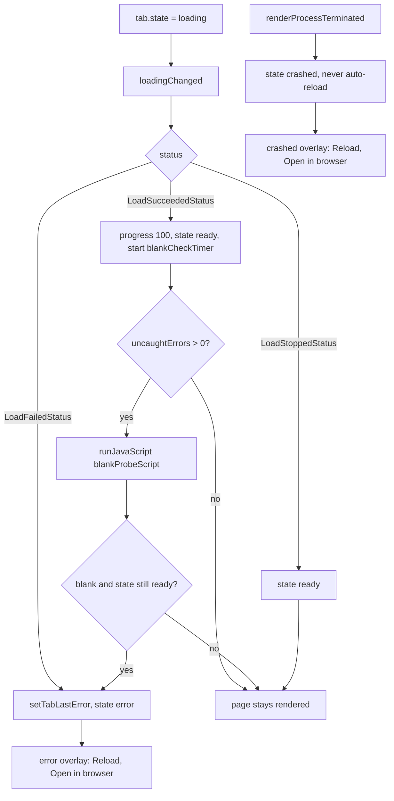

# WebEngine 适配层

适配层是隔离内嵌浏览器引擎的那一层。它注册 `embedded` Web 表面、为每个 agent 持有一个持久浏览器
profile、桥接 Qt 5 / Qt 6 的 WebEngine API 差异、为旧引擎注入 JavaScript polyfill，并用覆盖层兜底
渲染每个标签。它也是**唯一**链接 Qt WebEngine 的 CMake 目标。

用户视角见 [Agent Web UI](../guide/网页界面.md)。
架构背景见 [分层与依赖](../architecture/分层与依赖.md) 与
[C++ 库设计](../architecture/C++库设计.md)。
背景调研见 [WebEngine 内嵌](../research/webengine-embedding.md)。

## 为什么单独一层

领域模块 `awb_web` 从不 include 任何 WebEngine 头。所有引擎相关内容都在兄弟目标
`awb_web_webengine` 里：

- `src/web/CMakeLists.txt` 仅在 `AWB_ENABLE_WEBENGINE` 为 `ON` 时加入 `webengine/`。
- 该目标是唯一链接 `${AWB_WEBENGINE_TARGET}`（Qt 6 为 `Qt::WebEngineQuick`，Qt 5 为
  `Qt::WebEngine`）并引入 WebEngine 私有包含目录的目标。

好处是 `AWB_ENABLE_WEBENGINE=OFF` 构建出完全可用的应用：`embedded` 表面从不注册，
`WebTabsFacade::engineAvailable()` 为 false，`openTab()` 降级到系统浏览器。标签模型里没有任何
代码需要知道引擎是否存在。

`QQuickWebEngineView` 在**两个大版本上都是私有 API**——公共包含目录只提供 `Profile`、`Script` 与
`DownloadRequest`。因此适配层经目标的私有包含目录引入它：Qt 6 用
`${Qt6WebEngineQuick_PRIVATE_INCLUDE_DIRS}`，Qt 5 用 `${Qt5WebEngine_PRIVATE_INCLUDE_DIRS}`。

## 文件与类清单

| 文件 | 类 / 组件 | 职责 | 与谁协作 |
|---|---|---|---|
| `src/web/webengine/WebEngineSurfaceProvider.{h,cpp}` | `WebEngineSurfaceProvider` | 把 `embedded` kind 连同 `WebEngineSurface.qml` 的 URL 注册进去；它的存在本身就是 `engineAvailable()` 的判据 | `WebTabsFacade` |
| `src/web/webengine/WebEngineProfileStore.{h,cpp}` | `WebEngineProfileStore` | 缓存并创建每 agent 一个持久 `QQuickWebEngineProfile`；以 `WebProfiles` 单例暴露给 QML | `WebProfilePaths`、`WebEngineCompat` |
| `src/web/webengine/WebEngineCompat.{h,cpp}` | `WebEngineCompat` | Qt 5 / Qt 6 成员桥：弹窗信号名、下载状态常量、权限、DevTools 挂接、polyfill 注入；以 `WebEngineCompat` 单例暴露给 QML | `WebEngineProfileStore`、`WebEngineSurface.qml` |
| `src/web/webengine/compat-polyfills.js` | 注入脚本 | 带特性检测的旧引擎 JavaScript polyfill；在 Qt 6 的引擎上等于空转 | `WebEngineProfileStore`、`WebEngineCompat` |
| `src/web/webengine/qml/WebEngineSurface.qml` | `WebEngineSurface` | 单个标签的内嵌视图：`WebEngineView`、平台事件处理、状态覆盖层、JS/认证对话框、DevTools 窗口 | `WebTabsFacade`、`WebEngineCompat`、`WebProfiles` |
| `src/web/webengine/CMakeLists.txt` | `awb_web_webengine` | 适配层目标；链 `awb_web`、`Qt::Core` 与按大版本取的 WebEngine 目标 | `awb_web` |

## 每 agent 一个持久 profile

`WebEngineProfileStore::createProfile(agentId)` 是视图取得 profile 的唯一途径，同一个 agent 永远
返回同一实例。布局来自 `src/web/WebProfilePaths.{h,cpp}`：

- 存储目录：`<数据目录>/webprofiles/<净化后的 agentId>`；
- 存储名：`awb-<agentId>`。

按 agent 隔离是硬要求而非锦上添花。Chromium 的 cookie 按 **host 索引且忽略端口**（RFC 6265），
因此共享一个 profile 会让 `127.0.0.1:58627` 与 `127.0.0.1:4096` 上的两个本地服务互相看到对方的
会话 cookie。所有内置 agent 都监听 `127.0.0.1`、只差端口，这让串号成为常态而不是边角情况。实测
记录见 [WebEngine 内嵌第 3.1 节](../research/webengine-embedding.md)：在某个端口设置的 cookie 被
发到了另一个端口。`localStorage` 本身按 origin（含端口）正确隔离，从来不是问题所在。

`createProfile()` 里有两个硬性细节：

- **返回类型必须是 `QQuickWebEngineProfile`**，而不是 `QWebEngineProfile`。`WebEngineView.profile`
  收的是 Quick 类型，且 QML 拒绝调用返回类型未注册的方法——返回 core 类型会让 QML 报
  "Unknown method return type"，所有内嵌标签静默落回共享的默认 profile。
- **必须显式调 `setOffTheRecord(false)`。** 公开构造函数用空名字建 adapter，而 adapter 在构造时
  即据此判定为隐身；`setStorageName()` 不会翻转这个判定。漏掉这次调用，profile 会静默保持全内存，
  cookie 每次重启即失（在 Qt 6.7.3 上实测过）。

其余设置固定持久化意图：`setPersistentStoragePath(WebProfilePaths::profileDir(agentId))`、
`setHttpCacheType(DiskHttpCache)` 与 `setPersistentCookiesPolicy(ForcePersistentCookies)`。
它们都必须在第一个视图用上 profile 之前设好，而那正是创建它的时机。

`shutdown()` 删除并清空全部缓存的 profile；应用退出时调用，之后再调 `createProfile()` 会重新创建。

## 兼容桥 `WebEngineCompat`

QML 无法对「运行它的引擎里不存在的类型或信号」做静态条件引用——写下名字就足以让整个组件加载失败。
因此 `WebEngineCompat` 持有全部名字或形状随大版本变化的成员，`WebEngineSurface.qml` 只使用版本
中立的名字。

| 关注点 | Qt 6 | Qt 5 | 桥的处理 |
|---|---|---|---|
| 弹窗信号 | `newWindowRequested` | `newViewRequested` | 由 `watchPopups()` 在 C++ 连接；两者都转发为 `popupRequested(sourceView, target)` |
| 弹窗应答 | 置 `accepted` 属性 | 不调 `openIn`（即丢弃） | 请求一律在 C++ 侧先应答，再由 QML 决定 URL 去向 |
| 下载条目类型 | `WebEngineDownloadRequest` | `WebEngineDownloadItem` | 下载状态以 `int` 常量暴露（`downloadCompleted`、`downloadCancelled`、`downloadInterrupted`） |
| 权限拒绝 | `grantFeaturePermission(origin, feature, false)` | 同名 | `denyFeature()`；无版本分支 |
| DevTools 挂接 | `inspectedView` | 同名 | `attachDevTools()` 给检查器视图设 `inspectedView`；`devToolsUrl()` 恒返回空 URL |
| polyfill 注入 | profile 级 `scripts()`（Qt 6.8+）或 view 级 `userScripts`（Qt 6.2–6.7） | view 级 `userScripts` | Qt 6.8+ 走 profile 级，其余走 view 级；`installCompatScript()` 只在 Qt 6.8+ 上是空操作 |

弹窗信号为什么必须在 C++ 连接：`onNewWindowRequested` 是 Qt 6 名字。声明了它的 QML 文件会被 Qt 5
引擎以 "Cannot assign to non-existent property" 整体拒绝，结果是内嵌页**空白**，而所有 C++ 测试
照样全绿。这正是桥要防的白标签 bug，也是「请求在 C++ 应答、只有 URL 去向在 QML 决定」的原因。

状态常量由 `WebEngineCompat.cpp` 里的 `static_assert` 防止枚举漂移，断言 `DownloadCompleted`、
`DownloadCancelled`、`DownloadInterrupted` 在两种条目类型上都保持 2、3、4。

`watchPopups()` 与 `installCompatScript()` 都是幂等的：用动态属性标记视图，重复调用不会让一次
弹窗开出两个标签。

### QML 里的弹窗路由

C++ 侧已经应答或丢弃了引擎请求；`WebEngineSurface.qml` 只决定 URL 去哪里。它按来源视图匹配
（每个标签有自己的表面实例），把**回环**目标（`127.0.0.1`、`localhost`、`::1`，或任意 `127.x`）
路由到 `web.openDetachedTab(agentId, url, host)`——总是开新标签，因为 `openTab` 的去重会把 OAuth
窗口或 `target=_blank` 折进当前标签——其余一律交给 `workbench.openExternalUrl(url)`。

### 不需要桥的成员

有些 QML 可见的请求对象在两版上形状一致，直接使用：

- **全屏**（`fullScreenRequested`）：请求是同形状的 gadget，带 `toggleOn`（方向）与 `accept()`。
  两者都直接在 QML 写。注意两版都**没有** `accepted` 属性、也没有 `fullScreen` 属性——用这两个
  名字会静默失效。
- **JS 对话框**（`javaScriptDialogRequested`）与 **HTTP 认证**
  （`authenticationDialogRequested`）：表面自己持有两者并永远应答（主题化的 OK/取消对话框，绝不
  悬着），取消即拒绝。引擎会阻塞页面 JS 直到请求被应答，悬着的请求会冻住之后的所有交互。

## JS polyfill 与白屏兜底

Qt 5.15 内嵌的是 **Chromium 87**（可在 Qt 源码树的 `chrome/VERSION` 查证）。现代 agent WebUI
按当前浏览器目标构建，调用当时还不存在的 API；缺一个就是 `TypeError` 与白屏。
`compat-polyfills.js` 补齐运行时 API 缺口。每一项都带特性检测，因此整个文件在 Qt 6 的引擎
（Chromium 118+）上等于空转。

覆盖的 API 及其引入的 Chrome 版本：

| API | 起始版本 |
|---|---|
| `Promise.withResolvers` | 119 |
| `Array`/`String`/全部 `TypedArray` 的 `.at()` | 92 |
| `Array.prototype.findLast` / `findLastIndex` | 97 |
| `Array.prototype.toSorted` / `toReversed` / `toSpliced` / `with` | 110 |
| `Object.hasOwn` | 93 |
| `Object.groupBy` / `Map.groupBy` | 117 |
| `structuredClone` | 98 |
| `AbortSignal.timeout` / `AbortSignal.any` | 103 / 116 |
| `crypto.randomUUID` | 92 |
| `URL.canParse` | 120 |
| `Response.json` | 117 |

本文件自身必须保持在 Chromium 87 可解析的语法内：ES6 可用，但 ES2021+ 的写法（class 静态块、
`#` 私有字段……）禁用。

注入有两处，因为两个大版本——以及 Qt 6 的小版本之间——暴露的挂点不同：

- **Qt 6.8+** —— `WebEngineProfileStore::createProfile()` 把脚本以 `MainWorld` + `DocumentCreation`
  与 `runsOnSubFrames(true)` 插进 profile 的 `scripts()` 集合，一次插入覆盖该 profile 的全部视图。
  6.8 起 `QQuickWebEngineProfile` 继承 `QWebEngineProfile`，core 级集合在 profile 创建时即可用。
- **Qt 6.2–6.7** —— Quick profile 尚未继承 core 类，其 `QQuickWebEngineScriptCollection`
  要等 QML engine 关联后才可用；在 profile 创建时插入会命中集合的 `Q_ASSERT(engine)`
  （6.7.3 上实测）。因此脚本改在 view 级经 `WebEngineCompat::installCompatScript(view)` 插入。
- **Qt 5** —— Quick profile 只是 `QObject` 包装、没有任何脚本集合。脚本同样在 view 级经
  `WebEngineCompat::installCompatScript(view)` 追加进视图的 `userScripts` 列表。它必须在
  `Component.onCompleted` 调，因为 Qt 5 的适配器初始化经 `singleShot(0)` 排在完成阶段之后；
  此时追加仍能赶上首次加载。

源码从 `:/web/compat-polyfills.js` 读入一次并缓存。资源缺失时适配层记警告并跳过注入，退化为
「旧引擎裸奔」，而不是让整个表面失效。

### 白屏检测

有些缺口完全无法 polyfill：**语法级**特性如 class 静态块（Chrome 94）会让解析器在 bundle 上直接
失败，任何 polyfill 都来不及运行。这类页面返回 HTTP 200，状态机停在 `ready`，用户面对一张零提示
的空白页。因此表面在加载成功后做一次白屏探测：

1. `LoadSucceededStatus` 把标签置为 `ready` 并启动 3 秒计时器。
2. 只有本次加载产生过至少一条**未捕获** JS 异常（在 JS 控制台处理器里计数）时才探测。正常空白页
   ——如刚启动的服务——不受影响；部分渲染成功但有零星报错的页面也不会被覆盖层盖住。
3. 探测脚本用 `TreeWalker` 走 body 的文本节点，排除 `SCRIPT`、`STYLE`、`TEMPLATE`、`NOSCRIPT`
   （否则它们的源码文本会被当成内容），再看有没有 `canvas, svg, img, video, iframe`。两者都没有时
   才报空白。
4. 若确实空白**且**状态仍为 `ready`，标签被落到 `error` 态，消息里点名引擎的 Chromium 版本并建议
   用外置浏览器。`error` 覆盖层自带 **Open in browser** 逃生口。

下面这张图从一次加载开始，走到渲染完成或三种覆盖层状态之一。

## 日志与脱敏

连接 `WebEngineView.javaScriptConsoleMessage` 会**关掉引擎默认的 `[js]` 日志路由**——两个大版本都是
检测到 receivers 即 return。因此表面必须自己转发日志，而且转发前必须先脱敏：默认路由会把带
`?token=`/`#token=` 的 URL 原样写进日志文件。`redactedSource()` 在把 `sourceID` 写进日志之前，把
其中每处 `token=…` 替换为 `token=[redacted]`。`Info` 级信息被丢弃，以保持与旧默认路由相同的日志量
（它的 `js` 分类缺省级别是 warning）。

未捕获异常计数也在同一个处理器里完成；它就是白屏探测所需的证据（见上文）。

## `WebEngineSurface.qml` 的覆盖层

表面把 `tab.url`、`tab.zoom` 与按 agent 取的 profile（`WebProfiles.createProfile(tab.agentId)`）
绑到它的 `WebEngineView` 上，并把这些变化回报给门面：`onUrlChanged` → `setTabUrl`、
`onTitleChanged` → `setTabTitle`、`onLoadProgressChanged` → `setTabProgress`，以及
`loadingChanged` → `setTabProgress`/`setTabState`。

一个挂在 `tab.stateChanged` 上的 `Connections` 会在状态变为 `loading` 时调 `view.reload()`。
这是必需的，因为 `url` 绑定只在 URL **变化**时触发，不改 URL 的重载——`reloadTab()`、
`markOnlineForAgent()`、`reopen()`——否则永远到不了引擎，转圈也永远不停。

| 状态 | 触发者 | 覆盖层文案与动作 |
|---|---|---|
| `loading` | `openTab`/`openDetachedTab` 创建、`reloadTab`、`reopen`、`markOnlineForAgent`、`retargetTabForAgent` | 转圈加 "Loading `<host>`..."；**Cancel** 调 `view.stop()` |
| `offline` | agent 掉线时的 `markOfflineForAgent` | "This agent is not running" 加 URL（已去片段，等宽）；**Restart agent** 调 `workbench.launchAgent`，**Retry** 调 `web.reloadTab` |
| `crashed` | `renderProcessTerminated` | 危险色的 "The page crashed" 加 `lastError`；**Reload** 与 **Open in browser**。绝不自动重载——崩溃循环比手动重载更糟 |
| `error` | `LoadFailedStatus`，或白屏探测 | 危险色的 "Failed to load the page" 加 `lastError`；**Retry**、**Reload** 与 **Open in browser** |
| `released` | `applyMemoryPolicy` 的 LRU 释放 | 由 `WebTabsPage` 处理而非表面：视图隐藏（`visible` 排除 `released`），页面画灰色占位与 **Restore view** |

视图仅在「有标签且状态既不是 `released` 也不是 `offline`」时可见；覆盖层在 `loading`、`offline`、
`crashed`、`error` 时可见。

### 生命周期冻结

`lifecycleState` 绑定在「没有标签、`web.freezeInactiveTabs` 关、该标签是激活标签、或状态为
`loading`」时返回 `Active`，否则返回 `Frozen`。两个守卫都不是可选项：

- **加载中**的视图绝不能冻结——`Frozen` 会挂起页面，卡在加载中的视图永远加载不完，会停在 loading
  覆盖层；
- **激活**标签无论状态如何都必须保持 `Active`——Qt 会拒绝冻结可见页面，并在每次状态转换时记一条
  错误。

`LifecycleState` 是**scoped 枚举**：取值写作 `WebEngineView.LifecycleState.Active`。裸
`WebEngineView.Active` 是 `undefined`，赋值会静默失效。

## 构建期差异

| 方面 | Qt 6 | Qt 5 |
|---|---|---|
| WebEngine 链接目标 | `Qt::WebEngineQuick`（`AWB_WEBENGINE_TARGET`） | `Qt::WebEngine` |
| 私有包含目录 | `Qt6WebEngineQuick_PRIVATE_INCLUDE_DIRS` | `Qt5WebEngine_PRIVATE_INCLUDE_DIRS` |
| polyfill 注入点 | profile 的 `scripts()`（6.8+）、view 的 `userScripts`（6.2–6.7） | view 的 `userScripts` |
| 下载状态枚举来源 | core 的 `QWebEngineDownloadRequest`（公共头） | Quick 私有头 `QQuickWebEngineDownloadItem` |

`AWB_WEBENGINE_TARGET` 变量在 `cmake/AwbQtCompat.cmake` 里定义一次，消费方只引用它——从不写具体的
组件名。该文件同样覆盖 Qt 5 的 QML 差异：`import QtWebEngine` 被改写为
`import QtWebEngine 1.10`（Qt 5 编译器硬性要求库 import 带版本），`awb_add_qml_module` 生成一份
`qmldir` 加一个 qrc，镜像 Qt 6 的 `/qt/qml/AgentWorkbench/...` URL，因此 C++ 里所有
`qrc:/qt/qml/AgentWorkbench/...` 路径在两个大版本上都有效。Qt 5 路线的验证基准是 **5.15.16 LTS**，
因为本适配层依赖的 WebEngine backport（`lifecycleState`、`javaScriptDialogRequested`、
`authenticationDialogRequested`、profile 上的 `downloadRequested`）在 LTS 补丁版里。

## 做兼容改动时的检查清单

- **两个大版本都要能编译。** 只在你本机 Qt 上能编译不算完成；必须显式考虑 Qt 5 分支，而当它的失败
  方式是表面空白或属性静默失效时，Qt 6 的测试跑绿根本抓不到。
- **绝不在 QML 里写两版不存在的成员。** 名字或形状有差异就给 `WebEngineCompat` 加一个版本中立的
  方法并调它。
- **能桥接的走 C++。** QML 没有静态条件引用；在 C++ 连接版本相关的信号是唯一可靠的模式。
- **改了 polyfill 要在两个引擎上各验一次。** 文件必须保持 Chromium 87 可解析，且改动在新引擎上必须
  是空转。
- **绝不记录未脱敏的 URL。** 任何新的控制台/日志路径都必须先过脱敏helper。
- **改表面状态集合或覆盖层文案** —— 同步更新上面的表、[Web 标签](Web标签页.md) 的状态图，以及
  `../guide/web-ui.md`。

## 相关

- [Web 标签](Web标签页.md) —— 本适配层接入的标签模型与 `embedded`/`external` 表面策略。
- [Agent Launcher](Agent启动器.md) —— agent 与它的 token 文件的来源。
- [Workbench 与页面](workbench与页面.md) —— `openWeb()` 与弹窗/外置路由入口。
- [开发板块索引](index.md)
- 用户视角：[Agent Web UI](../guide/网页界面.md)
- 架构：[C++ 库设计](../architecture/C++库设计.md)、
  [分层与依赖](../architecture/分层与依赖.md)
- 调研：[WebEngine 内嵌](../research/webengine-embedding.md)
