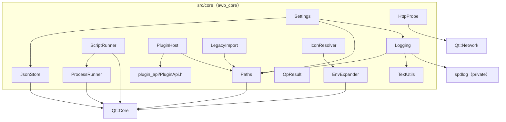

# core 基础设施

## 这个功能做什么，边界在哪

`src/core` 是 L0 层：其它所有模块脚下的基础设施。它管路径、JSON 文件、类型化设置、日志、外部进程与脚本、HTTP 健康探测、插件加载、旧数据导入、图标与环境变量解析、几个文本助手，以及可失败结果类型。

这条边界是被强制的，不只是约定：

- **不依赖 UI。** `scripts/check-architecture.sh` 规则 4 在 `src/core/` 下出现 `QtQuick`、`QQuick*`、`QQml*`、`Qt6::Quick` 或 `QtWebEngine` 时直接判构建失败。core 不知道 QML 页面是什么。
- **不认识业务概念。** core 不知道 agent、skill、Web 标签页或主题是什么。`Settings` 把 `web.chromiumFlags` 当不透明字符串存；`PluginHost` 加载一个库并把抽象的 `plugin::Services` 递给它；`ProcessRunner` 跑一条命令而不关心是哪条。领域语义在它上面的 L2 模块里。
- **唯一被允许的 Qt 依赖是 Core 加 Network**（`HttpProbe` 用 `QNetworkAccessManager`），外加 `Logging` 私有的 spdlog。spdlog 的头文件对 `awb_core` 是 `PRIVATE`，其它层看不到。

## 文件与类清单

| 文件 | 类 / 结构 | 职责 | 与谁协作 |
|---|---|---|---|
| `src/core/Paths.h` / `.cpp` | `awb::core::Paths` | 数据目录及其全部派生路径的唯一来源（`themesDir()`、`pluginsDir()`、`logsDir()`、`webProfilesDir()`、`skillCacheFile()`、`environmentCacheFile()`、`downloadsDir()`）；测试注入 | 所有碰磁盘的模块 |
| `src/core/JsonStore.h` / `.cpp` | `awb::core::JsonStore` | 原子 JSON 读写：`readFile()`、`writeFile()`、`writeBytes()` | `Settings`、`agentcatalog`、`tools`、测试夹具 |
| `src/core/Settings.h` / `.cpp` | `awb::core::Settings` + `WindowSettings`、`AppearanceSettings`、`LocaleSettings`、`LauncherSettings`、`WebSettings`、`SkillsSettings`、`LoggingSettings`、`PluginsSettings` | `settings.json` 的类型化访问层；其它任何地方不许读这个文件 | `Paths`、`JsonStore`、`Logging::isValidLevelName` |
| `src/core/Logging.h` / `.cpp` | `awb::core::Logging`、内部类 `RotatingFileSink`、宏 `AWB_DEBUG`/`AWB_INFO`/`AWB_WARNING`/`AWB_CRITICAL`/`AWB_PERF` | 异步轮转文件日志加 stderr 镜像；装 Qt 消息处理器 | `Paths`、`TextUtils`、spdlog |
| `src/core/ProcessRunner.h` / `.cpp` | `awb::core::ProcessRunner`、`awb::core::ProcessResult` | 外部命令的机制层：PATH/PATHEXT 解析、可捕获输出的分离启动、带超时的同步运行、杀进程树、命令行拆分、输出解码 | `agentcatalog`（启动、版本检查）、`workbench::EnvironmentProbe` |
| `src/core/ScriptRunner.h` / `.cpp` | `awb::core::ScriptRunner`（+ 私有 `Slot`） | 按 key 的一次性命令执行器，带流式输出与 epoch 规则 | `agentcatalog`（install/update/version/setup） |
| `src/core/HttpProbe.h` / `.cpp` | `awb::core::HttpProbe` | 语义固定的异步可达性探测，另有 `portFromUrl()` | `agentcatalog::AgentHealthMonitor` |
| `src/core/PluginHost.h` / `.cpp` | `awb::core::PluginHost`（+ `PluginHost::Manifest`） | 发现插件 manifest，并经导出的 C 入口装载已启用的库 | `plugin_api`、`workbench::PluginServices`；细节见[插件宿主](插件宿主.md) |
| `src/core/LegacyImport.h` / `.cpp` | `awb::core::LegacyImport` | 把 0.4 之前的 `~/.AgentLauncher` 数据目录一次性复制进新数据根 | `Paths`、`main.cpp` |
| `src/core/IconResolver.h` / `.cpp` | `awb::core::IconResolver` | 把配置里的图标串解析成可显示 URL，回退值由调用方给出 | `EnvExpander`；`agentcatalog`、`tools` |
| `src/core/EnvExpander.h` / `.cpp` | `awb::core::EnvExpander` | 展开路径里的 `%VAR%` 与前导 `~/` | `IconResolver`、`skillcatalog`、`agentcatalog` |
| `src/core/TextUtils.h` / `.cpp` | `awb::core::TextUtils` | `extractVersion()`、`formatCommandLine()`、`clampOutput()` | `Logging`、`EnvironmentProbe`、`agentcatalog` |
| `src/core/OpResult.h` / `.cpp` | `awb::core::OpResult`（`Q_GADGET`） | 可失败同步结果 `{ ok, error }`，跨模块边界不抛异常 | 每个模块边界，尤其是朝 QML 的一侧 |
| `src/plugin_api/PluginApi.h` | `awb::plugin::ApiVersion`、`PageDescriptor`、`Services`、`AWB_PLUGIN_EXPORT` | 仅头文件的插件 ABI | 外部插件仓库；见[插件宿主](插件宿主.md) |
| `src/core/CMakeLists.txt` | 构建目标 `awb_core` | 只为 Debug 定义 `AWB_PERF_ENABLED`，并私有链接 spdlog | 所有 |

下图说明每个 core 类拥有什么、又依赖哪些 core 类；离开这一组的箭头只指向 Qt 本身。

## 逐类说明

### Paths

`Paths::dataRoot()` 按以下顺序取值，顺序本身就是全部契约：

1. `Paths::setDataRootForTesting()` 注入的目录（测试传 `QTemporaryDir`）；
2. `QStandardPaths::setTestModeEnabled(true)` 生效时取 `AppConfigLocation`——因为测试模式**不会**重定向 `HomeLocation`，用 home 会让单元测试读写开发者真实的数据目录；
3. 否则取 `<HomeLocation>/.AgentWorkbench`。

所有子目录都由 `dataRoot()` 派生；**不要在别处拼这些路径**。`setDataRootForTesting()` 传空串可清除覆盖，`isDataRootOverridden()` 报告当前是否有覆盖。含非 ASCII 字符的用户目录只能交给 `QFile`/`QDir`，绝不许把这种路径传给窄字符 API。

### JsonStore

- `readFile()` 读**不存在**的文件返回空对象且**不告警**——那是首次启动的正常路径。打不开或 JSON 损坏记一条 `qWarning`，同样返回空对象，单个坏文件因此永远不会拖垮应用；调用方拿到空对象走默认值即可。
- `writeFile()` 用 `QJsonDocument::Indented` 序列化后交给 `writeBytes()`。
- `writeBytes()` 先建父目录，再经 `QSaveFile` 写入：临时文件直到最后才提交，进程中途死亡不会留下半截文件。它也是「逐字节一致」写入的入口（随包 agent 定义）。失败——打不开、写短、提交失败——都返回带英文原因的 `failure()`。

### Settings

`Settings` 是 `settings.json` 唯一的读写者。八个段结构体及其默认值声明在 `src/core/Settings.h`；逐键的完整字段表在 [Settings](设置.md)——本页有意不重复。这里只说要点：

- **缺键取默认值；未知键记警告后忽略；类型不对或越界记警告后取默认值。** 任何一个键的失败都不影响其它键。
- **没有迁移代码，也不要加。** 加一个键就加一个默认值。
- `save()` 把整个对象原子写入并返回 `OpResult`。
- 有 setter 的键就是 UI 会改的那些，每个都发带点分键名（如 `appearance.theme`）的 `valueChanged(key)`：`setWindowTitle`、`setThemeId`、`setFollowSystem`、`setFontFamily`、`setWindowSize`、`setSidebarCollapsed`、`setLastPageId`、`setWebSurface`、`setWebChromiumFlags`、`setSkillRoots`、`setPluginsDisabledIds`、`setPluginsGloballyEnabled`。调 setter 不会落盘——由调用方调 `save()`。
- `Settings` 在 `main.cpp` 里先于 `QGuiApplication` 构造，因为 `web.chromiumFlags` 必须在 WebEngine 初始化之前进环境。

### Logging

`Logging` 站在 spdlog 异步后端之前：

- `install()` 建日志目录、装 Qt 消息处理器，并搭起由轮转文件 sink（`<dataRoot>/log/agentworkbench.log`）与（`logging.mirrorToStderr` 不为 false 时的）stderr sink 组成的后端。队列是**8192 槽的 MPMC 队列配单个 worker 线程**，溢出策略 `overrun_oldest`：极端背压下丢最旧的一条，而不是反过来阻塞调用方（通常是 UI 线程）。警告及以上立即写盘（`flush_on(warn)`），其余最迟 1 s 后由定期 flush 提交。
- 轮转默认值：**单文件 5 MB、共 3 个文件**（当前 + 2 备份）。自定义的 `RotatingFileSink` 保留了仓库既有的备份命名（`agentworkbench.log.1`），而不是 spdlog 自带的「插在扩展名之前」的命名。
- 级别来自 `logging.level`（经 `Logging::isValidLevelName()` 校验；合法名是 `debug`、`info`、`warning`、`critical`、`off`，默认 `debug`）。`install()` 可以重复调用——`main.cpp` 在用户改过轮转或级别选项时会二次调用——它会先排空旧后端再建新的。调用线程只负责拼行和入队；函数返回时不要假定这一行已到磁盘。
- **每条退出路径都必须调 `uninstall()`**，否则队列尾部会丢。`main.cpp` 在正常返回与 QML 加载失败两条分支上都调了它。
- 行格式是契约（`[yyyy-MM-dd hh:mm:ss.zzz] [LEVEL][category][file:line] msg`）；时间戳、级别、分类与源码位置都在调用线程拼装，spdlog 的 pattern 只是 `%v`。`QtFatalMsg` 绕过队列同步直写，因为进程可能随即终止。
- `AWB_DEBUG` / `AWB_INFO` / `AWB_WARNING` / `AWB_CRITICAL` 把分类固定为 `awb.event`，级别取宏名。用 `Q_LOGGING_CATEGORY` 声明的分类（约定命名为 `awb.<module>`）**默认是开启的**，其 debug 行会进日志；要静音或单独开启某个分类用 `QT_LOGGING_RULES`。`AWB_PERF` 在 release 里被完全编译掉：`awb_core` 的 CMake 只在 Debug 配置定义 `AWB_PERF_ENABLED`，没有它时宏展开为空语句（连参数表达式都不求值）。Debug 下可用 `QT_LOGGING_RULES="awb.perf.debug=true"` 打开 `awb.perf` 分类。
- `Logging::formatCommandLine()` 与 `Logging::clampOutput()` 转发到 `TextUtils`，保证只有一份规范实现。

### ProcessRunner

- `findExecutable(program)` 用 `QStandardPaths::findExecutable`，它搜 `PATH` 且**在 Windows 上应用 `PATHEXT`**——npm 风格的垫片（`qwen` → `qwen.cmd`）因此能被找到，`CreateProcess` 自己不会尝试这些扩展名。返回空串表示找不到。
- `startDetached(program, args, pid, error, workingDirectory, env, outputFile)` 会再解析一次程序，然后分离启动，使子进程在启动器退出后继续存活。`outputFile` 非空时，stdout 与 stderr 每次启动都截断重定向到该文件；`agentcatalog` 正是靠这份捕获从 agent 自己的控制台输出里挑出每进程的会话 URL。`.cmd`/`.bat` 是否需要 `cmd /c` 包装是**调用方**的决定。
- `run(program, args, timeoutMs)` 是同步版，返回 `ProcessResult { started, exitCode, stdOut, stdErr, error }`。超时非正数表示无限等待；超时会杀进程，`exitCode` 保持 `-1`，`error` 说明原因。
- `killTree(pid)` 经 `startDetached` 跑 `killProgram()` 加 `killProgramArgs(pid)`——Windows 上是 `taskkill /F /T /PID <pid>`，覆盖 `cmd → qwen.cmd → node` 链——即发即忘。程序与参数分开暴露，调用方可以先记下真正执行的命令再执行。
- `splitCommand(command)` 在 Qt 6 上是 `QProcess::splitCommand`，Qt 5 上是一份可移植的孪生实现；引号数量为奇数时返回空表，与 Qt 6 一致。
- `decodeOutput(data)` 先按 UTF-8 解码，遇到第一个非法序列就回退到系统 locale 编码（zh-CN Windows 上是 GBK），老式 `cmd` 输出因此仍能解码而不是变乱码。

### ScriptRunner

`ScriptRunner` 执行按 `key`（通常是 agent id）标识的一次性命令（install、update、version、setup），是最容易被改、也最不容易一眼看对的部件：

- **epoch 规则。** 每次运行都会让该槽位的 `epoch` 自增。`run()` 先调 `invalidate()`：杀掉上一个进程、断开它的信号、删掉它的临时批处理文件；每个回调都拿自己捕获的 epoch（与进程指针）和槽位比对，过期就提前返回。因此旧运行迟到的 finished 回调永远碰不到新运行的状态。
- `run()` 直接跑「程序 + 参数」；`runShell()` 把原始命令串包进 `cmd /c`；`runBatch()` 把命令写进临时 `.cmd` 文件（带 `@echo off`）再运行该文件。`runBatch()` 存在的原因是 `QProcess` 会把内嵌的 `"` 按 C 惯例转义成 `\"`，而 `cmd.exe` 把反斜杠当字面字符，路径会被弄坏——跑批处理文件完全绕开参数引号问题。`QTemporaryFile` 由槽位持有到运行结束，因为 `cmd.exe` 还在读它。
- 输出经 `outputChunk(key, text)` 流式送出，同时按通道累计，因为 `readyRead` 会消耗字节而 `finished()` 必须汇报见过的全部内容加最后的尾巴。若一块的结尾停在一个多字节 UTF-8 序列中间，不完整的尾巴会先扣留、与下一块一起解码，被劈开的字符因此不会变成替换符；流结束时扣留的字节按原样冲出。
- `finished(key, ok, exitCode, stdOut, stdErr, error)` 每个被接受的运行恰好在结束时发一次。`ok` 仅在干净退出（退出码 0、未超时、确实启动过）时为真；启动失败经排队的一次性通知汇报 `exitCode = -1`，这样在 `run()` 之后才 connect 的调用方也能收到。
- `isRunning(key)` 报告该槽位当前是否持有进程。

### HttpProbe

语义固定且所有工具共用：**任何 HTTP 响应都算可达**，含 4xx/5xx（一个 `401` 就证明服务器在跑）；连接被拒或超时算不可达。默认超时 **5000 ms**；超时后中止请求并报为不可达，定时器挂在 reply 上，不留孤儿定时器。`probe()` 并发调用安全。`portFromUrl()` 返回显式端口，缺省时取 scheme 默认（443/80），空串或解析失败返回 `-1`。这里刻意没有任何进程嗅探。

### PluginHost

`PluginHost` 扫描 `<dataRoot>/plugins/*/plugin.json`，校验 ABI 版本，并经导出的 C 入口装载已启用的库。任何失败只记日志并跳过——插件永远不能阻止启动。宿主侧服务桥与完整契约见[插件宿主](插件宿主.md)；这里只说明它住在 core 是因为「装载动态库」属于基础设施，而它递出去的服务实现在 `awb_workbench`。

### LegacyImport

`LegacyImport::runOnce(newRoot, outNotice)` 把 0.4 之前的 `~/.AgentLauncher` 目录**只复制一次**进数据根——**旧目录从不搬移或删除**。它只在数据根仍「未动过」时行动，「未动过」的定义是「不存在，或除 `log/` 目录外没有任何内容」：`Logging::install()` 比一切先跑，升级后首次启动时目录里唯一的条目就是 `log/`。出现其它条目说明新版本已经往这里写过用户数据，导入不得覆盖。收编范围是 `agents.json`、`agent_state.json` 与旧 `log/` 里的全部文件。它返回是否复制了东西，并交回一条一次性英文提示；之后的调用是空操作，因此在每次启动都调用它是安全的。`importOnce()` 是可注入目录的变体，供测试用。

### IconResolver

`IconResolver::resolve(raw, fallback)` 把 `qrc:/…`、`http://…`、`https://…`、`file://…` 原样放行；其余当本地文件路径（先经 `EnvExpander::expand()`，所以 `%USERPROFILE%/icons/x.svg` 可用），存在时转成 `file:///` URL；其它情况（含空串）返回 fallback。**fallback 由调用方给出；core 从不写死应用资源路径。**

### EnvExpander

`EnvExpander::expand(path)` 经 `qEnvironmentVariable()` 展开 `%VAR%`（Windows 风格），并把前导 `~/` 替换成 home 目录。未知的 `%VAR%` **原样保留**，而不是替换成空串——写错时肉眼可见，不会被静默改写成别的路径。

### TextUtils

- `extractVersion(output)` 返回第一个 `x.y.z` 匹配，允许预发布后缀（`1.2.3`、`v1.2.3-beta`、`1.2.3.4`）；没有匹配返回空串。
- `formatCommandLine(program, args)` 渲染一条可复制粘贴的命令行，只给含空白或引号的参数加引号（空参数渲染为 `""`）。日志的 `[cmd]` 行用它，日志里因此能看到真正执行了什么。
- `clampOutput(text, limit)` 截断到 `limit` 个字符并追加 `… (N more characters not logged)`，刷屏命令灌不满日志。非正数 limit 表示不截断。

### OpResult

`OpResult` 是带 `ok` 与 `error` 的 `Q_GADGET`，配 `success()` / `failure(reason)` 工厂与 `explicit operator bool`。它存在的理由是**跨模块边界不抛异常**，而且异常根本无法跨 C++/QML 边界；分工是：边界处（尤其朝 QML）用 `OpResult` 与信号，模块**内部**用异常。因为它是带 `Q_PROPERTY` 成员的 gadget，QML 能直接读 `Q_INVOKABLE` 返回值的 `.ok` 与 `.error`。

**从 QML 调用的函数若返回它，返回类型必须写全限定名 `awb::core::OpResult`。** Qt 5 的 moc 按头文件里书写的形式记录返回类型名，而 QML 调用端按 `QMetaType` 注册名（即类全名）解析；短名解析不到注册表，症状是 `"Unknown method return type"` 加一个静默无响应的按钮。`app/main.cpp` 里那句 `qRegisterMetaType<awb::core::OpResult>()` 出于同一原因存在。

### plugin_api/PluginApi.h

`src/plugin_api/PluginApi.h` 是一个**仅头文件的接口目标**（`awb_plugin_api`），供外部插件仓库链接。它只依赖 Qt Core、绝不依赖宿主模块，里面声明了 ABI 版本、值类型 `PageDescriptor`、抽象接口 `Services`，以及每个插件都要导出的两个 `extern "C"` 入口。宿主侧契约见[插件宿主](插件宿主.md)。

## 新增一个 core 工具类时的检查清单

- [ ] 若需要路径，往 `Paths` 加一个派生 getter（及其基于 `dataRoot()` 的实现），而不是在调用点拼路径。
- [ ] 保持不依赖 UI：不许 `QtQuick` / `QQuick*` / `QQml*` / `QtWebEngine`（`check_architecture` 规则 4）。优先只用 Qt 值类型与 Core/Network。
- [ ] 在 `tests/core/` 下写单元测试（用例写在 `private Q_SLOTS:` 里），且绝不碰真实数据目录——经 `Paths::setDataRootForTesting()` 注入 `QTemporaryDir`。
- [ ] 需要编译的文件加进 `src/core/CMakeLists.txt`（仅头文件的工具类不需要）。
- [ ] 更新本页与 [C++ 库设计](../architecture/C++库设计.md)。
- [ ] 若是可失败且面向 QML 的，返回 `awb::core::OpResult`（写全限定名），涉及新类型时注册 metatype。

## 相关页面

- [主题引擎](主题引擎.md)——直接坐在 `Paths`、`JsonStore`、`Settings` 之上的 L1 层。
- [workbench 与页面](workbench与页面.md)——core 对象在哪里被构造与布线。
- [插件宿主](插件宿主.md)——从 `PluginHost` 开始的完整插件契约。
- [C++ 库设计](../architecture/C++库设计.md)——core 遵守的分层与错误处理契约。
- [分层与依赖](../architecture/分层与依赖.md)——core 为何不依赖任何上层。
- [使用指引](../guide/index.md)——日志、数据目录与设置的用户可见行为。
- [配置参考](../configuration.md)——`settings.json` 的键表。
