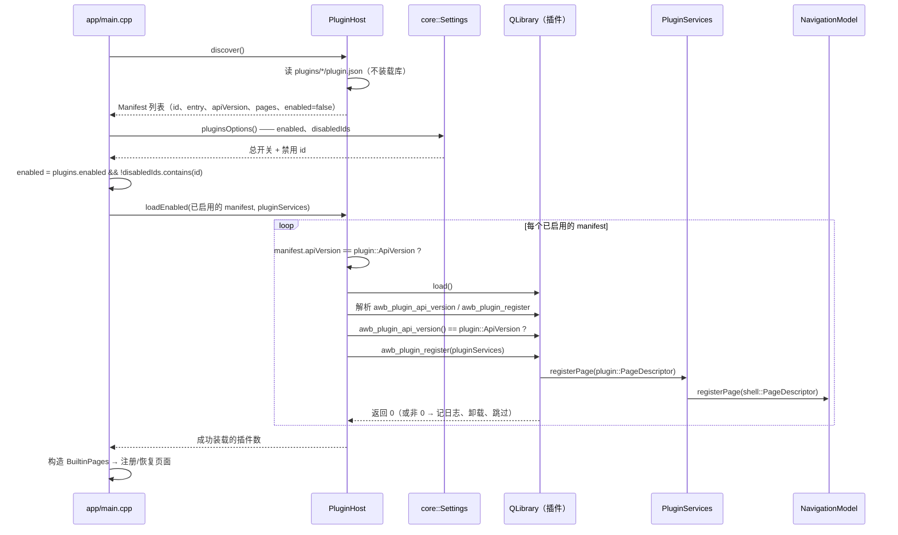

# 插件宿主

## 这个功能做什么，现状如何

插件是仓外扩展机制：一个动态库放进 `<数据目录>/plugins/<id>/`，旁边放一个 `plugin.json` manifest。宿主发现 manifest、用导出的符号校验 ABI 版本、装载已启用的库，并把一个服务对象递给它，让它注册侧栏页面与 Web 表面。

这个功能是**实验性且默认禁用**的，而这是诚实的现状描述而不是出货前的免责声明：

- 插件**跑在应用进程里、没有沙箱**。它的信任级别与应用自身代码相同，一次崩溃或内存错误可能带走整个应用。只应启用用户信任的插件。
- 因为库只在启动时装载一次，开关变更**下一次启动才生效**，设置页会写明这一点。
- 发现、版本校验、装载、注册中的任何失败都只记日志并跳过该插件。坏插件永远不能阻止启动，也永远影响不到另一个插件。
- ABI 刻意小且带版本；破坏它意味着递增 `ApiVersion` 并拒绝装载旧插件，而不是尝试兼容。

## 文件与类清单

| 文件 | 类 / 类型 | 职责 | 与谁协作 |
|---|---|---|---|
| `src/plugin_api/PluginApi.h` | `awb::plugin::ApiVersion`、`awb::plugin::PageDescriptor`、`awb::plugin::Services`、`AWB_PLUGIN_EXPORT` | 仅头文件的 ABI：版本常量、页面值类型、插件调用的服务接口、导出宏 | 外部插件仓库；`PluginHost`；`PluginServices` |
| `src/plugin_api/CMakeLists.txt` | 接口目标 `awb_plugin_api` | 只依赖 Qt Core、绝不依赖宿主模块；外部仓库链接它 | `awb_core` |
| `src/core/PluginHost.h` / `.cpp` | `awb::core::PluginHost`、`PluginHost::Manifest` | 扫描 manifest（`discover()`）、装载并校验已启用的库（`loadEnabled()`）、卸载（`shutdown()`） | `Paths::pluginsDir()`、`PluginServices` |
| `src/workbench/PluginServices.h` / `.cpp` | `awb::workbench::PluginServices` | `plugin::Services` 的宿主侧实现：页面注册、Web 表面、插件数据目录、日志、通知、主题色、白名单设置 | `NavigationModel`、`WebTabsFacade`、`Theme`、`Settings`、`Notifications`、`UiServices` |
| `src/shell/qml/SettingsPluginsPage.qml` | — | 设置 → 插件分区：信任提示、总开关、插件清单与单项开关 | `WorkbenchContext`（`workbench.*`） |
| `src/workbench/WorkbenchContext.h` / `.cpp` | `WorkbenchContext` | 面向 QML 的插件 API：`pluginList()`、`setPluginEnabled()`、`pluginsEnabled()`、`setPluginsEnabled()`、`pluginTrustNotice()` | `Settings`、`main.cpp` 灌进来的发现结果 |
| `app/main.cpp` | — | 发现 manifest、解析每个插件的启用标志、在页面恢复之前装载，自身不注册任何东西 | `PluginHost`、`PluginServices`、`WorkbenchContext` |
| `docs/plugins.md` | — | 面向插件作者的指南（插件是什么、怎么启用与编写） | 本页 |

## ABI 契约

`awb::plugin::ApiVersion` 是这份头文件描述的整数版本；**任何破坏性变更都必须递增它。** 它被校验两次——manifest 声明的 `apiVersion` 与库导出的 `awb_plugin_api_version()`——正是为了让陈旧的 manifest 无法把不兼容的实现偷运进来。

每个插件导出两个符号。`AWB_PLUGIN_EXPORT` 在 Windows 上展开为 `__declspec(dllexport)`，其它平台是 `__attribute__((visibility("default")))`：

- `int awb_plugin_api_version()` —— 返回插件编译时使用的 ABI 版本；
- `int awb_plugin_register(awb::plugin::Services *services)` —— 注册入口；返回 `0` 表示成功，其它值让宿主记日志并忽略该插件。

`plugin::PageDescriptor` 是普通值类型：`id`、`title`、`icon`（插件自己资源里的 `qrc:/…` URL）、`source`（QML 的 `qrc:/…` URL）、`section`（`"main" | "extensions" | "system"`，manifest 侧默认 `"extensions"`）与 `order`（默认 `50`）。它**没有 `keepAlive` 字段**，所以插件页面永远是切走即销毁的普通页。

`plugin::Services` 是宿主实现、插件调用的纯抽象接口：

| 方法 | 含义 |
|---|---|
| `registerPage(page)` | 注册一个侧栏页面；重复 id 由导航模型记警告后拒绝 |
| `unregisterPage(id)` | 按 id 注销页面 |
| `addWebSurface(kind, componentUrl)` | 注册一种额外的 Web 表面，把一种 kind 映射到 QML 组件 URL |
| `dataDir(pluginId)` | 插件私有的可写目录 `<dataRoot>/plugins/<pluginId>/data`（按需创建） |
| `log(level, message)` | 打一条日志；`level` 为 `0` = info、`1` = warning、`2` = error |
| `notify(level, title, text)` | 弹一条 toast；级别编码同上 |
| `themeColor(token)` | 当前颜色令牌的 `#rrggbb` 值；未知令牌返回空串 |
| `settingsValue(key)` | **只读白名单**里的设置值；白名单外的键记警告并返回空串 |

## 宿主侧实现

`PluginHost::discover()` 按名字顺序扫描 `<dataRoot>/plugins/*/`。没有 `plugin.json` 的目录、打不开或不是对象的 manifest、缺 `id` 或 `entry` 的 manifest 都记日志后跳过——发现过程**从不装载库**，这正是设置页在插件被禁用时也能列出它们的原因。解析出的 `Manifest` 携带 `id`、`name`、`version`、`apiVersion`、`description`、`author`、`entry`、`dir`、声明的 `pages`，以及由调用方解析的 `enabled` 标志。

`PluginHost::loadEnabled(manifests, services)` 负责装载，每道关卡都是「跳过这一个、继续走」的路径：

1. `enabled` 为 false 的 manifest 跳过；
2. manifest 声明的 `apiVersion` 必须等于 `plugin::ApiVersion`，否则拒绝该插件；
3. 用 `QLibrary` 装载库；
4. `awb_plugin_api_version` 与 `awb_plugin_register` 都必须解析到，否则卸载该库并跳过；
5. 导出的 `awb_plugin_api_version()` 值必须等于 `plugin::ApiVersion`（第二道校验）；
6. `awb_plugin_register(services)` 必须返回 `0`。

六道全过之后，库才加入已加载清单。**总开关与单项禁用清单是在 `main.cpp` 里应用的，不在这里**：`enabled` 等于 `plugins.enabled && !plugins.disabledIds.contains(id)`，只有启用的 manifest 才会被复制进传给 `loadEnabled()` 的列表；`loadEnabled()` 对空的 `services` 直接返回 `0`。

`shutdown()` 卸载全部已加载的库。库进程级存活，因为已注册的页面与表面可能仍引用它们，所以中途不卸载。`main.cpp` 里宿主是栈对象；它在 `main` 结尾析构时会卸载自己持有的库，`shutdown()` 是退出路径上的显式等价写法。

下面的时序图跟踪一个插件从发现到页面注册的全过程。

## 宿主桥 PluginServices

`PluginServices` 把每次 ABI 调用映射到已有的宿主能力；除映射之外它没有自己的逻辑。

- `registerPage()` 用插件的页面拼出 `shell::PageDescriptor` 并调 `NavigationModel::registerPage()`——**与内置页面走完全同一条路径**；`section` 为空时默认 `extensions`。没有单独的「插件模式」。
- `unregisterPage()` 转发给 `NavigationModel::unregisterPage()`。
- `addWebSurface()` 转发给 `WebTabsFacade::registerSurface()`。
- `dataDir()` 把插件 id 里 `[A-Za-z0-9._-]` 之外的每个字符替换成 `_`（id 来自 manifest，不能不加检查地拼进路径），然后创建并返回 `<dataRoot>/plugins/<安全化 id>/data`。
- `log()` 给消息加 `[plugin] ` 前缀；级别 2 与 1 走 `qWarning()`，级别 0 走 `qInfo()`。
- `notify()` 把 ABI 级别映射成 toast 级别（1 → `warning`，2 → `error`，其余 `info`）。
- `themeColor()` 从 `Theme::color()` 读令牌并返回 `QColor::name(QColor::HexRgb)`；未知令牌返回空串。插件永远不接触 `QColor`——ABI 边界只过基本类型。
- `settingsValue()` 只回答四个白名单键——`appearance.theme`、`window.title`、`web.surface`、`locale.override`——其它键记警告并返回空串。插件只能读这四个值，永远不能写设置。

## 设置页

`SettingsPluginsPage.qml` 是面向用户的界面，展示四样东西：

- 信任提示，文本来自 `WorkbenchContext::pluginTrustNotice()`：插件跑在应用进程里、信任级别与应用相同、重启后生效；
- 总开关，绑定 `workbench.pluginsEnabled()`、由 `workbench.setPluginsEnabled()` 写入，落到 `plugins.enabled`；
- 插件清单，来自 `workbench.pluginList()`，每行显示名字（取不到时用 id）与版本，以及描述；
- 单项开关，绑定该条目的 `enabled`、由 `workbench.setPluginEnabled()` 写入，把 id 加进或移出 `plugins.disabledIds`。

两次写入都经 `Settings` 并立即 `save()`，也都会同步内存里的快照，所以设置页立即反映新状态。生效推迟到下一次启动，因为库只在启动时装载一次。空状态文案提示用户把插件放进 plugins 目录。

## 安全边界

插件**能**做：注册与注销侧栏页面、注册一种 Web 表面、在自己的 `dataDir` 里写文件、打日志、弹 toast、读取主题令牌的当前颜色值、读取四个白名单设置键。它的 QML 可以像内置页面一样 `import AgentWorkbench.App` 并读取单例。

插件**不能**通过 ABI 做：

- 写 `agents.json`、`settings.json` 或任何其它应用状态——设置面只读，且没有任何写方法；
- 改变当前主题或字体——只能读颜色；
- 收发宿主的 C++ 类。**跨边界的只有 Qt 值类型**（`QString`、`int`、`PageDescriptor`，以及 `Services` 接口本身）；ABI 头文件绝不能出现宿主模块类型，加一个就会把每个插件与内部结构绑死；
- 让一个页面活过导航——`plugin::PageDescriptor` 没有 `keepAlive`；
- 在应用运行期间被卸载。

ABI **之外**它能做什么只受进程限制：插件是宿主进程里的原生代码，可以调用操作系统允许的任何东西。这就是文档、ABI 头与设置页都反复强调信任警告、以及插件默认关闭的原因。内嵌 Web 视图采用同样的信任框架（见 [WebEngine 内嵌调研](../research/webengine-embedding.md)）。

## 改动 ABI 的检查清单

- [ ] 任何破坏性变更都要递增 `awb::plugin::ApiVersion`。
- [ ] 更新两个语言的作者指南：[插件](../plugins.md)与它的 `zh` 镜像。
- [ ] 更新本页与[扩展点](../architecture/extension-points.md)。
- [ ] 新增类型一律是 Qt 值类型；绝不暴露宿主 C++ 类。
- [ ] 若给 `plugin::Services` 加了新能力，在 `PluginServices` 里实现，并在两份文档里写明它的安全限制（只读？白名单？）。
- [ ] 重新构建并确认过期的插件是被拒绝而不是被装载（`PluginHost::loadEnabled()` 会记下拒绝）。

## 相关页面

- [core 基础设施](core-infrastructure.md)——`PluginHost` 的位置与它被允许依赖什么。
- [workbench 与页面](workbench-and-pages.md)——在页面恢复之前装载插件的装配顺序。
- [扩展点](../architecture/extension-points.md)——插件在其它扩展机制中的位置。
- [插件](../plugins.md)——面向作者的指南与完整示例。
- [设置指引](../guide/settings.md)与[使用指引](../guide/index.md)——用户看到的设置 → 插件页。
- [配置参考](../configuration.md)——`plugins.enabled` 与 `plugins.disabledIds`。
