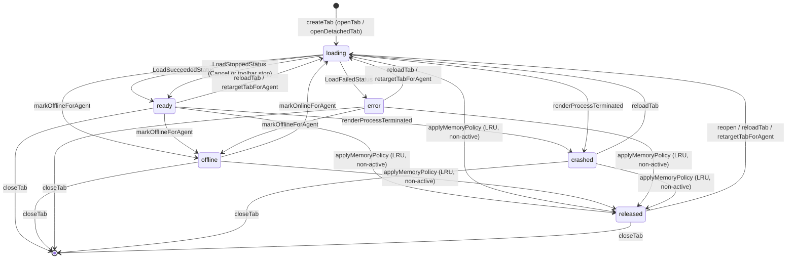

# Web 标签

web 功能把 agent 的本地 Web UI 变成**应用内的一个标签**。它持有标签模型、两种展示方式之间的选择，
以及约束同时存活视图数的内存策略。它不碰任何 WebEngine 头——那是兄弟适配层，见
[WebEngine 适配层](webengine-adapter.md)。

用户视角见 [Agent Web UI](../guide/web-ui.md)。
架构背景见 [分层与依赖](../architecture/layers-and-dependencies.md) 与
[前端设计](../architecture/frontend-design.md)。

## 这个功能做什么，两条路径

`web.surface` 设置选中两种 surface 之一：

- **`embedded`** —— 由 WebEngine 适配层渲染的应用内视图。构建包含 WebEngine 时这是默认值。
- **`external`** —— 完全不建标签；URL 交给系统浏览器，门面发 `externalOpened` 让外壳弹 toast。
  `external` surface 永远存在，且有意没有 QML 组件。

以 `AWB_ENABLE_WEBENGINE=OFF` 配置的构建没有注册 `embedded` surface。此时 `openTab()` 看到
`embedded` 请求会记一条警告并静默降级为 `external`，而 `WebTabsFacade::engineAvailable()` 返回
false，页面据此告知用户本构建会在系统浏览器里打开 agent Web UI。该配置下 Web 页本身完全可用。

## 文件与类清单

| 文件 | 类 / 组件 | 职责 | 与谁协作 |
|---|---|---|---|
| `src/web/WebTab.{h,cpp}` | `WebTab` | 单个标签的纯状态对象：视图要渲染的属性、`state` 状态机、值未变不发信号的 setter，以及 LRU 用的 `lastUsedMs()` | `WebTabsModel`、`WebTabsFacade`、`WebEngineSurface.qml` |
| `src/web/WebTabsModel.{h,cpp}` | `WebTabsModel` | 标签之上的 `QAbstractListModel`、面向 QML 的 role 契约、删除时的激活下标维护、把 `WebTab` 信号翻译成 `dataChanged` | `WebTab`、`WebTabsFacade`、`WebTabsPage.qml` |
| `src/web/WebTabsFacade.{h,cpp}` | `WebTabsFacade` | QML 门面：标签生命周期、表面选择、内存策略、日志 URL 脱敏；暴露模型与策略设置 | `WebTabsModel`、`WebSurfaceRegistry`、`core::Settings`、`BuiltinPages` |
| `src/web/WebSurfaceRegistry.{h,cpp}` | `WebSurfaceRegistry` | surface `kind` → QML 组件 URL 的映射；`external` 自构造起存在且无组件 | `WebTabsFacade`、`WebEngineSurfaceProvider` |
| `src/web/WebProfilePaths.{h,cpp}` | `WebProfilePaths` | 每 agent 持久 profile 路径与存储名的唯一推导来源 | `WebEngineProfileStore` |
| `src/web/qml/WebTabsPage.qml` | `WebTabsPage` | 页面：自绘标签栏、每标签一个 surface 宿主、工具栏、空状态、released 占位、快捷键 | `WebTabsFacade`、`WebEngineSurface.qml` |
| `src/web/CMakeLists.txt` | `awb_web` | 本域目标；只链 `awb_core` 与 `awb_theme`，永不链 WebEngine；仅在 `AWB_ENABLE_WEBENGINE` 打开时加 `webengine` 子目录 | `awb_web_webengine` |

驱动这个功能的跨域接线在 `src/workbench/BuiltinPages.cpp` 的 `wireWebRules()`，见下文「跨域接线」。

## 前端设计

### 为什么 `WebTabsPage` 是 `keepAlive` 页

`BuiltinPages` 注册 `web` 页时设了 `PageDescriptor::keepAlive = true`。它是应用里唯一的常驻页，
原因在于 **`WebEngineView` 的页面状态搬不进 C++**：切页销毁会让 Web UI 整页重载并丢掉页内状态。
因此 `Workspace` 对常驻页只隐藏不销毁。

有两个后果是硬性的：

- 页面保持实例化，因此切到别的页面后它的 `ApplicationShortcut` 仍然存活。所有全局快捷键都门控在
  `pageCurrent`（`nav.currentPageId === "web"`）上，否则 `Ctrl+W`、`F5`、`F12` 会在设置页之类
  的地方关掉或重载隐藏的 Web 标签。
- 常驻页以 0x0 创建、变可见后才拿到真实尺寸，因此必然经历一次重排。标签栏用 `implicitHeight`
  提供尺寸供 `ColumnLayout` 读取；直接绑定 `height` 会被重排覆盖，标签栏曾因此被踩成 0 高而整条
  消失。

### 标签栏

标签栏兼作页面头部。标签是 `Flickable` 里一 `Row` 的 delegate，标签多时滚动而不是溢出。

每个 delegate 声明的 `required property` 名字必须等于模型 role 名（`tabId`、`title`、`url`、
`state`、`color`、`iconSource`、`loadProgress`、`surfaceKind`）。颜色 role 尤其叫 `color`，
声明为 `required property string color`，因此 **delegate 根必须是 `Item` 而不是 `Rectangle`**：
在 `Rectangle` 上该 role 会遮蔽视觉 `color`，主题绑定落到字符串上，标签体永远画成默认白色。
视觉背景是内层 `Rectangle`（`tabBackground`）。这与 `AgentCard` 是同一模式。

值得保留的交互细节：

- 中键关闭标签；左键激活（并离开首页视图）。
- 双击重载。
- 关闭 × 必须声明在整块 `MouseArea` **之后**才会压在上面；否则点它只会激活标签。
- 状态点用颜色区分 `crashed`/`error`（危险色）与其它状态，且从不只靠颜色——tooltip 承载文字状态。

### 工具栏动作

工具栏作用于激活标签：

- **Home** 把运行中 agent 列表作为覆盖层显示，不关闭任何标签。没有可回的地方时禁用。
- **Reload / Stop** 按 `web.activeState` 切换图标与 tooltip：加载中是停止，调
  `surface.stopLoading()`；否则调 `web.reloadTab()`。
- **Open in browser** 任何时刻都可用——逃生口永远不能藏。
- **More actions** 弹 `AMenu`，条目有 **Copy URL**、**Zoom in / Zoom out / Reset zoom**、
  **Developer tools**（仅 `web.devToolsEnabled`，即 Debug 构建）与 **Close tab**。

### 空状态与 released 占位

空状态是 `AEmptyState`，在 `web.tabCount === 0` 或首页视图激活时可见。它的描述取决于
`web.engineAvailable`：有内嵌表面时指向运行中 agent 列表，没有时说明本构建在系统浏览器里打开
Web UI。它还内嵌一个高度封顶的运行中 agent 列表，每行一个 **Open** 按钮，调
`workbench.openWeb(agentId)`。

处于 `released` 态的标签没有活视图。`WebTabsPage` 画一块灰色占位（"View released to free
memory"），配 **Restore view** 按钮调 `web.reopen(tabId)`。该标签的 surface `Loader` 不激活，
`source` 为空。

页面请求全屏时 `WebTabsPage` 隐藏整条标签栏（`chromeHidden`），`Esc` 恢复。

## 后端设计

### `WebTab`

`WebTab` 是纯 `QObject` 状态对象——属性、setter 与一个状态串；它不含视图。所有属性都有 `NOTIFY`
信号，标签栏与表面因此自动重绑。

| 属性 | 类型 | 说明 |
|---|---|---|
| `id` | `QString` | `tab-<n>`，模型与 QML 侧的稳定键 |
| `agentId` | `QString` | 所属 agent |
| `url` | `QUrl` | 可含 token 片段；展示前必须脱敏 |
| `title` | `QString` | 页面标题，由表面回报 |
| `iconSource`、`color` | `QString` | 来自 agent 定义，创建后不变 |
| `surfaceKind` | `QString` | `embedded` 或 `external` |
| `state` | `QString` | `loading` \| `ready` \| `offline` \| `crashed` \| `error` \| `released` |
| `loadProgress` | `int` | 夹到 0..100 |
| `lastError` | `QString` | 在 `crashed`/`error` 覆盖层展示 |
| `zoom` | `double` | 夹到 0.5..2.0 |

setter 都是边沿触发：值未变不发信号，表面的 `url` 绑定因此不会空转重新求值。`lastUsedMs()` 由
`touch()` 刷新；构造即 touch，激活也 touch，因此全新标签或刚激活的标签在 LRU 策略里算刚用过。

### `WebTabsModel`

`WebTabsModel` 是持有标签的 `QAbstractListModel`。它的 role 是契约：

| Role 枚举 | QML 名 |
|---|---|
| `TabIdRole` | `tabId` |
| `AgentIdRole` | `agentId` |
| `UrlRole` | `url` |
| `TitleRole` | `title` |
| `IconRole` | `iconSource` |
| `ColorRole` | `color` |
| `SurfaceKindRole` | `surfaceKind` |
| `StateRole` | `state` |
| `LoadProgressRole` | `loadProgress` |
| `LastErrorRole` | `lastError` |
| `ZoomRole` | `zoom` |
| `TabObjectRole` | `tabObject` |

`TabObjectRole` 返回活的 `WebTab` 指针，surface 宿主据此把对象交给它的 loader——`required property`
无法直接持有对象，因此表面把自身的 `tab` 属性绑到这个 role。

`appendTab()` 接管所有权，并把 `WebTab` 的每个变更信号（`state`、`title`、`loadProgress`、
`url`、`lastError`、`zoom`）接到 `notifyTabChanged()`，后者发整行 `dataChanged`。
`setActiveIndex()` 忽略越界或未变的值并调 `touch()`；`removeTab()` 维护激活下标，让它始终指向
**同一个标签对象**：删除激活行之前的行会使其减一，删除激活行本身下标不动但已指向后一个标签，
下标落到末尾之外则夹到最后一行。以上任一情况都发 `activeIndexChanged()`。

### `WebTabsFacade`

门面是 QML 唯一交互的对象。它的属性：

| 属性 | 种类 | 含义 |
|---|---|---|
| `model` | constant | 以 `QAbstractItemModel` 暴露的 `WebTabsModel` |
| `activeTabId` | 带通知 | 激活标签的 id，无则空串 |
| `tabCount` | 带通知 | 标签数；QML 绑不了 `rowCount()`，它没有 NOTIFY |
| `activeState` | 带通知 | 激活标签的状态，无则空串（驱动重载/停止） |
| `devToolsEnabled` | constant | 仅 Debug 构建为 true |
| `freezeInactiveTabs` | 带通知 | `web.freezeInactiveTabs` |
| `downloadDir` | 带通知 | `web.downloadDir`，回退到 `core::Paths::downloadsDir()` |
| `engineAvailable` | constant | `embedded` surface 是否已注册 |

面向 QML 的方法：

| 方法 | 用途 |
|---|---|
| `openTab(fields)` | 为 `{agentId, url, title, icon, color}` 打开或激活标签；返回标签 id，external 路径返回空串 |
| `openDetachedTab(agentId, url, title)` | 总开新标签，绕开同 agent 去重 |
| `closeTab(id)` | 关闭并删除标签 |
| `activateTab(id)` | 激活标签 |
| `stepActiveTab(delta)` | 循环切换激活标签并回绕（`Ctrl+Tab` 传 1，反向传 -1） |
| `reloadTab(id)` | released 标签先重建，否则置回 `loading` |
| `reopen(id)` | 恢复 released 标签（state 回到 `loading`，进度 0） |
| `openExternal(id)` | 把标签 URL 交给系统浏览器，恒可用 |
| `tabForAgent(agentId)` | 快照 `{id, agentId, url, title, state}`，未打开返回空 map |
| `tabObject(id)` | 活的 `WebTab`，QML 据此响应式读 `zoom`、`state`…… |
| `surfaceUrl(kind)` | 表面 kind 的 QML 组件 URL，未注册为空串 |
| `setTabState/setTabProgress/setTabTitle/setTabLastError/setTabZoom/setTabUrl` | 表面/健康检查的回报入口 |

它的信号是 `activeTabChanged`、`tabCountChanged`、`activeStateChanged`、`policyChanged` 与
`externalOpened`。`tabCountChanged` 由 `rowsInserted`/`rowsRemoved` 驱动；激活跟踪把模型的
`activeIndexChanged` 转发为 `activeTabChanged` 与 `activeStateChanged`，并把激活行上的任何
`dataChanged` 也转发为 `activeStateChanged`。新状态为 `ready` 时 `setTabState()` 会调 `touch()`，
加载完成的标签因此算刚用过。

### `WebSurfaceRegistry` 与 `WebProfilePaths`

`WebSurfaceRegistry` 就是一张 `kind → 组件 URL` 表。它的构造函数插入 `external` 并给空 URL，
因此 `hasSurface("external")` 恒为真而 `surfaceUrl("external")` 为空。构建包含 WebEngine 时
`WebEngineSurfaceProvider` 在构造时注册 `embedded`；它的存在本身就是 `engineAvailable()` 的判据。

`WebProfilePaths` 是 profile 布局的唯一推导处：

- `profileDir(agentId)` 返回 `<数据目录>/webprofiles/<agentId>` 并创建它。追加前先净化 id
  （`[^A-Za-z0-9._-]` 变成 `_`），手工编辑过的配置因此永远无法把路径拼到 `webprofiles`
  目录之外。
- `storageName(agentId)` 返回 `awb-<agentId>`。

## 行为

### 打开标签

`openTab()` 先校验 URL，再套用表面策略（表面不可用时把 `embedded` 降级为 `external`），
在内嵌路径上**复用同一 agent 的已有标签**：该 agent 已有标签时激活它而不是再开一个。因此双击
运行中卡片不会堆出重复标签。

`openDetachedTab()` 的存在正是为了绕开这条规则。环回弹出窗口——OAuth 窗口，或同一 agent 的
`target=_blank` 链接——否则会被去重误折进已有标签。它只在嵌入表面可用时建标签，否则返回空串，
QML 侧的弹窗路由会把 URL 交给系统浏览器。

### 关闭标签

`closeTab()` 销毁视图但**不停止 agent**。会话数据留在每 agent 的持久 profile 里，重开标签即恢复。
被关的是激活标签时，激活下标移到占据它位置的那一行（越界夹到末行）。

### 跨域迁移

下面四个方法是 `BuiltinPages` 使用的精确契约；允许的迁移集合很重要。

| 方法 | 允许的源状态 | 结果 | 为何限定这些状态 |
|---|---|---|---|
| `markOfflineForAgent(agentId)` | `ready`、`loading`、`error` | `offline` | 含 `error`，是因为 agent 掉线时看到的 error 页其实是「agent 离线」页，恢复走正常的 `offline → loading` 路径。**agent 仍在运行**时的加载错误（token 门禁的 HTTP 401）有意停在 `error`——每轮探测都重载它永远不会成功。 |
| `markOnlineForAgent(agentId)` | 仅 `offline` | `loading`（进度 0） | `released` 保持 released，等用户手动恢复。`error`/`crashed` 不自动重载：健康检查已证明 agent 活着，说明加载本身失败，只有 retarget 或手动 Retry 能改变结局。 |
| `retargetTabForAgent(agentId, url)` | 任意，含 `released` | `loading`，清掉错误 | 抓到会话 URL 时用。换 URL 会重新导航视图，`error`/`offline` 覆盖层随之消失。 |
| `closeTabsForAgent(agentId)` | 任意 | 删除标签 | agent 从配置里被删除时用。 |

下面这张状态图列出 `WebTab` 的每个状态与造成每次迁移的角色。写入方是 `WebTabsFacade`（门面方法与
跨域规则）与表面（经 `setTabState()` 回报自身进度）。

图上有一处不对称值得注意：`markOnlineForAgent` 是**唯一**离开 `offline` 的迁移，而
`retargetTabForAgent` 是唯一无需用户动作就能复活 `error`/`crashed` 的路径。

### 内存策略

两套相互独立的机制约束资源占用，都在 `settings.json` 里配置。

**`web.maxLiveTabs`（默认 8，下限 1）—— LRU 释放。** `applyMemoryPolicy()` 统计所有非
`released` 的标签（激活标签的视图也计入，因为上限约束的是**全部**活视图），在数量超限时按
`lastUsedMs()` 释放最旧的**非激活**标签。释放即销毁视图、标签保留在 `released` 态；页面显示灰色
占位，用户用 **Restore view** 恢复。调低设置立即生效——门面监听 `web.maxLiveTabs` 变化并当场调
`applyMemoryPolicy()`，而不是等下一次开标签。这条策略**不**受 `freezeInactiveTabs` 门控：冻结是
CPU 取舍，上限是内存约束，两种设置下都必须成立。

**`web.freezeInactiveTabs`（默认关）—— 冻结视图。** 打开时非激活标签的视图进入
`LifecycleState.Frozen`。它默认关，是因为 Chromium 本就节流隐藏视图，而 `Frozen` 还会挂起 JS 与
websocket，切回时能看到 agent Web UI 明显重绘。生命周期绑定里有两条不可协商的规则：**加载中**的
视图绝不能冻结（被挂起的页面永远加载不完，会卡在 loading 覆盖层）；**激活**标签无论状态如何都
必须保持 `Active`（Qt 会拒绝冻结可见页面，并在每次状态转换时记一条错误）。

**`web.downloadDir`** —— 下载保存目录；空则回退平台下载目录。**`web.chromiumFlags`** —— 在
WebEngine 初始化之前注入 `QTWEBENGINE_CHROMIUM_FLAGS` 环境变量，因此只在下次重启生效。
**`web.homeUrl`** 在 `settings.json` 里声明、经 `Settings` 暴露，但截至 0.4.0，`src/web/` 里
没有代码读它：工具栏的 Home 按钮显示的是运行中 agent 列表，而不是某个 URL。

## 安全与脱敏

打开标签所用的 URL 由 `WorkbenchContext::openWeb()` 按固定优先级挑选：**抓到的会话 URL** 优先于
`AgentUrls::finalUrl(definition)`。裸 `webUrl` 从不直接用，因为 token 门禁的 harness 会对它回
HTTP 401——只有 agent 自己输出里打出的每进程 URL 能过。没抓到会话 URL 时，`finalUrl()` 把 token
文件的值以 `#token=` 片段追加（片段不发给服务器，token 因此不进访问日志与 `Referer` 头）。

任何可能被人或第三方读到的 URL，都必须先过 `WebTabsFacade` 内部的 `redactedUrl()`。它同时抹掉
**两种**拼写：`#token=…` 片段（qwen 的门禁）与 `?token=…` 查询项（dsh 的会话 URL），同时保留查询
串与片段的其余部分。用到它的地方是 `externalOpened` 信号（转成 toast）、`openUrl` 成功/失败的
日志行，以及外置打开的日志行。

## 跨域接线

`BuiltinPages::wireWebRules()` 装了四条规则加两个徽标：

1. `AgentsFacade::runningChanged(id, running)` → `markOnlineForAgent()` 或
   `markOfflineForAgent()`。
2. `AgentsFacade::agentRemoved(id)` → `closeTabsForAgent(id)`。
3. `AgentsFacade::sessionUrlChanged(id, url)` → `retargetTabForAgent(id, url)`。
4. `WebTabsFacade::externalOpened(url)` → 一条标题为 "Opening in the browser" 的 `Notifications`
   toast（URL 已脱敏）。

**web** 侧栏徽标显示标签数，为 0 时不显示，在标签模型的 `rowsInserted`/`rowsRemoved` 上刷新。
`WorkbenchContext::openWeb()` 组装 fields，并在拿到标签 id 时导航到 `web` 页。

## 改动检查清单

改这个功能时过一遍这张表：

- **新增标签状态**要同时改上面的状态图、`WebTab::state` 的说明、`WebEngineSurface.qml` 的覆盖层
  文案分支、`WebTabsPage.qml` 的 tooltip 文案，以及 `../guide/web-ui.md`。
- **改 `markOnlineForAgent` / `markOfflineForAgent`** —— 重新核对允许的源状态集合与「agent 仍在
  运行时 error 保持 error」这条规则；放宽集合会重新引入重载死循环。
- **改内存策略** —— 保持释放不受 `freezeInactiveTabs` 门控、激活视图计入上限，并验证调低
  `web.maxLiveTabs` 仍然立即生效。
- **改 `WebTabsModel` 的 role 名或顺序** —— 同一次编辑里更新 `WebTabsPage.qml` 的 delegate
  `required property` 名；不匹配会静默不渲染或让 role 整体错位。
- **新增工具栏动作或快捷键** —— 快捷键保持门控在 `pageCurrent` 上，并记住本页是 `keepAlive`。
- **新增一种 surface kind** —— 在 `WebSurfaceRegistry` 里注册；`external` 必须保持无组件且恒存在。

## 相关

- [Agent Launcher](agent-launcher.md) —— 产出本功能消费的运行状态与会话 URL。
- [WebEngine 适配层](webengine-adapter.md) —— `embedded` 表面的实现。
- [Workbench 与页面](workbench-and-pages.md) —— `wireWebRules()` 与 `openWeb()` 所在。
- [开发板块索引](index.md)
- 用户视角：[Agent Web UI](../guide/web-ui.md)
- 架构：[前端设计](../architecture/frontend-design.md)、
  [状态与持久化](../architecture/state-and-persistence.md)
