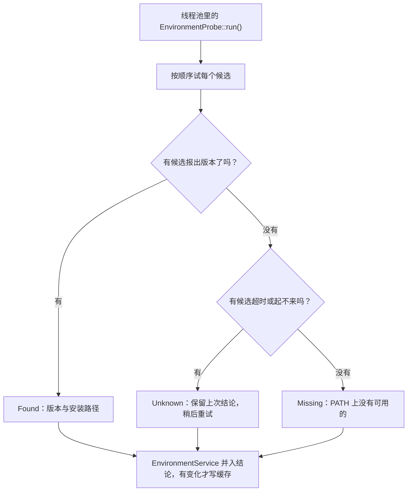

# workbench 与页面

## 这个功能做什么，边界在哪

`src/workbench` 是 L3 层，也是**全工程唯一允许同时认识多个领域**的层。注册内置页面、把 agent 的 URL 与 Web 标签页域组合起来、检测 Python/Node 运行时、把插件 ABI 桥接到 shell——这些都在这里，因为单个动作会横跨几个彼此不许互相 include 的模块。

边界是纵向的、不是横向的：`workbench` 可以依赖每个 L2 模块，而除可执行文件外没有任何东西依赖 `workbench`。两件事它刻意**不**做：

- 不变成领域逻辑的收容所。打开一个 Web 标签页是对 `WebTabsFacade` 的请求；`WorkbenchContext` 只决定用*哪个* URL、*何时*导航。
- 不扩展 shell 的知识。`WorkbenchContext` 与 `BuiltinPages` 调 `NavigationModel` / `ShellController`，而 `src/shell` 依然不知道 agent 或主题是什么。

## 文件与类清单

| 文件 | 类 | 职责 | 与谁协作 |
|---|---|---|---|
| `src/workbench/WorkbenchContext.h` / `.cpp` | `awb::workbench::WorkbenchContext` | `workbench` 背后的 QML 单例：导航意图、跨域意图（`openWeb`、`launchAgent` 等）、通用动作（复制、通知、打开 URL/目录/配置目录、退出）以及插件开关 API | `NavigationModel`、`UiServices`、`Notifications`、`AgentsFacade`、`WebTabsFacade`、`Settings` |
| `src/workbench/BuiltinPages.h` / `.cpp` | `awb::workbench::BuiltinPages` | 注册五个内置页面，并布线徽标、当前页持久化与跨域 Web 规则 | `NavigationModel`、`ShellController`、`AgentsFacade`、`WebTabsFacade`、`SkillsFacade`、`ToolsFacade`、`Notifications` |
| `src/workbench/EnvironmentService.h` / `.cpp` | `awb::workbench::EnvironmentService` | 状态栏与设置页的 Python / Node.js 检测：把探测派发到线程池、把结论并入已知状态、按变化落缓存、对没结论的一轮安排重试 | `EnvironmentProbe`、`EnvironmentCache` |
| `src/workbench/EnvironmentProbe.h` / `.cpp` | `awb::workbench::EnvironmentProbe`（含 `RuntimeState`、`RuntimeProbe`、`EnvironmentSnapshot`） | 线程安全的 worker：逐个试候选程序、问运行时自己装在哪、把结论并入已知状态 | `ProcessRunner`、`TextUtils` |
| `src/workbench/EnvironmentCache.h` / `.cpp` | `awb::workbench::EnvironmentCache`（含 `Snapshot`） | 首屏缓存：读写 `<dataRoot>/environment_cache.json` | `core::Paths`、`core::JsonStore` |
| `src/workbench/PluginServices.h` / `.cpp` | `awb::workbench::PluginServices` | `plugin::Services` 的宿主侧实现；插件 ABI 与 shell/theme/web 之间的桥 | `NavigationModel`、`UiServices`、`Notifications`、`Theme`、`WebTabsFacade`、`Settings`；细节见[插件宿主](插件宿主.md) |
| `src/workbench/CMakeLists.txt` | 构建目标 `awb_workbench` | 链接每个 L1/L2 模块加 core | `app` |
| `src/shell/PageDescriptor.h` | `awb::shell::PageDescriptor` | 一次页面注册的载体（`id`、`title`、`iconSource`、`source`、`section`、`order`、`badgeText`、`enabled`、`keepAlive`） | `NavigationModel`、`BuiltinPages`、`PluginServices` |
| `src/shell/qml/Workspace.qml` | — | 同一时刻托管一个页面；普通页用 `Loader`，`keepAlive` 页用 `Repeater` | `NavigationModel` |
| `src/shell/qml/MainWindow.qml` | — | 声明根部小写别名、快捷键、退出确认与一次性旧数据导入弹窗 | 所有单例 |
| `app/main.cpp` | — | 对象图装配与 QML 单例注册；启动顺序是契约 | 所有模块 |
| `app/CMakeLists.txt` | 可执行文件 `AgentWorkbench` | 声明 QML 模块、资源清单与翻译资源 | 所有 QML 模块 |

## WorkbenchContext

`WorkbenchContext` 以 `workbench` 别名暴露给 QML。它的构造函数只存指针并转发导航模型的 `currentPageChanged`；页面注册与规则布线在 `BuiltinPages`。

属性：

- `currentPageId` —— 直读 `NavigationModel::currentPageId()`。
- `legacyImportNotice` —— 一次性导入提示；正常启动为空串。组装层只设一次。`MainWindow.qml` 里的 `AAlertDialog` 读它。

导航意图：

- `showPage(id)` —— 切到已注册的页面。

跨域意图：

- `openWeb(agentId)` —— 卡片「打开」的默认路径。URL 优先级是**先取启动输出捕获的会话 URL，再取 `AgentUrls::finalUrl()`**（agent 配置了 `tokenFile` 时后者追加 `#token=<value>` 片段）。裸 `webUrl` 从不直接用：带 token 门禁的 harness 对它回 `401`，只有打到 stdout 的每进程 URL 能过。表面策略（内嵌/外部）与去重在 `WebTabsFacade` 内部决定。导航到 `web` 页**只在真正建了或复用了标签时**发生——`openTab()` 返回非空 id；外部表面路径返回空 id 且不导航，因为浏览器那边已经打开、Web 门面已发过 toast。
- `openWebExternal(agentId)` —— 绕过表面策略，把 URL 交给系统浏览器。URL 优先级同上，不建标签页。
- `closeWeb(agentId)` / `reloadWeb(agentId)` —— 找到该 agent 的标签页并关闭或重载；没有标签页时静默返回。
- `launchAgent(agentId)` —— 转发给 `AgentsFacade::launch()`；结果经门面自己的信号回报。

通用动作：

- `copyText(text)` —— 复制并按成败发 `success` 或 `error` toast。
- `notify(level, title, text)` —— 通用 toast 入口（`success` / `info` / `warning` / `error`）。
- `openExternalUrl(url)`、`openFolder(path)` —— 经 `UiServices`，失败发错误 toast。
- `openConfigDir(agentId)` —— 转发给 `AgentsFacade`。
- `quit()` —— 退出应用。

插件 API（只读清单加开关；行为见[插件宿主](插件宿主.md)）：`pluginList()`、`setPluginEnabled()`、`pluginsEnabled()`、`setPluginsEnabled()`、`pluginTrustNotice()`。

## BuiltinPages

`BuiltinPages` 把内置页面注册进 shell 的 `NavigationModel`，随后布三组规则。构造函数里的顺序是 `registerPages()`、`wireBadges()`、`wirePagePersistence()`、`wireWebRules()`。

完整的内置页面注册表：

| id | 标题（`tr()`） | 图标 | source | section | order | keepAlive |
|---|---|---|---|---|---|---|
| `agents` | Agent Launcher | `qrc:/icons/terminal.svg` | `qrc:/qt/qml/AgentWorkbench/agentcatalog/AgentGridPage.qml` | `main` | 10 | false |
| `web` | Agent Web UI | `qrc:/icons/web.svg` | `qrc:/qt/qml/AgentWorkbench/web/WebTabsPage.qml` | `main` | 20 | **true** |
| `skills` | Skills | `qrc:/icons/skills.svg` | `qrc:/qt/qml/AgentWorkbench/skillcatalog/SkillGridPage.qml` | `main` | 30 | false |
| `tools` | Agent Tools | `qrc:/icons/tools.svg` | `qrc:/qt/qml/AgentWorkbench/tools/ToolsPage.qml` | `main` | 40 | false |
| `settings` | Settings | `qrc:/icons/gear.svg` | `qrc:/qt/qml/AgentWorkbench/shell/SettingsPage.qml` | `system` | 100 | false |

`section` 决定页面落在侧栏的哪里，而且是唯一机制：`system` 页钉底。`keepAlive` 是一个实打实的取舍——普通页在切走时被销毁，所以必须活过切换的状态要放进 C++。`web` 页是唯一的例外，因为 `WebEngineView` 的状态搬不进 C++、销毁即整页重载；`Workspace.qml` 因此把它实例化一次、只隐藏不销毁。`keepAlive` 页必须自行在非当前页时禁用快捷键。

新功能页就注册在 `registerPages()` 里，走与插件相同的 `NavigationModel::registerPage()` 路径——没有另一套注册机制。

三组布线：

- `wireBadges()` —— `agents` 徽标是状态为 `running` 的 agent 数，在 `AgentModel` 的 `dataChanged`（限 `RunningRole`）、`rowsInserted`、`rowsRemoved` 时刷新，并在启动时先算一次初值。`setBadge` 传空串在计数为 0 时隐藏徽标。
- `wirePagePersistence()` —— 启动时恢复 `ShellController::lastPageId()`（记过才恢复），之后每次 `currentPageChanged` 立即保存当前页 id。页面恢复发生在这里，这正是插件必须在 `BuiltinPages` 构造**之前**加载的原因（见启动装配）。
- `wireWebRules()` —— 连接 agent 域与 Web 域的跨域规则：`AgentsFacade::runningChanged` 调 `WebTabsFacade::markOnlineForAgent()` / `markOfflineForAgent()`；`agentRemoved` 关掉该 agent 的标签页；`sessionUrlChanged` 调 `retargetTabForAgent()`，使已开的标签页不会停在会被 token 门禁拒绝的裸 `webUrl` 上；`WebTabsFacade::externalOpened` 发一条 toast。它还按标签模型的行数维护 `web` 徽标。

下图说明页面注册与它同模块内的跨域布线。

```mermaid
flowchart TD
    subgraph WB["awb_workbench（L3）"]
        BP["BuiltinPages"]
        WC["WorkbenchContext"]
        ES["EnvironmentService"]
        EP["EnvironmentProbe"]
        EC["EnvironmentCache"]
        PS["PluginServices"]
    end
    Nav["NavigationModel（shell）"]
    Shell["ShellController（shell）"]
    UI["UiServices（shell）"]
    Notif["Notifications（shell）"]
    Agents["AgentsFacade（agentcatalog）"]
    Web["WebTabsFacade（web）"]
    Skills["SkillsFacade（skillcatalog）"]
    Tools["ToolsFacade（tools）"]
    Theme["Theme（theme）"]
    Settings["Settings（core）"]
    PR["ProcessRunner（core）"]
    Workspace["Workspace.qml"]

    BP -->|registerPage / setBadge| Nav
    BP -->|lastPageId| Shell
    BP -->|runningChanged、sessionUrlChanged、agentRemoved| Agents
    BP -->|markOnline/markOffline、retargetTab、closeTabs| Web
    BP -->|notify| Notif
    BP -->|只接门面指针| Skills
    BP -->|只接门面指针| Tools
    WC -->|showPage / setCurrentPageId| Nav
    WC -->|openExternalUrl、copyText、openFolder| UI
    WC -->|openTab、tabForAgent、closeTab、reloadTab| Web
    WC -->|launch、openConfigDir、sessionUrl| Agents
    WC -->|notify| Notif
    WC -->|plugins.enabled、disabledIds| Settings
    ES -->|派发到线程池、合并结论| EP
    EP -->|问版本与路径| PR
    ES -->|启动读一次、有变化才写| EC
    PS -->|registerPage| Nav
    PS -->|registerSurface| Web
    PS -->|颜色令牌| Theme
    Workspace -->|currentPage、keepAlivePages| Nav
```



## EnvironmentService

`EnvironmentService` 以 `environment` 别名暴露，同时驱动状态栏的 Python/Node 徽标与设置页「环境」分区的两行；它是唯一知道「运行时怎么被检测出来」的地方。工作拆成两半：`EnvironmentProbe` 是纯 worker（进值类型、出值类型，不碰 `QObject`），`EnvironmentService` 是 GUI 侧协调者，负责把它派发到线程池、把结果落回 GUI 线程。

探测**不走 `cmd /c`**，并且每个运行时都要按顺序试若干候选程序名。worker 里每个运行时的流程（`EnvironmentProbe::run()`）：

- 候选按顺序试：Python 是 `python`、`python3`、`py`，Node 是 `node`、`nodejs`。Windows 上 `python` 常常是 Microsoft Store 的占位程序——它起得来，只打印一句「去商店装」然后退出、不报版本，于是这个候选落选、继续试下一个；机器上只装了 `py` 启动器时同理。
- 解析出的可执行文件**直接**运行（`ProcessRunner::run()`，两条通道都收，版本先看 stdout——老版本 Python 打到 stderr）。绕开 `cmd.exe` 就少一层进程、少一条命令行走安全软件的命令行解析，没有任何损失——因此它只留给 npm 风格的 `.cmd`/`.bat` 垫片，那种文件 `CreateProcess` 根本起不起来（与 `AgentRuntime` 的启动路径同一条规则）。
- 再跑一条命令问运行时自己装在哪：Python 看 `sys.executable`，Node 看 `process.execPath`。问不出来就回退到 `findExecutable()` 解析到的路径——安装路径属于展示信息，不该有能力把整次探测判失败。
- 三种结论刻意分开，这是最关键的一点。`Found` 是拿到了版本。`Missing` 是「PATH 上没有可用的」——要么候选一个都解析不到，要么解析到的候选全都跑完却没报版本（Store 占位程序正是这种）。`Unknown` 是超时或起不来：**没有结论**，绝不能报成「没装」。优先级是 `Found` > `Unknown` > `Missing`，因此一个慢候选不会把已装的运行时判成没装。
- 单条命令超时 4 秒，单个运行时预算 9 秒，每个候选最多两轮尝试（第二轮只重试瞬时失败的候选）。预算给「占住一个线程池线程多久」设了上界，也就给应用退出的等待时间设了上界。

GUI 侧再做四件事：

- 构造只读缓存；首次探测由 `start()`（`main.cpp` 调用）派发。把探测留在构造之外，才使得这个服务能在不起子进程的前提下被测试。
- `EnvironmentProbe::merge()` 把结论并入已知状态，`Unknown` 保留原值：一次瞬时失败会让最后已知的版本继续留在界面上，而不是把徽标打成红叉。
- 出现 `Unknown` 的一轮会按 3 秒、15 秒、60 秒安排重试；拿到权威结论的一轮重置该计数，`refresh()` 重新开始计数。三次重试之后停手并保留最后已知的值，同时把原因写进日志——设置页该行的 tooltip 会显示这一轮的排查记录（`RuntimeProbe::detail`），所以「为什么检测失败」在界面上和日志里都能答。
- `EnvironmentCache`（`<dataRoot>/environment_cache.json`）保存两个运行时的最后结论，且**只在结论变化时写**，因此一次「什么都没变」的启动不碰磁盘。缓存自己不做任何决定：每次启动、每次重测都真跑一轮探测——安装了、升级了、卸载了都是这样被发现的。



全部属性（`pythonStatus`、`pythonVersion`、`pythonPath`、`pythonInstalled`、`pythonProbeDetail` 以及对应的 `node` 五个，加 `detecting`）共用唯一一个 `changed()` 信号，状态栏因此可以统一绑定。`pythonStatus` / `nodeStatus` 是 QML 需要的三值契约（`found` / `missing` / `unknown`）：徽标只在 `missing` 时画 `×`，没有结论时画中性的 `…`；设置页也只把 `missing` 标红。`refresh()` 是 Re-detect 按钮背后的 `Q_INVOKABLE`，已有一轮在途时会被防抖忽略。

## PluginServices

`PluginServices` 是递给插件的抽象 `plugin::Services` 的宿主侧实现。它住在 `awb_workbench`，因为只有这一层被允许同时触碰导航模型、主题、Web 表面与设置。它被传给 `PluginHost::loadEnabled()`。每个方法——页面注册走与内置页同一条路径、插件私有数据目录、日志与 toast、只读主题色与白名单设置——都在[插件宿主](插件宿主.md)里说明。

## 启动装配

`app/main.cpp` 手工搭出对象图，顺序是硬契约；有几步挪位会静默失效。

1. **日志最先装**（`Logging::install()`），之后任何失败都落在磁盘上。读完 `Settings` 后，只有当用户确实改过轮转或级别选项时才二次安装日志后端，好让读设置期间发出的告警仍能落盘。
2. **`Settings` 在 `QGuiApplication` 之前读。** `web.chromiumFlags` 必须推进 `QTWEBENGINE_CHROMIUM_FLAGS`，而 WebEngine 模块必须在应用对象构造*之前*初始化（Qt 6 是 `QtWebEngineQuick::initialize()`，Qt 5 是 `QtWebEngine::initialize()`）。顺序错了，用户配的 Chromium flags 就会静默失效。
3. 创建 `QGuiApplication`，设版本与图标，钉住 Qt Quick Controls 样式（Qt 6 用 `Basic`，Qt 5 用 `Default`）。
4. 按区域（或 `locale.override` 的值）从 `:/i18n` 安装翻译器；见[国际化](国际化.md)。
5. 引擎创建之前把 `appearance.fontFamily` 应用到应用字体上。
6. **`LegacyImport::runOnce()` 在写默认 `settings.json` 之前跑**，因为导入是否行动取决于数据根是否仍未动过。此后，若 `settings.json` 不存在才写一份默认的。
7. **自底向上装配对象图**：`ThemeRegistry` → `Theme` → shell（`NavigationModel`、`ShellController`、`UiServices`、`Notifications`）→ `AgentsFacade`（+ `start()`）→ `WebTabsFacade` → `SkillsFacade`（+ `start()`）→ `ToolsFacade` → `MarkdownEdit` → `EnvironmentService`（+ `start()`）→ `WorkbenchContext`。
8. **插件在页面注册与恢复之前发现并加载。** manifest 总是要读（设置页即使插件被禁用也要列出它们）；库只在总开关打开时装载，每个 manifest 的启用标志再对照 `plugins.disabledIds` 解析。发现结果被灌进 `WorkbenchContext`。因为 `BuiltinPages` 在这之后才构造，插件页面 id 才能活过一次重启。
9. 构造 `BuiltinPages`，它注册内置页面并恢复上次的页面。
10. WebEngine 打开时，创建表面 provider、profile store 与 compat 对象，并把 `WebProfiles` / `WebEngineCompat` 注册为单例。
11. 调 `qRegisterMetaType<awb::core::OpResult>()`，并注册 QML 单例（见下表）。
12. 创建 `QQmlApplicationEngine`，加入导入路径 `<applicationDirPath>/qml`（Qt 5 再补 `qrc:/qt/qml`），加载 `MainWindow.qml`。若没有生成根对象，打日志列出导入路径，在 Windows 上弹一个说明弹窗，用 `Logging::uninstall()` 排空日志队列，并以 `-1` 退出。
13. `app.exec()` 返回后再调 `Logging::uninstall()`。QML 侧，`MainWindow.qml` 的 `onClosing` 保存窗口尺寸并弹退出确认；选择关闭后台终端会调 `agents.stopAll()`。已加载的插件库进程级存活，由 `PluginHost::shutdown()` 统一卸载（它在 `main` 结尾析构时效果相同）。

单例名与 QML 别名。所有全局对象都注册在纯 C++ URI `AgentWorkbench.App` 上、类型名大写；小写契约名是 `MainWindow.qml` 根部的 `readonly property` 别名。

| 注册的类型名 | QML 别名（`MainWindow.qml` 根部） | 说明 |
|---|---|---|
| `Theme` | `theme` | |
| `Nav` | `nav` | |
| `Shell` | `shell` | |
| `Ui` | `ui` | |
| `Notifications` | `toasts` | 别名与类型名不同 |
| `Agents` | `agents` | |
| `Web` | `web` | |
| `Skills` | `skills` | |
| `Tools` | `tools` | |
| `MarkdownEdit` | — | 直接以 `MarkdownEdit` 引用 |
| `Workbench` | `workbench` | |
| `Environment` | `environment` | |
| `WebProfiles` | — | 仅 WebEngine 开启时注册；在 `WebEngineSurface.qml` 内直接使用 |
| `WebEngineCompat` | — | 仅 WebEngine 开启时注册；由兼容桥直接使用 |

## 资源与 QML 模块

`app/CMakeLists.txt` 调用 `awb_add_qml_module(AgentWorkbench)`（Qt 6 是 `qt_add_qml_module`，Qt 5 是生成的 `qmldir` + qrc）。对每个 `.qml` 文件，清单设置 `QT_RESOURCE_ALIAS`，因此页面 URL 恒为

```
qrc:/qt/qml/AgentWorkbench/<area>/<Name>.qml
```

其中 `<area>` 是按目录划分的区域（`agentcatalog`、`web`、`shell`、`components`、`skillcatalog`、`tools`）。新增或移动一个 `.qml`，就要同时改这里的对应区域清单，以及（文件里有 `qsTr()` 时）`cmake/AwbTranslations.cmake` 的 `AWB_TS_SOURCES`。

QML 资源只编译进**可执行文件**，绝不进静态库，因为链接器会丢掉静态库里的 qrc 初始化器；这也是各模块 `CMakeLists.txt` 只列 C++ 源的原因。其余随包资源（图标、`config/default_*.json`、JS 兼容 polyfill、内置主题）也在这里登记，各有自己的 `PREFIX` 与别名。编译后的翻译由根 `CMakeLists.txt` 的 `qt_add_translation()` 产物嵌入 `:/i18n/`（见[国际化](国际化.md)）。

可执行文件把 `<applicationDirPath>/qml` 加进引擎的导入路径，让随包部署在二进制旁边的 Qt 运行时优先。

## 新增内置页面 / 新增跨域动作

**新增一个内置页面**：

- [ ] 在所属模块的 `qml/` 下建页面 QML，并登记进 `app/CMakeLists.txt` 的对应区域清单（有 `qsTr()` 时还要进 `AWB_TS_SOURCES`）。
- [ ] 在 `BuiltinPages::registerPages()` 里注册 `shell::PageDescriptor`，写明 id、`tr()` 标题、图标、source URL、`section` 与 `order`；只有当页面状态搬不进 C++ 时才设 `keepAlive`。
- [ ] 页面需要跨域行为时，在 `BuiltinPages` 里布线（照现有模式加一个 `wireXxx()` 私有方法），而不是从 QML 跨域伸手。
- [ ] 页面进侧栏且有徽标时，扩展 `wireBadges()`；需要可恢复的话 `wirePagePersistence()` 已经覆盖。
- [ ] 更新[扩展点](../architecture/扩展点.md)与本页的注册表，并补该页自己的 `guide/` 与 `development/` 文档。

**新增一个跨域动作**：

- [ ] 在 `WorkbenchContext` 上加一个 `Q_INVOKABLE` 方法（QML 只能调 `Q_INVOKABLE`，构建门禁会检查），域内调用都收在它里面。
- [ ] 需要跨页时走 `NavigationModel`，不要另开导航路径。
- [ ] 失败经 `Notifications` 上报，不要把错误返回给 QML；调用方确实需要同步结果时才返回写全限定名的 `awb::core::OpResult`。
- [ ] 在 `tests/workbench/` 里覆盖，并更新本页。

## 相关页面

- [core 基础设施](core基础设施.md)——启动时装配的 `Settings`、`Paths` 与各对象。
- [主题引擎](主题引擎.md)——`main.cpp` 注册的 `Theme` 单例。
- [插件宿主](插件宿主.md)——页面注册与宿主服务桥的插件侧。
- [C++ 库设计](../architecture/C++库设计.md)——门面与 `Q_INVOKABLE` 契约。
- [分层与依赖](../architecture/分层与依赖.md)——workbench 为何是唯一的多领域层。
- [使用指引](../guide/index.md)——用户看到的页面、导航与快捷键。
- [配置参考](../configuration.md)——装配层读取的 `window.lastPageId` 与插件键。
