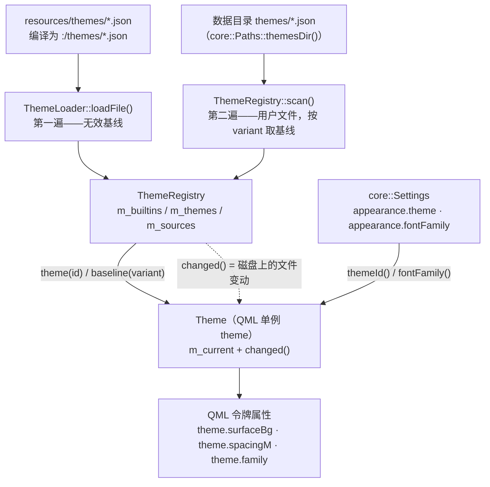

# 主题引擎

## 这个功能做什么，边界在哪

主题引擎把一个 JSON 文件翻译成一组**语义令牌**，QML 直接绑定它们：页面写 `theme.surfaceBg`、`theme.spacingM` 或 `theme.durationFast`，名字背后的值在用户换主题时随之变化。页面永远不知道某种颜色「是什么」，只知道它扮演什么角色。

边界刻意收得很窄。引擎只管三件事：读入并校验主题文件、维护「有哪些主题」的注册表、把当前主题暴露为命名属性。它**不**含布局、组件视觉配方（那是 `designs.md` 的职责），也完全不碰任何 UI 类型——`src/theme` 是构建门禁禁止出现 Qt Quick 的两个目录之一（规则 4），因此它只依赖 Qt Core 加 Qt Gui（`QColor`，以及跟随系统功能用到的 `QStyleHints`）。

## 文件与类清单

| 文件 | 类 / 结构 | 职责 | 与谁协作 |
|---|---|---|---|
| `src/theme/ThemeFile.h` | `awb::theme::ThemeFile` | 一份解析完成的主题：身份（`id`、`name`、`variant`）加 `colors`、`metrics`、`fonts`、`agentPalette`；`isValid()` 在 `id` 非空时为真 | 由 `ThemeLoader` 产出、`ThemeRegistry` 保存、`Theme` 持有 |
| `src/theme/ThemeLoader.h` / `.cpp` | `awb::theme::ThemeLoader` | 解析并校验单个主题 JSON；`parse()` 承载全部规则，`loadFile()` 读磁盘或 `:/` 路径 | `ThemeFile`、`ThemeRegistry::baseline()` |
| `src/theme/ThemeRegistry.h` / `.cpp` | `awb::theme::ThemeRegistry` | 可用主题的集合：内置来自 `:/themes/*.json`，用户主题来自 `<数据目录>/themes/*.json`；同 id 的用户文件覆盖内置；监视用户目录与文件并在变动后重发 `changed()` | `core::Paths::themesDir()`、`ThemeLoader`、`Theme` |
| `src/theme/Theme.h` / `.cpp` | `awb::theme::Theme` | `theme` 背后的 QML 单例：每个令牌一个 `Q_PROPERTY`，全部共用 `changed()` 信号；另有 `applyTheme()`、`setFollowSystem()`、`followSystem`/`canFollowSystem` 属性、`setFontFamily()`、`color()`、`metric()`、`alpha()`、`hover()`、`pressed()`；`setSystemVariantForTesting()` 供测试注入系统深浅色 | `core::Settings`（当前 id、跟随开关、字体覆盖）、`ThemeRegistry`、`QStyleHints`（Qt 6.5+） |
| `src/theme/CMakeLists.txt` | 构建目标 `awb_theme` | 只链接 `Qt::Core` 与 `Qt::Gui` | `app` |
| `resources/themes/mocha-dark.json` | — | 内置深色主题，编译为 `:/themes/mocha-dark.json`；同时是 `dark` 基线，也是未知 id 的回退主题 | `ThemeRegistry`、`ThemeLoader` |
| `resources/themes/latte-light.json` | — | 内置浅色主题，编译为 `:/themes/latte-light.json`；是 `light` 基线 | `ThemeRegistry`、`ThemeLoader` |
| `src/core/Paths.h` / `.cpp` | `awb::core::Paths` | 提供 `themesDir()`（`<dataRoot>/themes`）——用户主题目录唯一的推导点 | `ThemeRegistry` |
| `src/core/Settings.h` / `.cpp` | `awb::core::AppearanceSettings` | 保存 `theme`、`followSystem`、`fontFamily`；`Settings::setThemeId()`、`setFollowSystem()` 与 `setFontFamily()` 发 `valueChanged()` | `Theme` |
| `app/main.cpp` | — | 先构造 `ThemeRegistry` 再构造 `Theme`，并把 `Theme` 注册为 `AgentWorkbench.App` 上的 QML 单例 | 以上全部 |
| `scripts/check-architecture.sh` | — | 规则 2 拒绝 QML 字面颜色，规则 4 保证 `src/theme` 不出现 UI 类型 | CI / `check_architecture` |
| `tests/theme/tst_themeloader.cpp`、`tst_themeregistry.cpp`、`tst_themefontfamily.cpp`、`tst_themefollowsystem.cpp` | — | 覆盖校验规则、覆盖行为、字体优先级与跟随系统语义 | `tst_theme` |

## 数据模型

`ThemeFile` 是普通结构体，不是 `QObject`。它携带：

- `id` —— 主题 id，且**必须等于不带 `.json` 的裸文件名**。`id` 为空即「无效文件」。
- `name` —— 主题选择界面上的显示名。
- `variant` —— 只能是 `"dark"` 或 `"light"`。
- `colors` —— `QHash<QString, QColor>`，键为令牌名。
- `metrics` —— `QHash<QString, double>`，存圆角、间距、字号、固定尺寸与动效时长。
- `fonts` —— `QHash<QString, QString>`，只有 `family` 与 `monoFamily` 两个键存在。
- `agentPalette` —— 一串 `#rrggbb`；`agentcatalog` 按位置轮换取色给 agent 卡片着色。

解析器接受的顶层键是一份固定白名单：`id`、`name`、`variant`、`author`、`description`、`colors`、`metrics`、`fonts`、`agentPalette`。清单之外的顶层键记未知告警后忽略。

一个主题文件通常只声明它要改的部分，下面是精简后的内置示例：

```json
{
  "id": "mocha-dark",
  "name": "Catppuccin Mocha (Dark)",
  "variant": "dark",
  "colors": {
    "windowBg": "#1e1e2e",
    "surfaceBg": "#313244",
    "textPrimary": "#cdd6f4",
    "selectionBg": "#45475a",
    "selectionText": "#cdd6f4",
    "scrollbar": "#45475a"
  },
  "metrics": {
    "radiusCard": 16,
    "spacingM": 12,
    "fontSizeBody": 13,
    "durationNormal": 180,
    "sidebarWidth": 240
  },
  "fonts": { "family": "", "monoFamily": "Consolas, Monaco, Courier New, monospace" },
  "agentPalette": ["#f38ba8", "#fab387", "#a6e3a1", "#89b4fa"]
}
```

`colors` 放颜色令牌，`metrics` 放数值令牌，`fonts` 放两个字体族（`family` 可为空串，表示跟随系统），`agentPalette` 是每张卡片的强调色轮换表。

## 加载与校验

`ThemeLoader::parse()` 就是完整契约，每条规则都在防一类失败：

- **未知键**（`colors`、`metrics`、`fonts` 内以及顶层）记告警后忽略。带额外元数据的第三方主题仍能加载。
- **缺 `id`、`name` 或 `variant`，或 variant 不是 `dark`/`light` 的文件整个跳过。** 连自身身份都表不清的文件比少一个主题更糟。
- **`id` 必须等于文件名。** `id` 是注册表与 `settings.json` 共用的主键；名实不符的文件告警后整体跳过，而不是半注册进去。
- **非法颜色或非数字 metric 回退到同 variant 的基线。** `agentPalette` 里的非颜色项丢弃；非数组的 `agentPalette` 告警后忽略。
- **`fonts` 的值必须是字符串**，非字符串直接忽略而不强转；这里刻意没有基线兜底，因为空串本身就是合法的「跟随系统」。
- **缺失令牌统一从基线补齐**——同 variant 的内置主题（`dark` 用 `mocha-dark`，`light` 用 `latte-light`）。所以主题只需声明它想改的令牌。
- **`agentPalette` 为空时整体取基线的。**

内置主题本身用**无效基线**（`ThemeFile()`）解析，含义是「无兜底、也不过未知令牌过滤」：它们定义的是规范且完整的令牌集。`ThemeLoader::loadFile()` 在任一失败情形下都返回无效 `ThemeFile`——文件不可读、JSON 不是对象、或被 `parse()` 拒绝——调用方据此按「没有这个主题」处理。

## 注册表与热重载

下图说明主题文件如何一路流到 QML 令牌。



`ThemeRegistry` 在构造函数里按固定顺序装上内置主题（`mocha-dark` 在前，因为它是回退主题，然后 `latte-light`），随后创建用户主题目录（`<dataRoot>/themes`）让监视器有东西可挂，扫描该目录并挂上 `QFileSystemWatcher`（监视目录与其中每个用户文件）。`directoryChanged` 与 `fileChanged` 两条信号都汇到 `refresh()`：重扫、重挂监视、发 `changed()`。因此保存一个主题文件即刻生效，无需重启。

有两条行为看似冗余，实则必要，值得写明：

- **`Theme::loadCurrent()` 无条件换掉自己的 `ThemeFile` 并总是发 `changed()`**，即使主题 id 没变。同一个 id 背后的磁盘内容可能已经变了，按 id 跳过会让热重载静默失效。
- **`Theme::applyTheme()` 先校验再落盘。** 未知 id 被拒绝并告警；若先落盘，之后每次启动都会走「未知 → 回退 + 告警」路径——那条路径只为手改坏的 `settings.json` 留容错，不该被选择界面触发。`setFontFamily()` 沿用同样的「先写再重载」形状。

settings 里的 id 未知时，`loadCurrent()` 回退到 `mocha-dark` 并记一条告警。

### 跟随系统深浅色

`appearance.followSystem`（**设置 → 外观** 的开关）让 `loadCurrent()` 不再从
`appearance.theme` 解析当前主题，改由**系统**深浅色决定：

- 系统变体经 `QGuiApplication::styleHints()->colorScheme()`（Qt 6.5+）读取。
  `Theme` 在构造时订阅 `colorSchemeChanged`，但只在跟随开启时重解析——显式选择
  不该被系统翻转覆盖。
- 变体对应的主题取**该变体的内置基线**（`ThemeRegistry::baseline("dark"/"light")`
  → `mocha-dark` / `latte-light`），不是逐用户偏好：用户主题只能经选择框到达。
- 配色不可知时——Qt 5（没有 `QStyleHints::colorScheme`，所以
  `Theme::canFollowSystem` 恒为假、设置开关禁用）、只有 `QCoreApplication` 的进程、
  或 `Qt::ColorScheme::Unknown`——`loadCurrent()` 回退 `appearance.theme`，行为与
  关闭跟随一致。
- `Theme::themeId()` 汇报的是**实际生效**的主题，跟随期间选择框显示的就是它；
  选择框本身被禁用，做不出会被搁置的显式选择。

`setFollowSystem()` 写设置并落盘——重载经与外部改 `settings.json` 相同的
`valueChanged("appearance.followSystem")` → `loadCurrent()` 通路到达。测试经
`Theme::setSystemVariantForTesting()` 注入变体，因为套件 runner 没有
`QGuiApplication`。

选择界面的顺序来自 `ThemeRegistry::themes()`：内置主题按固定顺序在前，随后是仅有用户版本的主题按 id 不区分大小写排序。`Theme::availableThemes()` 把每一项映射成含 `id`、`name`、`variant` 与短标签 `display`（`Dark` / `Light`；variant 意外时用主题名）的 map。

## 暴露给 QML 的令牌

`Theme` 暴露两类 API：命名 `Q_PROPERTY` 与助手方法。**所有属性共用唯一的 `changed()` 信号作为 `NOTIFY`**，所以切换主题、热重载文件、改字体三者都会让 QML 一次性重绑。

元信息属性：

| 属性 | 含义 |
|---|---|
| `variant` | 当前主题的深浅变体，`"dark"` 或 `"light"` |
| `themeId` | 当前主题 id |
| `availableThemes` | 选择界面用的 `QVariantList`，每项含 `{id, name, variant, display}` |
| `agentPalette` | `QStringList` 的 `#rrggbb`，按 agent 卡片轮换分配 |
| `fontFamilies` | 本机字体族清单（外观页选择框用）；进程内不变，标 `CONSTANT` |

颜色令牌（各有一个同名 getter，缺键返回无效 `QColor`）：

`windowBg`、`sidebarBg`、`workspaceBg`、`surfaceBg`、`surfaceAltBg`、`surfaceHoverBg`、`chromeBg`、`overlayBg`、`consoleBg`、`textPrimary`、`textSecondary`、`textMuted`、`textDisabled`、`textOnAccent`、`textLink`、`borderSubtle`、`borderStrong`、`separator`、`accent`、`focusRing`、`success`、`warning`、`danger`、`info`、`neutralOff`、`tooltipBg`、`tooltipText`、`badgeBg`、`tabActiveBg`、`tabInactiveBg`、`selectionBg`、`selectionText`、`scrollbar`。

数值令牌（缺键返回 `0.0`）：

`radiusCard`、`radiusOverlay`、`radiusControl`、`radiusPill`、`spacingXs`、`spacingS`、`spacingM`、`spacingL`、`spacingXl`、`fontSizeCaption`、`fontSizeBody`、`fontSizeSubtitle`、`fontSizePageTitle`、`cardMinWidth`、`cardHeight`、`durationFast`、`durationNormal`、`sidebarWidth`、`sidebarCollapsedWidth`、`statusBarHeight`、`tabBarHeight`、`toastWidth`。

字体令牌：`family` 与 `monoFamily`。

助手方法：

- `color(name)` 与 `metric(name)` 按名字查令牌——与命名 getter 等价，供遍历令牌的组件使用。未知名字返回无效 `QColor` / `0.0`。
- `alpha(color, a)` 返回设好 alpha 的副本，超出范围会被夹到 `0..1`。
- `hover(color)` 与 `pressed(color)` 沿 HSL 的 L 轴分别移动 `0.08` 与 `0.16`，**方向随当前变体走**——深色提亮、浅色压暗——同时保住色相与饱和度。

**QML 必须用 `theme.hover()` / `theme.pressed()` 而不是 `Qt.darker()` / `Qt.lighter()`。** Qt 的这两个助手方向固定、不感知深浅变体，用它们写的 hover 态会在两套主题之一里变得不可读。

## fontFamily 的优先级

`Theme::family()` 按以下顺序取值：

1. 用户设置 `appearance.fontFamily`，非空时优先；
2. 当前主题的 `fonts.family`；
3. 空串，QML 侧据此继承系统默认。

`monoFamily` 没有用户覆盖机制，永远是主题值。`app/main.cpp` 还会在引擎创建之前把 `appearance.fontFamily` 应用到 `QGuiApplication` 的字体上；运行期换字体由 `MainWindow.qml` 把 `font.family` 绑定到 `theme.family` 驱动。

## 构建门禁

`scripts/check-architecture.sh` 的两条规则守住了令牌纪律：

- **规则 2 拒绝 QML 字面颜色**：`#rrggbb` / `#rgb`，以及由数字字面量构造的 `Qt.rgba(<数字>, …)`。`"transparent"` 与 `Qt.rgba(theme.…)` 表达式是允许的。理由是深浅双主题的硬要求：写死颜色的页面不可能在两套主题下都正确，而令牌层正是让同一个页面服务两套主题的东西。
- **规则 4 保证 `src/core` 与 `src/theme` 不出现 UI 类型**（不许 `QtQuick`、`QQuick*`、`QQml*`、`Qt6::Quick`、`QtWebEngine`）。这就是引擎只讲 `QColor`、从不触碰 QML item 的原因。

## 新增或修改主题要做什么

只加一个主题的话，改的都是数据：

- **内置**：新增 `resources/themes/<id>.json`，在 `app/CMakeLists.txt` 里以 `theme_resources` 登记并设 `QT_RESOURCE_ALIAS "<id>.json"`、`PREFIX "/themes"`，再把 id 加进 `ThemeRegistry.cpp` 的内置清单。文件名必须等于 `id`。
- **用户**：把 `<id>.json` 放进 `<数据目录>/themes/`，即刻生效；与内置同 id 的文件只覆盖该用户。

要新增一个**令牌**（而不只是给已有令牌一个新值），必须同时改几处：

1. `src/theme/ThemeLoader.cpp` 的键白名单与解析逻辑；
2. `src/theme/Theme.h` / `Theme.cpp` 的 `Q_PROPERTY` 与 getter；
3. **两个**内置 JSON——它们是其它主题补全缺失令牌的基线；
4. 若该令牌供共享组件使用，还要改 `designs.md` 的组件配方；
5. 本文档。

有一对不能拆：**`selectionText` 必须与 `selectionBg` 成对定义。** 不设的话，文本编辑组件会回落到系统 palette 的 `HighlightedText`（Windows 浅色 palette 下近黑），配深色主题的选区背景几乎不可辨。`ATextField` / `ATextArea` / `ASearchField` 已用这两个令牌内建了 `selectionColor` / `selectedTextColor`，页面里不要再设一遍。

## 改动检查清单

- [ ] 主题文件名等于 `id`；`id`、`name`、`variant` 齐全且 variant 为 `dark`/`light`。
- [ ] 内置主题已在 `app/CMakeLists.txt` 登记（`QT_RESOURCE_ALIAS` + `PREFIX "/themes"`），并写进 `ThemeRegistry` 的内置 id 清单。
- [ ] 新增令牌时同时改了 loader 白名单、`Theme` 属性、两个内置 JSON。
- [ ] `selectionText` 仍与 `selectionBg` 一同交付。
- [ ] QML 里没有新增字面颜色；深浅两套主题都检查过。
- [ ] `bash scripts/build.sh --test` 全绿，含 `check_architecture`。

## 相关页面

- [core 基础设施](core基础设施.md)——引擎脚下的 `core::Paths`、`core::Settings` 与 JSON 读写。
- [workbench 与页面](workbench与页面.md)——`Theme` 在哪里被构造并注册为单例。
- [前端设计](../architecture/前端设计.md)——只用令牌的规则与玻璃卡配方。
- [扩展点](../architecture/扩展点.md)——主题作为一种数据扩展点。
- [外观指引](../guide/外观.md)与[使用指引](../guide/index.md)——主题与字体选择的用户视角。
- [配置参考](../configuration.md)——`appearance.*` 设置键。
