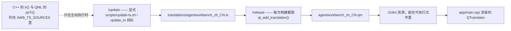

# 国际化

## 规则，以及它们为什么长这样

这是一个国际化的开源项目：所有面向用户的字符串都必须可翻译。由此推出四条规则，每条都对应一个具体的失败。

1. **源语言是英文。** 绝不在 `tr()` 或 `qsTr()` 里写中文（或任何其它非英文语言）。`check_architecture` 规则 3 会扫描每个 `tr(...)` / `qsTr(...)` 调用里的非 ASCII 字节，发现即构建失败。理由是机械的、不是风格问题：源串是查找键，若不同开发者用不同语言书写，同一条消息就会有几个键，译者再也没法复用同一条翻译。
2. **翻译放在 `translations/`。** 中文及其它语言只存在于那里的 `.ts` 文件，绝不写进源串。
3. **构建只跑 `lrelease`** —— 把 `.ts` 编译成 `.qm` 并以 `:/i18n/` 资源前缀嵌入。`lupdate`（源码 → `.ts` 同步）**不在构建里**。
4. **`lupdate` 是显式步骤**：`bash scripts/update-ts.sh`，等价于 `cmake --build build --target update_ts`。

第 3 条看起来像遗漏，实则刻意。`lupdate` 会按当前源码行号重写每个 `<location>` 元素，所以如果它挂在构建里，即使没有任何字符串改动，每次编译后工作区都会带着一个被修改的 `translations/agentworkbench_zh_CN.ts`——在一个经常多工作树并行开发的仓库里，这是一份永远存在的假改动。把 `lupdate` 保持为显式步骤，`.ts` 才只在开发者主动要求时变化。

流水线如下，显式步骤单独画出：

## 文件与流程清单

| 文件 | 作用 | 说明 |
|---|---|---|
| `translations/agentworkbench_zh_CN.ts` | 唯一的翻译文件 | XML `<TS version="2.1" language="zh_CN">`，每个类或 QML 组件一个 `<context>`，每条消息含 `<location>` 与 `<source>` / `<translation>` 对 |
| `cmake/AwbTranslations.cmake` | 声明 `AWB_TS_SOURCES`，即 `lupdate` 扫描的**源码文件清单** | 新增含 `tr()` / `qsTr()` 的 `.cpp` / `.h` / `.qml` 必须加进来，否则它的字符串永远到不了译者手里 |
| 根 `CMakeLists.txt` | `include(cmake/AwbTranslations.cmake)`，再 `qt_add_translation(QM_FILES translations/agentworkbench_zh_CN.ts)`；`awb_translations` 是 order-only 目标，保证 `rcc` 不会早于 `lrelease` | 还定义了 `update_ts` 目标：经 `@file` 清单（90+ 路径超过 Windows 命令行上限）跑 `lupdate` 并写出唯一的 `.ts` |
| `app/CMakeLists.txt` | `add_dependencies(AgentWorkbench awb_translations)`，设 `QT_RESOURCE_ALIAS "agentworkbench_zh_CN.qm"`，并把 `${QM_FILES}` 以 `PREFIX "/i18n"` 嵌入 | `.qm` 在这里登记，因为资源嵌入跟着可执行文件走 |
| `scripts/update-ts.sh` | 驱动 `cmake --build <构建目录> --target update_ts`，并报告 `translations/` 是否变化 | 需要已配置的构建目录；它**不**直接跑 `lupdate` |
| `app/main.cpp` | 建 `QTranslator`，用 `translator.load(locale, "agentworkbench", "_", ":/i18n")` 加载并安装 | `locale` 默认是 `QLocale()`（系统区域）；`core::Settings` 的 `locale.override` 非空时改用它；前缀是 `agentworkbench` |
| `scripts/check-architecture.sh` | 规则 3：`tr()` / `qsTr()` 的源串必须是 ASCII | 由 `check_architecture` 在构建期强制 |

QML 侧精神一致：`qsTr()` 的用法与 `tr()` 完全相同，且该 QML 文件必须在 `AWB_TS_SOURCES` 里。

## 日常改动流程

1. **新增含 `tr()` / `qsTr()` 的源文件？** 把它加进 `cmake/AwbTranslations.cmake` 的 `AWB_TS_SOURCES`。漏了这一步，该文件的字符串只是永远不出现在 `.ts` 里。
2. **新增或改了面向用户的字符串？** 跑 `bash scripts/update-ts.sh`（等价 `cmake --build build --target update_ts`）。这需要已配置的构建目录；`build/` 不存在时先跑一次 `bash scripts/build.sh`。
3. **把 `.ts` 与代码改动放在同一次提交里**，先把新增的 `<translation type="unfinished">` 条目填上。
4. **忘跑第 2 步不会导致构建失败。** 新串在已翻译语言里只是回退英文。这是轻惩罚而非坏构建，但仍是应当避免的缺陷。
5. **`.ts` 的行号差异是噪声。** 合并时，若冲突只是 `<location>` 行号不同，取任一侧即可；只有翻译文本本身有分歧才需要手工合并。

只有面向用户的字符串才被包裹。不打算翻译的东西（JSON 键、命令行、URL 片段、日志前缀）一律用 `QStringLiteral`，绝不能对它们用 `tr()`。

## 添加一种新语言

1. 创建 `translations/agentworkbench_<locale>.ts`（例如 `agentworkbench_de.ts`），`language` 属性与之对应。
2. 在根 `CMakeLists.txt` 的 `qt_add_translation()` 里登记它，让 `lrelease` 编译它、`app/CMakeLists.txt` 嵌入产出的 `.qm`。`update_ts` 目标目前只写 `agentworkbench_zh_CN.ts`，所以也要把新文件加进去（或加一个并列目标），否则 `lupdate` 不会填充它。
3. `AWB_TS_SOURCES` 列的是要扫描的**源码**文件、不是 `.ts`；除非你同时在上面的流程第 1 步新增了源码，否则它保持不变。
4. 跑 `bash scripts/update-ts.sh`，让 `lupdate` 把全部消息与待翻译的空 `<translation>` 条目填进新文件。
5. 翻译这些条目、重新构建，系统区域匹配的用户就会自动加载到它。
6. 更新站点的语言处理：该语言同样要列进 `mkdocs.yml` 里 i18n 插件的 `nav`（两个 `locale` 用同样的相对页面路径），并在任何列出受支持语言的地方补上它。

## 不该翻译的东西

- **标识符** —— 类名、函数名、属性名、文件名保持英文。
- **日志信息** —— 日志是英文（`qInfo()` / `qWarning()` 与 `AWB_*` 宏）。日志行是诊断输出、不是面向用户的字符串，从不带翻译。
- **提交信息** —— 英文。
- **代码注释** —— 中文，见[编程规范](../standards/coding-standard.md)。注释不是面向用户的字符串，与规则 1 不冲突。
- **本地化文档** —— `docs/zh/`、`README-zh.md` 以及 `mkdocs.yml` 里的语言名标签是正当的本地化内容，不是源串，不受此约束。

一句话概括这个分工：**标识符、面向用户的字符串、日志与提交信息用英文；代码注释用中文。**

## 改动检查清单

- [ ] 任何 `tr()` / `qsTr()` 里都没有非 ASCII 文本（`check_architecture` 规则 3）。
- [ ] 含 `tr()` / `qsTr()` 的新源文件已加进 `AWB_TS_SOURCES`。
- [ ] 已跑 `bash scripts/update-ts.sh`，且产出的 `.ts` 改动与字符串改动在同一次提交里。
- [ ] 新翻译已填写；你声称支持的语言里没有遗留的 `type="unfinished"` 条目。
- [ ] 被改动的源串对应的既有翻译已更新，而不是留在原地过期。
- [ ] **文档保持双语同步**：改了英文页，就补上或更新 `docs/zh/` 镜像，章节、表格、链接一一对应（见 [docs/AGENTS.md](../AGENTS.md) 与 `zh/` 约定）。相比之下，源码除中文注释外绝不承载其它语言。
- [ ] `bash scripts/build.sh --test` 全绿，含 `check_architecture`。

## 相关页面

- [core 基础设施](core基础设施.md)——应用「日志只用英文」规则的 `core::Logging`，以及 `core::Settings` 的 `locale.override`。
- [workbench 与页面](workbench与页面.md)——启动时安装翻译器的位置。
- [主题引擎](主题引擎.md)——它的两个面向用户的标签（`Dark`、`Light`）就是 `tr()` 源串。
- [编程规范](../standards/coding-standard.md)——注释语言规则与 `tr()` / `QStringLiteral` 的分工。
- [docs/AGENTS.md](../AGENTS.md)——本页交叉引用的双语文档政策。
- [配置参考](../configuration.md)——`locale.override` 键。
