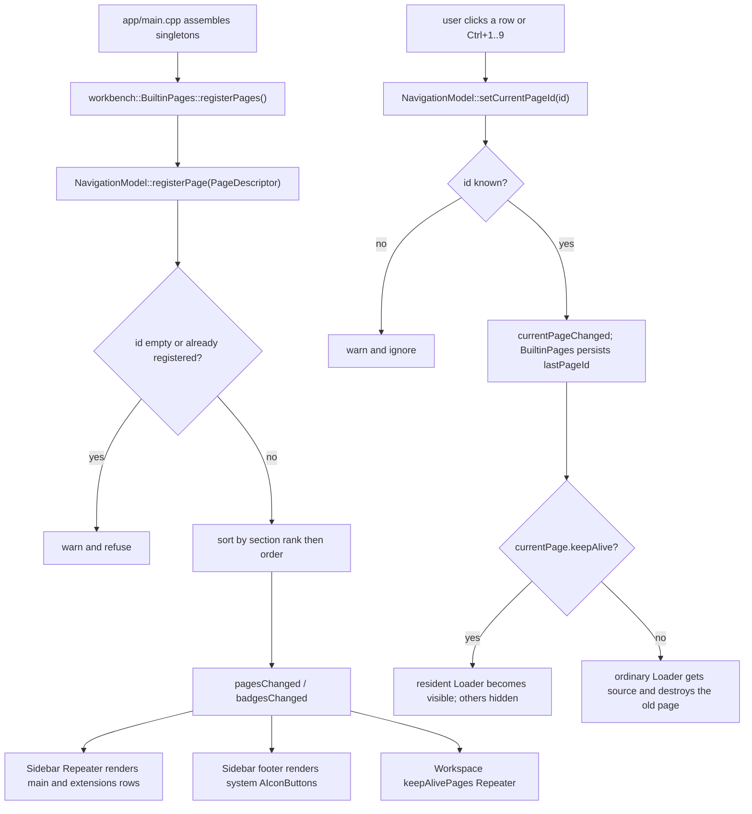

# Shell 与导航

## 这个功能做什么

shell 是应用的外壳与 UI 框架：侧栏、工作区宿主、状态栏、toast 覆盖层、页面注册表
以及共享的 `A*` 组件货架。它认识页面、分区、徽标与窗口几何——**完全不认识
agent、skill、web 标签或 tools**。那些业务概念由装配层（`awb_workbench`）经页面
*注册*送进来，绝不作为 shell 的依赖。

边界：

- shell 不创建页面。`workbench::BuiltinPages` 注册 `PageDescriptor`；shell 只负责
  排序、渲染与切换。
- shell 不执行业务动作。侧栏只回答「去哪里」，从不回答「做什么」。
- 必须跨页存活的状态放 C++；工作区在切页时销毁普通页面。唯一例外是声明
  `keepAlive` 的页（目前是 Web 页），由工作区常驻托管。

## 文件与类清单

| 文件 | 类 / 组件 | 职责 | 与谁协作 |
|---|---|---|---|
| `src/shell/PageDescriptor.h` | `PageDescriptor` | shell 眼中「一个页面」的形状：`id`、`title`、`iconSource`、`source`、`section`、`order`、`badgeText`、`enabled`、`keepAlive` | `NavigationModel`、`BuiltinPages` |
| `src/shell/NavigationModel.h` | `NavigationModel` | 页面注册表与侧栏/工作区列表模型；属性 `currentPageId`、`currentPage`、`badges`、`keepAlivePages`；`Roles` | `Sidebar.qml`、`Workspace.qml`、`StatusBar.qml`、`MainWindow.qml`、`BuiltinPages` |
| `src/shell/NavigationModel.cpp` | `NavigationModel` | 注册校验、分区排序、徽标更新、顺序页 id | `BuiltinPages` |
| `src/shell/ShellController.h` | `ShellController` | 持久化进 `settings.json` 的窗口级状态：标题、尺寸、侧栏宽/折叠、`lastPageId`、Web 表面与 Chromium flags | `MainWindow.qml`、`Sidebar.qml`、`SettingsWebPage.qml`、`core::Settings` |
| `src/shell/ShellController.cpp` | `ShellController` | getter/setter、`saveWindowSize()`、`valueChanged` 再广播 | `core::Settings` |
| `src/shell/UiServices.h` | `UiServices` | 剪贴板、外链/文件管理器、原生目录/颜色对话框、最近颜色记忆；颜色选择器支撑数据 | `ToolsPage.qml`、`AgentEditDialog.qml`、`AColorPicker.qml`、`WorkbenchContext` |
| `src/shell/UiServices.cpp` | `UiServices` | 原生 Win32 `IFileDialog` / `ChooseColor` 实现、`OpResult` 错误 | `core::OpResult` |
| `src/shell/Notifications.h` | `Notifications` | 非阻塞 toast 队列模型：`IdRole`/`LevelRole`/`TitleRole`/`TextRole`、`notify()`、`dismiss()`、`durationFor()`、`maxVisible()` | `AToastStack.qml`、`Toasts.qml`、`WorkbenchContext`、`BuiltinPages` |
| `src/shell/Notifications.cpp` | `Notifications` | 只做增删；所有计时在 QML 侧 | `AToastStack.qml` |
| `src/shell/qml/MainWindow.qml` | `MainWindow` | 窗口组装：尺寸钳制、小写别名桥、全局快捷键、退出确认、legacy 提示、字体绑定 | 全部单例、`Sidebar`、`Workspace`、`StatusBar`、`Toasts` |
| `src/shell/qml/Sidebar.qml` | `Sidebar` | 分区导航：可滚动的 `main`/`extensions`、钉底 `system` footer 与折叠手柄、徽标 | `nav`、`shell`、`AIconButton`、`APill` |
| `src/shell/qml/Workspace.qml` | `Workspace` | 同一时刻只装载一个页面；`keepAlive` 页经常驻 `Repeater`，普通页经切走即销毁的 `Loader` | `nav`、`PageHeader` 消费者、`workbench` |
| `src/shell/qml/StatusBar.qml` | `StatusBar` | 运行数/标签数读 `nav.badges`，Python/Node 徽标读 `environment` | `nav`、`environment`、经 `ShellController` 读 `core::Settings` |
| `src/shell/qml/Toasts.qml` | `Toasts` | 把 `AToastStack` 锚到窗口右下角 | `Notifications` |
| `src/shell/qml/PageHeader.qml` | `PageHeader` | 标题 + 副标题 + 推到右缘的 `actions` 插槽 | 每个页面 |
| `src/shell/qml/SettingsPage.qml` | `SettingsPage` | 设置外壳：左侧分区导航 + 右侧 `StackLayout`、钉底应用版本号 | `Settings*Page.qml`（详见[设置](设置.md)） |
| `src/shell/qml/Settings{Appearance,Launchers,Environment,Skills,Web,Plugins,Advanced}Page.qml` | 七个分区页 | 各负责一个设置分区；由 `StackLayout` 保持实例化 | `theme`、`agents`、`environment`、`skills`、`shell`、`workbench` |
| `src/shell/qml/components/*.qml` | `A*` 货架 | 26 个可复用主题化组件（见下方货架表） | 每个页面 |
| `src/shell/CMakeLists.txt` | 构建目标 `awb_shell` | 静态库 | — |

参与页面注册与状态栏、但位于 `src/shell/` 之外的跨模块件列在下面——没有它们，
shell 无法独立工作：

| 文件 | 类 | 作用 |
|---|---|---|
| `src/workbench/BuiltinPages.h` / `.cpp` | `BuiltinPages` | 注册五个内置页、布线侧栏徽标、持久化上次页面、布线 Web 跨域规则 |
| `src/workbench/EnvironmentService.h` / `.cpp` | `EnvironmentService` | 状态栏徽标与设置页那两行背后的 Python/Node 检测 |
| `src/workbench/WorkbenchContext.h` / `.cpp` | `WorkbenchContext` | `workbench` 单例：`showPage()`、`notify()`、`copyText()`、插件开关与 `legacyImportNotice` |
| `app/main.cpp` | `main()` | 装配顺序与 `AgentWorkbench.App` URI 上的单例注册 |

## 前端设计

### `MainWindow.qml`

窗口负责组装骨架：

- **布局。** `RowLayout` 装 `Sidebar` 与一个 `ColumnLayout`（`Workspace` +
  `StatusBar`）：侧栏整条通到窗口底部，状态栏只占工作区列、从侧栏右缘开始——
  钉底的系统页图标与折叠手柄因此贴住窗口底边，不再隔一条横跨全宽的状态栏。
- **尺寸钳制。** `width`/`height` 取自 `shell.windowWidth`/`windowHeight`，按
  `Screen.desktopAvailableWidth`/`Height` 钳制，最小 1024×540。标题取
  `shell.windowTitle`，空串时用不翻译的品牌名。
- **小写别名桥。** 根部声明 `readonly property var` 别名 `theme`、`nav`、`shell`、
  `ui`、`toasts`、`agents`、`web`、`skills`、`tools`、`workbench`、`environment`，
  各自绑到对应的大写单例。所有后代都经这个根解析 `theme.` / `nav.`，所以 QML 契约
  名是小写、而注册类型名是大写。
- **全局快捷键。** `Ctrl+B` 切换 `shell.sidebarCollapsed`；`Ctrl+,` 调
  `workbench.showPage("settings")`；`Ctrl+1`…`Ctrl+9` 调 `goToPageNumber(n)`，后者
  读 `nav.pageIdsInOrder()` 再调 `nav.setCurrentPageId()`。钉底页排在最后，所以
  Ctrl+9 落到 `system` 页属预期。
- **字体绑定。** `font.family: theme.family.length > 0 ? theme.family : undefined`，
  令牌为空即回退系统默认；`theme.changed` 让它实时生效。
- **退出确认。** `onClosing` 先调 `shell.saveWindowSize()`；若
  `agents.hasLaunchedAgents()` 且用户尚未确认，则阻止关闭并弹一个三按钮 `ADialog`
  （经 `agents.stopAll()` 关闭后台终端、直接退出、取消）。
- **legacy 提示。** `workbench.legacyImportNotice` 非空时，`AAlertDialog` 在
  `Component.onCompleted` 打开一次。

### `Sidebar.qml`

按分区渲染导航模型。根是 `Item`：侧栏是一块毛玻璃面板，视觉本体按声明顺序分层——
自下而上是 `AWorkspaceGlow` 底衬光斑（玻璃「透」的光源）、半透明玻璃底
`theme.alpha(theme.sidebarBg, 0.72)`（深色）/ `0.88`（浅色）、顶部反光纱、内容列；
右缘一条 `borderSubtle` 分界线，深色主题再叠 1 px 内缘微高光。真 backdrop blur
刻意不做（与 `AMenu` 同一结论：跨 Qt 大版本不可移植；桌面级 acrylic 需要平台原生
合成，同样不做）。完整配方见 `designs.md` 第 2.4 节。

- **可滚动区。** 一个 `Flickable` 套 `ColumnLayout`，`Repeater` 绑 `nav`；每个
  `NavRow` 仅在 `model.enabled` 且 `model.section !== "system"` 时可见。分区
  分割线由每个非 `main` 区的首行画在自身上方
  （`index === nav.rowOfFirstInSection(model.section)`）。
- **当前行。** `nav.currentPageId === model.pageId` 驱动 `surfaceBg` 背景与 3 px
  accent 条。
- **宽度。** `implicitWidth` 折叠时取 `theme.sidebarCollapsedWidth`，否则取
  `shell.sidebarWidth`（设置为 0 时回退 `theme.sidebarWidth`）。用 `implicitWidth`
  很关键：父 `RowLayout` 只在隐式尺寸变化时重排。
- **拖拽手柄。** 右缘 6 px 窄条（折叠时隐藏）：悬停时光标变水平双向箭头，按住
  拖动调宽度。拖拽期间宽度走本地 `pendingWidth`（`Behavior on implicitWidth`
  被禁用，让边缘逐帧贴住指针），抬起时经 `shell.setSidebarWidth()` 一次性提交，
  由它钳制到 `[180, 480]` 并落盘。指针位置先映射到 `sidebar.parent` 再取差值——
  父 `RowLayout` 的几何不随侧栏宽度变化，直接用 `mouse.x`（跟着右缘移动）增量
  会互相抵消。
- **钉底 footer。** `system` 分区的页面渲染为纯 `AIconButton`（当前项 `active`，
  标题在 tooltip 里），与折叠手柄同排；展开时图标在左、手柄在右，收起时垂直堆叠
  居中。
- **tooltip。** 收起态的行用 tooltip 显示标题；`NavRow` 与 footer 按钮都带
  `Component.onDestruction: ToolTip.hide()`。

### `Workspace.qml`

同一时刻只显示一个页面。

- **`keepAlive` 页**来自 `nav.keepAlivePages`，由常驻 `Repeater` 的 `Loader` 只
  实例化一次。可见性由 `nav.currentPageId === pageId` 决定；切页绝不销毁。
- **普通页**用一个 `Loader`，`source` 取 `nav.currentPage.source`，但仅在当前页
  *不是* `keepAlive` 页（`isKeepAliveCurrent`）时才喂；否则同一页面会实例化两份。
  切走即销毁旧页。
- **加载失败**在 `Loader.Error` 时经 `workbench.notify("error", ...)` 报告。
- **空态。** `nav.currentPageId` 为空（启动恢复前的过渡态）时显示居中的
  "Pick a page from the sidebar"。

### `StatusBar.qml`

位于工作区列底部、从侧栏右缘开始（侧栏整条通到窗口底部，状态栏不再横跨全宽）。
一个 `Rectangle` 里的 `RowLayout`，高度经 `implicitHeight: theme.statusBarHeight`
提供（直接绑 `height` 会触发 Qt 5 的递归重排）；顶边一条 1 px `theme.separator`
细线与工作区分界——侧栏半透明化后，外壳各面单靠色差的区分变弱了。它由
`nav.badges["agents"]` 显示 `Running: %1`，以及绑 `environment.*` 的 Python/Node
徽标（缺失时红色 `×`，tooltip 说明后果）。应用版本号已不在这里，移到了
`SettingsPage` 的钉底。
Web 标签数**刻意不在这里显示**：侧栏已经用 `web` 页徽标展示同一数字
（`BuiltinPages::wireBadges()`），而这里曾经的 `Tabs: %1` 标签从未渲染过——它的
条件（`nav.countInSection("web")`）统计的是页面 `section`，没有哪个页面的 section
是 `web`，于是标签被删掉而不是再接一个数据源。

### `PageHeader.qml`

一个 `RowLayout`：标题/副标题列、弹性占位项，以及 `default property alias actions`
插槽，页面注入的动作按钮会贴到右缘。

## 后端设计

### `PageDescriptor`

shell 眼中的页面形状。`id` 是注册键；`title` 是英文源串、在展示边缘翻译；
`iconSource` 是 `qrc:` URL；`source` 是页面 QML URL。

| 字段 | 含义 |
|---|---|
| `id` | 注册键，必须唯一 |
| `title` | 英文源串，渲染时经 `qsTr()` 翻译 |
| `iconSource` | `qrc:` 图标 URL |
| `source` | 页面 QML URL，如 `qrc:/qt/qml/AgentWorkbench/agentcatalog/AgentGridPage.qml` |
| `section` | `main` \| `extensions` \| `system`；`system` 钉在侧栏 footer |
| `order` | 节内排序键；同分保持注册顺序 |
| `badgeText` | 侧栏徽标；空串 = 无 |
| `enabled` | false 时侧栏不显示该页 |
| `keepAlive` | true 时工作区常驻托管、切换只隐藏 |

### `NavigationModel`

- **注册校验。** `registerPage()` 拒绝空 id 或重复 id（都只告警、不致命——shell
  绝不猜调用方指的是哪个页面）。接受时重置整个模型（插入位置由排序决定），随后发
  `pagesChanged()` 与 `badgesChanged()`。
- **分区排序。** `sort()` 按 `sectionRank`（`main` < `extensions` < `system`）再按
  `order` 做 `stable_sort`；同 `order` 保持注册顺序。
- **持久化。** `NavigationModel` 自身不落盘；`BuiltinPages` 在 `currentPageChanged()`
  时调 `ShellController::setLastPageId()`，启动时恢复。
- **必须带 NOTIFY 的属性。** `currentPageId` 与 `currentPage` 驱动工作区的 `source`
  绑定；`badges` 让 `StatusBar` 绑定 `nav.badges["agents"]`（`page(id)` invokable
  没有通知信号）；`keepAlivePages` 让工作区 `Repeater` 在注册变化时重算。三者都是
  带 NOTIFY 的 `Q_PROPERTY`，正是为这些绑定而设。
- **`setCurrentPageId` 必须是 `Q_INVOKABLE`。** 裸 `Q_PROPERTY` WRITE 访问器不在
  meta-object 方法表里，`nav.setCurrentPageId(...)` 会抛「is not a function」；
  侧栏点击与 Ctrl+N 切页曾因此静默失效。赋值（`nav.currentPageId = x`）也仍可用。
- 辅助的 `pageIdsInOrder()`、`countInSection()` 与 `rowOfFirstInSection()` 供快捷键
  与侧栏分区渲染使用。

### `ShellController`

把窗口级状态投影成可绑定属性；值只存在 `core::Settings`，不做本地缓存。setter 写
设置并立即 `save()`。构造函数连 `core::Settings::valueChanged`，使 `settings.json`
的外部改写也能再广播 `window.sidebarCollapsed`、`window.sidebarWidth`、
`window.width`/`height`、`window.title`、`web.surface` 与 `web.chromiumFlags`。
`setWebSurface`/`setWebChromiumFlags`/`setSidebarWidth` 是 `Q_INVOKABLE`，因为它们没有
WRITE 访问器。`setSidebarWidth`（侧栏拖拽手柄的提交入口）钳制到
`sidebarMinWidth`/`sidebarMaxWidth` 属性（180/480，`CONSTANT`）并同样暴露给 QML；读侧
保持宽容，手改 `window.sidebarWidth` 到 0..1024 仍走既有的「0 = 回退主题」语义。

### `UiServices`

系统级 UI 操作的唯一落点：`copyText()`、`openExternalUrl()`、`revealFile()`、
`openFolder()`、`pickFolder()`、`pickColor()`、`rememberColor()`，以及颜色选择器的
支撑数据（`colorThemes`、`standardColors`、`recentColors`）。所有可失败操作返回
`awb::core::OpResult`，且**必须写全限定名**：Qt 5 的 moc 按书写形式记录返回类型，
而 QML 按 `QMetaType` 注册名（类全名）解析，短类型名会抛 "Unknown method return
type"、调用静默失效。`pickFolder`/`pickColor` 走原生 Win32 对话框，因为
`QFileDialog`/`QColorDialog` 需要 QtWidgets（本项目是 `QGuiApplication`），而 QML 的
`FolderDialog` 是 Qt 6 QuickDialogs2 独有；原生路线是唯一版本无关的做法。最近颜色是
进程内、不落盘、上限 10、最新在前。

### `Notifications`

一个只做增删的 `QAbstractListModel`。`notify(level, title, text)` 忽略空 toast 并
生成字符串 id；`dismiss(id)` 按 id 移除、未知 id 静默忽略。`durationFor(level)`
返回停留时长——warning 5000 ms、error 8000 ms、其余 3000 ms——但真正的计时与悬停
暂停在 `AToastStack.qml` 里，不在 C++。`maxVisible()` 是 3。

### `EnvironmentService`

支撑状态栏的 Python/Node 徽标与设置页的那两行；`statusBar` 经唯一一个 `changed()`
信号绑定 `pythonInstalled` / `pythonVersion`（以及对应 `node` 的两个，再加
`pythonStatus` / `nodeStatus`——用它把「没装」和「还没有结论」分开）。检测本身不
在这里跑：`EnvironmentProbe::run()` 是纯 worker，由 `EnvironmentService` 派发到线程
池，结果经 `QFutureWatcher` 的 finished 处理回到 GUI 线程。这样一轮在途时
`detecting` 为真；`refresh()`（Re-detect 动作）会在没有在途轮次时派新的一轮。

行为、三态判定规则与缓存见 [workbench 与页面](workbench与页面.md)。对本页读者关键
的一点是：没有结论时状态栏画的是省略号——「还没答上来」与「没装」不是同一个消息。

## 组件货架

`src/shell/qml/components/` 是唯一合法的通用件来源；视觉配方由 `designs.md` 拥有，
其权威性高于本清单。

| 组件 | 用途 |
|---|---|
| `AButton` | 文字按钮，primary/secondary/ghost/danger 变体与 `accentColor` |
| `AIconButton` | 图标按钮（常规 28 px、large 44 px），tooltip 必填，`active` 导航态 |
| `ATextField` | 单行主题化输入，含焦点环与 invalid 态 |
| `ATextArea` | 多行主题化编辑器（surface 背景） |
| `AFormLabel` | 表单标签行，含必填星号与信息 tooltip |
| `ASearchField` | 带前置图标与清除键的搜索框 |
| `AComboBox` | 完全主题化的下拉框；使用点可覆写 `contentItem`/`delegate` |
| `AColorField` | `#RRGGBB` 输入 + 迷你色卡，背后是 `AColorPicker` |
| `AColorPicker` | Office 式颜色选择器（主题色、标准色、自定义、最近） |
| `AColorSwatch` | 色块/选择器格子，含「无颜色」态 |
| `ACard` | 卡片容器（surface、圆角、边框、hover） |
| `ASpotlight` | 玻璃卡的指针聚光 + 描边流光覆盖层 |
| `AWorkspaceGlow` | 玻璃卡下方的页面底衬（两团极淡径向光斑） |
| `AListRow` | 列表/设置行，注入内容 `RowLayout` |
| `APill` | 计数与来源标签的徽标胶囊 |
| `AEmptyState` | 整块空状态，带 `extra` 插槽与动作 |
| `ADialog` | 模态弹窗骨架（居中、遮罩、Esc、首个焦点） |
| `AConfirmDialog` | 基于 `ADialog` 的确认弹窗 |
| `AAlertDialog` | 提示/错误弹窗，含可滚动等宽详情块 |
| `ASectionHeader` | 设置分组标题，尾部 `extra` 动作 |
| `AStatusDot` | on/off 状态点，永不只靠颜色 |
| `AToastStack` | 右下角 toast 栈（同屏最多 3 条，悬停暂停） |
| `AScrollBar` | 常驻可见的主题化滚动条 |
| `AMenu` | 唯一菜单底座（玻璃面、外扩软阴影、顶部反光纱） |
| `AMenuItem` | 菜单条目，16 px 图标槽恒占位 |
| `AMenuSeparator` | 菜单分组线 |
| `AgentAvatar` | agent 图标 + 状态角标 |

## 业务逻辑

下图追踪一个页面如何从装配层进入侧栏与工作区，以及一次切换如何被应用。

工作区与侧栏只经 `nav` 通信；shell 从不 import 任何领域类型。`BuiltinPages` 负责
跨域桥接：它读 agent 模型拿 `agents` 徽标、读 web 标签模型拿 `web` 徽标，并布线 Web
跨域规则（离线遮罩、会话 URL 换靶、删除即关标签、外部打开提示）。

## 坑与约定

- **QML 只与门面/模型交互。** 页面不读文件、不直接调 `Qt.openUrlExternally`；一律
  走 `ui.*`、`workbench.*` 或自己的门面。
- **delegate 的 tooltip。** 任何 delegate 行（侧栏行、设置列表行、toast 宿主）都要
  `Component.onDestruction: ToolTip.hide()`，否则共享 tooltip 会在悬停宿主死掉时冻在
  屏上。
- **`ComboBox` 回显用遍历而不是 `indexOfValue`。** 只依赖 id 的绑定
  （`indexOfValue(theme.themeId)`）在内部 delegateModel 未就绪时求值成 -1 且永不
  重算；遍历 NOTIFY 属性（`theme.availableThemes`）会在列表就绪时重算。
  `SettingsAppearancePage.qml` 的主题与字体选择框都用遍历法。
- **`system` 区不进可滚动列表。** 钉底页只在 footer 渲染；同时也放进 `Repeater`
  会重复。
- **`keepAlive` 页以 0x0 创建。** 常驻页的布局子项必须经
  `implicitWidth`/`implicitHeight` 提供尺寸；直接绑 `width`/`height` 会被第一次重排
  覆盖。
- **布局子项用 `implicitWidth`。** 侧栏用它工作区才会重排；直接写 `width` 会让工作区
  冻在旧尺寸。
- **用 `nav.badges[...]` 而不是 `nav.page(id)`。** invokable 没有通知信号，经它
  建立的绑定在徽标变化时永不重算。

## 新增一个页面

新增一个页面，至少要动：

1. **页面 QML**，放在所属模块的 `qml/` 目录。
2. **`app/CMakeLists.txt`** —— 把文件加进该模块的 `_*_qml` 列表（它设置
   `QT_RESOURCE_ALIAS`，即页面 URL 的来源）。
3. **`cmake/AwbTranslations.cmake`** —— 含 `qsTr()` 时加进 `AWB_TS_SOURCES`。
4. **`src/workbench/BuiltinPages.cpp`** —— 构造 `PageDescriptor` 并调
   `registerPage()`，选定 `id`、`title`、`iconSource`、`source`、`section` 与
   `order`。
5. **接线** —— 需要徽标就在 `BuiltinPages` 里按对应门面更新；需要快捷键就在
   `MainWindow.qml` 里加（记住 `keepAlive` 页必须在非当前页时自行禁用快捷键）。
6. **文档** —— 更新本文档与 Guide 的对应页。

## 相关

- [Skills 浏览器](Skill浏览.md) —— 经同一条路径注册的页面。
- [Agent Tools](AgentTools.md) —— 另一个页面，也是 `A*` 货架的重度消费者。
- [设置](设置.md) —— `system` 分区的页面与其各分区。
- [界面（使用）](../guide/index.md) —— 面向用户的描述。
- [前端设计](../architecture/前端设计.md) —— 视觉配方与复用优先规则。
- [分层与依赖](../architecture/分层与依赖.md) —— 为什么 shell 不许
  import 领域模块。
